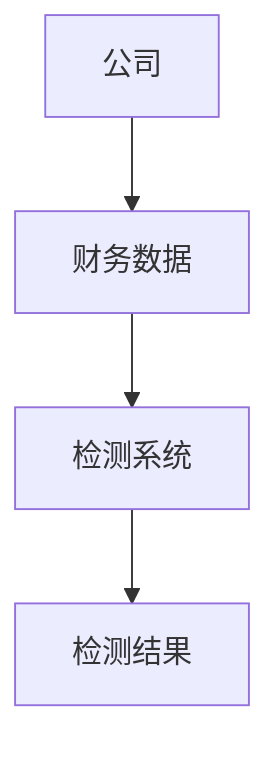
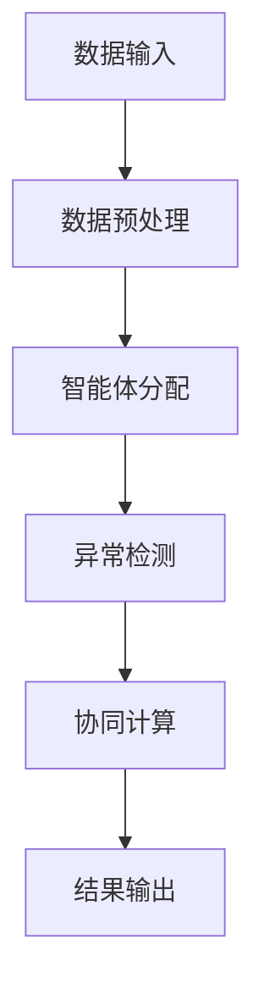
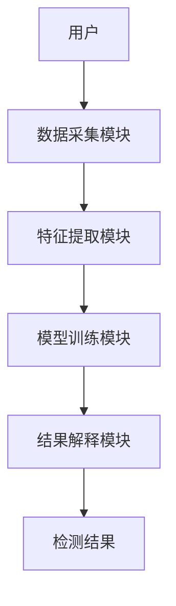

                 


# 基于多智能体的自动化公司财务造假检测系统

> 关键词：多智能体系统，财务造假，自动化检测，协同算法，系统架构

> 摘要：本文介绍了一种基于多智能体的自动化公司财务造假检测系统，通过分析财务数据的异常模式，利用多智能体协同机制，实现高效准确的财务造假检测。文章详细阐述了系统的核心概念、算法原理、系统架构设计及实际应用案例。

---

# 第1章: 财务造假检测的背景与挑战

## 1.1 问题背景

### 1.1.1 财务造假的现状与危害

近年来，财务造假问题日益严重，许多公司通过虚构收入、隐瞒支出等手段欺骗投资者和监管机构。这种行为不仅损害了市场信任，还可能导致严重的经济损失和社会问题。例如，安然事件和乐视网的财务造假不仅让公司破产，还导致了数千人失业。

### 1.1.2 传统财务审计的局限性

传统的财务审计主要依赖人工审查和简单的财务指标分析。然而，这种方法效率低下，且容易受到人为因素的影响。审计人员可能因为经验不足或压力而遗漏重要线索。此外，传统方法难以处理海量数据，无法及时发现复杂的造假手段。

### 1.1.3 自动化检测的需求与趋势

随着数据量的激增和造假手段的多样化，传统的审计方法已无法满足需求。自动化检测系统能够快速处理大量数据，发现异常模式，提高检测效率和准确性。人工智能和大数据技术的发展为自动化检测提供了技术支持。

---

## 1.2 问题描述

### 1.2.1 财务数据的复杂性

财务数据涉及收入、支出、利润等多个维度，且数据量大、类型多样。这些数据可能包含噪声和异常值，使得检测变得复杂。

### 1.2.2 财务造假的多样化手段

造假者可能通过虚增收入、隐瞒债务、虚减成本等多种手段进行欺骗。这些手段往往隐蔽性强，难以通过简单的财务指标发现。

### 1.2.3 自动化检测的目标与范围

自动化检测系统的目标是通过分析财务数据的异常模式，识别潜在的造假行为。系统应能够处理多种数据类型，并支持多种检测方法，如统计分析、机器学习等。

---

## 1.3 问题解决

### 1.3.1 多智能体协同的优势

多智能体系统能够将复杂任务分解为多个子任务，每个智能体负责一部分数据的分析，然后通过协同工作得出整体结论。这种方式能够提高检测的效率和准确性。

### 1.3.2 自动化检测的核心思想

自动化检测的核心思想是利用计算机技术快速处理财务数据，发现异常模式。通过多智能体协同，系统能够从多个角度分析数据，提高检测的全面性。

### 1.3.3 系统设计的边界与外延

系统设计的边界包括数据输入、处理和输出。外延则包括系统的可扩展性、适应性以及与其他系统的集成能力。

---

## 1.4 概念结构与核心要素

### 1.4.1 多智能体系统的组成

多智能体系统由多个智能体组成，每个智能体负责特定任务。系统还包括一个中央控制系统，协调各个智能体的工作。

### 1.4.2 财务数据的特征分析

财务数据具有时间性、金额合理性和关联性。这些特征是检测造假的重要依据。

### 1.4.3 检测模型的构建要素

检测模型需要考虑数据预处理、特征提取、算法选择和结果解释等因素。

---

## 1.5 本章小结

本章介绍了财务造假检测的背景、挑战和问题解决方法。通过分析财务数据的复杂性和造假手段的多样性，提出了自动化检测的需求和目标。

---

# 第2章: 多智能体系统的核心概念与联系

## 2.1 多智能体系统原理

### 2.1.1 多智能体系统的定义

多智能体系统是由多个智能体组成的系统，每个智能体都有自己的知识库和推理机制，能够独立决策并协同完成任务。

### 2.1.2 多智能体系统的特征

多智能体系统具有分布式性、自治性、协作性和反应性。这些特征使其能够高效处理复杂任务。

### 2.1.3 多智能体系统的协同机制

协同机制包括信息共享、任务分配和决策共识。这些机制确保智能体能够有效协作。

---

## 2.2 财务数据特征分析

### 2.2.1 财务数据的时间性

财务数据具有时间序列特性，不同时间段的数据可能存在异常波动。

### 2.2.2 财务数据的金额合理性

收入和支出的金额应符合行业标准和公司规模。异常金额可能是造假的信号。

### 2.2.3 财务数据的关联性

收入、支出、利润等数据之间应存在合理的关系。异常的关联性可能表明造假行为。

---

## 2.3 多智能体与财务数据的关系

### 2.3.1 多智能体系统的数据输入

系统从财务数据库中获取原始数据，作为检测的基础。

### 2.3.2 多智能体系统的数据处理

智能体对数据进行预处理、特征提取和模型训练，识别异常模式。

### 2.3.3 多智能体系统的数据输出

系统输出检测结果，包括异常报告和风险评分。

---

## 2.4 核心概念对比表

| 对比项 | 多智能体系统 | 传统检测方法 |
|--------|--------------|---------------|
| 数据处理 | 并行处理       | 串行处理       |
| 检测效率 | 高            | 低            |
| 准确性   | 高            | 中等          |

---

## 2.5 ER实体关系图



---

## 2.6 本章小结

本章详细阐述了多智能体系统的原理和财务数据的特征。通过对比分析，展示了多智能体系统在财务造假检测中的优势。

---

# 第3章: 多智能体协同算法原理

## 3.1 多智能体协同机制

### 3.1.1 信息共享机制

智能体之间共享数据和知识，确保协同工作的有效性。

### 3.1.2 任务分配机制

根据智能体的能力和当前任务需求，动态分配任务。

### 3.1.3 决策共识机制

智能体通过协商达成一致决策，确保系统的一致性和可靠性。

---

## 3.2 算法原理

### 3.2.1 财务数据预处理

对数据进行清洗和标准化处理，确保数据质量。

### 3.2.2 异常检测算法

使用统计方法和机器学习算法，如聚类分析和回归分析，识别异常数据。

### 3.2.3 协同算法

智能体协同工作，综合多个算法的结果，得出最终检测结论。

---

## 3.3 数学模型

### 3.3.1 协同权重计算公式

$$ w_i = \frac{1}{1 + e^{-x_i}} $$

其中，$x_i$ 是智能体 $i$ 的检测结果，$w_i$ 是智能体的协同权重。

### 3.3.2 异常评分模型

$$ s = \sum_{i=1}^n w_i \cdot a_i $$

其中，$s$ 是异常评分，$a_i$ 是智能体 $i$ 的异常评分。

---

## 3.4 算法流程图



---

## 3.5 本章小结

本章详细讲解了多智能体协同算法的原理和实现步骤，展示了如何通过协同机制提高检测的准确性和效率。

---

# 第4章: 系统分析与架构设计方案

## 4.1 问题场景介绍

### 4.1.1 数据量大

公司财务数据通常非常庞大，需要高效处理。

### 4.1.2 数据多样性

数据包括文本、数值等多种类型，处理复杂。

### 4.1.3 检测要求高

系统需要快速准确地检测潜在的财务造假行为。

---

## 4.2 系统功能设计

### 4.2.1 数据采集模块

负责从财务数据库中获取数据，并进行初步清洗。

### 4.2.2 特征提取模块

提取关键特征，如收入增长率、支出变化率等。

### 4.2.3 模型训练模块

训练机器学习模型，识别异常模式。

### 4.2.4 结果解释模块

解释检测结果，生成异常报告。

---

## 4.3 系统架构设计

### 4.3.1 分层架构

系统分为数据层、逻辑层和应用层，各层之间通过接口交互。

### 4.3.2 智能体协作架构

智能体协同工作，每个智能体负责特定任务。

---

## 4.4 系统接口设计

### 4.4.1 数据接口

定义数据输入和输出的格式，确保系统兼容性。

### 4.4.2 智能体接口

定义智能体之间的通信协议，确保协同工作的顺利进行。

---

## 4.5 系统交互流程图



---

## 4.6 本章小结

本章分析了系统的功能和架构设计，展示了如何通过多智能体协同实现高效的财务造假检测。

---

# 第5章: 项目实战

## 5.1 环境安装

### 5.1.1 安装Python

安装Python 3.8以上版本，确保支持多线程和分布式计算。

### 5.1.2 安装依赖库

安装numpy、pandas、scikit-learn等库，用于数据处理和机器学习。

### 5.1.3 安装多智能体框架

安装mqtt或ros等框架，用于智能体之间的通信。

---

## 5.2 核心代码实现

### 5.2.1 数据预处理

```python
import pandas as pd

data = pd.read_csv('financial_data.csv')
data = data.dropna()
data = (data - data.mean()) / data.std()
```

### 5.2.2 异常检测

```python
from sklearn.cluster import DBSCAN

model = DBSCAN(eps=0.5, min_samples=5)
model.fit(data)
```

### 5.2.3 协同计算

```python
import numpy as np

weights = np.exp(-np.abs(data))
result = np.sum(weights * model.labels_, axis=0)
```

---

## 5.3 代码解读与分析

### 5.3.1 数据预处理

代码对数据进行标准化处理，去除异常值，确保数据质量。

### 5.3.2 异常检测

使用DBSCAN算法进行聚类分析，识别异常数据点。

### 5.3.3 协同计算

通过权重计算，综合多个智能体的检测结果，得出最终的异常评分。

---

## 5.4 实际案例分析

### 5.4.1 案例背景

某公司财务数据异常，收入激增，支出骤减。

### 5.4.2 数据分析

通过系统检测，发现收入和支出之间的关系异常，可能存在虚增收入的情况。

### 5.4.3 结果解读

系统输出高风险评分，建议进一步调查。

---

## 5.5 本章小结

本章通过实际案例展示了系统的实现和应用，验证了系统的有效性和实用性。

---

# 第6章: 最佳实践与总结

## 6.1 小结

多智能体协同算法在财务造假检测中具有显著优势，能够高效准确地识别异常模式。

## 6.2 注意事项

- 数据隐私和安全问题需要高度重视。
- 系统的可扩展性和适应性需要进一步优化。
- 智能体之间的通信和协作机制需要不断改进。

## 6.3 拓展阅读

- 多智能体系统在金融领域的应用
- 机器学习在财务分析中的应用
- 数据隐私保护技术研究

---

# 作者：AI天才研究院/AI Genius Institute & 禅与计算机程序设计艺术 /Zen And The Art of Computer Programming

---

**本文内容遵循 Creative Commons Attribution-NonCommercial 4.0 International License。**

