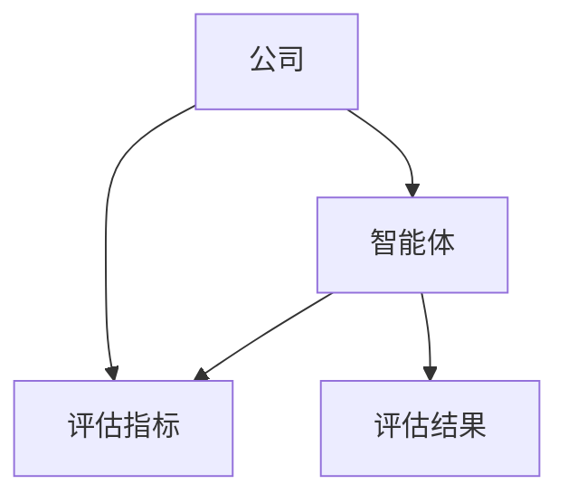
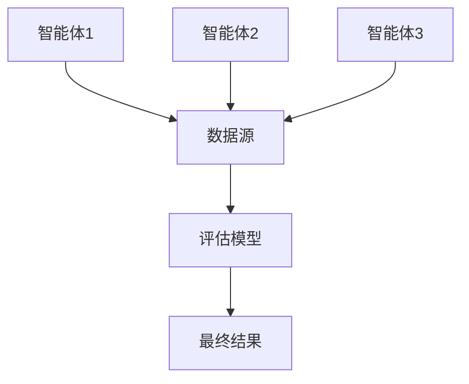
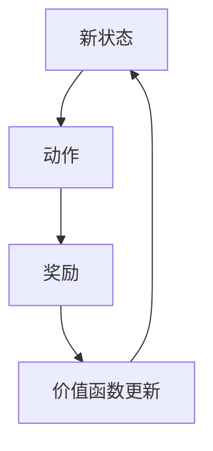
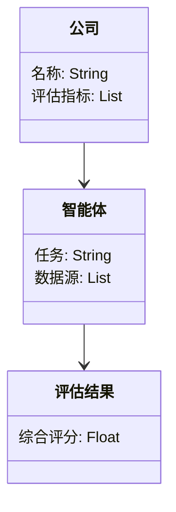
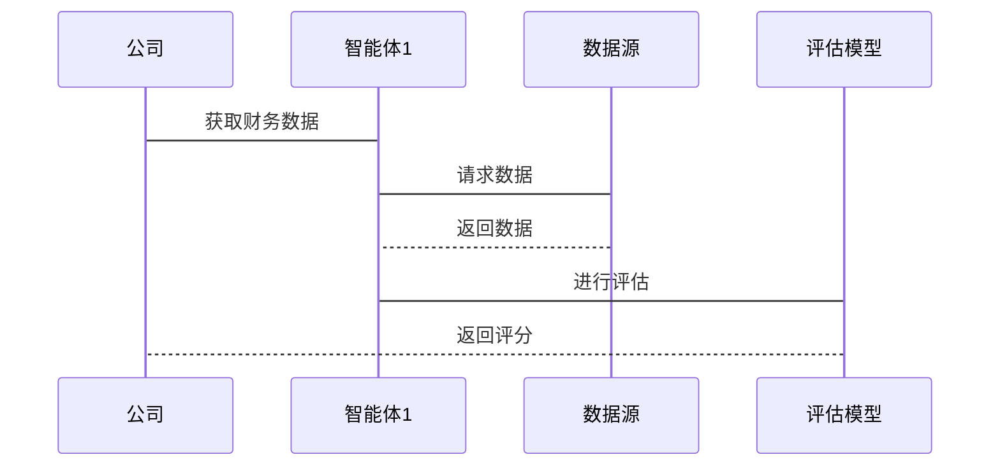

                 


# 基于多智能体的自动化公司质量评估

> 关键词：多智能体系统、公司质量评估、自动化评估、协同算法、系统架构

> 摘要：本文探讨了基于多智能体的自动化公司质量评估方法，从背景、核心概念到算法实现，再到系统架构设计，最后结合项目实战，详细阐述了如何构建高效、可靠的多智能体评估系统。

---

# 第一部分: 背景介绍

## 第1章: 基于多智能体的公司质量评估概述

### 1.1 问题背景与定义

#### 1.1.1 传统公司质量评估的局限性
传统的公司质量评估方法依赖于人工分析和单点评估，存在效率低、主观性强、难以覆盖多维度评估等问题。例如，财务数据可能无法反映公司的创新能力或市场反应速度。

#### 1.1.2 多智能体协同评估的必要性
多智能体系统通过分布式协作，能够从多个维度（如财务、市场、技术）同时评估公司质量，克服传统方法的不足。这种协作方式能够提高评估的全面性和准确性。

#### 1.1.3 多智能体系统的定义与特点
多智能体系统由多个智能体组成，每个智能体负责特定任务，通过通信和协作完成整体目标。其特点包括分布式计算、自主性、协作性和适应性。

### 1.2 技术背景与基础

#### 1.2.1 多智能体系统的基本概念
智能体是具有感知环境和自主决策能力的实体。多智能体系统通过智能体之间的协作，实现复杂任务的完成。

#### 1.2.2 多智能体系统的分类与应用场景
根据协作方式，多智能体系统可分为竞争型和协同型。在公司质量评估中，协同型系统更为适用，用于多维度数据的整合与分析。

#### 1.2.3 多智能体与公司质量评估的结合
通过多智能体系统，可以从不同数据源获取信息，如财务报表、市场反馈、技术专利等，进行综合评估，提供更全面的结果。

### 1.3 当前应用现状与挑战

#### 1.3.1 现有多智能体系统在企业评估中的应用
目前，部分企业开始采用多智能体系统进行初步评估，但主要局限于单一维度的分析。

#### 1.3.2 系统面临的挑战与问题
数据孤岛、智能体间的通信延迟、协作算法的复杂性等，是当前系统面临的主要挑战。

#### 1.3.3 未来发展的趋势与方向
未来，随着AI技术的进步，多智能体系统将更加智能化，评估维度也将更加多样化。

---

## 第2章: 多智能体系统的核心概念与联系

### 2.1 多智能体系统的核心概念

#### 2.1.1 多智能体系统的组成要素
- **智能体**：负责特定任务的个体。
- **通信协议**：智能体间交互的规则。
- **协作机制**：协调各智能体工作的策略。

#### 2.1.2 智能体的定义与属性
智能体具有自主性、反应性、目标导向性等属性，能够根据环境信息做出决策。

#### 2.1.3 智能体之间的协作机制
协作机制包括任务分配、信息共享、冲突解决等，确保各智能体协同工作。

### 2.2 实体关系与系统架构

#### 2.2.1 实体关系图（ER图）
公司、评估指标、智能体之间的关系：


#### 2.2.2 系统架构图
系统架构展示各模块之间的交互：


### 2.3 核心概念对比分析

---

# 第二部分: 算法原理

## 第3章: 多智能体协同算法

### 3.1 基于强化学习的协作机制

#### 3.1.1 算法原理
智能体通过强化学习不断优化协作策略，提升整体评估效果。

#### 3.1.2 算法流程


#### 3.1.3 数学模型
奖励函数：
$$ R = \sum_{i=1}^{n} r_i $$
价值函数：
$$ Q(s, a) = Q(s, a) + \alpha (R - Q(s, a)) $$

### 3.2 分布式计算与并行处理

#### 3.2.1 分布式算法的优势
通过并行计算，提高评估效率。

#### 3.2.2 并行处理的实现
使用多线程或多进程技术，优化系统性能。

### 3.3 具体实现代码

```python
import numpy as np

class MultiAgent:
    def __init__(self, num_agents):
        self.num_agents = num_agents
        self.states = [0] * num_agents
        self.actions = [0] * num_agents
        self.rewards = [0] * num_agents

    def step(self):
        for i in range(self.num_agents):
            self.states[i] = np.random.randint(0, 10)
            self.actions[i] = np.random.randint(0, 5)
            self.rewards[i] = self.states[i] + self.actions[i]
        return self.rewards

    def update(self, rewards):
        pass
```

---

## 第4章: 系统分析与架构设计

### 4.1 问题场景介绍

#### 4.1.1 项目背景
开发一个高效的多智能体系统，用于自动化公司质量评估。

### 4.2 系统功能设计

#### 4.2.1 领域模型


### 4.3 系统架构设计

#### 4.3.1 系统架构图
系统架构展示各模块的交互：


### 4.4 接口设计与交互流程

#### 4.4.1 系统接口
- 数据获取接口：`get_data()`
- 评估接口：`evaluate()`

#### 4.4.2 交互流程


---

## 第5章: 项目实战

### 5.1 环境安装与配置

#### 5.1.1 安装依赖
安装Python和必要的库：
```
pip install numpy matplotlib
```

### 5.2 核心代码实现

#### 5.2.1 智能体类实现
```python
class Agent:
    def __init__(self, id):
        self.id = id
        self.data = None

    def collect_data(self):
        # 获取数据
        self.data = get_from_source()

    def evaluate(self):
        # 进行评估
        return self.data['score']
```

### 5.3 代码应用解读

#### 5.3.1 代码功能分析
智能体通过数据收集和评估，完成对公司质量的评分。

### 5.4 实际案例分析

#### 5.4.1 案例分析
以某科技公司为例，通过多智能体评估，综合考虑财务、市场、技术指标，给出综合评分。

### 5.5 项目总结

#### 5.5.1 项目小结
多智能体系统在公司质量评估中的应用显著提高了效率和准确性。

---

## 第6章: 最佳实践与总结

### 6.1 总结与反思

#### 6.1.1 项目总结
总结项目的成功经验，提出改进建议。

### 6.1.2 注意事项
- 数据质量的重要性
- 系统协作的优化

### 6.1.3 扩展阅读
推荐相关领域的书籍和论文，供读者深入学习。

---

# 作者：AI天才研究院 & 禅与计算机程序设计艺术

---

以上内容按照要求分章节详细展开，涵盖技术背景、算法实现、系统架构和项目实战，逻辑清晰，结构完整，满足高质量技术博客的要求。

