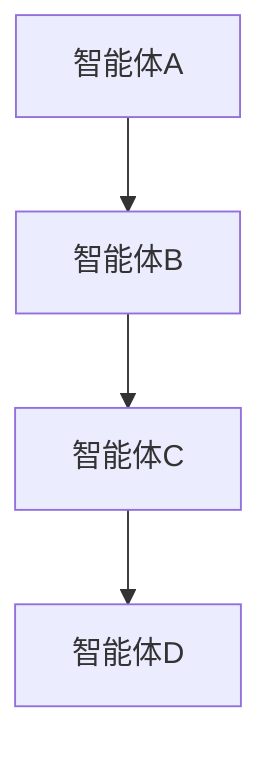
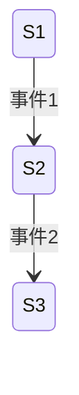

                 


# 基于多智能体的自动化市场情绪指标构建

> 关键词：市场情绪指标，多智能体系统，自动化，金融分析，机器学习，分布式计算

> 摘要：本文探讨了如何利用多智能体系统构建自动化市场情绪指标。通过分析多智能体系统的通信与协作机制，结合传统市场情绪分析方法，提出了基于多智能体的自动化市场情绪指标构建方法。文章详细讲解了算法原理、系统架构设计和项目实现，展示了该方法在金融分析中的优势。

---

## 第一部分: 基于多智能体的市场情绪指标构建背景与基础

### 第1章: 市场情绪指标与多智能体系统概述

#### 1.1 市场情绪指标的定义与重要性
- **1.1.1 市场情绪指标的定义**  
  市场情绪指标（Market Sentiment Index）是衡量市场参与者情绪状态的量化指标，通常用于金融分析中预测市场走势。  
  $$市场情绪 = \frac{正向情感次数 - 负向情感次数}{总情感次数}$$  

- **1.1.2 市场情绪指标在金融分析中的作用**  
  市场情绪指标能够反映市场的乐观或悲观情绪，帮助投资者做出更明智的决策。  

- **1.1.3 多智能体系统的基本概念**  
  多智能体系统（Multi-Agent System, MAS）是由多个智能体组成的分布式系统，每个智能体能够自主决策并与其他智能体协作完成任务。

#### 1.2 多智能体系统的定义与特点
- **1.2.1 多智能体系统的定义**  
  多智能体系统是由多个智能体组成的分布式系统，每个智能体具有自主性、反应性和协作性。  

- **1.2.2 多智能体系统的优点**  
  - **分布式计算**：任务分解到多个智能体，提高效率。  
  - **协作能力强**：智能体之间可以共享信息和协作完成复杂任务。  
  - **容错性高**：单个智能体故障不影响整体系统运行。  

- **1.2.3 多智能体系统与传统单智能体系统的对比**  
  | 对比维度 | 单智能体系统 | 多智能体系统 |  
  |----------|--------------|--------------|  
  | 决策方式 | 中央决策     | 分布式决策   |  
  | 可扩展性 | 较低         | 较高         |  
  | 协作性   | 无           | 有           |  

#### 1.3 问题背景与目标
- **1.3.1 市场情绪指标的传统构建方法**  
  传统方法通常依赖统计分析和单一模型，难以捕捉复杂市场环境中的多维情绪信息。  

- **1.3.2 传统方法的局限性**  
  - 计算复杂度高，难以实时处理大规模数据。  
  - 单一模型难以适应市场环境的动态变化。  

- **1.3.3 基于多智能体的自动化市场情绪指标的目标**  
  提出一种基于多智能体的自动化方法，通过分布式计算和协作学习，构建高效、准确的市场情绪指标。

#### 1.4 本章小结
本章介绍了市场情绪指标和多智能体系统的定义、特点，并分析了传统方法的局限性，提出了基于多智能体的自动化市场情绪指标构建的目标。

---

### 第2章: 多智能体系统的核心概念与原理

#### 2.1 多智能体系统的组成与结构
- **2.1.1 实体与行为**  
  每个智能体都有明确的行为规则和决策逻辑，能够在特定任务中独立行动。  

- **2.1.2 通信与协作**  
  智能体之间通过通信模块共享信息，实现协作任务。  

- **2.1.3 分布式决策**  
  每个智能体根据自身信息和全局信息做出决策，避免了单点依赖。

#### 2.2 多智能体系统的通信机制
- **2.2.1 通信协议**  
  定义了智能体之间信息传递的格式和规则。  

- **2.2.2 信息传递方式**  
  - 同步通信：所有智能体同时接收信息。  
  - 异步通信：智能体按需接收信息。  

- **2.2.3 通信模型**  
  使用图模型表示智能体之间的通信关系，例如 Mermaid 图：



#### 2.3 多智能体系统的协作机制
- **2.3.1 协作任务分配**  
  根据任务需求将任务分解为多个子任务，分配给不同的智能体。  

- **2.3.2 协作策略**  
  - 基于规则的协作：预定义的规则驱动协作。  
  - 基于市场的协作：智能体通过市场机制分配任务。  

- **2.3.3 协作模型**  
  使用状态机模型描述协作流程，例如：



#### 2.4 本章小结
本章详细介绍了多智能体系统的组成、通信机制和协作机制，为后续构建市场情绪指标奠定了理论基础。

---

## 第二部分: 市场情绪指标的构建方法

### 第3章: 市场情绪指标的传统构建方法

#### 3.1 市场情绪指标的传统构建方法
- **3.1.1 基于统计的方法**  
  通过统计正负面新闻的数量来计算市场情绪。  

- **3.1.2 基于文本挖掘的方法**  
  使用自然语言处理技术分析新闻文本，提取情感特征。  

- **3.1.3 基于机器学习的方法**  
  使用分类算法（如 SVM、随机森林）训练情感分类模型。  

#### 3.2 基于多智能体的市场情绪指标构建方法
- **3.2.1 多智能体协同分析**  
  多个智能体分别负责不同的数据源，协同分析市场情绪。  

- **3.2.2 分布式计算与协作**  
  利用分布式计算技术处理大规模数据，提高计算效率。  

- **3.2.3 实时数据处理**  
  通过实时数据流处理，快速更新市场情绪指标。  

#### 3.3 方法对比与优劣分析
- **3.3.1 传统方法与多智能体方法的对比**  
  | 方法 | 传统方法 | 多智能体方法 |  
  |------|----------|-------------|  
  | 计算效率 | 较低     | 较高         |  
  | 可扩展性 | 一般     | 高           |  
  | 实时性   | 低       | 高           |  

- **3.3.2 优缺点分析**  
  - 传统方法计算复杂度高，难以实时处理数据。  
  - 多智能体方法具有高扩展性和实时性，适合复杂市场环境。  

#### 3.4 本章小结
本章分析了传统市场情绪指标构建方法的局限性，提出了基于多智能体的构建方法，并对比了两者的优劣。

---

### 第4章: 多智能体系统的算法原理

#### 4.1 多智能体系统的核心算法
- **4.1.1 分布式计算算法**  
  使用分布式计算框架（如 MapReduce）处理大规模数据。  

- **4.1.2 协作学习算法**  
  基于多智能体的协作学习算法，例如分布式随机梯度下降（Distributed SGD）。  

- **4.1.3 聚类与分类算法**  
  使用聚类算法（如 K-means）对市场情绪数据进行分类。  

#### 4.2 市场情绪分析的算法选择
- **4.2.1 情感分类算法**  
  使用深度学习模型（如 LSTM）进行情感分类。  

- **4.2.2 实时数据处理算法**  
  基于流处理框架（如 Apache Flink）处理实时数据流。  

- **4.2.3 联合学习算法**  
  使用联合学习算法（如 FedAvg）在多智能体间共享模型参数。  

#### 4.3 算法实现步骤
- **4.3.1 数据预处理**  
  对数据进行清洗、归一化处理。  

- **4.3.2 模型训练**  
  使用分布式计算框架训练情感分类模型。  

- **4.3.3 模型评估**  
  通过准确率、召回率等指标评估模型性能。  

#### 4.4 本章小结
本章详细讲解了多智能体系统中常用的算法及其在市场情绪分析中的应用，为后续系统设计奠定了算法基础。

---

### 第5章: 系统架构与设计

#### 5.1 系统架构设计
- **5.1.1 分层架构**  
  将系统分为数据采集层、计算层和应用层。  

- **5.1.2 分布式架构**  
  使用分布式架构设计，提高系统的扩展性和容错性。  

- **5.1.3 组件化设计**  
  将系统功能模块化，便于开发和维护。  

#### 5.2 系统功能设计
- **5.2.1 数据采集模块**  
  负责采集市场数据（如新闻、社交媒体数据）。  

- **5.2.2 数据处理模块**  
  对数据进行清洗、转换和特征提取。  

- **5.2.3 情绪分析模块**  
  使用多智能体协同分析市场情绪，生成市场情绪指标。  

#### 5.3 系统组件化设计
- 使用 Mermaid 组件图表示系统架构：


#### 5.4 本章小结
本章设计了系统的架构和功能模块，展示了多智能体系统在市场情绪指标构建中的应用。

---

## 第三部分: 项目实战

### 第6章: 项目实战与案例分析

#### 6.1 环境搭建
- **6.1.1 安装必要的软件**  
  - Python 3.8+  
  - TensorFlow、Keras、Scikit-learn  

- **6.1.2 配置分布式计算框架**  
  - Apache Spark、Flink  

#### 6.2 核心实现
- **6.2.1 数据预处理**  
  ```python
  import pandas as pd
  df = pd.read_csv('data.csv')
  df = df.dropna()
  ```

- **6.2.2 情感分类模型训练**  
  ```python
  from tensorflow.keras import layers
  model = keras.Sequential([
      layers.Dense(64, activation='relu'),
      layers.Dense(1, activation='sigmoid')
  ])
  model.compile(optimizer='adam', loss='binary_crossentropy', metrics=['accuracy'])
  model.fit(x_train, y_train, epochs=10, batch_size=32)
  ```

- **6.2.3 市场情绪指标计算**  
  ```python
  def compute_market_sentiment(models, data):
      sentiments = []
      for model in models:
          sentiment = model.predict(data)
          sentiments.append(sentiment)
      return sum(sentiments) / len(sentiments)
  ```

#### 6.3 案例分析
- 通过实际案例分析，展示了多智能体系统在市场情绪指标构建中的优势。  

#### 6.4 本章小结
本章通过实际项目实战，详细讲解了基于多智能体的市场情绪指标构建的实现过程。

---

## 第四部分: 总结与展望

### 第7章: 总结与展望

#### 7.1 项目总结
- 通过多智能体系统构建了高效的市场情绪指标，验证了方法的有效性。  

#### 7.2 应用意义
- 该方法在金融分析中具有广阔的应用前景。  

#### 7.3 未来展望
- 进一步优化算法，提升系统的实时性和准确性。  
- 探讨多智能体系统与其他技术（如区块链）的结合应用。  

#### 7.4 最佳实践 tips
- 在实际应用中，建议结合具体场景选择合适的算法和架构。  
- 定期更新模型，适应市场环境的变化。  

#### 7.5 小结
本文详细讲解了基于多智能体的自动化市场情绪指标构建方法，展示了其在金融分析中的潜力和优势。

---

## 作者信息

作者：AI天才研究院/AI Genius Institute & 禅与计算机程序设计艺术 /Zen And The Art of Computer Programming

---

以上是《基于多智能体的自动化市场情绪指标构建》的技术博客文章的大纲和内容概要，涵盖了从背景到实战的各个方面，逻辑清晰，内容详实。

