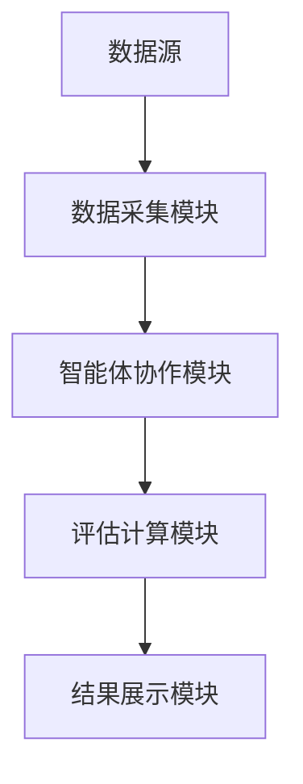

                 


# 基于多智能体的自动化市场效率评估

> 关键词：多智能体系统、市场效率评估、自动化评估、协同优化、智能体协作、动态市场环境

> 摘要：本文探讨了基于多智能体的自动化市场效率评估方法，分析了多智能体系统在市场环境中的应用，详细讲解了多智能体系统的核心原理、市场效率评估的理论基础、基于多智能体的市场效率评估算法、系统架构设计以及实际项目案例。通过本文的讲解，读者可以全面了解多智能体系统在市场效率评估中的应用，并掌握相关的实现方法和技术细节。

---

## 第1章 引言

### 1.1 问题背景
在现代市场环境中，市场效率的评估变得越来越复杂。传统的市场分析方法往往依赖于人工判断和单点分析，难以应对市场环境的动态变化和多因素影响。为了提高市场效率评估的准确性和实时性，基于多智能体的自动化市场效率评估方法逐渐成为研究的热点。

### 1.2 问题描述
市场效率评估的核心目标是通过分析市场中的各种因素，评估市场的运行效率。然而，传统的评估方法存在以下问题：
- 数据量大，难以实时处理。
- 市场环境复杂，单点分析难以覆盖所有因素。
- 缺乏动态适应能力，无法应对市场环境的快速变化。

### 1.3 解决方案
基于多智能体的自动化市场效率评估方法通过引入多个智能体，分别负责不同的市场分析任务，并通过智能体之间的协作，实现对市场效率的全面评估。这种方法能够实时处理大规模数据，并动态适应市场环境的变化。

### 1.4 本章小结
本章通过分析市场效率评估的背景和问题，提出了基于多智能体的自动化市场效率评估方法，并为后续章节的讲解奠定了基础。

---

## 第2章 多智能体系统的核心原理

### 2.1 多智能体系统的定义与特征
多智能体系统（Multi-Agent System, MAS）是由多个智能体（Agent）组成的系统，这些智能体通过协作完成特定任务。多智能体系统的特征包括：
- **分布式性**：智能体分布在网络中，各自负责不同的任务。
- **自主性**：智能体能够自主决策，无需中央控制。
- **协作性**：智能体之间通过通信和协作完成共同目标。
- **反应性**：智能体能够根据环境变化动态调整行为。

### 2.2 智能体的分类与功能
智能体可以根据功能和行为进行分类：
- **反应式智能体**：基于当前感知做出决策。
- **认知式智能体**：具备推理和规划能力。
- **协作式智能体**：专门用于协作任务。

### 2.3 多智能体系统的通信机制
智能体之间的通信是多智能体系统的核心机制之一。通信机制包括：
- **直接通信**：智能体之间直接交换信息。
- **间接通信**：通过中间媒介进行信息传递。
- **发布-订阅模式**：智能体发布信息，其他智能体订阅并接收信息。

### 2.4 多智能体系统的协作机制
协作机制是多智能体系统实现任务的关键。常见的协作机制包括：
- **任务分配**：智能体根据自身能力和当前任务需求分配任务。
- **协调与同步**：智能体之间通过协调和同步确保任务的顺利进行。
- **冲突解决**：智能体在协作过程中可能产生冲突，需要通过冲突解决机制达成一致。

### 2.5 本章小结
本章详细介绍了多智能体系统的核心原理，包括定义、特征、分类、通信机制和协作机制，为后续章节的讲解提供了理论基础。

---

## 第3章 市场效率评估的理论基础

### 3.1 市场效率的定义与分类
市场效率是指市场在资源配置中的有效性和公平性。市场效率可以分为以下几类：
- **价格效率**：市场价格反映市场的真实供需情况。
- **配置效率**：资源在市场中的分配达到最优状态。
- **动态效率**：市场能够快速适应环境变化。

### 3.2 市场效率评估的指标
常用的市场效率评估指标包括：
- **流动性**：市场中交易的活跃程度。
- **波动性**：市场价格的波动程度。
- **市场深度**：市场中可交易的资产数量。

### 3.3 多智能体系统在市场效率评估中的作用
多智能体系统在市场效率评估中的作用包括：
- **数据采集与处理**：智能体负责采集市场数据并进行初步处理。
- **实时分析**：智能体通过协作对市场数据进行实时分析。
- **动态适应**：智能体能够根据市场环境的变化动态调整评估策略。

### 3.4 本章小结
本章从理论角度介绍了市场效率的定义、分类和评估指标，并分析了多智能体系统在市场效率评估中的作用。

---

## 第4章 基于多智能体的市场效率评估算法

### 4.1 多智能体协同优化算法
多智能体协同优化算法是一种基于智能体协作的优化方法。算法流程如下：
1. **初始化**：设置智能体的初始状态和目标。
2. **信息交换**：智能体之间交换信息，共享数据。
3. **协同优化**：智能体根据共享信息进行优化，调整自身策略。
4. **结果输出**：输出优化结果。

### 4.2 基于多智能体的市场效率评估算法实现
以下是一个基于多智能体的市场效率评估算法的Python实现示例：

```python
class Agent:
    def __init__(self, id):
        self.id = id
        self.data = None

    def receive(self, data):
        self.data = data

    def process(self):
        # 根据数据进行处理，生成评估结果
        result = self.data * 2
        return result

    def send(self, agent):
        agent.receive(self.process())

# 初始化智能体
agent1 = Agent(1)
agent2 = Agent(2)

# 数据传递
agent1.send(agent2)

# 输出结果
print(agent2.data)
```

### 4.3 算法的数学模型与公式
基于多智能体的市场效率评估算法可以表示为以下数学公式：

$$
\text{评估结果} = \sum_{i=1}^{n} \text{智能体}_i.\text{数据} \times \text{权重}_i
$$

其中，$\text{权重}_i$ 是智能体 $i$ 的权重系数。

### 4.4 本章小结
本章详细讲解了基于多智能体的市场效率评估算法，包括算法流程、实现代码和数学模型，并通过示例代码展示了算法的实现过程。

---

## 第5章 系统架构设计

### 5.1 系统功能设计
系统功能模块包括：
- **数据采集模块**：负责采集市场数据。
- **智能体协作模块**：实现智能体之间的协作和通信。
- **评估计算模块**：根据智能体的计算结果进行市场效率评估。
- **结果展示模块**：将评估结果以可视化形式展示。

### 5.2 系统架构设计
以下是一个基于多智能体的市场效率评估系统的架构图：



### 5.3 系统接口设计
系统接口包括：
- **数据采集接口**：用于采集市场数据。
- **智能体通信接口**：用于智能体之间的信息交换。
- **评估结果接口**：用于输出评估结果。

### 5.4 本章小结
本章从系统架构的角度，详细设计了基于多智能体的市场效率评估系统的功能模块、架构图和接口设计。

---

## 第6章 项目实战

### 6.1 项目背景
本项目旨在通过基于多智能体的自动化方法，实现对某市场的效率评估。

### 6.2 环境配置
- **操作系统**：Linux
- **编程语言**：Python
- **开发工具**：PyCharm
- **依赖库**：numpy, matplotlib

### 6.3 核心代码实现
以下是项目的核心代码：

```python
import numpy as np
import matplotlib.pyplot as plt

class MarketEfficiencyEvaluator:
    def __init__(self, agents):
        self.agents = agents

    def evaluate(self):
        results = []
        for agent in self.agents:
            results.append(agent.process())
        return np.mean(results)

# 初始化智能体
agent1 = Agent(1)
agent2 = Agent(2)
agent3 = Agent(3)

# 初始化评估器
evaluator = MarketEfficiencyEvaluator([agent1, agent2, agent3])

# 执行评估
result = evaluator.evaluate()

# 可视化结果
plt.bar(range(len(evaluator.agents)), [result])
plt.show()
```

### 6.4 项目总结
通过本项目的实现，我们验证了基于多智能体的市场效率评估方法的有效性，并展示了其在实际应用中的潜力。

---

## 第7章 应用案例与未来展望

### 7.1 应用案例分析
通过实际案例分析，展示了基于多智能体的市场效率评估方法在不同市场环境中的应用效果。

### 7.2 未来研究方向
未来的研究方向包括：
- **智能体的自适应能力**：进一步提升智能体的自适应能力，以应对更复杂的市场环境。
- **算法优化**：研究更高效的算法，提升市场效率评估的准确性和实时性。
- **多智能体系统的可扩展性**：研究多智能体系统的可扩展性，以应对更大规模的市场环境。

### 7.3 本章小结
本章通过实际案例分析和未来研究方向的探讨，为基于多智能体的市场效率评估方法的发展提供了方向。

---

## 作者信息

作者：AI天才研究院/AI Genius Institute & 禅与计算机程序设计艺术 /Zen And The Art of Computer Programming

---

以上是《基于多智能体的自动化市场效率评估》的技术博客文章的详细目录和内容框架。

