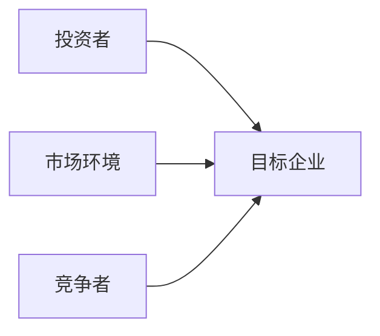
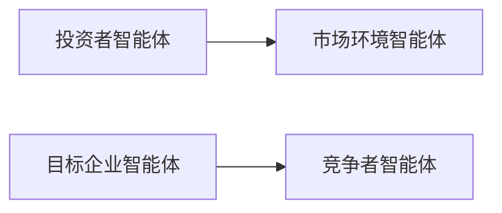
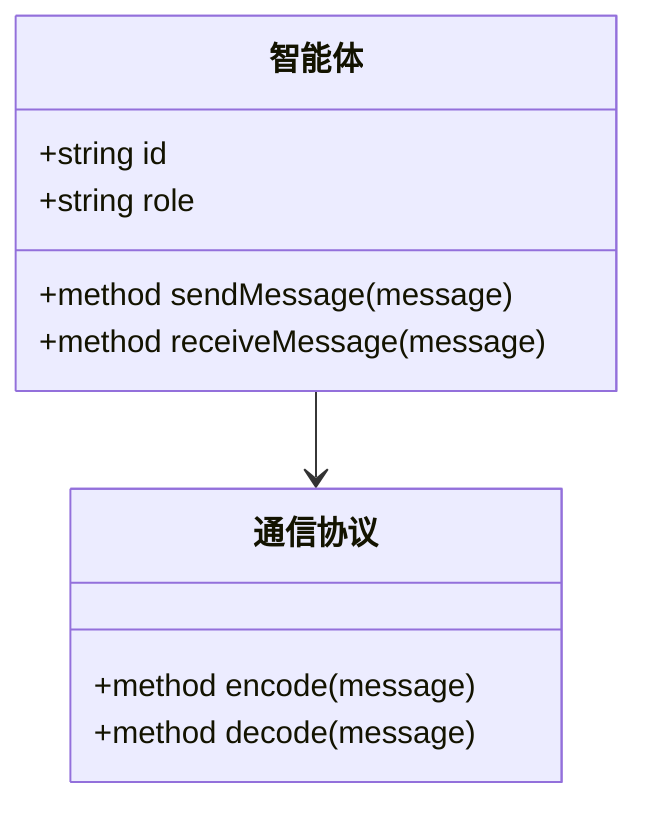
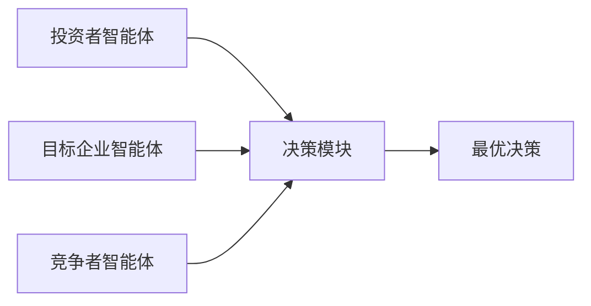
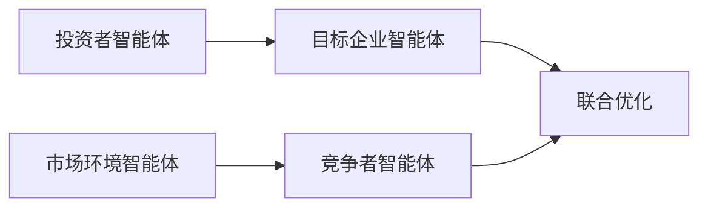
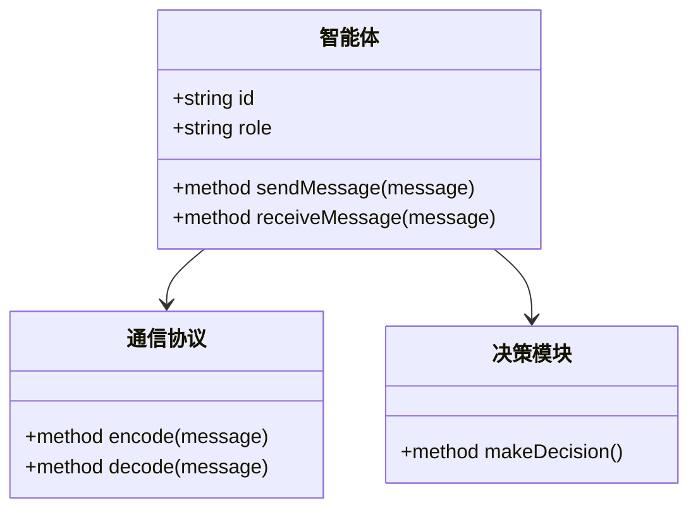
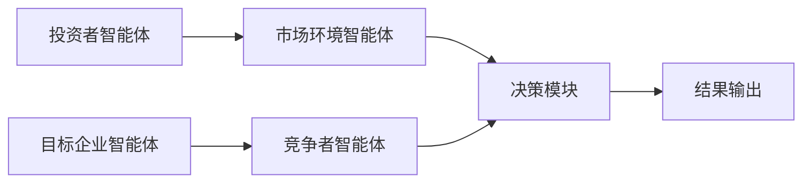
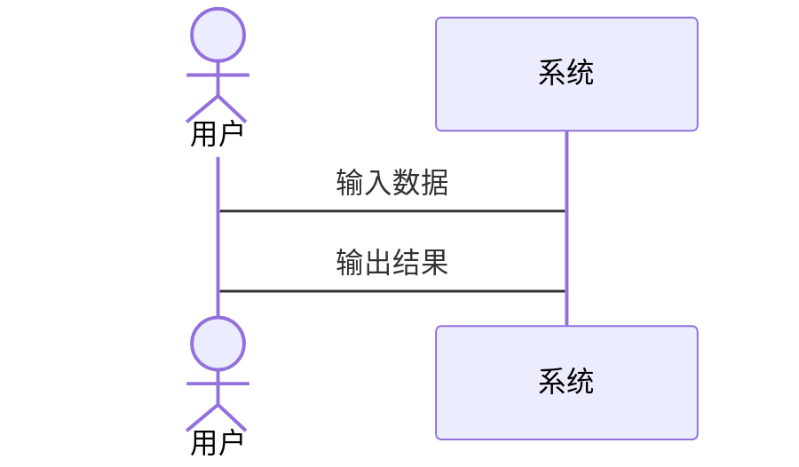
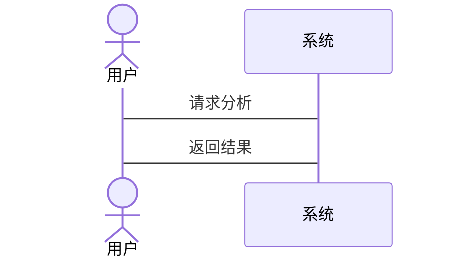

                 


# 基于多智能体的自动化并购机会分析

## 关键词
- 多智能体系统, 自动化并购, 并购机会分析, 人工智能, 协同学习

## 摘要
本篇文章深入探讨了基于多智能体的自动化并购机会分析的方法与实现。通过分析多智能体系统的核心原理、协同机制和算法模型，结合实际应用场景，提出了一种创新的自动化并购机会评估框架。文章从背景介绍、核心概念、算法原理、系统架构到项目实战，全面阐述了多智能体系统在金融领域的应用，为读者提供了系统化的解决方案和实践指导。

---

# 第1章 多智能体系统与并购机会分析的背景

## 1.1 多智能体系统的基本概念

### 1.1.1 多智能体系统的定义
多智能体系统（Multi-Agent System, MAS）是由多个智能体组成的分布式系统，每个智能体具有自主性、反应性、协作性和社会性等特征。这些智能体通过信息共享和协同合作，共同完成复杂任务。

### 1.1.2 多智能体系统的特征
- **自主性**：智能体能够自主决策和行动。
- **反应性**：智能体能够感知环境并实时响应。
- **协作性**：智能体之间可以协同合作，共同完成任务。
- **分布性**：智能体分布在网络中，通过通信进行交互。

### 1.1.3 多智能体系统在金融领域的应用
多智能体系统在金融领域的应用广泛，包括股票交易、风险管理、市场预测等。在并购分析中，多智能体系统可以模拟不同利益相关者的决策行为，提供更全面的分析结果。

## 1.2 并购机会分析的背景

### 1.2.1 并购的基本概念
并购是指企业通过购买其他企业的股权或资产，以实现战略目标和业务扩展。并购分析的核心是评估并购的可行性和潜在价值。

### 1.2.2 并购分析的挑战
- **信息不对称**：企业内部信息不透明，影响决策的准确性。
- **复杂性**：涉及多个利益相关者，决策过程复杂。
- **动态性**：市场环境变化快，需要实时调整策略。

### 1.2.3 自动化并购机会分析的意义
自动化并购机会分析通过多智能体系统，能够快速处理大量数据，模拟不同场景，提供科学的决策支持，提高并购分析的效率和准确性。

## 1.3 多智能体系统与并购机会分析的结合

### 1.3.1 多智能体系统在并购中的优势
- **分布式计算**：多个智能体可以同时处理不同任务，提高效率。
- **协同合作**：智能体之间可以协同工作，提供全面的分析结果。
- **动态适应**：智能体能够实时感知环境变化，快速调整策略。

### 1.3.2 自动化并购机会分析的核心问题
- **信息共享**：如何高效地共享信息，避免隐私泄露。
- **协同决策**：如何实现智能体之间的协同决策，确保结果的最优性。
- **动态适应**：如何应对市场环境的快速变化，保持系统的稳定性。

### 1.3.3 多智能体系统与并购机会分析的边界与外延
多智能体系统在并购机会分析中的应用不仅限于传统的并购分析，还可以扩展到战略规划、风险管理和市场预测等领域。

## 1.4 本章小结
本章介绍了多智能体系统的基本概念和特征，分析了并购机会分析的背景和挑战，探讨了多智能体系统在并购分析中的优势和应用边界。这些内容为后续章节的深入分析奠定了基础。

---

# 第2章 多智能体系统的核心原理

## 2.1 多智能体系统的组成与功能

### 2.1.1 实体关系图（ER图）
以下是一个简单的实体关系图，展示了并购分析中的主要实体及其关系：



### 2.1.2 实体属性对比表格
| 实体 | 属性 |
|------|------|
| 投资者 | 资金、风险偏好、行业偏好 |
| 目标企业 | 财务状况、行业地位、管理团队 |
| 市场环境 | 宏观经济指标、行业趋势、政策环境 |
| 竞争者 | 市场份额、竞争优势、战略动向 |

## 2.2 多智能体系统的协同机制

### 2.2.1 协作学习算法
协作学习算法通过多个智能体的协同工作，实现全局最优。以下是协作学习算法的基本流程图：



### 2.2.2 信息传递机制
信息传递机制是多智能体系统的核心之一，以下是信息传递的流程图：


## 2.3 多智能体系统的通信协议

### 2.3.1 通信模型
通信模型描述了智能体之间的信息交换方式，以下是通信模型的类图：



### 2.3.2 协调与决策机制
协调与决策机制确保智能体之间的协同工作，以下是决策流程图：



## 2.4 本章小结
本章详细介绍了多智能体系统的组成与功能，分析了协同机制和通信协议，为后续章节的算法实现奠定了基础。

---

# 第3章 多智能体协同学习算法

## 3.1 多智能体协同学习的基本原理

### 3.1.1 分布式计算
分布式计算是多智能体协同学习的核心，以下是分布式计算的流程图：



### 3.1.2 联合优化
联合优化是通过多个智能体的协同工作，实现全局最优。以下是联合优化的数学模型：

$$ \min_{\theta} \sum_{i=1}^{n} L_i(\theta) $$

其中，$L_i(\theta)$ 表示第 $i$ 个智能体的损失函数，$\theta$ 是参数。

### 3.1.3 协作策略
协作策略是智能体之间的合作方式，以下是协作策略的流程图：


## 3.2 多智能体协同学习的数学模型

### 3.2.1 智能体状态表示
智能体的状态可以用向量表示，例如：

$$ s_i = \{x_i, y_i, z_i\} $$

其中，$x_i$ 表示智能体的属性，$y_i$ 表示目标，$z_i$ 表示环境状态。

### 3.2.2 联合优化目标函数
联合优化的目标函数可以表示为：

$$ \min_{\theta} \sum_{i=1}^{n} L_i(\theta) $$

其中，$L_i(\theta)$ 是第 $i$ 个智能体的损失函数，$\theta$ 是参数。

### 3.2.3 注意力机制
注意力机制用于智能体之间的信息共享，以下是注意力机制的公式：

$$ \alpha_i = \frac{\exp(\text{score}(q_i, k_j))}{\sum_{j=1}^{n} \exp(\text{score}(q_i, k_j))} $$

其中，$\alpha_i$ 是注意力权重，$q_i$ 是查询向量，$k_j$ 是键向量。

## 3.3 算法实现流程

### 3.3.1 初始化智能体
初始化智能体的参数和状态：

$$ \theta^{(0)} = \text{初始化参数} $$

### 3.3.2 信息共享与协同
智能体之间共享信息并协同工作：

$$ \theta^{(t+1)} = \theta^{(t)} + \eta \nabla_{\theta} \sum_{i=1}^{n} L_i(\theta^{(t)}) $$

其中，$\eta$ 是学习率，$\nabla_{\theta}$ 是梯度。

### 3.3.3 联合决策与优化
通过联合优化算法，实现最优决策：

$$ \min_{\theta} \sum_{i=1}^{n} L_i(\theta) $$

## 3.4 本章小结
本章详细介绍了多智能体协同学习的基本原理和数学模型，为后续章节的系统设计和项目实战提供了理论基础。

---

# 第4章 系统架构设计与实现

## 4.1 系统架构设计

### 4.1.1 领域模型类图
以下是领域模型的类图：



### 4.1.2 系统架构图
以下是系统的架构图：



## 4.2 系统接口设计

### 4.2.1 系统接口
系统接口包括输入接口和输出接口，以下是接口设计：



## 4.3 系统交互流程图

### 4.3.1 交互流程
以下是系统的交互流程图：



## 4.4 本章小结
本章详细介绍了系统的架构设计和接口设计，为后续章节的项目实战提供了实现框架。

---

# 第5章 项目实战与案例分析

## 5.1 环境安装与配置

### 5.1.1 安装Python
安装Python 3.8及以上版本。

### 5.1.2 安装依赖库
安装以下依赖库：

```bash
pip install numpy
pip install matplotlib
pip install pytorch
```

## 5.2 核心代码实现

### 5.2.1 智能体类
以下是智能体类的实现代码：

```python
class Agent:
    def __init__(self, id, role):
        self.id = id
        self.role = role
        self.state = {}
    
    def sendMessage(self, message):
        # 实现消息发送逻辑
        pass
    
    def receiveMessage(self, message):
        # 实现消息接收逻辑
        pass
```

### 5.2.2 通信协议类
以下是通信协议类的实现代码：

```python
class CommunicationProtocol:
    def __init__(self):
        pass
    
    def encode(self, message):
        # 实现消息编码逻辑
        pass
    
    def decode(self, message):
        # 实现消息解码逻辑
        pass
```

## 5.3 代码解读与分析

### 5.3.1 智能体类解读
智能体类定义了智能体的基本属性和方法，包括发送和接收消息的方法。

### 5.3.2 通信协议类解读
通信协议类定义了消息的编码和解码方法，确保智能体之间的信息共享。

## 5.4 案例分析

### 5.4.1 案例背景
假设我们有投资者A、目标企业B和竞争者C，分析投资者A并购目标企业B的可行性。

### 5.4.2 分析过程
1. 投资者智能体分析企业的财务状况和行业地位。
2. 目标企业智能体分析自身的优劣势。
3. 竞争者智能体分析市场环境和竞争态势。
4. 决策模块综合分析，得出最优决策。

## 5.5 本章小结
本章通过实际案例分析，展示了多智能体系统在并购机会分析中的应用，验证了系统的可行性和有效性。

---

# 第6章 最佳实践与总结

## 6.1 最佳实践 tips

### 6.1.1 系统设计
- 确保智能体之间的信息共享机制合理。
- 设计高效的通信协议，减少信息传递的延迟。

### 6.1.2 算法实现
- 使用分布式计算框架，提高系统的并行计算能力。
- 定期更新智能体的模型参数，确保系统的适应性。

## 6.2 小结
本篇文章详细介绍了基于多智能体的自动化并购机会分析的方法和实现，通过理论分析和实际案例，验证了系统的可行性和有效性。

## 6.3 注意事项

### 6.3.1 系统安全
- 注意智能体之间的信息共享可能引发的安全问题。
- 设计合理的权限管理机制，防止信息泄露。

### 6.3.2 系统性能
- 确保系统的计算能力和网络传输能力，避免性能瓶颈。
- 使用高效的算法优化技术，提高系统的运行效率。

## 6.4 拓展阅读
- 多智能体系统在金融领域的其他应用。
- 更复杂的协同学习算法，如多智能体强化学习。

---

# 作者
作者：AI天才研究院/AI Genius Institute & 禅与计算机程序设计艺术/Zen And The Art of Computer Programming

