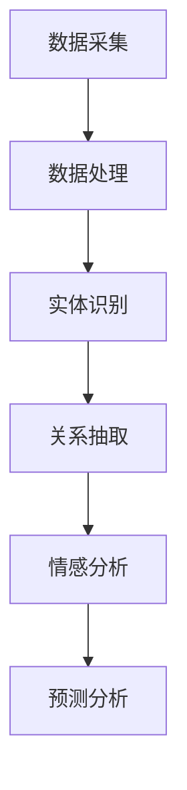
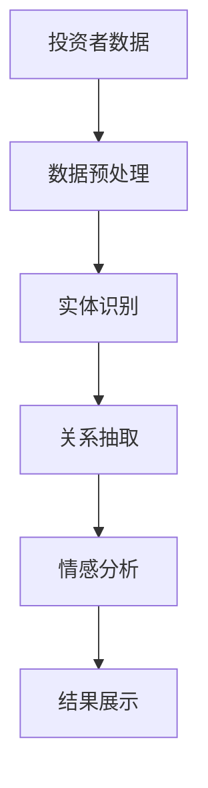
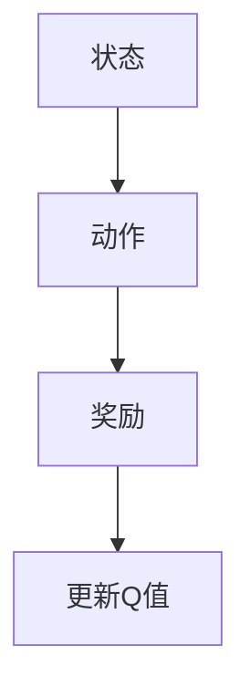
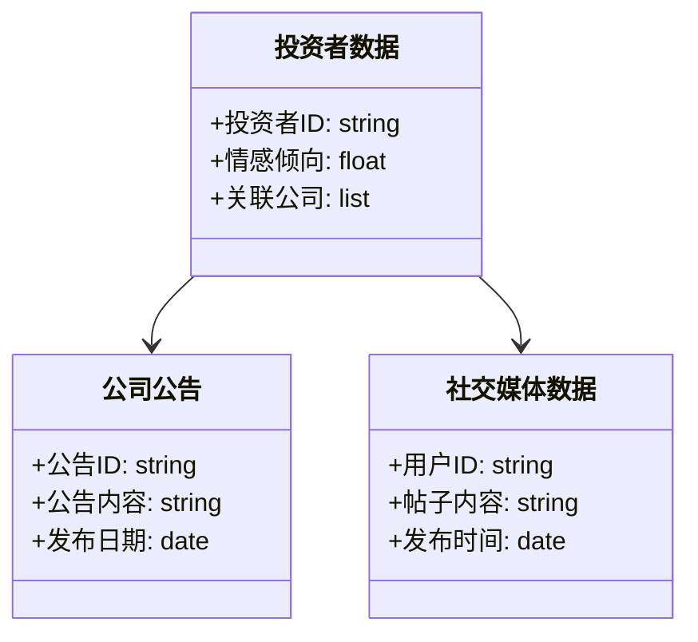
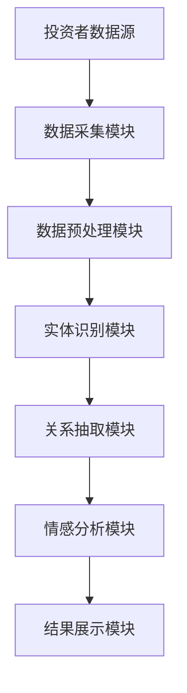
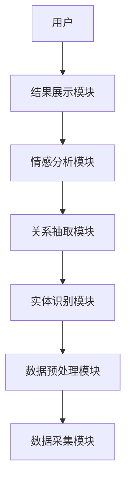

                 


# 基于多智能体的自动化投资者关系分析系统

## 关键词：多智能体系统、投资者关系分析、自动化分析、分布式计算、强化学习

## 摘要：  
本文探讨了基于多智能体的自动化投资者关系分析系统的设计与实现。通过分析投资者关系的核心问题，提出了一种多智能体协同工作的解决方案，利用分布式计算和强化学习等技术，构建了一个高效、智能的投资者关系分析系统。本文详细阐述了系统的核心算法、架构设计以及实际应用场景，为投资者关系管理提供了新的思路和方法。

---

# 第1章：背景介绍

## 1.1 问题背景

### 1.1.1 投资者关系管理的重要性  
投资者关系管理（Investor Relation Management，IRM）是企业与投资者之间沟通的桥梁，通过及时传递公司信息、维护投资者信任，直接影响公司的市场价值和资本运作效率。传统的投资者关系管理依赖人工分析，效率低、覆盖面有限，难以应对海量数据和实时分析的需求。

### 1.1.2 传统投资者关系管理的局限性  
传统投资者关系管理主要依赖人工筛选和分析财务报告、新闻报道等信息，存在以下问题：  
1. 数据量大，人工分析效率低；  
2. 实时性差，难以捕捉市场变化；  
3. 主观性强，分析结果受个人经验影响；  
4. 难以处理多源异构数据。  

### 1.1.3 多智能体系统的优势  
多智能体系统（Multi-Agent System，MAS）通过多个智能体协同工作，能够高效处理复杂任务。在投资者关系管理中，多智能体系统可以实现：  
- 分布式数据采集与处理；  
- 实时信息分析与反馈；  
- 多维度关系挖掘与预测。  

## 1.2 问题描述

### 1.2.1 投资者关系分析的复杂性  
投资者关系分析需要处理海量非结构化数据，包括新闻、社交媒体、财务报告等，涉及多种数据格式和语义理解。  

### 1.2.2 数据来源的多样性  
投资者关系数据来源广泛，包括新闻媒体、社交媒体、公司公告等，数据格式多样，增加了分析的复杂性。  

### 1.2.3 实时分析的需求  
投资者关系分析需要实时跟踪市场动态，及时发现潜在风险或机会，这对系统的实时性提出了更高要求。  

## 1.3 问题解决

### 1.3.1 引入多智能体系统的目的  
引入多智能体系统是为了提高投资者关系分析的效率和准确性，通过分布式计算和协同学习实现任务分解和优化。  

### 1.3.2 多智能体在投资者关系分析中的应用  
多智能体系统可以应用于以下场景：  
- 分布式数据采集与预处理；  
- 实体识别与关系抽取；  
- 情感分析与预测；  
- 实时监控与反馈。  

### 1.3.3 解决传统方法的不足  
多智能体系统通过以下方式解决了传统方法的不足：  
- 提高了数据处理效率；  
- 实现了多维度数据的协同分析；  
- 增强了系统的实时性和可扩展性。  

## 1.4 边界与外延

### 1.4.1 系统的边界  
投资者关系分析系统的边界包括：  
- 数据来源：新闻、社交媒体、公司公告等；  
- 分析目标：投资者情绪、公司声誉、市场趋势等；  
- 输出结果：实时报告、预警信息、数据分析可视化等。  

### 1.4.2 外延与相关领域的联系  
投资者关系分析与以下领域密切相关：  
- 自然语言处理（NLP）：用于文本分析和情感计算；  
- 数据挖掘与机器学习：用于模式识别和预测分析；  
- 分布式系统：用于数据采集和任务分配。  

### 1.4.3 系统与外部环境的交互  
投资者关系分析系统通过API接口与外部数据源、数据库以及用户界面进行交互，实现数据的输入与输出。  

## 1.5 概念结构与核心要素

### 1.5.1 核心概念的构成  
投资者关系分析系统的核心概念包括：  
- 数据采集：从多种来源获取投资者相关数据；  
- 数据处理：清洗、转换和预处理数据；  
- 实体识别：识别公司、投资者等实体信息；  
- 关系抽取：挖掘实体之间的关系；  
- 情感分析：分析文本中的情感倾向；  
- 预测分析：基于历史数据预测未来趋势。  

### 1.5.2 核心要素的特征  
- 数据采集：实时性、多样性；  
- 数据处理：高效性、准确性；  
- 实体识别：准确性、可扩展性；  
- 关系抽取：关联性、语义理解；  
- 情感分析：情感强度、上下文理解；  
- 预测分析：预测精度、可解释性。  

### 1.5.3 概念结构图  


---

# 第2章：核心概念与联系

## 2.1 多智能体系统的核心原理

### 2.1.1 多智能体系统的定义与特点  
多智能体系统是由多个智能体组成的分布式系统，智能体之间通过协作和竞争完成复杂任务。其特点包括：  
- 分布式计算：任务分解到多个智能体；  
- 协作性：智能体之间协同工作；  
- 反应性：智能体能够感知环境并做出反应；  
- 自适应性：智能体能够动态调整策略。  

### 2.1.2 投资者关系分析的核心原理  
投资者关系分析的核心在于从海量数据中提取有价值的信息，通过多智能体系统的协同工作，实现高效的数据处理和分析。  

### 2.1.3 多智能体系统与投资者关系分析的联系  
多智能体系统通过分布式计算和协同学习，能够高效处理投资者关系分析中的复杂任务，如数据采集、实体识别和情感分析。  

---

## 2.2 投资者关系分析的原理

### 2.2.1 数据采集与处理  
数据采集是投资者关系分析的第一步，需要从多种来源获取数据，并进行清洗和预处理。  

### 2.2.2 实体识别与关系抽取  
通过自然语言处理技术，识别文本中的实体，并挖掘实体之间的关系。  

### 2.2.3 情感分析与预测  
基于文本的情感分析，预测投资者情绪的变化趋势。  

---

## 2.3 系统架构的Mermaid流程图  


---

# 第3章：算法原理

## 3.1 分布式计算原理

### 3.1.1 并行计算公式  
$$T = \sum_{i=1}^{n} T_i$$  

### 3.1.2 分布式计算的实现  
通过将任务分解到多个智能体，利用并行计算提高处理效率。  

## 3.2 强化学习算法

### 3.2.1 Q-learning算法  
Q-learning是一种经典的强化学习算法，通过状态-动作-奖励的机制优化智能体的决策策略。  

### 3.2.2 算法流程图  


---

# 第4章：系统分析与架构设计

## 4.1 问题场景介绍

### 4.1.1 投资者关系分析系统的目标  
- 实时监控投资者情绪变化；  
- 分析公司声誉和市场趋势；  
- 提供数据驱动的决策支持。  

## 4.2 系统功能设计

### 4.2.1 领域模型类图  


### 4.2.2 系统架构设计  


### 4.2.3 接口设计  
- 数据采集接口：从多种来源获取数据；  
- 模块间接口：模块之间的数据传递和交互；  
- 用户界面接口：提供可视化结果展示。  

### 4.2.4 交互流程图  


---

# 第5章：项目实战

## 5.1 环境安装

### 5.1.1 Python环境安装  
安装Python和必要的库，如numpy、pandas、spacy等。  

### 5.1.2 系统安装  
安装多智能体框架，如基于Docker的分布式计算框架。  

## 5.2 核心实现

### 5.2.1 数据采集模块  
实现从社交媒体和公司公告中采集数据的代码。  

```python
import requests

def fetch_data(source):
    # 数据采集逻辑
    pass
```

### 5.2.2 实体识别与关系抽取  
使用自然语言处理库实现实体识别和关系抽取。  

```python
from spacy.lang.zh import Chinese

nlp = Chinese()
doc = nlp("公司A收购了公司B。")
for ent in doc.ents:
    print(ent.text, ent.label_)
```

### 5.2.3 情感分析模块  
使用机器学习模型进行情感分析。  

```python
from sklearn.feature_extraction.text import TfidfVectorizer
from sklearn.svm import SVC

vectorizer = TfidfVectorizer()
model = SVC()
```

## 5.3 实际案例分析

### 5.3.1 案例介绍  
分析某公司的社交媒体数据，识别投资者情绪变化。  

### 5.3.2 数据分析与解读  
展示数据分析结果，并解释其对投资者关系的影响。  

### 5.3.3 结果展示  
通过可视化工具展示分析结果，如情感趋势图、关联图等。  

---

# 第6章：总结与展望

## 6.1 小结  
本文详细介绍了基于多智能体的自动化投资者关系分析系统的构建与实现，包括核心算法、系统架构和项目实战。  

## 6.2 注意事项  
在实际应用中，需要注意数据隐私、算法可解释性等问题。  

## 6.3 拓展阅读  
建议读者深入学习多智能体系统、自然语言处理和分布式计算的相关知识。

---

# 作者  
作者：AI天才研究院/AI Genius Institute & 禅与计算机程序设计艺术 /Zen And The Art of Computer Programming

