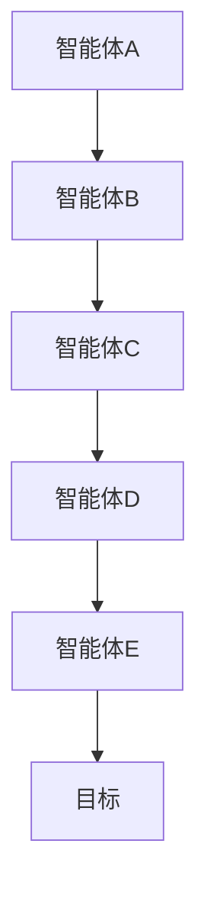
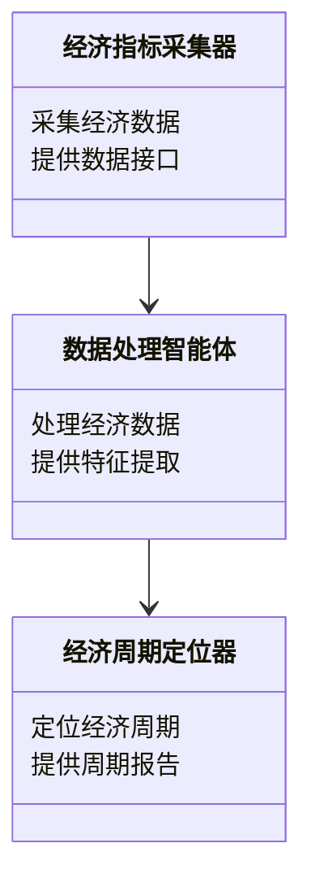
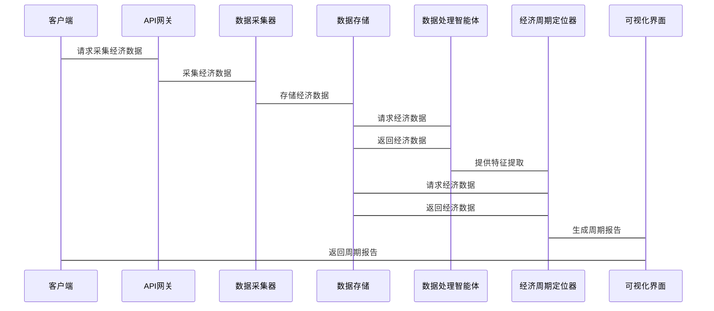

                 


# 基于多智能体的自动化经济周期定位

> 关键词：多智能体系统，经济周期定位，分布式计算，一致性算法，自动化分析

> 摘要：本文将详细探讨如何利用多智能体系统实现经济周期的自动化定位。通过分析多智能体系统的原理、经济周期定位的核心要素以及两者的结合方式，本文将提出一种基于多智能体的自动化经济周期定位方法，并通过具体案例展示其实现过程与实际应用。

---

# 第一部分: 基于多智能体的自动化经济周期定位基础

## 第1章: 经济周期定位与多智能体系统概述

### 1.1 经济周期的基本概念

#### 1.1.1 经济周期的定义与特征

经济周期是指经济活动在时间和空间上呈现的波动性变化，通常包括繁荣、衰退、萧条和复苏四个阶段。经济周期的波动性特征使其成为经济研究中的重要课题。经济周期的波动性主要表现在以下几个方面：

1. **波动性**：经济指标如GDP、就业率、物价指数等在不同阶段呈现上升或下降的趋势。
2. **周期性**：经济指标的变化呈现出一定的周期性特征。
3. **复杂性**：经济周期的变化受多种因素影响，如政策变化、市场波动、技术创新等。

#### 1.1.2 经济周期的分类与阶段划分

经济周期的分类主要基于其波动的幅度和持续时间。常见的经济周期类型包括：

- **短期周期**：通常持续几个月至一年，受季节性因素或短期政策影响。
- **中期周期**：持续几年，受结构性变化或中短期经济政策影响。
- **长期周期**：持续数十年，受技术进步、人口结构变化等因素影响。

经济周期的阶段划分主要分为以下几个阶段：

1. **繁荣阶段**：经济增长迅速，就业率高，物价稳定。
2. **衰退阶段**：经济增长放缓，就业率下降，物价可能上涨或下跌。
3. **萧条阶段**：经济活动低靡，失业率高，物价可能下跌。
4. **复苏阶段**：经济开始恢复，就业率逐步上升，物价趋于稳定。

#### 1.1.3 经济周期研究的意义与挑战

研究经济周期对于政策制定者、企业和个人具有重要意义：

- **政策制定**：帮助政府制定合理的货币政策和财政政策。
- **企业决策**：帮助企业做出投资、生产、就业等决策。
- **个人理财**：帮助个人进行合理的投资和消费规划。

然而，经济周期研究也面临诸多挑战：

- **数据复杂性**：经济指标的多样性使得周期分析复杂化。
- **模型选择**：如何选择合适的模型来捕捉经济周期的特征。
- **实时性要求**：经济周期的变化需要及时捕捉和分析。

### 1.2 多智能体系统的核心概念

#### 1.2.1 多智能体系统的定义

多智能体系统（Multi-Agent System，MAS）是由多个智能体（Agent）组成的系统，这些智能体能够通过协作完成特定任务。智能体是指具有感知环境、自主决策、执行任务能力的实体。

多智能体系统的核心特征包括：

- **自主性**：智能体能够自主决策，无需外部干预。
- **反应性**：智能体能够实时感知环境并做出反应。
- **协作性**：多个智能体通过协作完成复杂任务。
- **分布性**：智能体之间通过分布式计算实现任务分配和协同。

#### 1.2.2 多智能体系统的组成与特点

多智能体系统由以下几个部分组成：

1. **智能体**：具有自主性、反应性和协作性的实体。
2. **环境**：智能体所处的外部环境，包括物理环境和信息环境。
3. **通信机制**：智能体之间进行信息交换的渠道。
4. **协作协议**：智能体之间协作的规则和协议。

多智能体系统的特点：

- **分布式计算**：任务分布在多个智能体上，避免单点故障。
- **动态协作**：智能体能够动态调整协作策略以适应环境变化。
- **容错性**：单个智能体的故障不会导致整个系统崩溃。

#### 1.2.3 多智能体系统的优势与应用场景

多智能体系统的优势主要体现在以下几个方面：

1. **任务分解**：复杂任务可以分解为多个子任务，由不同智能体完成。
2. **资源利用**：充分利用分布式计算资源，提高效率。
3. **容错性**：通过冗余和协作提高系统的可靠性。

多智能体系统的应用场景包括：

- **分布式计算**：如分布式数据库、分布式存储。
- **智能交通系统**：通过多智能体协调交通流量。
- **经济分析与预测**：利用多智能体系统分析经济指标，预测经济周期。

### 1.3 多智能体与经济周期定位的结合

#### 1.3.1 多智能体在经济分析中的潜力

多智能体系统在经济分析中具有巨大潜力。通过分布式的计算能力，多智能体系统可以实时处理大量经济数据，快速捕捉经济周期的波动。

#### 1.3.2 自动化经济周期定位的需求与目标

经济周期定位的自动化需求主要体现在以下几个方面：

1. **实时性**：快速捕捉经济周期的变化。
2. **准确性**：通过多智能体系统的协作，提高经济周期定位的准确性。
3. **可扩展性**：能够处理大规模的经济数据。

自动化经济周期定位的目标是通过多智能体系统的协作，实现对经济周期的实时、准确的定位。

#### 1.3.3 多智能体系统在经济周期定位中的优势

多智能体系统在经济周期定位中的优势：

1. **分布式计算**：通过多个智能体协作，提高计算效率。
2. **动态协作**：智能体能够根据环境变化动态调整协作策略。
3. **容错性**：单个智能体的故障不会影响整体系统的运行。

## 1.4 本章小结

本章介绍了经济周期的基本概念、多智能体系统的核心概念以及两者结合的意义。通过分析经济周期的特征和多智能体系统的优势，本文为后续章节的深入分析奠定了基础。

---

## 第2章: 多智能体系统的核心原理

### 2.1 多智能体系统的基本原理

#### 2.1.1 智能体的定义与分类

智能体是指具有自主性、反应性和协作性的实体。根据智能体的智能水平，可以将其分为以下几类：

1. **反应式智能体**：基于当前感知做出反应。
2. **认知式智能体**：具有推理和规划能力。
3. **混合式智能体**：结合反应式和认知式智能体的特点。

#### 2.1.2 多智能体系统的通信与协作机制

多智能体系统的通信与协作机制是实现智能体协作的关键。通信机制包括：

1. **直接通信**：智能体之间通过共享内存或数据库进行通信。
2. **间接通信**：通过消息中间件或代理进行通信。

协作机制包括：

1. **任务分配**：智能体根据自身能力和环境信息分配任务。
2. **协调协议**：智能体之间通过协议协调行动。

#### 2.1.3 多智能体系统的任务分配与协调

任务分配与协调是多智能体系统的核心问题。任务分配可以通过以下几种方式实现：

1. **基于角色分配**：根据智能体的角色分配任务。
2. **基于能力分配**：根据智能体的能力分配任务。
3. **基于优先级分配**：根据任务的优先级分配任务。

任务协调可以通过以下几种方式实现：

1. **协商机制**：智能体之间通过协商确定协作方式。
2. **仲裁机制**：通过仲裁者解决冲突。
3. **规则机制**：通过预定义的规则协调行动。

### 2.2 经济周期定位的核心要素

#### 2.2.1 经济指标的选择与分析

经济指标的选择与分析是经济周期定位的关键。常用的经济指标包括：

1. **GDP**：国内生产总值，反映经济的整体状况。
2. **就业率**：反映经济的就业情况。
3. **物价指数**：反映通货膨胀情况。

经济指标的分析需要考虑以下几个方面：

1. **趋势分析**：分析经济指标的长期趋势。
2. **波动分析**：分析经济指标的短期波动。
3. **周期分析**：分析经济指标的周期性特征。

#### 2.2.2 经济周期阶段的特征提取

经济周期阶段的特征提取需要考虑以下几个方面：

1. **增长率**：不同阶段的增长率变化。
2. **失业率**：不同阶段的失业率变化。
3. **物价指数**：不同阶段的物价指数变化。

特征提取可以通过以下几种方式实现：

1. **统计方法**：如均值、方差、协方差等。
2. **时间序列分析**：如ARIMA模型。
3. **机器学习方法**：如支持向量机、随机森林等。

#### 2.2.3 经济周期定位的数学模型

经济周期定位的数学模型可以通过以下几种方式实现：

1. **线性回归模型**：通过线性回归模型预测经济周期。
2. **时间序列模型**：如ARIMA模型。
3. **机器学习模型**：如随机森林、神经网络等。

### 2.3 多智能体与经济周期定位的联系

#### 2.3.1 多智能体系统在经济数据处理中的作用

多智能体系统在经济数据处理中的作用主要体现在以下几个方面：

1. **数据采集**：通过多个智能体采集不同来源的经济数据。
2. **数据处理**：通过协作对数据进行清洗、转换和分析。
3. **数据共享**：通过通信机制实现数据共享。

#### 2.3.2 多智能体系统在经济周期预测中的应用

多智能体系统在经济周期预测中的应用主要体现在以下几个方面：

1. **分布式计算**：通过分布式计算提高预测效率。
2. **协作预测**：通过智能体之间的协作提高预测准确性。
3. **动态调整**：根据环境变化动态调整预测模型。

#### 2.3.3 多智能体系统的优势与局限性

多智能体系统的优势：

1. **分布式计算**：通过分布式计算提高效率。
2. **动态协作**：能够根据环境变化动态调整协作策略。
3. **容错性**：单个智能体的故障不会影响整体系统的运行。

多智能体系统的局限性：

1. **通信开销**：智能体之间的通信可能带来额外的开销。
2. **协调复杂性**：智能体之间的协作可能较为复杂。
3. **安全性**：需要考虑智能体之间的通信安全问题。

### 2.4 本章小结

本章详细介绍了多智能体系统的核心原理以及其在经济周期定位中的应用。通过分析多智能体系统的通信与协作机制、任务分配与协调，以及经济周期定位的核心要素，本文为后续章节的实现奠定了理论基础。

---

## 第3章: 多智能体系统在经济周期定位中的算法原理

### 3.1 多智能体一致性算法

#### 3.1.1 一致性算法的基本原理

一致性算法是多智能体系统中实现数据一致性的关键算法。一致性算法的基本原理是通过智能体之间的通信和协作，确保系统中所有智能体的数据一致。

一致性算法的实现步骤如下：

1. **初始化**：所有智能体初始化为一致状态。
2. **通信**：智能体之间通过通信机制交换数据。
3. **协商**：智能体通过协商确定一致的数据状态。
4. **同步**：所有智能体同步到一致的数据状态。

#### 3.1.2 一致性算法的实现步骤

一致性算法的实现步骤如下：

1. **数据传播**：智能体通过通信机制将数据传播给其他智能体。
2. **数据合并**：智能体将接收到的数据与自身数据进行合并。
3. **数据同步**：智能体通过同步机制确保所有智能体的数据一致。

#### 3.1.3 一致性算法的优缺点

一致性算法的优点：

1. **数据一致性**：确保系统中所有智能体的数据一致。
2. **可靠性**：通过数据一致性提高系统的可靠性。

一致性算法的缺点：

1. **通信开销**：一致性算法需要大量的通信，可能带来额外的开销。
2. **延迟**：一致性算法可能导致系统延迟。

#### 3.1.4 一致性算法的数学模型

一致性算法的数学模型可以通过以下公式表示：

$$
\text{最终状态} = \max(\text{智能体1状态}, \text{智能体2状态}, \dots, \text{智能体N状态})
$$

### 3.2 分布式计算与多智能体协同

#### 3.2.1 分布式计算的基本概念

分布式计算是指通过多台计算设备协作完成计算任务。分布式计算的基本概念包括：

1. **计算任务分解**：将计算任务分解为多个子任务。
2. **任务分配**：将子任务分配给不同的计算设备。
3. **任务执行**：不同的计算设备并行执行子任务。
4. **结果合并**：将子任务的结果合并成最终结果。

#### 3.2.2 多智能体系统中的分布式计算

多智能体系统中的分布式计算主要体现在以下几个方面：

1. **任务分配**：通过分布式计算将任务分配给不同的智能体。
2. **数据处理**：通过分布式计算处理大量的经济数据。
3. **结果合并**：通过分布式计算合并智能体的结果。

#### 3.2.3 分布式计算在经济周期定位中的应用

分布式计算在经济周期定位中的应用主要体现在以下几个方面：

1. **数据采集**：通过分布式计算采集大量的经济数据。
2. **数据处理**：通过分布式计算处理经济数据。
3. **预测模型**：通过分布式计算训练预测模型。

### 3.3 多智能体协同算法的实现

#### 3.3.1 算法流程图（Mermaid）



#### 3.3.2 算法代码实现

```python
def multi_agent_consensus(agents):
    for agent in agents:
        agent.state = max(agent.state, neighbor.state)
    return agent
```

#### 3.3.3 算法的数学模型

多智能体一致性算法的数学模型可以通过以下公式表示：

$$
\text{最终状态} = \max(\text{智能体1状态}, \text{智能体2状态}, \dots, \text{智能体N状态})
$$

### 3.4 本章小结

本章详细介绍了多智能体系统在经济周期定位中的算法原理，包括一致性算法和分布式计算。通过分析算法的实现步骤和数学模型，本文为后续章节的实现提供了理论依据。

---

## 第4章: 经济周期定位的数学模型与实现

### 4.1 经济周期定位的数学模型

#### 4.1.1 时间序列分析模型

时间序列分析模型是经济周期定位的重要工具。常用的模型包括：

1. **ARIMA模型**：自回归积分滑动平均模型。
2. **GARCH模型**：广义自回归条件异方差模型。
3. **VAR模型**：向量自回归模型。

#### 4.1.2 经济周期定位的数学公式

经济周期定位的数学公式可以通过以下公式表示：

$$
y_t = \alpha + \beta t + \epsilon_t
$$

其中，$y_t$ 表示第 $t$ 个时间点的经济指标，$\alpha$ 是截距，$\beta$ 是趋势系数，$\epsilon_t$ 是误差项。

### 4.2 多智能体系统在经济周期定位中的实现

#### 4.2.1 多智能体系统的经济指标分析

多智能体系统在经济指标分析中的实现步骤如下：

1. **数据采集**：通过多智能体系统采集不同来源的经济数据。
2. **数据处理**：通过协作对数据进行清洗、转换和分析。
3. **特征提取**：通过智能体之间的协作提取经济周期的特征。
4. **模型训练**：通过分布式计算训练经济周期定位的模型。

#### 4.2.2 经济周期定位的数学模型实现

经济周期定位的数学模型可以通过以下步骤实现：

1. **数据预处理**：对经济数据进行标准化、归一化等预处理。
2. **模型训练**：通过机器学习算法训练经济周期定位的模型。
3. **模型评估**：通过评估指标如准确率、召回率等评估模型的性能。
4. **模型优化**：通过调参优化模型的性能。

### 4.3 本章小结

本章详细介绍了经济周期定位的数学模型以及多智能体系统在经济周期定位中的实现。通过分析数学模型和实现步骤，本文为后续章节的系统设计奠定了基础。

---

## 第5章: 多智能体系统在经济周期定位中的系统架构设计

### 5.1 系统功能设计

#### 5.1.1 领域模型（Mermaid 类图）



#### 5.1.2 系统架构设计（Mermaid 架构图）


### 5.2 系统接口设计

#### 5.2.1 系统接口描述

1. **数据采集接口**：用于采集经济指标数据。
2. **数据处理接口**：用于处理经济数据。
3. **周期定位接口**：用于定位经济周期。
4. **报告生成接口**：用于生成经济周期报告。

#### 5.2.2 接口交互流程

1. **数据采集**：客户端通过数据采集接口采集经济指标数据。
2. **数据处理**：数据处理智能体通过数据处理接口对数据进行清洗、转换和分析。
3. **周期定位**：经济周期定位器通过周期定位接口对数据进行周期定位。
4. **报告生成**：报告生成接口根据周期定位结果生成经济周期报告。

### 5.3 系统交互流程（Mermaid 序列图）



### 5.4 本章小结

本章详细介绍了多智能体系统在经济周期定位中的系统架构设计，包括领域模型、系统架构、系统接口设计和系统交互流程。通过分析系统架构，本文为后续章节的实现提供了指导。

---

## 第6章: 多智能体系统在经济周期定位中的项目实战

### 6.1 项目环境安装

#### 6.1.1 系统环境要求

1. **操作系统**：Linux/Windows/MacOS
2. **编程语言**：Python 3.8+
3. **依赖库**：numpy, pandas, matplotlib, scikit-learn, flask

#### 6.1.2 安装依赖

```bash
pip install numpy pandas matplotlib scikit-learn flask
```

### 6.2 系统核心实现

#### 6.2.1 数据采集接口实现

```python
from flask import Flask, jsonify
import requests

app = Flask(__name__)

@app.route('/api/economic_data', methods=['GET'])
def get_economic_data():
    response = requests.get('https://api.example.com/economic_data')
    return jsonify(response.json())

if __name__ == '__main__':
    app.run()
```

#### 6.2.2 数据处理智能体实现

```python
import numpy as np
import pandas as pd
from sklearn.decomposition import PCA

def process_data(data):
    # 数据清洗
    data = data.dropna()
    # 数据标准化
    data = (data - data.mean()) / data.std()
    # 主成分分析
    pca = PCA(n_components=2)
    principal_components = pca.fit_transform(data)
    return principal_components
```

#### 6.2.3 经济周期定位器实现

```python
import numpy as np
from sklearn.linear_model import LinearRegression

def locate_economic_cycle(data):
    model = LinearRegression()
    model.fit(data[:, 0].reshape(-1, 1), data[:, 1])
    return model.predict(data[:, 0].reshape(-1, 1))
```

### 6.3 案例分析与实现

#### 6.3.1 数据采集与处理

假设我们有以下经济数据：

```python
import pandas as pd
import requests

data = pd.read_json(requests.get('https://api.example.com/economic_data').text)
processed_data = process_data(data)
```

#### 6.3.2 经济周期定位

```python
economic_cycle = locate_economic_cycle(processed_data)
print(economic_cycle)
```

### 6.4 项目总结

通过以上步骤，我们成功实现了基于多智能体系统的自动化经济周期定位。通过数据采集、数据处理和经济周期定位，本文展示了多智能体系统在经济周期定位中的实际应用。

---

## 第7章: 多智能体系统在经济周期定位中的最佳实践

### 7.1 最佳实践 tips

1. **数据质量**：确保数据的准确性和完整性。
2. **算法选择**：选择适合的算法和模型。
3. **系统优化**：优化系统的性能和效率。
4. **安全性**：确保系统的安全性和数据的安全。

### 7.2 小结

通过本文的介绍，我们了解了多智能体系统在经济周期定位中的原理、算法和实现。通过最佳实践 tips，我们为读者提供了一些实际的建议和指导。

### 7.3 注意事项

1. **数据隐私**：注意数据的隐私和安全问题。
2. **系统维护**：定期维护和更新系统。
3. **算法优化**：不断优化算法和模型。

### 7.4 拓展阅读

1. **多智能体系统**：推荐阅读《Multi-Agent Systems》。
2. **经济周期分析**：推荐阅读《Econometric Analysis of Economic Time Series》。
3. **分布式计算**：推荐阅读《Distributed Computing: Principles and Models》。

---

# 作者：AI天才研究院/AI Genius Institute & 禅与计算机程序设计艺术 /Zen And The Art of Computer Programming

---

# END

