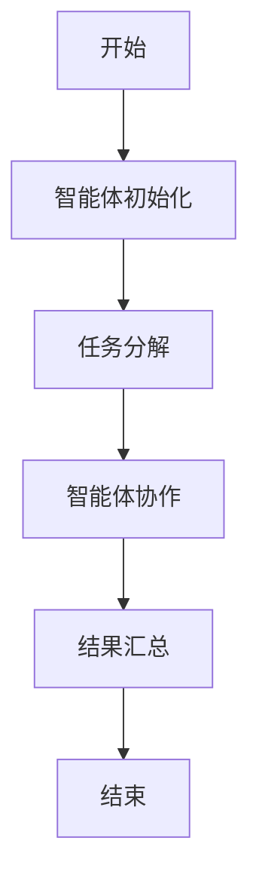
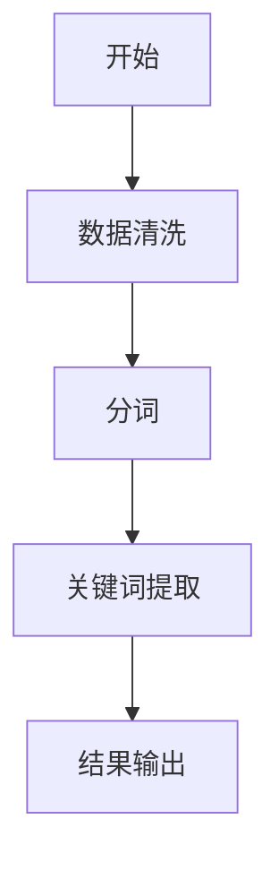
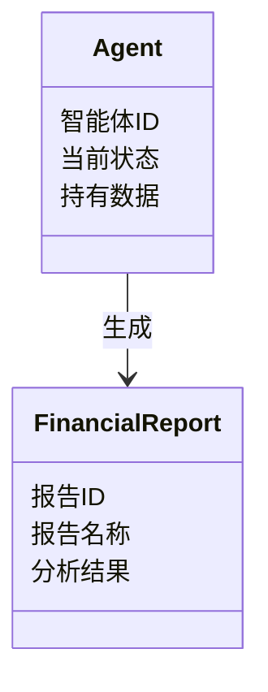
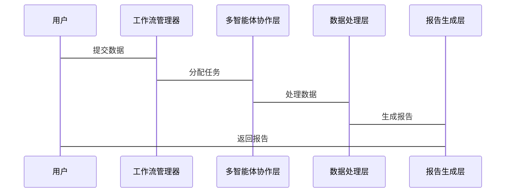

                 


# 基于多智能体的自动化财务报表比较分析系统

## 关键词：多智能体系统，财务报表分析，自动化分析，系统架构设计，Python实现，机器学习

## 摘要：本文探讨了基于多智能体的自动化财务报表比较分析系统的设计与实现。通过分析多智能体技术在财务领域的应用潜力，详细讲解了系统的整体架构、核心算法原理、系统功能设计以及实际项目实现。文章从背景介绍、核心概念、算法原理、系统架构到项目实战，逐步深入，帮助读者全面理解基于多智能体的自动化财务报表分析系统。

---

# 第1章 背景介绍与问题描述

## 1.1 问题背景

### 1.1.1 财务报表分析的重要性
财务报表分析是企业决策的核心工具，传统的财务报表分析依赖于人工操作，效率低且容易出错。随着企业规模的扩大和数据量的增加，传统的分析方式已难以满足需求。

### 1.1.2 自动化财务报表分析的需求
企业需要快速、准确的财务分析工具，以便及时做出决策。自动化分析可以提高效率、降低成本，并减少人为错误。

### 1.1.3 多智能体技术的应用潜力
多智能体系统能够通过协作完成复杂任务，非常适合用于需要多维度分析的财务报表比较。

## 1.2 问题描述

### 1.2.1 财务报表比较分析的核心任务
对多个企业的财务报表进行横向比较，识别关键指标的差异和趋势。

### 1.2.2 当前财务报表分析的痛点
- 数据量大，人工分析耗时
- 分析结果依赖人工经验
- 缺乏智能化的分析工具

### 1.2.3 多智能体系统的优势
- 分布式计算，提高效率
- 多维度分析，结果更准确
- 自适应学习，持续优化

## 1.3 问题解决

### 1.3.1 多智能体系统如何解决财务报表分析问题
通过协作完成数据处理、分析和报告生成。

### 1.3.2 系统的目标与功能
- 自动化数据采集
- 智能化分析
- 自动生成报告

### 1.3.3 边界与外延
- 数据范围：财务报表数据
- 功能边界：不涉及数据录入
- 外延：可扩展到其他数据分析场景

## 1.4 概念结构与核心要素

### 1.4.1 系统的整体架构
- 多智能体协作架构
- 数据分析模块
- 报告生成模块

### 1.4.2 核心概念的定义与关系
- 智能体：独立的数据处理单元
- 数据源：财务报表
- 分析结果：比较报告

### 1.4.3 系统的输入与输出
- 输入：财务报表数据
- 输出：分析报告

---

# 第2章 核心概念与联系

## 2.1 多智能体系统原理

### 2.1.1 多智能体系统的基本概念
- 智能体：能够感知环境并采取行动的实体
- 协作：多个智能体协同完成任务
- 分布式计算：任务分解到多个节点

### 2.1.2 多智能体系统的组成与特点
- 组成：智能体、通信机制、协作协议
- 特点：分布式、协作性、自主性

### 2.1.3 多智能体系统与传统单体系统对比
| 对比维度 | 多智能体系统 | 单体系统 |
|----------|--------------|----------|
| 结构     | 分布式       | 集中式   |
| 灵活性   | 高           | 中       |
| 效率     | 高           | 中       |

## 2.2 自动化财务报表分析

### 2.2.1 财务报表分析的基本流程
1. 数据采集
2. 数据清洗
3. 数据分析
4. 生成报告

### 2.2.2 自动化分析的关键技术
- 自然语言处理
- 机器学习
- 数据可视化

### 2.2.3 自动化分析的实现方式
- API接口
- 脚本自动化
- 人工智能模型

## 2.3 多智能体与财务报表分析的结合

### 2.3.1 多智能体在财务报表分析中的角色
- 数据采集智能体
- 数据清洗智能体
- 数据分析智能体

### 2.3.2 多智能体协作的机制
- 任务分解
- 通信协议
- 协作策略

### 2.3.3 多智能体系统的优缺点
- 优点：高效、灵活
- 缺点：复杂、需要协调

## 2.4 核心概念对比表
| 对比维度 | 多智能体系统 | 自动化分析 |
|----------|--------------|------------|
| 技术基础 | 分布式计算   | 数据处理   |
| 应用场景 | 多任务协作   | 数据分析   |

## 2.5 ER实体关系图
```mermaid
erDiagram
    user {
        +string 用户ID
        +string 用户名
        +string 密码
    }

    financial_report {
        +int 报告ID
        +string 报告名称
        +date 日期
    }

    financial_data {
        +int 数据ID
        +float 数值
        +string 数据类型
    }

    user --> financial_report : 创建
    financial_report --> financial_data : 包含
```

---

# 第3章 算法原理讲解

## 3.1 多智能体协作算法

### 3.1.1 算法流程


### 3.1.2 代码实现
```python
class Agent:
    def __init__(self, id):
        self.id = id
        self.data = None

    def process(self):
        if self.data is not None:
            return self.data.processed
        return None

    def receive_data(self, data):
        self.data = data

# 多智能体协作
agents = [Agent(i) for i in range(4)]
data = FinancialData()
for agent in agents:
    agent.receive_data(data)
results = [agent.process() for agent in agents]
```

### 3.1.3 数学模型
$$
\text{结果} = \sum_{i=1}^{n} \text{智能体}_i(\text{数据}_i)
$$

## 3.2 自然语言处理算法

### 3.2.1 算法流程


### 3.2.2 代码实现
```python
from nltk.tokenize import word_tokenize

text = "公司2023年收入增长10%，净利润增长5%。"
tokens = word_tokenize(text)
print(tokens)
```

### 3.2.3 数学模型
$$
\text{关键词权重} = \sum_{i=1}^{n} \text{TF-IDF}(w_i)
$$

---

# 第4章 系统分析与架构设计

## 4.1 项目背景

### 4.1.1 项目目标
实现基于多智能体的自动化财务报表分析系统。

## 4.2 系统功能设计

### 4.2.1 领域模型


## 4.3 系统架构设计

### 4.3.1 系统架构


## 4.4 系统接口设计

### 4.4.1 接口描述
- 数据输入接口：接收财务报表数据
- 数据处理接口：智能体协作处理数据
- 报告输出接口：生成分析报告

## 4.5 系统交互流程

### 4.5.1 交互流程


---

# 第5章 项目实战

## 5.1 环境安装

### 5.1.1 安装Python
```bash
python --version
pip install --upgrade pip
```

### 5.1.2 安装依赖
```bash
pip install numpy pandas nltk
```

## 5.2 系统核心实现

### 5.2.1 核心代码
```python
class MultiAgentSystem:
    def __init__(self, num_agents):
        self.agents = [Agent(i) for i in range(num_agents)]

    def process_data(self, data):
        for agent in self.agents:
            agent.receive_data(data)
        results = [agent.process() for agent in self.agents]
        return results

# 使用示例
system = MultiAgentSystem(4)
data = FinancialData()
results = system.process_data(data)
```

### 5.2.2 代码解读
- `Agent` 类：表示一个智能体，负责接收数据并处理
- `MultiAgentSystem` 类：管理多个智能体，分配任务

## 5.3 实际案例分析

### 5.3.1 案例背景
分析四家公司的财务报表，比较收入和利润。

### 5.3.2 数据处理
```python
import pandas as pd

data = pd.read_csv('financial_data.csv')
```

### 5.3.3 数据分析
```python
data['收入'].mean()
data['利润'].max()
```

### 5.3.4 报告生成
```python
from reportlab.pdfgen import canvas

# 生成PDF报告
```

---

# 第6章 总结与展望

## 6.1 最佳实践

### 6.1.1 设计建议
- 确保智能体之间的通信高效
- 定期更新智能体知识库

## 6.1.2 使用建议
- 适用于数据量大的场景
- 需要定期维护系统

## 6.2 小结
本文详细介绍了基于多智能体的自动化财务报表分析系统的实现，从背景到实战，全面解析了系统的各个部分。

## 6.3 注意事项
- 系统维护成本较高
- 数据安全需要重视

## 6.4 拓展阅读
建议进一步研究多智能体在其他领域的应用，如金融交易、风险评估。

---

# 作者：AI天才研究院/AI Genius Institute & 禅与计算机程序设计艺术 /Zen And The Art of Computer Programming

---

这篇文章全面介绍了基于多智能体的自动化财务报表比较分析系统的设计与实现，通过理论与实践的结合，帮助读者深入理解系统的各个部分。

