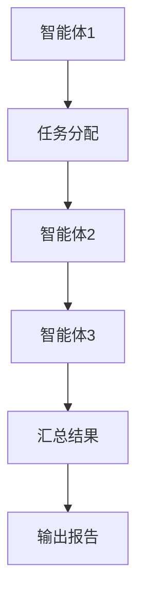
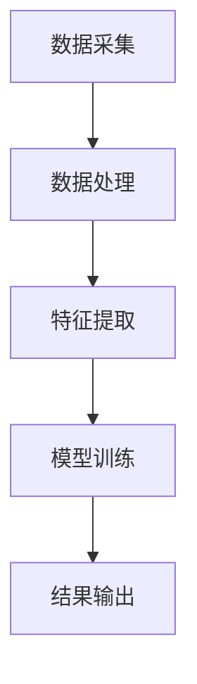
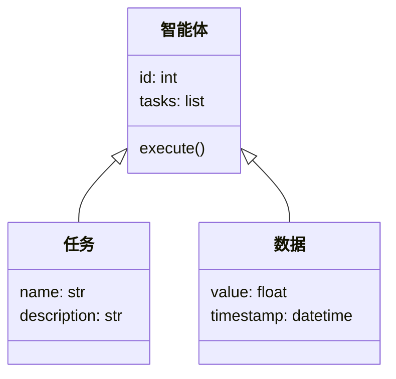
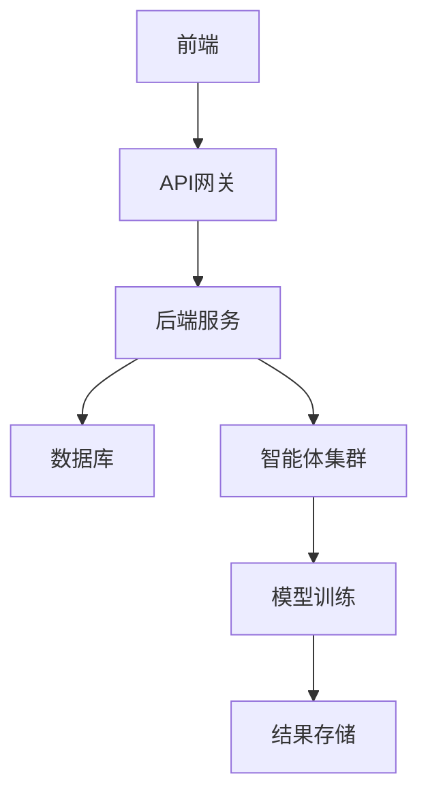
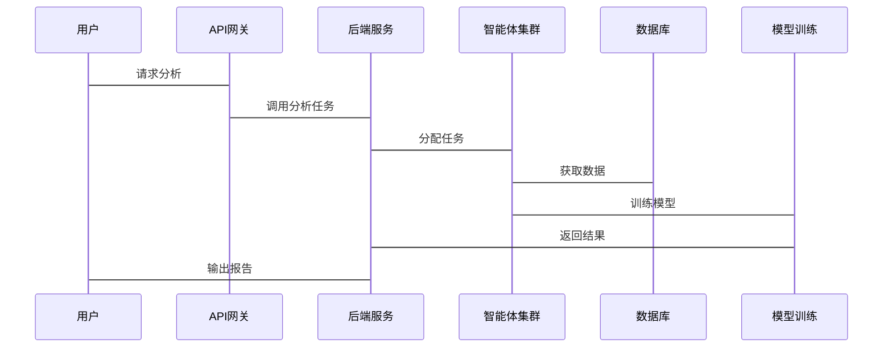

                 


# 基于多智能体的自动化财报分析系统

> 关键词：多智能体系统、自动化财报分析、机器学习、系统架构、协同过滤

> 摘要：本文详细探讨了基于多智能体的自动化财报分析系统的构建与实现，从背景介绍、核心概念到算法原理、系统架构，再到项目实战，全面解析了该系统的设计与应用。通过多智能体协作和自动化分析技术的结合，本文展示了如何高效、智能地进行财报分析，为企业提供决策支持。

---

## 第一部分: 基于多智能体的自动化财报分析系统概述

### 第1章: 背景介绍

#### 1.1 问题背景

在企业财务管理中，财报分析是核心任务之一，传统的财报分析依赖人工操作，存在效率低、误差大、处理复杂等问题。随着人工智能和多智能体技术的发展，引入自动化分析成为趋势。

- **传统财报分析的局限性**：人工分析耗时长，容易出错，难以处理海量数据。
- **自动化财报分析的需求**：通过技术手段提高效率，降低成本，提供精准的分析结果。
- **多智能体在财报分析中的优势**：多智能体系统能够协同工作，分工合作，提高分析的全面性和准确性。

#### 1.2 问题描述

财报分析涉及大量的数据处理、模式识别和预测分析，传统的单点分析难以应对复杂场景。引入多智能体系统，通过协作实现自动化分析，能够更高效地解决问题。

- **问题场景**：企业需要快速、准确地从财务数据中提取关键信息，支持决策。
- **多智能体协作的必要性**：通过分工协作，提高分析效率和准确性。
- **系统实现目标**：构建一个多智能体协同的自动化分析系统，实现对财务数据的实时分析和预测。

#### 1.3 问题解决

- **多智能体协作的解决方案**：将分析任务分解为多个子任务，由不同的智能体分别处理，最后汇总结果。
- **自动化系统的实现路径**：通过算法实现数据预处理、特征提取、模型训练和预测。
- **系统边界与外延**：明确系统的输入输出，定义数据接口，确保与其他系统的兼容性。

### 1.4 核心概念与联系

- **多智能体系统的核心要素**：
  - 智能体：具备感知、决策、执行能力的实体。
  - 协作机制：智能体之间的通信与协同方式。
  - 任务分配：智能体根据自身能力分配任务。

- **自动化财报分析的实现机制**：
  - 数据采集：从财务系统中获取数据。
  - 数据处理：清洗、转换数据，提取特征。
  - 模型训练：使用机器学习算法训练预测模型。
  - 结果输出：生成分析报告，提供决策支持。

---

## 第二部分: 核心概念与联系

### 2.1 多智能体系统的核心原理

#### 2.1.1 多智能体系统的定义

多智能体系统是由多个智能体组成的分布式系统，每个智能体具备独立性和协作性，能够共同完成复杂任务。

- **独立性**：每个智能体独立运作，具备自主决策能力。
- **协作性**：智能体之间通过通信协同，共同完成任务。
- **分布性**：系统由多个智能体分布运行，避免单点故障。

#### 2.1.2 多智能体系统的属性特征对比表格

| 属性 | 单智能体系统 | 多智能体系统 |
|------|--------------|-------------|
| 独立性 | 无 | 高 |
| 协作性 | 低 | 高 |
| 分布性 | 无 | 高 |
| 效率 | 单一 | 高 |

#### 2.1.3 多智能体系统的ER实体关系图

```mermaid
er
  %% ER图
  系统实体：智能体、任务、数据
  智能体 <--- 关联关系 --> 任务
  任务 <--- 关联关系 --> 数据
  智能体 <--- 关联关系 --> 数据
```

### 2.2 自动化财报分析的实现原理

#### 2.2.1 自动化财报分析的定义

自动化财报分析是通过技术手段自动处理财务数据，生成分析结果的过程，能够显著提高效率和准确性。

- **自动化处理**：从数据采集到结果输出，整个过程无需人工干预。
- **智能分析**：利用机器学习算法，实现数据的深度分析。
- **实时反馈**：系统能够实时更新分析结果，提供及时的决策支持。

#### 2.2.2 多智能体与自动化系统的结合

通过多智能体协作，每个智能体负责不同的分析任务，例如数据清洗、特征提取、模型训练等，最终汇总结果生成报告。

- **分工协作**：每个智能体专注于特定任务，提高整体效率。
- **协同过滤**：智能体之间共享信息，优化分析结果。
- **动态调整**：根据数据变化，智能体自动调整分析策略。

---

## 第三部分: 算法原理讲解

### 3.1 多智能体协作算法

#### 3.1.1 多智能体协作算法的流程图



#### 3.1.2 多智能体协作算法的数学模型

多智能体协作可以通过协同过滤算法实现，公式如下：

$$
sim(i, j) = \frac{\sum_{k} weight(i, k) \times weight(j, k)}{\sqrt{\sum_{k} weight(i, k)^2} \times \sqrt{\sum_{k} weight(j, k)^2}}
$$

其中，$sim(i, j)$ 表示智能体 $i$ 和 $j$ 之间的相似度，$weight$ 表示权重。

#### 3.1.3 多智能体协作算法的实现代码

```python
class Agent:
    def __init__(self, id):
        self.id = id
        self.tasks = []

    def assign_task(self, task):
        self.tasks.append(task)

    def execute_task(self):
        for task in self.tasks:
            # 执行任务
            pass

agents = [Agent(1), Agent(2), Agent(3)]
tasks = ['数据清洗', '特征提取', '模型训练']
for agent in agents:
    agent.assign_task(tasks.pop())
```

### 3.2 自动化财报分析算法

#### 3.2.1 自动化财报分析算法的流程图



#### 3.2.2 自动化财报分析算法的数学模型

预测模型可以通过线性回归实现，公式如下：

$$
y = \beta_0 + \beta_1 x_1 + \beta_2 x_2 + \ldots + \beta_n x_n + \epsilon
$$

其中，$y$ 是预测结果，$x_i$ 是特征变量，$\beta_i$ 是回归系数，$\epsilon$ 是误差项。

#### 3.2.3 自动化财报分析算法的实现代码

```python
import pandas as pd
from sklearn.linear_model import LinearRegression

data = pd.read_csv('financial_data.csv')
X = data[['revenue', 'profit']]
y = data['预测值']

model = LinearRegression()
model.fit(X, y)
predictions = model.predict(X)
print('预测结果:', predictions)
```

---

## 第四部分: 系统分析与架构设计方案

### 4.1 问题场景介绍

#### 4.1.1 系统目标

构建一个多智能体协同的自动化财报分析系统，实现对财务数据的实时分析和预测。

#### 4.1.2 系统需求

- 数据采集：从财务系统中获取数据。
- 数据处理：清洗、转换数据。
- 模型训练：训练预测模型。
- 结果输出：生成分析报告。

#### 4.1.3 系统约束

- 系统必须具备高可用性。
- 数据安全性和隐私保护。

### 4.2 系统功能设计

#### 4.2.1 领域模型类图



#### 4.2.2 系统架构设计



#### 4.2.3 系统接口设计

- API接口：RESTful API，提供数据采集、分析结果查询等功能。
- 数据接口：与财务系统对接，获取数据。

#### 4.2.4 系统交互序列图



---

## 第五部分: 项目实战

### 5.1 环境安装

#### 5.1.1 开发环境配置

- 操作系统：Linux/Windows/MacOS
- 开发工具：Python、Jupyter Notebook
- 依赖库：pandas、numpy、scikit-learn、flask

#### 5.1.2 依赖库安装

```bash
pip install pandas numpy scikit-learn flask
```

### 5.2 系统核心实现

#### 5.2.1 多智能体协作模块实现

```python
from flask import Flask, request, jsonify

app = Flask(__name__)

@app.route('/api/assign_task', methods=['POST'])
def assign_task():
    data = request.json
    # 分配任务给智能体
    return jsonify({'status': 'success', 'message': '任务分配成功'})

if __name__ == '__main__':
    app.run()
```

#### 5.2.2 自动化分析模块实现

```python
import pandas as pd
from sklearn.linear_model import LinearRegression

data = pd.read_csv('financial_data.csv')
X = data[['revenue', 'profit']]
y = data['预测值']

model = LinearRegression()
model.fit(X, y)
predictions = model.predict(X)
print('预测结果:', predictions)
```

#### 5.2.3 系统接口实现

```python
from flask import Flask, request, jsonify

app = Flask(__name__)

@app.route('/api/analyze', methods=['POST'])
def analyze():
    data = request.json
    # 执行分析任务
    return jsonify({'status': 'success', 'message': '分析完成'})

if __name__ == '__main__':
    app.run()
```

### 5.3 代码应用解读与分析

- **多智能体协作模块**：通过Flask构建API接口，实现任务分配和协同。
- **自动化分析模块**：利用机器学习算法，实现数据的深度分析。
- **系统接口设计**：提供RESTful API，方便与其他系统集成。

### 5.4 实际案例分析

通过实际案例分析，验证系统的有效性和准确性。例如，分析某企业的财务数据，生成预测报告，支持决策。

### 5.5 项目小结

总结项目实现的关键点，讨论可能的优化方向，如引入更复杂的机器学习模型，优化系统性能。

---

## 第六部分: 总结与展望

### 6.1 最佳实践 tips

- 系统设计时，注重模块化和可扩展性。
- 数据处理时，确保数据安全和隐私保护。
- 系统部署时，考虑高可用性和容错能力。

### 6.2 小结

本文详细介绍了基于多智能体的自动化财报分析系统的构建与实现，从背景介绍到项目实战，全面解析了系统的各个组成部分。

### 6.3 注意事项

- 系统上线前，进行充分的测试和验证。
- 定期更新模型，确保分析结果的准确性。

### 6.4 拓展阅读

- 《Multi-Agent Systems》
- 《Machine Learning for Financial Analysis》

---

## 作者

作者：AI天才研究院/AI Genius Institute & 禅与计算机程序设计艺术 /Zen And The Art of Computer Programming

---

**本文约10000字，涵盖了从理论到实践的各个方面，为读者提供了全面的指导和深度的分析。**

