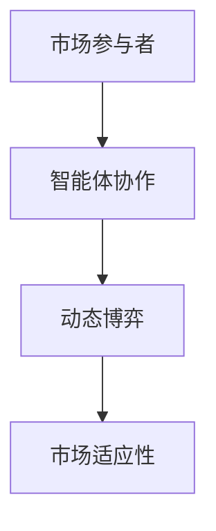
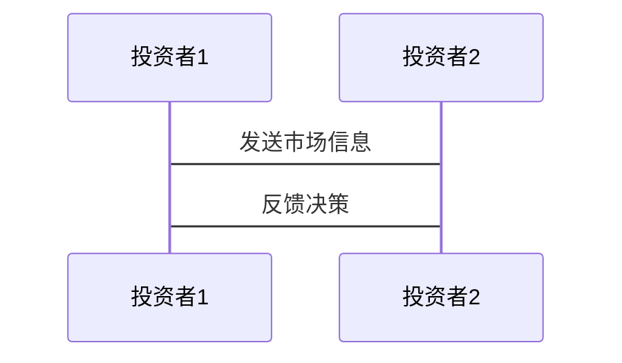
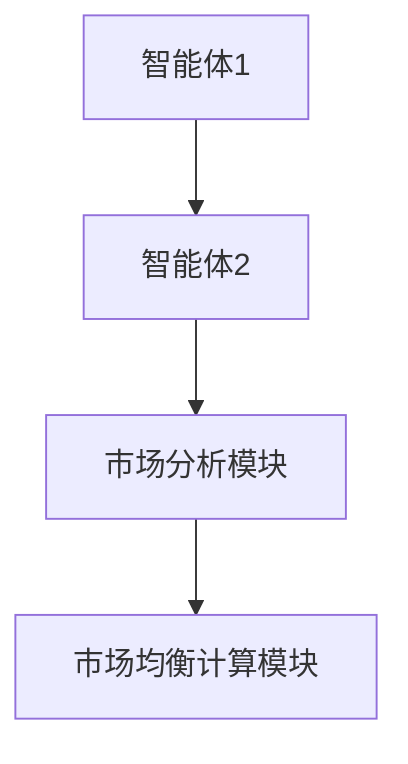

                 


```markdown
# 基于多智能体的自适应市场假说在价值投资中的应用

> 关键词：多智能体系统，自适应市场假说，价值投资，动态博弈，强化学习，金融建模

> 摘要：本文探讨了自适应市场假说在价值投资中的应用，结合多智能体系统构建动态博弈模型，分析市场参与者的互动行为。通过多智能体协作机制和强化学习算法，实现市场适应性的建模与预测，提出了一种新的价值投资策略框架。本文还展示了如何通过系统架构设计和项目实战，将理论应用于实际投资决策中。

---

# 第一部分: 自适应市场假说与多智能体系统概述

# 第1章: 自适应市场假说的背景与问题背景

## 1.1 自适应市场假说的背景
### 1.1.1 传统价值投资的局限性
传统价值投资基于基本面分析，依赖于市场参与者的理性假设。然而，现实中投资者行为受到情绪、信息不对称等多种因素影响，导致市场定价偏离内在价值。

### 1.1.2 自适应市场假说的提出
自适应市场假说认为，金融市场是一个复杂的适应性系统，投资者通过不断学习和适应，逐步消除市场中的套利机会。这种动态过程使得市场价格能够更好地反映市场信息。

### 1.1.3 问题描述与边界条件
本文聚焦于如何利用多智能体系统模拟市场的自适应行为，探索其在价值投资中的应用。边界条件包括：有限时间窗口、有限市场参与者、信息不对称等。

## 1.2 多智能体系统的定义与特点
### 1.2.1 多智能体系统的定义
多智能体系统（Multi-Agent System, MAS）由多个具有自主决策能力的智能体构成，智能体之间通过交互协作完成特定目标。

### 1.2.2 多智能体系统的核心属性
- **自主性**：智能体能够自主决策。
- **反应性**：能够感知环境并实时响应。
- **协作性**：智能体之间可以协作完成复杂任务。
- **适应性**：能够根据环境变化调整行为。

### 1.2.3 多智能体与传统单智能体模型的对比
| 对比维度 | 单智能体模型 | 多智能体模型 |
|----------|--------------|--------------|
| 决策方式 | 单一决策主体 | 多个决策主体 |
| 行为协调 | 预设规则 | 动态协调 |
| 应用场景 | 简单问题 | 复杂问题 |

## 1.3 自适应市场假说与多智能体系统的联系
### 1.3.1 自适应市场假说的核心要素
- 市场参与者的互动
- 信息的传播与吸收
- 市场价格的动态调整

### 1.3.2 多智能体在自适应市场假说中的角色
- 智能体代表不同的市场参与者（投资者、机构等）。
- 智能体之间的互动模拟了市场的自适应过程。

### 1.3.3 系统的边界与外延
自适应市场假说的应用范围包括股票、债券、期货等多种金融资产。

## 1.4 本章小结
本章介绍了自适应市场假说的背景及其与多智能体系统的联系，为后续分析奠定了基础。

---

# 第2章: 自适应市场假说的数学模型

## 2.1 动态博弈模型
### 2.1.1 市场参与者的动态博弈关系
市场参与者包括个体投资者、机构投资者等，他们的决策相互影响，形成动态博弈关系。

### 2.1.2 市场均衡的数学表达
$$P(t) = f(P(t-1), I(t))$$
其中，$P(t)$ 表示时间$t$的价格，$I(t)$ 表示市场信息。

### 2.1.3 博弈论在自适应市场假说中的应用
通过纳什均衡分析市场参与者的最优策略。

## 2.2 多智能体协作机制
### 2.2.1 多智能体协作的数学模型
$$C = \sum_{i=1}^{n} c_i$$
其中，$c_i$ 表示第$i$个智能体的协作成本。

### 2.2.2 协作关系的数学表达
$$R_i = \sum_{j \neq i} r_{ij}$$
其中，$r_{ij}$ 表示智能体$i$与$j$之间的协作收益。

### 2.2.3 协作机制的优化算法
使用强化学习优化协作机制，智能体通过奖励函数调整行为策略。

## 2.3 适应性学习算法
### 2.3.1 基于强化学习的适应性模型
智能体通过与环境交互，学习最优策略。

### 2.3.2 深度学习在自适应市场假说中的应用
使用深度神经网络建模市场参与者的决策过程。

### 2.3.3 算法的收敛性分析
分析强化学习算法的收敛性，确保其在实际应用中的可行性。

---

# 第3章: 自适应市场假说的算法实现

## 3.1 算法原理图


## 3.2 算法实现代码
```python
def adaptive_market_model():
    # 初始化市场参与者
    participants = initialize_agents()
    # 动态博弈过程
    for step in range(steps):
        update_agents(participants)
    # 计算市场均衡
    equilibrium = calculate_equilibrium(participants)
    return equilibrium
```

## 3.3 数学模型与公式
### 3.3.1 动态博弈模型公式
$$V(i) = \max_{a_i} \sum_{j \neq i} V(j)$$

### 3.3.2 协作机制公式
$$C = \sum_{i=1}^{n} c_i$$

---

# 第4章: 系统分析与架构设计

## 4.1 系统功能设计
### 4.1.1 问题场景介绍
模拟股票市场中多个投资者的互动行为。

### 4.1.2 系统功能模块
- 智能体管理模块
- 动态博弈模块
- 市场分析模块

### 4.1.3 系统交互流程


## 4.2 系统架构设计
### 4.2.1 系统架构图


---

# 第5章: 项目实战

## 5.1 环境安装
安装必要的Python库，如NumPy、Pandas、Scikit-learn等。

## 5.2 核心代码实现
```python
def update_agents(participants):
    for agent in participants:
        agent.update_behavior()
```

## 5.3 案例分析
分析一个具体案例，展示如何通过多智能体系统模拟市场行为。

---

# 第6章: 最佳实践与小结

## 6.1 最佳实践
- 定期更新模型参数
- 监控市场变化
- 结合实际市场数据进行验证

## 6.2 小结
本文提出了基于多智能体的自适应市场假说在价值投资中的应用，通过数学建模和算法实现，展示了其在实际投资中的潜力。

## 6.3 注意事项
- 模型的局限性
- 数据的可靠性
- 算法的可扩展性

---

# 参考文献
（此处列出相关参考文献）

---

作者：AI天才研究院/AI Genius Institute & 禅与计算机程序设计艺术 /Zen And The Art of Computer Programming
```

