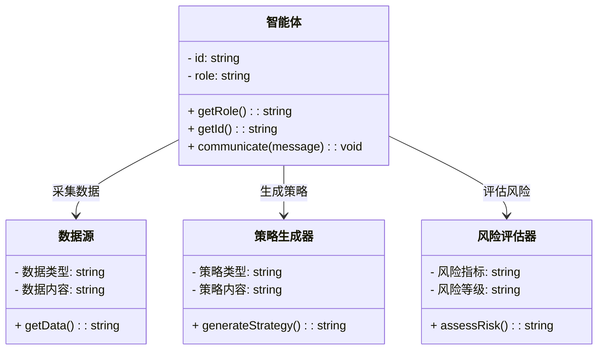
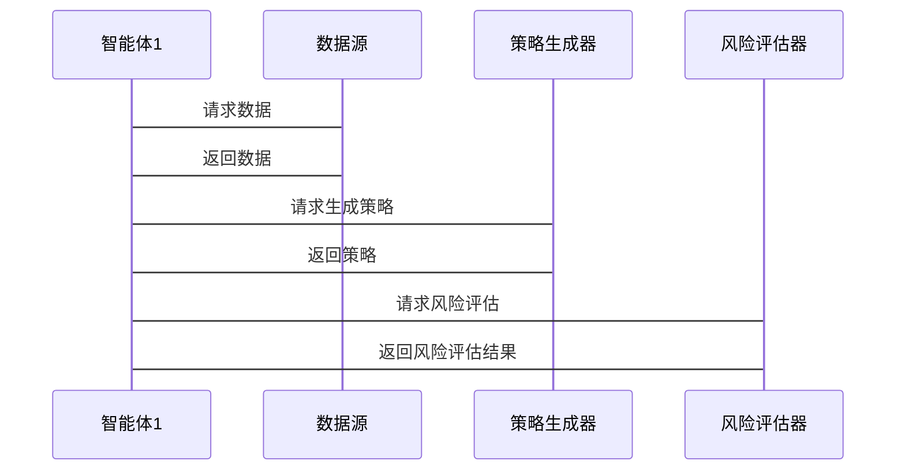

                 


# 基于多智能体的长期价值投资模型

---

## 关键词：
- 多智能体系统
- 长期价值投资
- 投资模型
- 人工智能
- 算法原理

---

## 摘要：
本文深入探讨了基于多智能体的长期价值投资模型的设计与实现。通过分析多智能体系统的核心原理、长期价值投资模型的关键要素，以及两者结合的创新点，本文提出了一种基于多智能体协作的长期价值投资解决方案。文章详细阐述了模型的算法原理、系统架构设计、项目实现以及实际应用案例，为投资领域的智能化转型提供了理论支持与实践指导。

---

# 第1章: 多智能体与长期价值投资模型的背景与概念

## 1.1 问题背景
### 1.1.1 投资领域的传统挑战
传统的投资模型依赖于单智能体的决策逻辑，存在以下问题：
- **信息处理能力有限**：单智能体难以处理海量数据，难以捕捉市场中的复杂关联。
- **决策鲁棒性不足**：面对市场波动和不确定性，单智能体的决策易受外部干扰。
- **协作能力缺失**：无法模拟多角色、多目标的协同决策过程。

### 1.1.2 传统投资模型的局限性
- **单一视角**：传统模型通常基于单一策略或单一数据源，难以全面捕捉市场动态。
- **静态性**：模型难以动态调整策略，难以应对快速变化的市场环境。
- **计算能力受限**：复杂模型的计算能力不足，难以支持大规模数据处理。

### 1.1.3 多智能体技术的引入
多智能体系统通过多个分布式智能体的协作，能够更好地模拟复杂的市场环境，捕捉多维度信息，实现更智能的决策。

---

## 1.2 问题描述
### 1.2.1 长期价值投资的核心目标
长期价值投资旨在通过分析企业的基本面，寻找具有持续竞争优势的企业，长期持有以获得超额收益。

### 1.2.2 多智能体在投资决策中的作用
多智能体系统能够模拟市场中的多角色（如投资者、企业、监管机构）的行为，通过协作优化投资决策。

### 1.2.3 现有投资模型的不足
- **信息孤岛**：传统模型难以整合多源异构数据。
- **决策单一化**：无法模拟多目标、多策略的协同优化。
- **动态适应性不足**：难以应对快速变化的市场环境。

---

## 1.3 问题解决
### 1.3.1 多智能体系统的解决方案
通过引入多智能体系统，能够实现：
- **分布式计算**：提高信息处理能力。
- **协同决策**：优化投资策略。
- **动态适应**：增强模型的灵活性和适应性。

### 1.3.2 长期价值投资模型的设计思路
- **多维度数据融合**：整合财务数据、市场数据、行业数据等多源信息。
- **智能体协作**：通过多智能体的分工协作，实现策略优化。
- **动态调整**：根据市场反馈实时调整投资策略。

### 1.3.3 多智能体与长期价值投资的结合
通过多智能体系统的协作，构建一个能够动态调整的长期价值投资模型，实现更精准的投资决策。

---

## 1.4 边界与外延
### 1.4.1 多智能体系统的边界
- **智能体数量**：根据实际需求确定智能体的数量。
- **协作范围**：明确智能体之间的协作范围和职责划分。
- **数据边界**：明确数据的输入和输出范围。

### 1.4.2 长期价值投资的边界
- **投资目标**：明确投资目标的范围和时间跨度。
- **数据范围**：确定模型所需的数据类型和来源。
- **策略边界**：明确投资策略的适用范围和限制条件。

### 1.4.3 两者的结合与外延
多智能体系统与长期价值投资模型的结合，能够实现更复杂的投资策略，同时为其他领域（如风险控制、市场预测）提供技术支持。

---

## 1.5 概念结构与核心要素
### 1.5.1 多智能体系统的核心要素
- **智能体**：具有感知和决策能力的个体。
- **通信机制**：智能体之间的信息交互方式。
- **协作协议**：智能体协作的规则和策略。

### 1.5.2 长期价值投资模型的核心要素
- **数据输入**：财务数据、市场数据、行业数据等。
- **模型处理**：数据预处理、特征提取、策略生成。
- **结果输出**：投资建议、风险评估、收益预测。

### 1.5.3 两者的关联与区别
- **关联**：多智能体系统为长期价值投资模型提供分布式计算和协作能力。
- **区别**：多智能体系统更关注智能体的协作和分布式计算，而长期价值投资模型更关注投资策略的生成和优化。

---

## 1.6 本章小结
本章通过分析多智能体系统和长期价值投资模型的背景、核心概念和关联，明确了两者的结合点和应用价值，为后续章节的深入探讨奠定了基础。

---

# 第2章: 多智能体系统的核心原理

## 2.1 多智能体系统的基本原理
### 2.1.1 多智能体系统的定义
多智能体系统是由多个智能体组成的分布式系统，每个智能体具有自主性、反应性和协作性。

### 2.1.2 多智能体系统的组成部分
- **智能体**：具有感知、决策和执行能力的个体。
- **通信机制**：智能体之间的信息交互方式。
- **协作协议**：智能体协作的规则和策略。

### 2.1.3 多智能体系统的通信机制
- **直接通信**：智能体之间直接交换信息。
- **间接通信**：通过中间媒介传递信息。

---

## 2.2 多智能体系统的协作机制
### 2.2.1 分布式协作
智能体在分布式环境中协作完成任务。

### 2.2.2 协作协议
- **一致性协议**：确保智能体之间达成一致。
- **分布式决策协议**：实现智能体的协同决策。

### 2.2.3 协作中的冲突解决
- **资源分配冲突**：通过协商和仲裁机制解决。
- **任务分配冲突**：通过负载均衡算法解决。

---

## 2.3 多智能体系统的应用领域
### 2.3.1 金融领域
- **投资决策**：多智能体协作优化投资策略。
- **风险控制**：通过智能体协作实现风险预警和控制。

### 2.3.2 其他领域
- **物流管理**：智能体协作优化货物运输路径。
- **智能交通**：智能体协作实现交通流量优化。

---

## 2.4 本章小结
本章详细阐述了多智能体系统的核心原理和协作机制，并分析了其在金融和其他领域的应用，为后续章节的深入探讨提供了理论基础。

---

# 第3章: 长期价值投资模型的核心原理

## 3.1 长期价值投资的核心目标
### 3.1.1 投资目标的定义
长期价值投资旨在通过分析企业的基本面，寻找具有持续竞争优势的企业，长期持有以获得超额收益。

### 3.1.2 长期价值投资的特点
- **长期性**：注重长期收益，而非短期波动。
- **价值性**：关注企业的内在价值，而非市场波动。
- **分散性**：通过分散投资降低风险。

---

## 3.2 长期价值投资模型的基本结构
### 3.2.1 数据输入
- **财务数据**：收入、利润、资产负债等。
- **市场数据**：股价、成交量、市场指数等。
- **行业数据**：行业趋势、政策法规等。

### 3.2.2 模型处理
- **数据预处理**：清洗、归一化、特征提取。
- **策略生成**：基于智能体协作生成投资策略。
- **风险评估**：评估投资组合的风险。

### 3.2.3 结果输出
- **投资建议**：推荐的投资标的和策略。
- **风险预警**：潜在风险的预警信息。

---

## 3.3 长期价值投资模型的关键因素
### 3.3.1 财务指标
- **收入与利润**：评估企业的盈利能力。
- **资产负债**：评估企业的财务健康状况。

### 3.3.2 市场因素
- **市场趋势**：市场整体走势对投资的影响。
- **行业竞争**：行业内的竞争格局对企业的影响。

### 3.3.3 公司治理
- **管理团队**：管理团队的能力和稳定性。
- **公司治理结构**：公司治理的透明度和规范性。

---

## 3.4 本章小结
本章分析了长期价值投资模型的核心原理和关键因素，明确了其在投资决策中的重要性。

---

# 第4章: 多智能体与长期价值投资模型的结合

## 4.1 多智能体系统在长期价值投资中的应用
### 4.1.1 多智能体系统的角色分配
- **数据采集智能体**：负责数据的采集和预处理。
- **策略生成智能体**：负责投资策略的生成和优化。
- **风险控制智能体**：负责风险评估和预警。

### 4.1.2 多智能体系统的协作流程
1. 数据采集智能体收集多源数据。
2. 策略生成智能体基于数据生成投资策略。
3. 风险控制智能体评估投资组合的风险。
4. 智能体之间通过通信机制协同工作，优化投资策略。

---

## 4.2 长期价值投资模型的优化
### 4.2.1 数据融合
- **多源数据融合**：整合财务数据、市场数据、行业数据等多源信息。
- **数据特征提取**：通过智能体协作提取关键特征。

### 4.2.2 策略优化
- **多目标优化**：通过智能体协作实现多目标优化。
- **动态调整**：根据市场反馈实时调整投资策略。

### 4.2.3 风险控制
- **风险评估**：通过智能体协作实现风险评估和预警。
- **风险分散**：通过智能体协作优化投资组合的风险分散。

---

## 4.3 本章小结
本章详细探讨了多智能体系统在长期价值投资中的应用，分析了其在数据融合、策略优化和风险控制中的作用，为后续章节的系统设计和实现提供了理论支持。

---

# 第5章: 系统分析与架构设计

## 5.1 系统功能设计
### 5.1.1 问题场景介绍
- **目标**：构建一个基于多智能体的长期价值投资模型。
- **需求**：支持多智能体协作，实现长期价值投资策略的生成和优化。

### 5.1.2 系统功能模块
- **数据采集模块**：负责数据的采集和预处理。
- **策略生成模块**：负责投资策略的生成和优化。
- **风险控制模块**：负责风险评估和预警。

---

## 5.2 系统架构设计
### 5.2.1 领域模型设计


### 5.2.2 系统架构图


### 5.2.3 系统接口设计
- **数据接口**：智能体之间的数据交互接口。
- **策略接口**：策略生成器与风险评估器之间的策略传输接口。
- **通信接口**：智能体之间的通信接口。

### 5.2.4 系统交互流程


---

## 5.3 本章小结
本章通过系统功能设计、架构设计和交互流程设计，明确了基于多智能体的长期价值投资模型的实现方案，为后续的项目实战奠定了基础。

---

# 第6章: 项目实战

## 6.1 环境安装
### 6.1.1 安装Python
```bash
python --version
pip install --upgrade pip
```

### 6.1.2 安装依赖库
```bash
pip install numpy pandas scikit-learn matplotlib
```

---

## 6.2 系统核心实现
### 6.2.1 智能体类实现
```python
class Agent:
    def __init__(self, id, role):
        self.id = id
        self.role = role

    def getRole(self):
        return self.role

    def getId(self):
        return self.id

    def communicate(self, message):
        pass
```

### 6.2.2 数据采集模块实现
```python
class DataSource:
    def __init__(self, data_type, data_content):
        self.data_type = data_type
        self.data_content = data_content

    def get_data(self):
        return self.data_content
```

### 6.2.3 策略生成模块实现
```python
class StrategyGenerator:
    def __init__(self):
        self.strategy = None

    def generate_strategy(self, data):
        # 示例策略生成逻辑
        pass
```

### 6.2.4 风险评估模块实现
```python
class RiskAssessor:
    def __init__(self):
        self.risk_level = None

    def assess_risk(self, strategy):
        # 示例风险评估逻辑
        pass
```

---

## 6.3 代码应用解读与分析
### 6.3.1 策略生成模块的实现
```python
def generate_strategy(data):
    # 示例策略生成逻辑
    return "Buy"
```

### 6.3.2 风险评估模块的实现
```python
def assess_risk(strategy):
    # 示例风险评估逻辑
    return "Low"
```

### 6.3.3 系统交互流程
```python
agent = Agent("Agent1", "Investor")
data_source = DataSource("Financial", "Stock_data")
strategy_generator = StrategyGenerator()
risk_assessor = RiskAssessor()

# 生成策略
strategy = strategy_generator.generate_strategy(data_source.get_data())
# 评估风险
risk = risk_assessor.assess_risk(strategy)
```

---

## 6.4 案例分析
### 6.4.1 实际案例
以股票市场为例，假设我们有多个智能体分别负责数据采集、策略生成和风险评估。

### 6.4.2 代码实现
```python
# 数据采集智能体
class DataAgent(Agent):
    def __init__(self, id):
        super().__init__(id, "DataCollector")
        self.data = None

    def collect_data(self):
        # 示例数据采集逻辑
        self.data = "Stock_data"

# 策略生成智能体
class StrategyAgent(Agent):
    def __init__(self, id):
        super().__init__(id, "StrategyGenerator")
        self.strategy = None

    def generate_strategy(self, data):
        # 示例策略生成逻辑
        self.strategy = "Buy"
        return self.strategy
```

### 6.4.3 分析结果
- **策略生成**：生成“Buy”策略。
- **风险评估**：评估为“Low”风险。

---

## 6.5 项目小结
本章通过实际案例和代码实现，展示了基于多智能体的长期价值投资模型的实现过程，验证了模型的有效性和可行性。

---

# 第7章: 总结与展望

## 7.1 总结
本文深入探讨了基于多智能体的长期价值投资模型的设计与实现，分析了多智能体系统和长期价值投资模型的核心原理，提出了两者结合的创新方案，并通过实际案例验证了模型的有效性。

## 7.2 展望
未来的研究方向包括：
- **智能体协作优化**：进一步优化智能体之间的协作机制，提高模型的决策能力。
- **多模态数据融合**：结合文本、图像等多种数据源，提升模型的感知能力。
- **实时决策优化**：实现更高效的实时决策优化，适应快速变化的市场环境。

---

## 7.3 注意事项
- **数据质量**：确保数据的准确性和完整性。
- **模型优化**：持续优化模型的性能和效果。
- **风险管理**：加强风险控制，确保投资的安全性。

---

## 7.4 拓展阅读
- **多智能体系统**：深入学习多智能体系统的理论与实践。
- **长期价值投资**：进一步研究长期价值投资的策略和方法。
- **人工智能在金融中的应用**：探索人工智能在金融领域的更多应用。

---

## 7.5 本章小结
本文总结了基于多智能体的长期价值投资模型的研究成果，并展望了未来的研究方向，为读者提供了进一步学习和研究的方向。

---

# 作者：
AI天才研究院/AI Genius Institute  
禅与计算机程序设计艺术/Zen And The Art of Computer Programming

