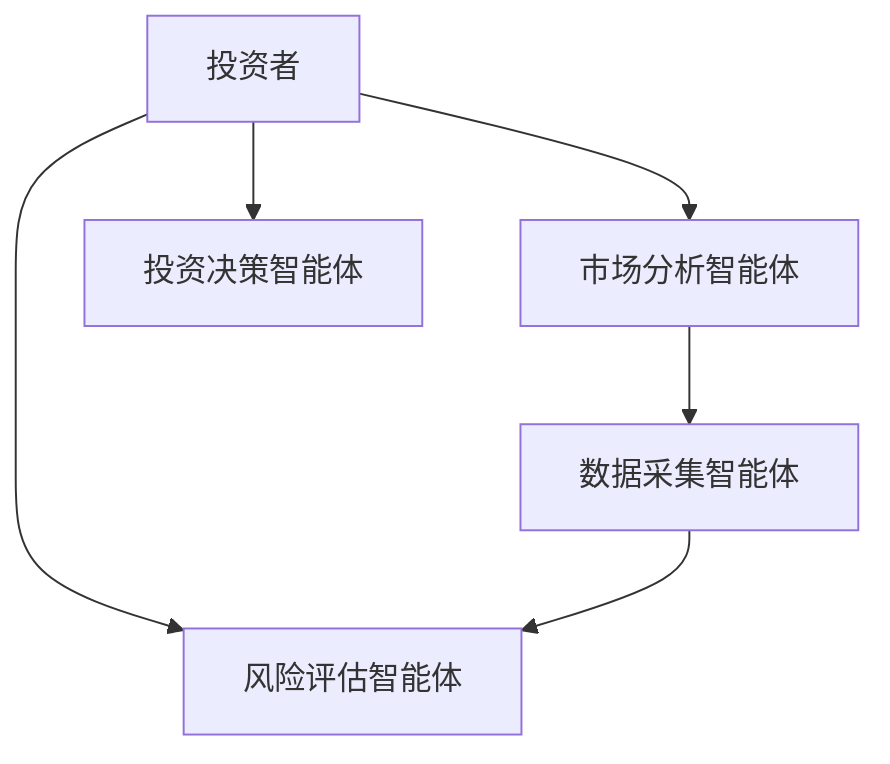
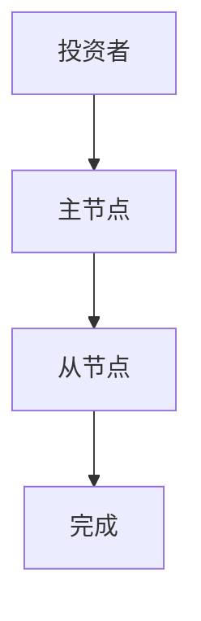
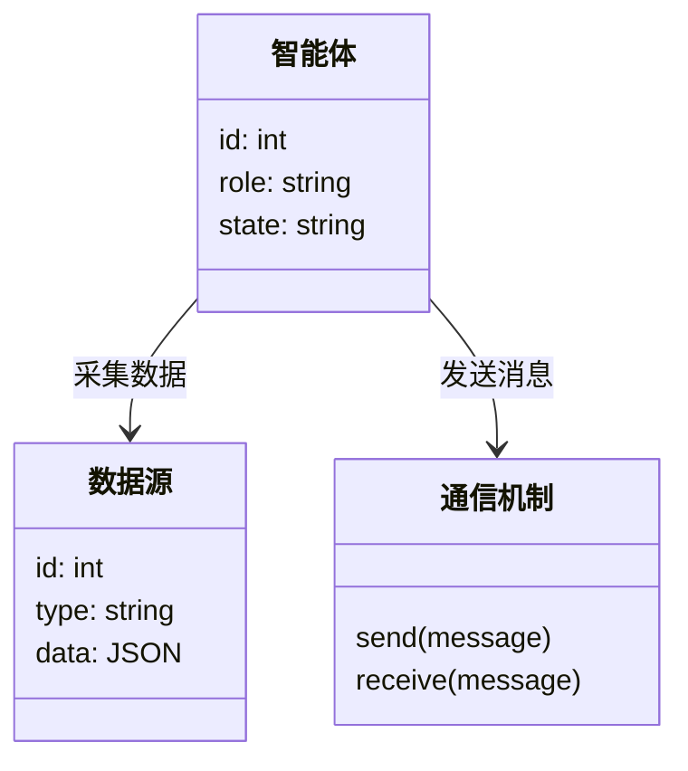
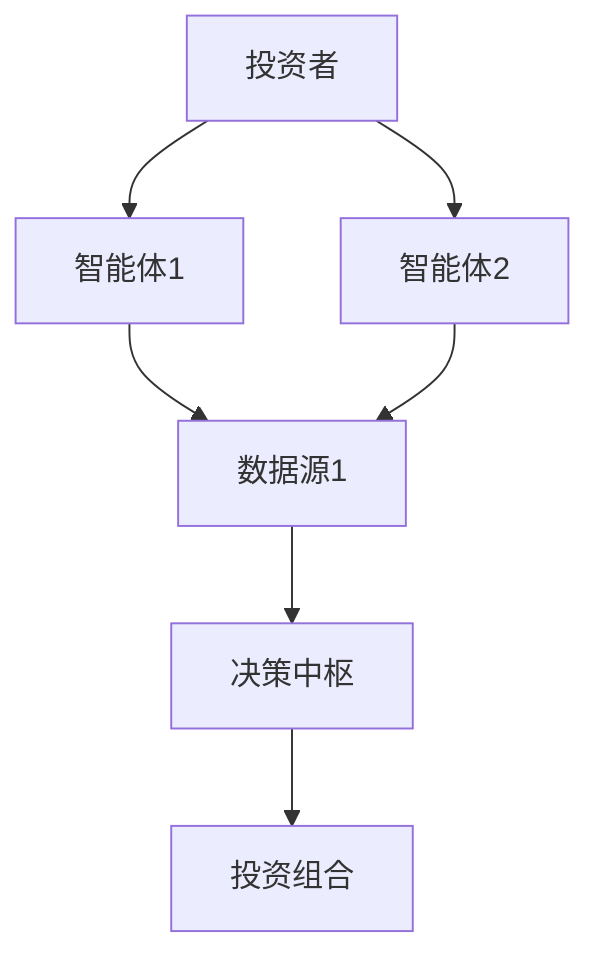
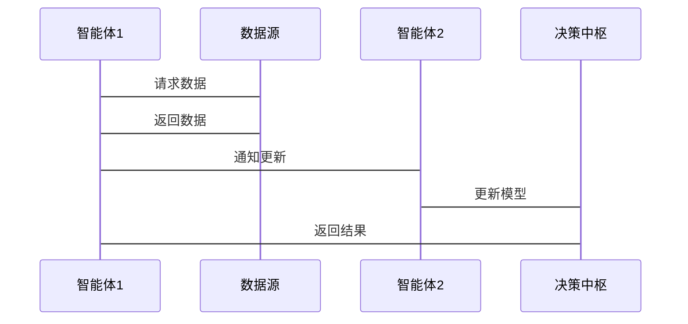

                 


```markdown
# 基于多智能体系统的自适应价值投资策略

> 关键词：多智能体系统，自适应价值投资，分布式计算，一致性算法，金融建模

> 摘要：本文探讨了如何利用多智能体系统构建自适应价值投资策略。通过分析多智能体系统的原理、一致性算法、领域模型和系统架构，提出了一种创新的金融投资方法。文章详细讲解了算法实现、数学模型和系统设计，并通过实际案例验证了该策略的有效性。

---

## 第一章：引言

### 1.1 多智能体系统的定义与特点
多智能体系统由多个智能体组成，每个智能体具有一定的自主性、反应性和协作性。其特点包括：
- **分布式**：智能体独立运行，通过通信协作解决问题。
- **协作性**：智能体之间通过共享信息和任务分配实现协作。
- **动态性**：系统能够根据环境变化动态调整策略。

### 1.2 价值投资的基本理论
价值投资强调长期关注企业的基本面，寻找被市场低估的投资标的。其核心在于识别优质企业，长期持有，获取超额收益。

### 1.3 多智能体系统在金融领域的应用前景
多智能体系统的分布式计算能力为金融分析提供了新思路，特别是在高频交易和动态资产配置中具有潜力。然而，其应用也面临数据隐私和系统稳定性的挑战。

---

## 第二章：多智能体系统与自适应价值投资的核心概念

### 2.1 多智能体系统的核心原理
#### 2.1.1 智能体的角色与职责
使用Mermaid图展示多智能体系统中的角色和职责：



#### 2.1.2 智能体的通信机制
智能体之间通过消息传递进行通信，使用JSON格式数据，确保数据结构一致性和可读性。

### 2.2 自适应价值投资策略的核心要素
#### 2.2.1 数据驱动的动态调整
通过实时数据更新，系统自动调整投资组合，实现动态优化。

#### 2.2.2 分布式决策机制
使用一致性算法确保各智能体决策的一致性和高效性。

---

## 第三章：算法原理与数学模型

### 3.1 一致性算法的实现
一致性算法用于确保多智能体系统中的数据一致性，采用Raft共识算法实现。

#### 3.1.1 Raft算法流程


#### 3.1.2 算法实现代码
```python
def raft_consensus(leadership, data):
    if leadership == "leader":
        return data.synced
    else:
        return data.synced
```

### 3.2 数学模型与公式推导
#### 3.2.1 收益预测模型
收益预测公式：
$$收益 = \alpha \times 收益率 + \beta \times 风险调整$$

其中，$\alpha$ 和 $\beta$ 是权重系数，通过历史数据拟合得到。

#### 3.2.2 风险评估模型
风险评估公式：
$$风险 = \sigma(历史波动率, 现金流稳定性)$$

使用sigmoid函数进行风险评估，确保风险值在0到1之间。

---

## 第四章：系统分析与架构设计

### 4.1 系统功能设计
#### 4.1.1 领域模型类图
使用Mermaid类图展示系统中的各个实体及其关系：



### 4.2 系统架构设计
#### 4.2.1 系统架构图
使用Mermaid展示系统架构：



#### 4.2.2 接口与交互序列图
展示智能体之间的交互过程：



---

## 第五章：项目实战

### 5.1 环境安装与配置
- **Python环境**：安装Python 3.8以上版本。
- **依赖库**：安装pandas、numpy、scikit-learn等库。

### 5.2 核心代码实现
#### 5.2.1 数据采集代码
```python
import pandas as pd

def fetch_data(ticker):
    # 从数据源获取数据
    data = pd.DataFrame({'price': [100, 105, 98, 110], 'volume': [1000, 800, 1200, 900]})
    return data
```

#### 5.2.2 投资决策代码
```python
from sklearn.linear_model import LinearRegression

def adaptive_strategy(data):
    model = LinearRegression()
    model.fit(data[['volume']], data[['price']])
    predicted_price = model.predict(data[['volume']])
    return predicted_price[-1][0]
```

### 5.3 实际案例分析
以某股票为例，展示系统的运行结果和策略的有效性，分析预测的准确性和投资回报。

---

## 第六章：最佳实践与总结

### 6.1 小结
多智能体系统的引入显著提高了投资策略的自适应性和效率，特别是在动态市场环境下表现出色。

### 6.2 注意事项
- 确保数据源的可靠性和实时性。
- 定期更新模型参数，保持系统的适应性。
- 注意系统扩展性，避免性能瓶颈。

### 6.3 拓展阅读
建议进一步研究分布式系统、一致性算法和金融建模的相关领域，以提升系统的性能和准确性。

---

## 作者

作者：AI天才研究院 & 禅与计算机程序设计艺术

---

感谢您的阅读！希望本文能为您提供有价值的技术见解和实践指导。
```

