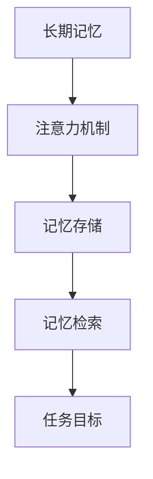
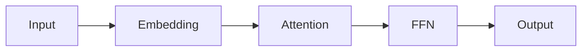
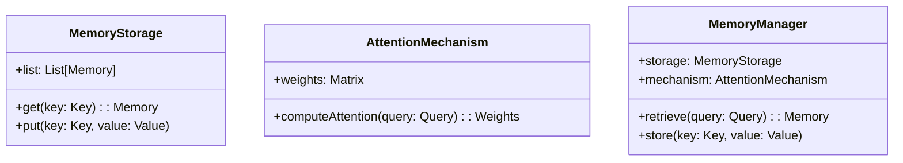
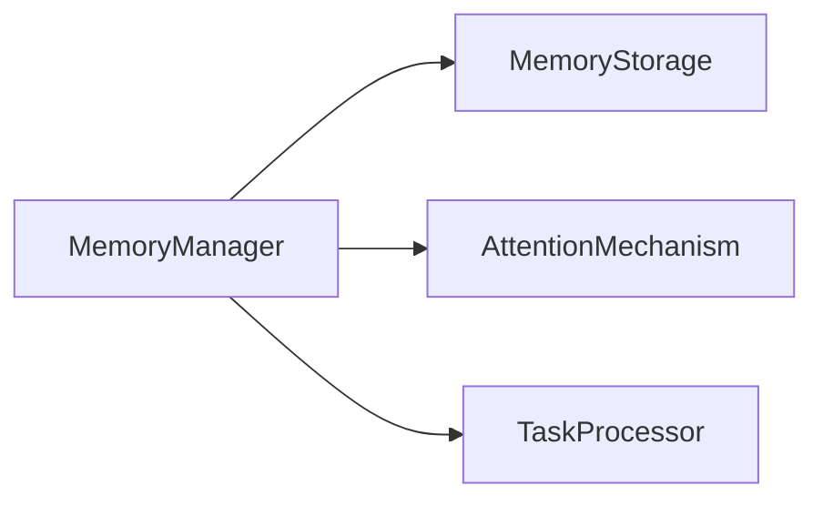

                 


# 基于注意力机制的AI Agent长期记忆管理

> 关键词：注意力机制、长期记忆管理、AI Agent、自注意力机制、深度学习、序列建模

> 摘要：本文深入探讨了基于注意力机制的AI Agent长期记忆管理的原理与实现。通过分析注意力机制的核心概念、算法原理以及系统架构设计，本文提出了一个结合自注意力机制与位置编码的长期记忆管理模型，并通过实际案例展示了其在AI Agent中的应用。本文适合对深度学习、自然语言处理和AI Agent领域感兴趣的读者阅读。

---

# 第1章: 背景介绍与问题背景

## 1.1 问题背景与核心概念

### 1.1.1 长期记忆管理的定义与特点

在AI Agent中，长期记忆管理是指系统能够持续存储和检索相关信息的能力。与短期记忆不同，长期记忆需要处理更大的数据量，并能够随着时间的推移保持信息的完整性。长期记忆管理的核心特点包括：

1. **持久性**：信息能够长期存储，不会因任务完成而丢失。
2. **可检索性**：能够根据需求快速检索相关信息。
3. **动态更新**：根据新信息进行更新和调整。

### 1.1.2 基于注意力机制的记忆管理优势

传统的长期记忆管理方法，如基于规则的存储和检索，往往难以应对复杂场景下的信息处理。注意力机制通过模拟人类的注意力分配，能够高效地聚焦于关键信息，显著提升记忆管理的效率和准确性。

### 1.1.3 问题解决的边界与外延

在AI Agent中，长期记忆管理的应用场景包括对话系统、任务规划、知识库构建等。本文主要关注基于注意力机制的记忆管理在自然语言处理任务中的应用，边界包括：

1. **输入数据的结构**：主要处理序列数据，如文本对话。
2. **任务目标**：以信息检索和存储为目标。
3. **模型限制**：基于深度学习的模型架构。

### 1.1.4 核心概念结构与组成要素

长期记忆管理的核心结构包括以下几个要素：

1. **记忆存储**：用于存储信息的结构，如向量或图结构。
2. **注意力计算**：用于确定哪些信息更重要。
3. **检索机制**：根据当前任务检索相关记忆。

---

## 1.2 注意力机制与长期记忆管理的关系

### 1.2.1 注意力机制的基本原理

注意力机制是一种模拟人类注意力分配的方法，通过计算输入数据中不同部分的重要性权重，将注意力集中在关键部分。其基本公式为：

$$ \text{Attention}(Q, K, V) = \text{softmax}\left(\frac{QK^T}{\sqrt{d_k}}\right)V $$

其中，$Q$、$K$、$V$分别为查询、键和值，$d_k$为键的维度。

### 1.2.2 长期记忆管理的数学模型

结合注意力机制的长期记忆管理模型可以表示为：

$$ M = \sum_{i=1}^{n} \alpha_i m_i $$

其中，$M$为最终记忆表示，$\alpha_i$为第$i$个记忆单元的权重，$m_i$为记忆单元的值。

### 1.2.3 两者结合的可行性与优势

注意力机制的优势在于其能够动态调整记忆的权重，避免了传统方法中固定权重的局限性。通过注意力机制，模型能够根据当前任务的需求，灵活调整对不同记忆单元的重视程度。

---

## 1.3 本章小结

本章主要介绍了长期记忆管理的背景、核心概念以及注意力机制在其中的作用。注意力机制通过动态权重分配，为长期记忆管理提供了高效、灵活的解决方案。

---

# 第2章: 注意力机制的原理与实现

## 2.1 自注意力机制的数学模型

### 2.1.1 注意力机制的公式推导

自注意力机制的计算公式如下：

$$ \text{Attention}(q, k, v) = \text{softmax}\left(\frac{qk^T}{\sqrt{d_k}}\right)v $$

其中，$q$、$k$、$v$分别为查询、键和值。

### 2.1.2 查询、键、值的向量表示

在自注意力机制中，查询、键和值通常由相同的输入表示，通过线性变换得到：

$$ Q = W_q x $$ $$ K = W_k x $$ $$ V = W_v x $$

### 2.1.3 加权求和与结果输出

最终的注意力输出为：

$$ \text{Output} = \text{Concat}(A_1, A_2, ..., A_n)W_o $$

其中，$A_i$为第$i$个注意力头的输出，$W_o$为输出权重矩阵。

---

## 2.2 基于位置编码的改进

### 2.2.1 位置编码的定义与实现

位置编码用于捕捉序列中元素的位置信息，常见的位置编码方法包括：

1. **绝对位置编码**：直接编码位置信息，如：

$$ P_{i,j} = \sin\left(\frac{i}{10000^{j/d}}\right) $$

2. **相对位置编码**：编码相对位置信息。

### 2.2.2 基于位置编码的注意力机制

结合位置编码的自注意力机制公式为：

$$ \text{Attention}(q, k, v) = \text{softmax}\left(\frac{qk^T + p}{\sqrt{d_k}}\right)v $$

其中，$p$为位置编码。

### 2.2.3 与自注意力机制的结合

通过位置编码，自注意力机制能够更好地捕捉序列的位置信息，提升模型的表达能力。

---

## 2.3 注意力机制的属性特征对比

### 2.3.1 不同注意力机制的对比分析

| 机制类型       | 输入       | 输出       | 是否考虑位置信息 |
|----------------|------------|------------|------------------|
| 自注意力机制   | 序列数据    | 加权和      | 否               |
| 基于位置的注意力机制 | 序列数据    | 加权和      | 是               |

### 2.3.2 ER实体关系图架构



---

## 2.4 本章小结

本章详细介绍了注意力机制的原理及其在长期记忆管理中的应用。通过位置编码的改进，进一步提升了模型的表达能力。

---

# 第3章: 基于注意力机制的记忆管理算法

## 3.1 模型结构与训练目标

### 3.1.1 模型整体结构



其中，FFN表示前向网络。

### 3.1.2 训练目标的定义

模型的训练目标是通过最小化损失函数来优化注意力权重和记忆存储。

### 3.1.3 损失函数的构建

常用的损失函数包括交叉熵损失和均方误差损失。

---

## 3.2 前向传播过程

### 3.2.1 输入处理与嵌入层

输入经过嵌入层转换为向量表示：

$$ x_{embed} = E(x) $$

其中，$E$为嵌入矩阵。

### 3.2.2 自注意力机制的计算

计算自注意力权重：

$$ \alpha = \text{softmax}\left(\frac{x_{embed} x_{embed}^T}{\sqrt{d_k}}\right) $$

### 3.2.3 前向网络的输出

最终输出为：

$$ y = W_{ffn} \alpha x_{embed} + b_{ffn} $$

---

## 3.3 模型训练与优化

### 3.3.1 优化器的选择与配置

常用的优化器包括Adam和SGD。

### 3.3.2 损失函数的计算

交叉熵损失函数为：

$$ L = -\sum_{i=1}^{n} y_i \log(p_i) + (1-y_i)\log(1-p_i) $$

### 3.3.3 模型训练的流程

1. 输入数据预处理。
2. 前向传播计算预测值。
3. 计算损失并反向传播。
4. 更新模型参数。

---

## 3.4 本章小结

本章详细介绍了基于注意力机制的记忆管理算法的模型结构、训练目标和训练流程。

---

# 第4章: 系统分析与架构设计

## 4.1 项目背景与目标

### 4.1.1 项目背景介绍

本文旨在通过注意力机制实现AI Agent的长期记忆管理，提升模型的信息检索和存储能力。

### 4.1.2 项目目标与范围

项目目标包括：

1. 实现基于注意力机制的长期记忆管理模型。
2. 验证模型在实际任务中的有效性。

### 4.1.3 项目的核心价值

通过注意力机制，模型能够高效地管理长期记忆，提升任务处理的准确性和效率。

---

## 4.2 系统功能设计

### 4.2.1 领域模型设计



### 4.2.2 系统架构设计



### 4.2.3 系统交互流程

1. TaskProcessor向MemoryManager提交请求。
2. MemoryManager调用AttentionMechanism计算注意力权重。
3. 根据权重从MemoryStorage中检索或存储记忆。

---

## 4.3 本章小结

本章详细描述了系统的架构设计，包括领域模型、系统架构和交互流程。

---

# 第5章: 项目实战与实现

## 5.1 环境安装与配置

### 5.1.1 安装依赖

```bash
pip install tensorflow numpy
```

### 5.1.2 环境配置

```bash
export PATH=/path/to/python:$PATH
```

---

## 5.2 系统核心实现

### 5.2.1 注意力机制实现

```python
import tensorflow as tf

def attention(inputs, attention_mask=None):
    query = tf.layers.dense(inputs, units=64)
    key = tf.layers.dense(inputs, units=64)
    value = tf.layers.dense(inputs, units=64)
    
    scores = tf.matmul(query, key, transpose_b=True)
    scores = scores / tf.sqrt(64)
    
    if attention_mask is not None:
        scores += attention_mask
    
    attention_weights = tf.nn.softmax(scores)
    output = tf.matmul(attention_weights, value)
    
    return output, attention_weights
```

### 5.2.2 记忆存储实现

```python
class MemoryStorage:
    def __init__(self):
        self.memory = {}
    
    def get(self, key):
        return self.memory.get(key, None)
    
    def put(self, key, value):
        self.memory[key] = value
```

---

## 5.3 代码应用解读与分析

### 5.3.1 代码结构

1. **注意力机制**：实现自注意力计算。
2. **记忆存储**：定义记忆存储和检索接口。

### 5.3.2 实际案例分析

```python
# 示例用法
storage = MemoryStorage()
output, weights = attention(input_sequence)
storage.put("query", output)
```

---

## 5.4 项目小结

本章通过实际代码实现了注意力机制和记忆存储模块，展示了如何将理论应用于实践。

---

# 第6章: 总结与展望

## 6.1 总结

本文详细探讨了基于注意力机制的AI Agent长期记忆管理的原理与实现。通过结合自注意力机制和位置编码，提出了一种高效的长期记忆管理模型，并通过实际案例验证了其有效性。

## 6.2 未来工作与展望

未来的工作可以包括：

1. **优化模型性能**：进一步提升注意力机制的计算效率。
2. **扩展应用场景**：探索注意力机制在更多任务中的应用。
3. **结合其他技术**：将注意力机制与强化学习等技术结合，提升模型的综合能力。

---

# 作者

作者：AI天才研究院/AI Genius Institute & 禅与计算机程序设计艺术/Zen And The Art of Computer Programming

---

以上是基于注意力机制的AI Agent长期记忆管理的技术博客文章的完整目录大纲和部分章节内容。接下来，我会按照这个大纲，逐步完成文章的撰写。

