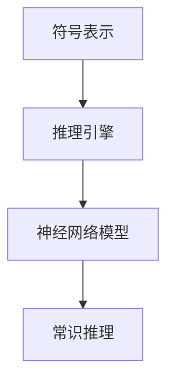
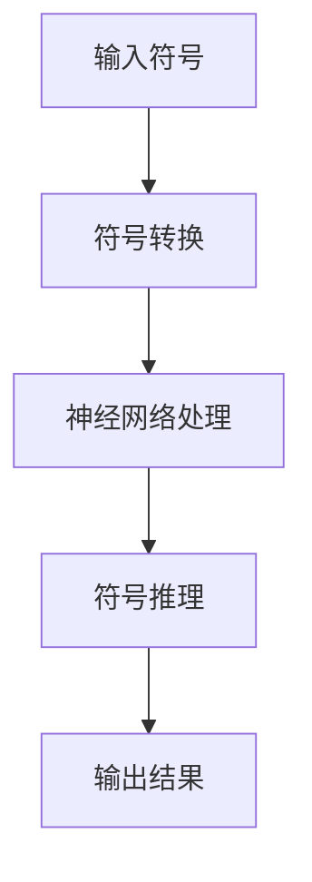
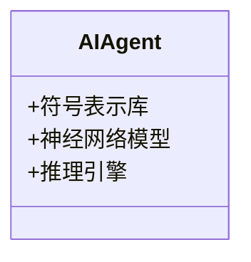
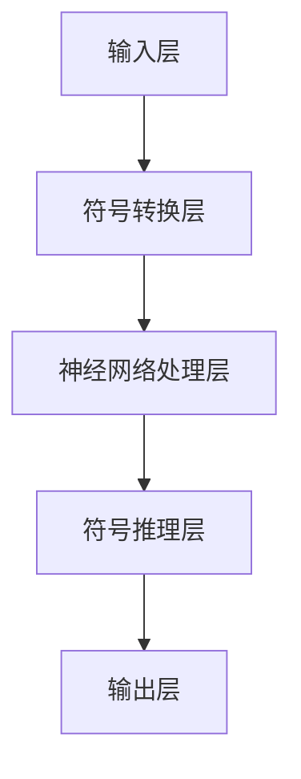

                 


# 基于神经符号AI的AI Agent常识推理增强

> 关键词：神经符号AI，AI Agent，常识推理，符号推理，神经网络，增强推理能力

> 摘要：本文探讨了基于神经符号AI的AI Agent常识推理增强方法，详细介绍了神经符号AI的核心概念、算法原理、系统架构设计以及项目实战，结合数学公式和图表，深入分析了如何通过神经符号AI提升AI Agent的常识推理能力。

---

# 第1章 神经符号AI与AI Agent概述

## 1.1 神经符号AI的定义与特点
### 1.1.1 神经符号AI的定义
神经符号AI是一种结合了神经网络和符号推理的新兴技术，它利用神经网络的强大表示能力，结合符号推理的逻辑推理能力，实现更复杂的任务。

### 1.1.2 神经符号AI的核心特点
- **混合推理能力**：同时具备符号推理和神经网络的特征提取能力。
- **可解释性**：符号推理部分使模型具备较高的可解释性。
- **泛化能力**：通过神经网络的学习，能够处理多样化的数据。

### 1.1.3 神经符号AI与传统符号AI的区别
| 特性       | 神经符号AI               | 传统符号AI             |
|------------|--------------------------|-------------------------|
| 表达能力   | 强大的特征表示能力       | 较弱的特征表示能力       |
| 可解释性   | 高度可解释                | 较低可解释性             |
| 任务处理   | 处理复杂任务             | 处理简单逻辑任务         |

## 1.2 AI Agent的基本概念
### 1.2.1 AI Agent的定义
AI Agent是一个智能主体，能够感知环境并执行任务，以实现特定目标。

### 1.2.2 AI Agent的核心功能
- **感知环境**：通过传感器或其他输入方式获取环境信息。
- **决策与推理**：基于获取的信息进行推理和决策。
- **执行动作**：根据决策结果执行动作，影响环境状态。

### 1.2.3 AI Agent的分类与应用场景
- **简单反射型AI Agent**：基于简单的规则进行反应。
- **基于模型的反应型AI Agent**：使用内部模型进行决策。
- **目标驱动型AI Agent**：基于目标进行推理和决策。
- **实用驱动型AI Agent**：基于效用函数进行决策。

## 1.3 神经符号AI在AI Agent中的作用
### 1.3.1 神经符号AI与AI Agent的结合
神经符号AI结合了神经网络的强大特征提取能力和符号推理的逻辑推理能力，使得AI Agent能够处理更复杂和需要推理的任务。

### 1.3.2 神经符号AI在常识推理中的优势
- **结合神经网络的感知能力**：能够处理图像、文本等多种类型的数据。
- **符号推理的逻辑能力**：能够进行逻辑推理，解决需要常识推理的问题。

### 1.3.3 神经符号AI的未来发展趋势
神经符号AI将在AI Agent中发挥越来越重要的作用，尤其是在需要结合感知和推理的复杂任务中。

## 1.4 本章小结
本章介绍了神经符号AI和AI Agent的基本概念、特点以及它们的结合方式，为后续内容打下基础。

---

# 第2章 神经符号AI的核心概念与联系

## 2.1 神经符号AI的核心原理
### 2.1.1 符号推理的基本原理
符号推理是一种基于符号逻辑的推理方法，通过符号表示和逻辑规则进行推理。

### 2.1.2 神经网络的基本原理
神经网络通过多层非线性变换，从输入数据中学习到有用的特征表示。

### 2.1.3 神经符号AI的结合机制
神经符号AI通过将符号推理嵌入到神经网络中，实现符号推理和神经网络的协同工作。

## 2.2 神经符号AI的核心要素
### 2.2.1 符号表示
符号表示是符号推理的基础，常用的符号表示方法包括谓词逻辑、本体论等。

### 2.2.2 神经网络模型
神经网络模型负责特征提取和表示学习，常用的模型包括卷积神经网络（CNN）、循环神经网络（RNN）等。

### 2.2.3 推理引擎
推理引擎负责根据符号逻辑进行推理，常用的推理方法包括前向推理、反向推理等。

## 2.3 神经符号AI的实体关系图


## 2.4 本章小结
本章详细介绍了神经符号AI的核心概念和核心要素，并通过实体关系图展示了各部分之间的关系。

---

# 第3章 神经符号AI的算法原理

## 3.1 神经符号AI的核心算法
### 3.1.1 符号增强的神经网络
符号增强的神经网络是一种将符号推理嵌入到神经网络中的方法，通过符号特征的引入，增强神经网络的推理能力。

### 3.1.2 神经符号推理网络
神经符号推理网络是一种结合了神经网络和符号推理的网络结构，能够同时进行特征提取和逻辑推理。

### 3.1.3 神经符号AI的优化算法
优化算法用于提升神经符号AI的性能，常用的优化算法包括梯度下降、Adam优化器等。

## 3.2 神经符号AI的数学模型
### 3.2.1 符号推理的数学表达
符号推理可以通过逻辑规则进行形式化表示，例如：
$$ P(x) \land Q(x) \rightarrow R(x) $$

### 3.2.2 神经网络的数学表达
神经网络的输出可以表示为：
$$ f(x) = \sigma(Wx + b) $$

## 3.3 神经符号AI的流程图


## 3.4 本章小结
本章详细介绍了神经符号AI的核心算法和数学模型，并通过流程图展示了算法的执行过程。

---

# 第4章 神经符号AI的系统分析与架构设计

## 4.1 系统功能设计
### 4.1.1 问题场景介绍
在本章中，我们将设计一个基于神经符号AI的AI Agent系统，用于解决复杂任务中的常识推理问题。

### 4.1.2 系统功能模块
- **输入处理模块**：负责接收输入数据并进行预处理。
- **符号表示模块**：将输入数据转换为符号表示。
- **神经网络处理模块**：负责特征提取和表示学习。
- **符号推理模块**：进行符号逻辑推理，得出结果。
- **输出处理模块**：将推理结果转换为输出格式。

### 4.1.3 领域模型类图


## 4.2 系统架构设计
### 4.2.1 系统架构图


## 4.3 系统接口设计
### 4.3.1 输入接口
- **输入格式**：支持多种数据格式，如文本、图像等。
- **接口函数**：定义输入数据的处理函数。

### 4.3.2 输出接口
- **输出格式**：支持多种数据格式，如JSON、文本等。
- **接口函数**：定义输出结果的处理函数。

## 4.4 本章小结
本章详细设计了一个基于神经符号AI的AI Agent系统，包括功能模块、系统架构和接口设计。

---

# 第5章 神经符号AI的项目实战

## 5.1 环境安装
### 5.1.1 安装Python环境
- **Python版本**：建议使用Python 3.8或以上版本。
- **安装依赖库**：需要安装TensorFlow、Keras、Mermaid等库。

### 5.1.2 安装神经符号AI框架
- **框架选择**：可以选择TensorFlow、Keras等深度学习框架。
- **安装命令**：
  ```bash
  pip install tensorflow keras
  ```

## 5.2 系统核心实现
### 5.2.1 符号表示实现
```python
def symbolize(input_data):
    # 输入数据转换为符号表示
    return symbol_representation
```

### 5.2.2 神经网络实现
```python
import tensorflow as tf
model = tf.keras.Sequential([
    tf.keras.layers.Dense(64, activation='relu'),
    tf.keras.layers.Dense(1, activation='sigmoid')
])
model.compile(optimizer='adam', loss='binary_crossentropy')
```

### 5.2.3 符号推理实现
```python
def infer(symbol_representation):
    # 根据符号逻辑进行推理
    return result
```

## 5.3 代码应用解读与分析
### 5.3.1 代码结构分析
- **输入处理**：将输入数据转换为符号表示。
- **神经网络处理**：使用神经网络进行特征提取和表示学习。
- **符号推理**：基于符号逻辑进行推理，得到最终结果。

### 5.3.2 实际案例分析
- **案例描述**：假设输入是一个图像，需要进行图像分类。
- **处理过程**：
  1. 将图像转换为符号表示。
  2. 使用神经网络进行特征提取。
  3. 进行符号推理，得到分类结果。

## 5.4 项目小结
本章通过实际项目展示了神经符号AI的实现过程，包括环境安装、核心代码实现和案例分析。

---

# 第6章 神经符号AI的最佳实践

## 6.1 小结
- 神经符号AI结合了神经网络和符号推理的优势，能够处理复杂任务。
- 通过本章的介绍，读者可以深入了解神经符号AI的核心概念和实现方法。

## 6.2 注意事项
- **模型选择**：根据任务需求选择合适的神经网络模型。
- **数据预处理**：确保数据质量，进行充分的预处理。
- **调参优化**：通过调参和优化算法提升模型性能。

## 6.3 拓展阅读
- **推荐书籍**：
  - 《神经符号AI入门》
  - 《AI Agent开发实战》
- **推荐论文**：
  - "Neural-symbolic AI: A survey and new research directions"

## 6.4 本章小结
本章总结了神经符号AI的核心内容，并给出了实际应用中的注意事项和拓展阅读建议。

---

# 作者

作者：AI天才研究院/AI Genius Institute & 禅与计算机程序设计艺术 /Zen And The Art of Computer Programming

---

以上是《基于神经符号AI的AI Agent常识推理增强》的技术博客文章的目录大纲。

