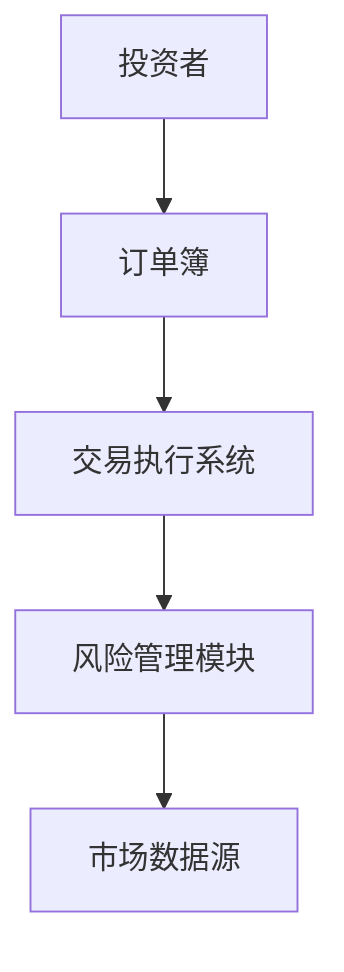

                 


# 塞思·克拉曼的特殊情况套利：价值投资的另一面

> 关键词：塞思·克拉曼、特殊情况套利、价值投资、套利策略、风险与风险管理

> 摘要：塞思·克拉曼是全球闻名的价值投资者，他以发现市场中的特殊情况套利机会而闻名。本文将从塞思·克拉曼的特殊情况套利策略出发，深入探讨套利的基本概念、特殊套利的理论基础、套利的数学模型、风险与风险管理、系统分析与架构设计，以及项目实战等多方面展开分析。通过本文，读者可以全面理解塞思·克拉曼的特殊套利策略，及其在价值投资中的应用。

---

## 第1章 套利的基本概念

### 1.1 什么是套利

套利是一种通过利用资产价格差异获利的投资策略。其核心思想是利用市场的不完美性，通过同时买入低估资产和卖出高估资产，赚取无风险或低风险的收益。

套利的基本步骤如下：
1. 识别市场中资产价格的不一致。
2. 构建一个套利组合，使得该组合在市场达到均衡时的收益为零。
3. 在市场价差消失时，卖出或买入相关资产，实现利润。

套利的风险主要来自于市场效率的提高，即市场趋于有效，套利机会减少。

### 1.2 塞思·克拉曼的特殊套利策略

塞思·克拉曼的特殊套利策略是一种基于市场无效性和信息不对称的投资策略。他通过寻找市场中被低估的资产，利用短期市场波动进行套利，以实现超额收益。

特殊套利策略的特点包括：
1. 基于市场无效性：利用市场的短期波动性进行套利。
2. 基于信息不对称：通过分析市场信息的不对称性寻找套利机会。
3. 短期性：套利机会通常存在于短期市场波动中。

### 1.3 套利与价值投资的关系

价值投资是通过寻找市场中被低估的资产进行长期投资，而套利则是通过识别短期价格差异进行交易。两者都基于市场无效性，但套利更注重短期价格波动，而价值投资则注重长期价值。

套利可以作为价值投资的补充策略，帮助投资者在市场波动中捕捉短期机会，提高投资组合的收益。

---

## 第2章 套利的理论基础

### 2.1 套利的无套利定价定理

无套利定价定理是套利理论的核心，它指出在无摩擦市场中，任何资产的合理价格应当使得不存在套利机会。

无套利定价定理的数学表达式如下：
$$
\frac{S}{F} = e^{-r(T-t)}
$$
其中，\( S \) 是当前股票价格，\( F \) 是远期价格，\( r \) 是无风险利率，\( T \) 是到期日，\( t \) 是当前时间。

### 2.2 套利机会的识别方法

套利机会的识别方法主要包括市场无效性分析和信息不对称分析。

市场无效性分析：
- 识别市场中的价格差异。
- 分析价格差异是否可以通过套利消除。

信息不对称分析：
- 分析市场中信息分布的不均衡性。
- 寻找信息不对称可能导致的价格差异。

套利机会的量化评估：
- 计算套利组合的预期收益。
- 评估套利组合的风险。

---

## 第3章 特殊情况套利的策略分析

### 3.1 特殊情况套利的类型

特殊情况套利主要包括以下几种类型：
1. 事件驱动套利：利用公司事件（如并购、重组）进行套利。
2. 统计套利：基于统计套利模型进行套利。
3. 跨市场套利：利用不同市场之间的价格差异进行套利。

### 3.2 特殊情况套利的实施步骤

实施特殊情况套利的步骤包括：
1. 确定套利机会。
2. 构建套利组合。
3. 风险管理。

套利组合的构建需要考虑市场的流动性、交易成本和价格波动等因素。

---

## 第4章 套利的风险与风险管理

### 4.1 套利的主要风险

套利的主要风险包括：
1. 市场风险：市场价格波动可能导致套利失败。
2. 流动性风险：市场流动性不足可能导致无法及时买卖资产。
3. 法律与合规风险：法律法规的变动可能导致套利策略失效。

### 4.2 套利的风险管理策略

风险管理策略包括：
1. 风险对冲：通过金融衍生品对冲市场风险。
2. 风险分散：将套利组合分散到不同的资产类别和市场。
3. 风险监控：实时监控套利组合的风险指标。

---

## 第5章 套利的数学模型与算法

### 5.1 套利的数学模型

套利的数学模型主要包括：
1. 资本资产定价模型（CAPM）。
2. 套利组合优化模型。
3. 风险对冲模型。

### 5.2 套利算法的实现

套利算法的实现包括：
1. 识别套利机会。
2. 构建套利组合。
3. 风险对冲。

以下是套利算法的伪代码示例：
```python
def identify_arbitrage_opportunity():
    # 识别套利机会
    pass

def build_arbitrage_portfolio():
    # 构建套利组合
    pass

def hedge_risk():
    # 风险对冲
    pass
```

---

## 第6章 系统分析与架构设计方案

### 6.1 系统分析

系统分析包括：
1. 问题场景介绍。
2. 项目介绍。
3. 系统功能设计。

### 6.2 系统架构设计

系统架构设计包括：
1. 系统架构图。
2. 系统接口设计。
3. 系统交互流程。

以下是系统架构图的mermaid图示：


### 6.3 系统接口设计

系统接口设计包括：
1. API接口定义。
2. 接口交互流程。

---

## 第7章 项目实战

### 7.1 项目介绍

项目介绍包括：
1. 项目背景。
2. 项目目标。
3. 项目实施步骤。

### 7.2 核心实现源代码

以下是套利策略的Python代码示例：
```python
import pandas as pd
import numpy as np

def calculate_arbitrage_profit(prices):
    # 计算套利利润
    pass

def main():
    # 读取数据
    data = pd.read_csv('market_data.csv')
    # 计算套利机会
    arbitrage_profit = calculate_arbitrage_profit(data)
    # 输出结果
    print(arbitrage_profit)

if __name__ == "__main__":
    main()
```

### 7.3 实际案例分析

实际案例分析包括：
1. 可转债套利。
2. 并购套利。

### 7.4 项目小结

项目小结包括：
1. 项目总结。
2. 项目意义。
3. 项目启示。

---

## 第8章 总结与展望

### 8.1 总结

总结全文，回顾塞思·克拉曼的特殊套利策略，及其在价值投资中的应用。

### 8.2 展望

展望未来，探讨套利策略的发展趋势，以及其在投资中的应用前景。

---

## 作者信息

作者：AI天才研究院/AI Genius Institute & 禅与计算机程序设计艺术 /Zen And The Art of Computer Programming

