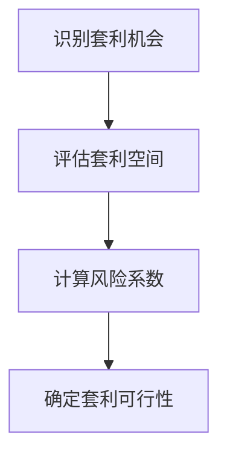
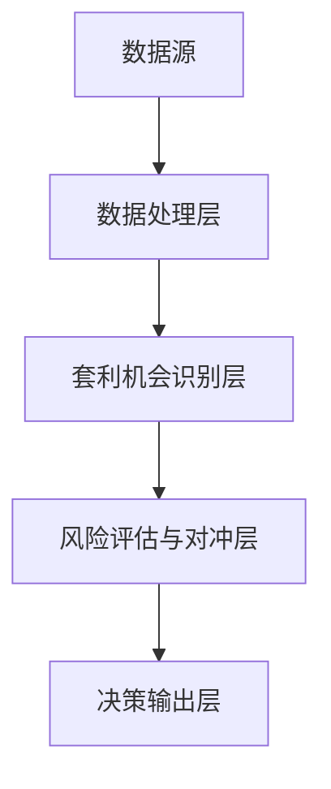

                 


# 塞思·克拉曼的风险套利：特殊情况下的价值发现

---

## 关键词：
塞思·克拉曼, 风险套利, 价值发现, 特殊情况, 套利策略, 投资机会, 风险评估

---

## 摘要：
本文深入探讨塞思·克拉曼的风险套利策略，特别是在企业并购、破产重组等特殊情况下如何发现和捕捉价值。通过理论分析、算法设计和实际案例，揭示风险套利的核心原理、数学模型和系统架构，帮助读者理解如何在复杂市场环境中利用套利机会实现投资收益最大化。文章结合背景介绍、算法实现和实战案例，全面解析风险套利的精髓。

---

## 第一部分: 风险套利与价值发现概述

### 第1章: 风险套利的定义与背景

#### 1.1 风险套利的核心概念

##### 1.1.1 风险套利的定义与特点
风险套利是一种通过识别市场中价格偏离内在价值的机会，利用短期价格波动进行投资以获取超额收益的投资策略。其特点包括：
- **短期性**：套利机会通常存在于市场短期失衡中，持续时间较短。
- **低风险**：通过 hedging（对冲）降低市场风险。
- **高收益**：套利收益通常高于传统投资。

##### 1.1.2 风险套利的历史发展
风险套利的起源可以追溯到古希腊时期的泰勒斯，他在预测橄榄油丰收的情况下，通过购买期权进行套利。现代风险套利在20世纪80年代得到快速发展，尤其是在并购交易和破产重组中广泛应用。

##### 1.1.3 风险套利与其他投资策略的区别
| 投资策略 | 核心目标 | 风险特征 | 持股期限 |
|----------|----------|----------|----------|
| 长期价值投资 | 追求企业内在价值 | 高 | 长期 |
| 股票投机 | 投机价格波动 | 高 | 短期 |
| 风险套利 | 利用价格偏差 | 低（通过 hedging） | 短期 |

#### 1.2 风险套利的基本原理
##### 1.2.1 套利机会的来源
套利机会通常来源于市场信息不对称、短期流动性不足或市场参与者情绪波动。例如：
- 企业并购消息泄露前的股价异动。
- 债务重组中的债券价格低估。

##### 1.2.2 套利的经济学基础
套利是市场效率的体现，套利者通过买卖行为纠正价格偏差，促进市场均衡。套利者通常利用市场中的价格差异，在无风险或低风险的情况下获取收益。

##### 1.2.3 套利与市场效率的关系
套利活动有助于提高市场流动性，降低信息不对称，促进价格发现。然而，过度套利可能导致市场波动加剧。

---

### 第2章: 特殊情况下的价值发现

#### 2.1 特殊情况的定义与分类
##### 2.1.1 企业并购与重组
企业并购通常伴随着股价的短期波动，套利者可以通过分析并购双方的协同效应和估值差异，捕捉套利机会。

##### 2.1.2 破产与债务重组
在企业破产或债务重组过程中，债券价格通常被低估，套利者可以通过购买债券并推动重组进程，获取超额收益。

##### 2.1.3 股权分置与资产重组
股权分置改革或资产重组过程中，股价可能因信息不对称而出现低估，套利者可以通过短期持有获利。

#### 2.2 价值发现的核心要素
##### 2.2.1 企业基本面分析
套利者需要对企业进行深入的财务分析，包括盈利能力、资产负债表和现金流情况。

##### 2.2.2 市场情绪与价格波动
套利者需要关注市场情绪和短期价格波动，识别市场失衡的机会。

##### 2.2.3 信息不对称与套利机会
套利者通常依赖于内部信息或市场分析，捕捉市场未充分反映的信息。

---

### 第3章: 风险套利的数学模型与算法

#### 3.1 风险套利的数学模型
##### 3.1.1 套利空间的量化公式
$$ \text{套利空间} = \text{市场价} - \text{内在价值} $$

##### 3.1.2 风险调整后的套利收益计算
$$ \text{风险调整收益} = \text{套利收益} \times (1 - \text{风险系数}) $$

#### 3.2 套利机会评估的算法流程


---

### 第4章: 风险套利的系统架构设计

#### 4.1 系统功能模块
##### 4.1.1 数据采集模块
- 数据来源：实时市场数据、新闻公告、财务报表。
- 数据类型：股价、债券价格、市场情绪指标。

##### 4.1.2 套利机会识别模块
- 通过算法识别价格偏离内在价值的机会。
- 输出套利机会列表。

##### 4.1.3 风险评估与对冲模块
- 计算套利风险系数。
- 设计 hedging 策略。

#### 4.2 系统架构图


---

### 第5章: 风险套利的项目实战

#### 5.1 项目环境与工具安装
##### 5.1.1 数据获取工具
- 数据源：Yahoo Finance API、 Bloomberg。
- 工具：Python、Pandas、NumPy。

##### 5.1.2 数据分析工具
- 工具：Jupyter Notebook、Matplotlib、Seaborn。

##### 5.1.3 风险评估模型实现
- 工具：Scikit-learn、XGBoost。

#### 5.2 核心代码实现
##### 5.2.1 套利空间计算代码
```python
import pandas as pd
import numpy as np

def calculate_arbitrage_space(prices, intrinsic_values):
    arbitrage_space = prices - intrinsic_values
    return arbitrage_space

# 示例数据
prices = pd.Series([100, 90, 110, 80])
intrinsic_values = pd.Series([90, 85, 105, 75])
arbitrage_space = calculate_arbitrage_space(prices, intrinsic_values)
print(arbitrage_space)
```

##### 5.2.2 风险调整收益计算代码
```python
def calculate_risk_adjusted_return(arbitrage收益, risk_coefficient):
    risk_adjusted_return = arbitrage收益 * (1 - risk_coefficient)
    return risk_adjusted_return

# 示例数据
arbitrage收益 = 10
risk_coefficient = 0.1
risk_adjusted_return = calculate_risk_adjusted_return(arbitrage收益, risk_coefficient)
print(risk_adjusted_return)
```

#### 5.3 实际案例分析
##### 5.3.1 某公司并购事件
- 并购消息公布前，股价被低估。
- 套利者买入股票，消息公布后卖出，获取收益。

##### 5.3.2 破产重组案例
- 某公司债券价格被低估。
- 套利者买入债券，推动重组进程，获取收益。

---

## 第六部分: 最佳实践与小结

### 6.1 最佳实践
- **信息收集**：建立高效的信息收集系统，捕捉市场机会。
- **风险对冲**：通过 hedging 降低市场风险。
- **快速决策**：套利机会通常短暂，需要快速决策。

### 6.2 小结
风险套利是一种高收益低风险的投资策略，特别适用于特殊情况下的价值发现。套利者需要具备敏锐的市场洞察力和高效的执行能力，才能在竞争激烈的市场中捕捉到套利机会。

---

## 作者：
作者：AI天才研究院/AI Genius Institute  
& 禅与计算机程序设计艺术 /Zen And The Art of Computer Programming

