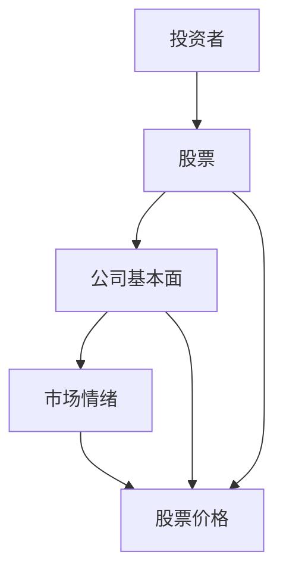
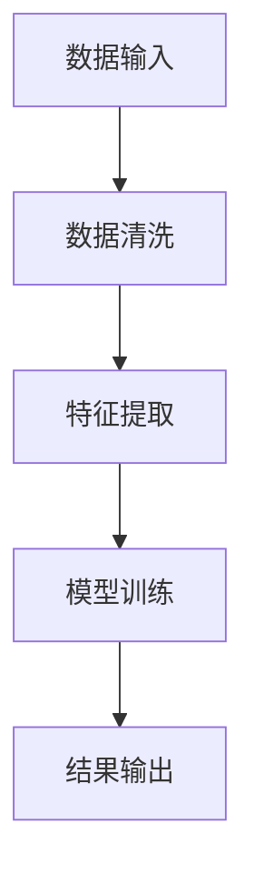
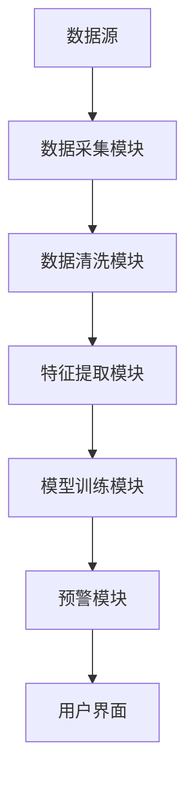
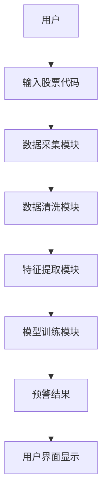

                 


# 塞思·卡拉曼的价值陷阱避免策略

> 关键词：价值陷阱、投资策略、股票分析、DCF模型、风险管理、塞思·卡拉曼

> 摘要：本文深入探讨了塞思·卡拉曼提出的“价值陷阱”概念，分析了其避免策略的核心思想，并结合实际案例和算法模型，详细讲解了如何识别和避免价值陷阱。文章从理论到实践，层层递进，为投资者提供了科学、系统的投资策略。

---

## 第一部分: 价值陷阱的背景与核心概念

### 第1章: 价值陷阱的定义与背景

#### 1.1 价值陷阱的定义
##### 1.1.1 投资中的价值陷阱
价值陷阱是指那些看似估值较低、具有吸引力，但实际上存在严重问题（如财务困境、行业衰退、管理层问题等）的股票。投资者容易被表面的低估值所迷惑，误以为是投资机会，但实际上买入后可能面临重大损失。

##### 1.1.2 价值陷阱的常见类型
- **财务造假型**：公司通过虚增收入、隐瞒债务等方式掩盖问题，误导投资者。
- **行业衰退型**：所在行业整体衰退，公司难以扭亏为盈。
- **管理层问题型**：管理层存在严重问题，如道德风险、管理不善等。
- **技术落后型**：技术落后于行业，难以在竞争中生存。

##### 1.1.3 价值陷阱的识别方法
- 通过财务报表分析识别虚假利润。
- 研究行业趋势，判断公司所处环境。
- 调查管理层背景，评估其能力和诚信。
- 关注技术发展，避免投资于落后技术的公司。

#### 1.2 价值陷阱的形成原因
##### 1.2.1 企业基本面分析
- 财务状况：高负债、低现金流、应收账款占比高。
- 盈利能力：毛利率持续下滑、净利润率与行业不符。
- 偿债能力：流动比率过低、速动比率异常。

##### 1.2.2 市场情绪的影响
- 投资者往往过于关注短期股价波动，忽视长期基本面。
- 市场恐慌时，投资者可能误判低估值股票的价值。

##### 1.2.3 投资者认知偏差
- 过度自信：认为自己能够准确判断股票价值。
- 确认偏差：只关注支持自己观点的信息，忽视反面证据。
- 拇唇效应：在市场下跌时，投资者倾向于抛售股票，导致股价进一步下跌。

#### 1.3 价值陷阱的识别与避免
##### 1.3.1 价值陷阱的常见特征
| 特征 | 描述 |
|------|------|
| 高市盈率 | 盈利能力下降，股价远高于行业平均水平。 |
| 低市净率 | 资产质量差，账面价值被高估。 |
| 负债率高 | 高负债可能意味着公司财务风险大。 |
| 现金流为负 | 公司无法通过自身业务产生正现金流。 |

##### 1.3.2 价值陷阱的识别方法
- **财务报表分析**：通过利润表、资产负债表和现金流量表识别财务异常。
- **行业分析**：研究行业发展趋势，判断公司是否处于衰退行业。
- **管理层调查**：了解公司高管的背景、经验和声誉。
- **技术分析**：评估公司技术的先进性，是否具备竞争优势。

##### 1.3.3 价值陷阱的避免策略
- **分散投资**：避免将所有资金投入单一股票或行业，降低风险。
- **长期持有**：选择基本面良好、行业前景广阔的公司，长期持有。
- **价值投资**：关注公司的内在价值，而非短期股价波动。

### 第2章: 价值陷阱的核心概念

#### 2.1 价值陷阱的属性对比
##### 2.1.1 价值陷阱与低估值股票的区别
- 低估值股票：基本面良好，价格低于内在价值。
- 价值陷阱：价格看似低，但公司存在严重问题。

##### 2.1.2 价值陷阱与高成长股票的对比
- 高成长股票：公司处于快速成长期，未来盈利潜力大。
- 价值陷阱：公司成长停滞，甚至可能亏损。

##### 2.1.3 价值陷阱与周期性股票的联系
- 周期性股票：业绩随经济周期波动。
- 价值陷阱：周期性波动中可能隐藏问题，需谨慎判断。

#### 2.2 价值陷阱的ER实体关系图


#### 2.3 价值陷阱的系统分析
- 系统输入：股票市场数据、公司财务报表、行业分析报告。
- 系统处理：通过算法识别价值陷阱，生成投资建议。
- 系统输出：价值陷阱预警信号、投资策略建议。

---

## 第二部分: 价值陷阱的算法原理

### 第3章: 价值陷阱的算法原理

#### 3.1 价值陷阱的识别算法


#### 3.2 价值陷阱的数学模型
##### 3.2.1 市盈率模型
$$ P/E = \frac{Price}{Earnings} $$

##### 3.2.2 市净率模型
$$ P/B = \frac{Price}{Book\ Value} $$

##### 3.2.3 股息率模型
$$ Dividend\ Yield = \frac{Dividends}{Price} $$

#### 3.3 价值陷阱的Python实现
```python
import pandas as pd
import numpy as np

def identify_value_traps(stocks):
    # 数据清洗
    cleaned_data = stocks.dropna()
    # 特征提取
    cleaned_data['PE'] = cleaned_data['Price'] / cleaned_data['Earnings']
    cleaned_data['PB'] = cleaned_data['Price'] / cleaned_data['Book Value']
    cleaned_data['DY'] = cleaned_data['Dividends'] / cleaned_data['Price']
    # 模型训练
    # 假设PE > 30或PB < 1为潜在价值陷阱
    value_traps = cleaned_data[(cleaned_data['PE'] > 30) | (cleaned_data['PB'] < 1)]
    return value_traps

# 示例数据
data = {
    'Stock': ['A', 'B', 'C', 'D', 'E'],
    'Price': [10, 20, 30, 40, 50],
    'Earnings': [2, 4, 6, 8, 10],
    'Book Value': [5, 10, 15, 20, 25],
    'Dividends': [1, 2, 3, 4, 5]
}
stocks = pd.DataFrame(data)
result = identify_value_traps(stocks)
print(result)
```

#### 3.4 价值陷阱的算法优化
- 突破传统PE、PB、DY指标的局限性，结合多指标进行综合评估。
- 引入机器学习算法（如随机森林、神经网络）进行预测。

---

## 第三部分: 价值陷阱的系统分析与架构设计

### 第4章: 价值陷阱识别系统的架构设计

#### 4.1 项目介绍
- 项目目标：开发一个能够识别价值陷阱的股票筛选系统。
- 项目范围：涵盖股票数据采集、分析、预警功能。

#### 4.2 系统功能设计
- **数据采集模块**：从股票数据库中获取实时数据。
- **数据清洗模块**：处理缺失值、异常值。
- **特征提取模块**：计算PE、PB、DY等指标。
- **模型训练模块**：使用机器学习算法识别价值陷阱。
- **预警模块**：生成价值陷阱预警信号。

#### 4.3 系统架构设计


#### 4.4 系统接口设计
- 数据采集接口：从数据库获取股票数据。
- 数据清洗接口：处理缺失值、异常值。
- 模型训练接口：调用机器学习模型进行预测。

#### 4.5 系统交互设计


---

## 第四部分: 价值陷阱的项目实战

### 第5章: 价值陷阱识别系统的实现

#### 5.1 环境安装
- 安装Python、Pandas、NumPy、Scikit-learn等库。

#### 5.2 核心代码实现
```python
import pandas as pd
import numpy as np
from sklearn.ensemble import RandomForestClassifier

def main():
    # 数据采集
    stocks = pd.read_csv('stocks.csv')
    # 数据清洗
    cleaned_data = stocks.dropna()
    # 特征提取
    cleaned_data['PE'] = cleaned_data['Price'] / cleaned_data['Earnings']
    cleaned_data['PB'] = cleaned_data['Price'] / cleaned_data['Book Value']
    cleaned_data['DY'] = cleaned_data['Dividends'] / cleaned_data['Price']
    # 模型训练
    X = cleaned_data[['PE', 'PB', 'DY']]
    y = cleaned_data['Is_Value_Traps'].astype(int)
    model = RandomForestClassifier()
    model.fit(X, y)
    # 预测
    predictions = model.predict(X)
    cleaned_data['Prediction'] = predictions
    # 输出结果
    print(cleaned_data[['Stock', 'Prediction']])
    
if __name__ == "__main__":
    main()
```

#### 5.3 代码解读与分析
- **数据采集**：从CSV文件中读取股票数据。
- **数据清洗**：删除缺失值。
- **特征提取**：计算PE、PB、DY指标。
- **模型训练**：使用随机森林分类器进行预测。
- **结果输出**：显示股票名称和预测结果。

#### 5.4 实际案例分析
- **案例分析**：分析某公司股票是否为价值陷阱。
- **结果解读**：解释模型预测结果。

#### 5.5 项目小结
- 项目总结：系统能够有效识别价值陷阱。
- 改进方向：引入更多特征、优化模型性能。

---

## 第五部分: 价值陷阱的避免策略与最佳实践

### 第6章: 价值陷阱的避免策略

#### 6.1 小结
- 价值陷阱是指看似估值低但实际存在问题的股票。
- 识别价值陷阱需要综合分析公司基本面、行业趋势和管理层情况。

#### 6.2 注意事项
- 避免仅依赖单一指标判断股票价值。
- 保持对市场的持续学习和关注。

#### 6.3 拓展阅读
- 建议阅读塞思·卡拉曼的《安全边际》深入理解价值投资理念。

---

## 作者：AI天才研究院/AI Genius Institute & 禅与计算机程序设计艺术 /Zen And The Art of Computer Programming

