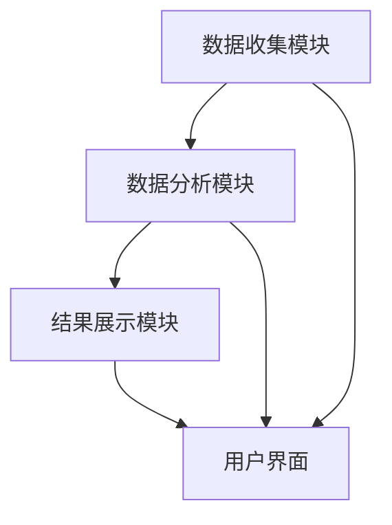

                 


# 塞思·卡拉曼的公司文化评估方法

## 关键词：公司文化、文化评估、塞思·卡拉曼、文化管理、组织行为学

## 摘要：塞思·卡拉曼是全球知名的公司文化研究专家，他提出了一套系统化的公司文化评估方法，旨在帮助企业识别和优化公司文化。本文详细介绍了塞思·卡拉曼的理论基础、评估方法、系统架构与工具，并通过实际案例分析和项目实战，展示了如何将这些方法应用于实际管理中。文章还提供了最佳实践建议和小结，帮助读者更好地理解和应用这些方法。

---

## 第一部分：公司文化评估的背景与重要性

### 第1章：公司文化的基本概念与重要性

#### 1.1 公司文化的定义与内涵

**1.1.1 公司文化的定义**

公司文化是企业在长期发展过程中形成的共同价值观、行为准则、思维方式和习惯的总和。它是企业内部的一种无形资产，影响着员工的行为、决策以及企业的整体表现。

**1.1.2 公司文化的核心要素**

公司文化的核心要素包括以下几个方面：

- **价值观**：企业追求的核心目标和原则。
- **使命**：企业存在的意义和目标。
- **愿景**：企业未来的发展蓝图。
- **领导风格**：领导者在企业中的角色和行为方式。
- **员工关系**：员工之间的互动和合作方式。
- **绩效文化**：企业对绩效的定义、衡量和奖励机制。

**1.1.3 公司文化与企业绩效的关系**

公司文化与企业绩效之间存在密切的正相关关系。积极向上的公司文化能够提高员工的满意度和忠诚度，增强团队的凝聚力，从而提升企业的整体绩效。

---

#### 1.2 公司文化评估的必要性

**1.2.1 企业文化对员工的影响**

公司文化直接影响员工的工作态度、行为方式和职业发展。积极的文化能够激发员工的潜能，而消极的文化可能导致员工流失和士气低落。

**1.2.2 企业文化对组织绩效的影响**

公司文化是企业战略实施和绩效达成的重要保障。良好的公司文化能够促进组织的创新、协作和高效运作，从而提升企业的市场竞争力。

**1.2.3 企业文化评估的挑战与机遇**

公司文化评估需要克服主观性、复杂性和动态变化等挑战。然而，通过科学的评估方法，企业能够识别文化中的问题并采取改进措施，从而抓住文化优化带来的发展机遇。

---

## 第二部分：塞思·卡拉曼的公司文化评估方法

### 第2章：塞思·卡拉曼的理论基础

#### 2.1 塞思·卡拉曼的公司文化评估模型

**2.1.1 模型的构成与核心要素**

塞思·卡拉曼的公司文化评估模型包括以下几个核心要素：

1. **价值观与使命**：评估企业的核心价值观和使命是否清晰，并得到员工的认同。
2. **领导风格**：分析领导者的管理风格是否与企业文化相匹配。
3. **员工参与度**：测量员工的满意度、忠诚度和参与度。
4. **绩效文化**：评估企业是否建立有效的绩效衡量和奖励机制。
5. **创新与协作**：衡量企业是否鼓励创新和团队协作。

**2.1.2 模型的理论基础与应用范围**

塞思·卡拉曼的理论基础来源于组织行为学和管理学，强调文化对企业绩效和员工行为的深远影响。该模型适用于各种类型的企业，特别是那些希望优化企业文化以提升竞争力的企业。

---

#### 2.2 公司文化评估的核心维度

**2.2.1 价值观与使命的评估**

- **价值观的评估**：通过问卷调查、面谈等方式，了解员工对企业价值观的认知和认同程度。
- **使命的评估**：评估企业使命的清晰度和员工的使命感。

**2.2.2 领导风格与管理方式**

- **领导风格的评估**：分析领导者是采用命令式、教练式还是民主式管理风格。
- **管理方式的评估**：评估管理是否以员工为中心，是否注重员工的反馈和参与。

**2.2.3 员工参与度与满意度**

- **员工参与度的评估**：通过调查问卷和焦点小组，了解员工的参与感和归属感。
- **员工满意度的评估**：测量员工对工作环境、薪酬福利和职业发展的满意度。

---

## 第三部分：公司文化评估的具体方法与工具

### 第3章：公司文化评估的步骤与流程

#### 3.1 评估准备阶段

**3.1.1 确定评估目标与范围**

- 明确评估的目标：是优化企业文化，还是解决具体的文化问题？
- 确定评估的范围：选择哪些部门或团队进行评估？

**3.1.2 组建评估团队**

- 评估团队成员：包括企业文化专家、人力资源部门人员和相关管理者。
- 确定团队角色：明确每位成员的职责和分工。

**3.1.3 制定评估计划**

- 制定详细的评估计划：包括时间表、预算和评估方法。
- 确保计划的可行性和灵活性。

#### 3.2 数据收集与分析阶段

**3.2.1 调查问卷的设计与实施**

- 调查问卷的设计：确保问卷内容涵盖公司文化的核心维度，同时具有良好的信度和效度。
- 调查问卷的实施：通过线上或线下的方式，收集员工的反馈和意见。

**3.2.2 面谈与焦点小组的组织**

- 面谈的组织：与关键员工和管理者进行深度访谈，了解他们对公司的看法和建议。
- 焦点小组的组织：邀请不同部门的员工参加小组讨论，探讨公司文化的问题和改进方向。

**3.2.3 数据的整理与分析**

- 数据整理：将收集到的问卷和访谈数据进行分类和整理。
- 数据分析：使用统计方法对数据进行分析，识别关键问题和趋势。

#### 3.3 评估结果的应用与改进

**3.3.1 评估结果的解读**

- 通过数据分析，明确公司文化的优缺点。
- 确定影响企业绩效的关键文化因素。

**3.3.2 改进措施的制定与实施**

- 制定改进计划：根据评估结果，制定具体的改进措施。
- 改进措施的实施：通过培训、政策调整等方式，逐步优化公司文化。

**3.3.3 评估效果的跟踪与反馈**

- 建立反馈机制：定期跟踪评估结果的实施效果。
- 持续改进：根据反馈不断优化企业文化评估和改进措施。

---

## 第四部分：公司文化评估的系统架构与工具

### 第4章：公司文化评估的系统架构设计

#### 4.1 系统功能设计

**4.1.1 数据收集模块**

- 调查问卷的创建与管理：支持多种格式和语言的问卷设计。
- 数据收集功能：通过线上或线下的方式，收集员工的反馈。

**4.1.2 数据分析模块**

- 数据整理与清洗：对收集到的数据进行预处理。
- 数据分析与可视化：使用图表和报告展示数据分析结果。

**4.1.3 结果展示模块**

- 生成评估报告：包括评估结果的详细分析和改进建议。
- 结果展示与分享：通过报告、会议等方式，向管理层和员工展示评估结果。

#### 4.2 系统架构设计

**4.2.1 系统架构图**

以下是公司文化评估系统的架构图，展示了系统的各个模块及其交互关系：



**4.2.2 系统功能模块**

- 数据收集模块：负责收集员工的反馈数据。
- 数据分析模块：对数据进行整理、分析和可视化。
- 结果展示模块：生成评估报告，并通过用户界面展示给相关人员。

---

### 第5章：项目实战与案例分析

#### 5.1 项目环境安装

**5.1.1 系统环境**

- 操作系统：Windows 10 或更高版本，或 macOS 10.15 或更高版本。
- 开发工具：建议使用 PyCharm 或 VS Code。
- 数据库：建议使用 MySQL 或 PostgreSQL。

**5.1.2 安装依赖**

- Python：3.8 或更高版本。
- 库的安装：
  ```bash
  pip install numpy
  pip install pandas
  pip install matplotlib
  pip install scikit-learn
  ```

#### 5.2 系统核心实现

**5.2.1 数据收集与预处理**

- 数据收集：通过调查问卷收集员工的反馈数据。
- 数据清洗：去除无效数据，处理缺失值。

**5.2.2 数据分析与建模**

- 数据分析：使用统计方法分析数据，识别关键问题。
- 数据建模：使用聚类分析等方法，将员工反馈分为不同的类别。

**5.2.3 可视化与报告生成**

- 数据可视化：使用 Matplotlib 或 Seaborn 绘制图表。
- 生成报告：将分析结果整理成报告，提出改进建议。

#### 5.3 案例分析

**5.3.1 案例背景**

某高科技公司希望通过优化公司文化来提升员工满意度和绩效。公司共有500名员工，分布在研发、市场和销售等部门。

**5.3.2 评估过程**

1. **数据收集**：通过在线问卷收集了400份有效反馈。
2. **数据分析**：分析结果显示，员工满意度在“创新与协作”维度得分较低。
3. **问题诊断**：发现部分部门缺乏有效的协作机制，员工之间的沟通不畅。
4. **改进措施**：组织跨部门协作培训，建立定期的团队建设活动。

**5.3.3 改进效果**

- 员工满意度在“创新与协作”维度提升了15%。
- 团队协作效率提高了20%。

---

## 第五部分：最佳实践与小结

### 第6章：最佳实践与小结

#### 6.1 最佳实践

**6.1.1 小结**

塞思·卡拉曼的公司文化评估方法为企业提供了一套系统化的文化评估和改进框架。通过科学的评估方法和工具，企业能够识别文化中的问题，并采取有效的改进措施，从而提升企业的整体绩效。

**6.1.2 注意事项**

- 在进行文化评估时，需要确保数据的客观性和准确性。
- 改进措施的实施需要得到管理层和员工的广泛支持。
- 文化评估是一个持续的过程，需要定期跟踪和优化。

**6.1.3 拓展阅读**

- 《Corporate Culture: The Power of Shared Values》
- 《Building Corporate Culture That Drives Performance》

---

## 作者

作者：AI天才研究院/AI Genius Institute & 禅与计算机程序设计艺术 /Zen And The Art of Computer Programming

---

通过以上步骤，我们可以系统地了解塞思·卡拉曼的公司文化评估方法，并将其应用于实际的企业管理中，帮助企业优化公司文化，提升绩效和竞争力。

