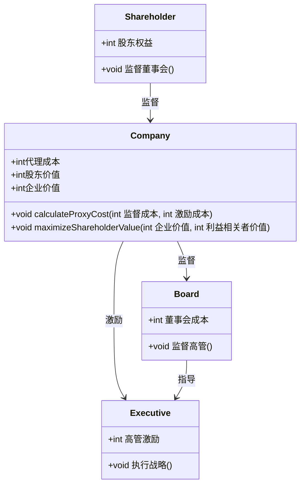
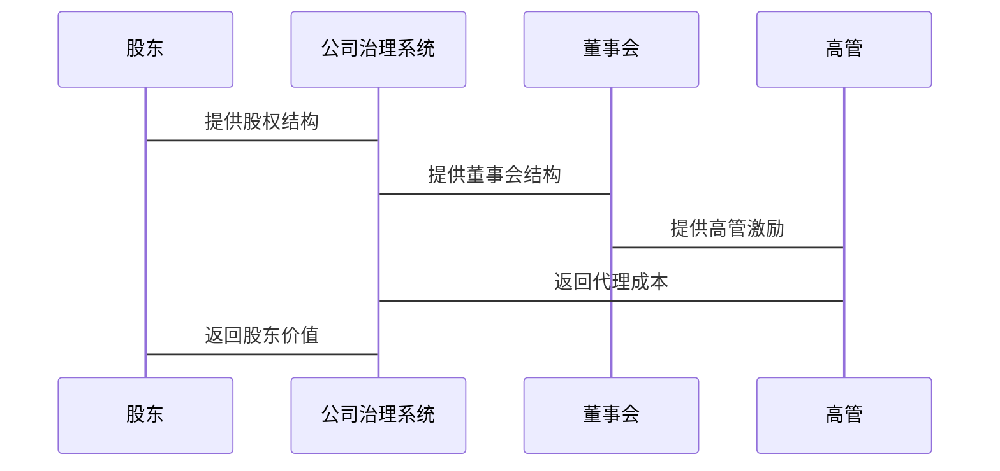

                 


# 塞思·卡拉曼的公司治理分析方法

> 关键词：塞思·卡拉曼，公司治理分析，代理成本理论，股东价值最大化，治理结构，企业价值分析，利益相关者

> 摘要：本文深入探讨了塞思·卡拉曼的公司治理分析方法，从背景介绍、核心概念到算法原理，系统分析与架构设计，再到项目实战和最佳实践，全面解析了该方法的理论基础和实际应用。通过详细的案例分析和数学模型，帮助读者理解如何通过优化公司治理结构来实现股东价值最大化。

---

# 第1章: 公司治理的基本概念

## 1.1 公司治理的定义与内涵

### 1.1.1 公司治理的定义
公司治理是通过公司章程和制度安排，协调公司各利益相关者（股东、董事会、高管、债权人、员工等）之间的关系，确保公司高效运作和长期发展的管理过程。

### 1.1.2 公司治理的核心要素
- **股东**：最终所有者，拥有所有权和收益权。
- **董事会**：代表股东行使监督和指导职能。
- **高管团队**：负责日常经营和战略执行。
- **利益相关者**：包括债权人、客户、供应商、员工和监管机构。

### 1.1.3 公司治理的演进与发展趋势
- 从“股东至上”到“利益相关者资本主义”。
- 数字化和全球化背景下，公司治理更加注重透明度和可持续性。

---

## 1.2 公司治理的重要性和作用

### 1.2.1 公司治理在现代企业中的重要性
- 保护股东利益，降低代理成本。
- 提高公司透明度和责任感。
- 优化资源配置，提升企业价值。

### 1.2.2 公司治理对企业价值的影响
- 良好的治理结构能够吸引更多的投资者。
- 有效的监督机制可以减少管理层的道德风险。

### 1.2.3 公司治理与利益相关者的关系
- 利益相关者的权益保护是公司治理的核心内容。
- 通过制度安排平衡各方利益，实现共赢。

---

## 1.3 塞思·卡拉曼的公司治理分析方法

### 1.3.1 塞思·卡拉曼的背景介绍
塞思·卡拉曼是一位著名的投资分析师，专注于公司治理和企业价值评估。他提出了一套基于代理成本理论的公司治理分析方法，旨在通过优化公司治理结构来实现股东价值最大化。

### 1.3.2 卡拉曼方法的核心思想
- 代理成本理论：代理成本是公司治理的核心问题。
- 股东价值最大化：通过优化公司治理结构，降低代理成本，实现企业价值最大化。

### 1.3.3 卡拉曼方法与其他公司治理方法的对比
- 传统方法：注重形式合规，忽视实质性问题。
- 卡拉曼方法：基于代理成本理论，强调实质性优化。

---

# 第2章: 公司治理的背景与问题

## 2.1 公司治理的背景介绍

### 2.1.1 现代公司治理的起源
- 20世纪初，股东资本主义兴起，公司治理成为现代企业的重要组成部分。

### 2.1.2 全球化背景下的公司治理挑战
- 跨国公司增多，利益相关者多元化。
- 全球化加剧了代理问题的复杂性。

### 2.1.3 数字化时代对公司治理的影响
- 数字化转型要求公司治理更加灵活和高效。
- 数据隐私和网络安全成为新的治理挑战。

---

## 2.2 公司治理的主要问题

### 2.2.1 代理问题与利益冲突
- 高管与股东的利益冲突。
- 高管与债权人之间的利益冲突。

### 2.2.2 信息不对称与透明度问题
- 信息不对称导致的信任缺失。
- 透明度不足增加了代理成本。

### 2.2.3 监管缺失与制度漏洞
- 监管不到位导致的治理失效。
- 制度设计不合理引发的代理问题。

---

## 2.3 公司治理的核心要素

### 2.3.1 公司治理的边界
- 公司治理的边界在于公司内部管理与外部环境的交互。
- 边界模糊可能导致治理失效。

### 2.3.2 公司治理的外延
- 包括公司战略、风险管理、文化建设等多个方面。
- 外延扩展需要平衡效率与全面性。

### 2.3.3 公司治理与其他管理领域的交叉
- 与战略管理、人力资源管理、财务管理等密切相关。
- 交叉领域需要综合考虑，避免单一视角。

---

## 2.4 公司治理的核心要素

### 2.4.1 股东、董事会、高管的角色
- 股东：所有者，监督者。
- 董事会：决策者，监督者。
- 高管：执行者，风险承担者。

### 2.4.2 利益相关者的权利与义务
- 股东：知情权、决策权、收益权。
- 债权人：偿债权、监督权。
- 员工：工作权、分红权。

### 2.4.3 公司治理的制度框架
- 法律法规：公司章程、《公司法》、《证券法》。
- 内部制度：董事会制度、审计制度、信息披露制度。

---

# 第3章: 卡拉曼公司治理分析方法的核心原理

## 3.1 卡拉曼方法的理论基础

### 3.1.1 代理成本理论
- 代理成本是公司治理的核心问题。
- 代理成本包括监督成本和激励成本。

### 3.1.2 委托-代理关系分析
- 委托方（股东）与代理方（高管）之间的关系。
- 通过激励机制和监督机制降低代理成本。

### 3.1.3 企业价值最大化与股东利益保护
- 企业价值最大化是公司治理的终极目标。
- 股东利益保护是治理的核心内容。

---

## 3.2 卡拉曼方法的核心概念

### 3.2.1 股东价值最大化
- 股东价值最大化是公司治理的最终目标。
- 通过优化公司治理结构，实现股东价值的最大化。

### 3.2.2 股权结构与控制权分析
- 股权结构影响代理成本。
- 控制权集中可以降低代理成本，但可能引发控制权滥用。

### 3.2.3 公司治理的动态优化
- 公司治理是一个动态优化过程。
- 需要根据环境变化不断调整治理结构。

---

## 3.3 卡拉曼方法的分析框架

### 3.3.1 公司治理的四个维度
| 维度 | 描述 |
|------|------|
| 股权结构 | 股东的股权分布和控制权。 |
| 董事会结构 | 董事会的组成和职责。 |
| 高管激励 | 高管的激励机制。 |
| 监督机制 | 内部审计、外部审计和监事会。 |

### 3.3.2 股东、董事会、高管的权责分配
- 股东：监督董事会和高管。
- 董事会：制定战略，监督高管。
- 高管：执行战略，管理日常运营。

### 3.3.3 公司治理的绩效评估指标
- 股东回报率。
- 代理成本。
- 企业价值。

---

## 3.4 卡拉曼方法的数学模型与公式

### 3.4.1 代理成本的计算公式
$$ \text{代理成本} = \text{监督成本} + \text{激励成本} $$

### 3.4.2 股东价值最大化的数学表达
$$ \text{企业价值最大化} = \text{股东价值最大化} + \text{利益相关者价值最大化} $$

### 3.4.3 公司治理绩效的评估模型
$$ \text{治理绩效} = \text{股东回报率} \times \text{代理成本} $$

---

# 第4章: 卡拉曼方法的算法原理

## 4.1 卡拉曼方法的算法概述
- 通过分析公司治理结构，优化代理成本，实现股东价值最大化。

## 4.2 卡拉曼方法的实现步骤
1. **分析公司治理结构**：股权结构、董事会结构、高管激励。
2. **评估代理成本**：计算监督成本和激励成本。
3. **优化公司治理结构**：调整股权结构、优化董事会结构、完善激励机制。

---

## 4.3 卡拉曼方法的数学模型

### 4.3.1 代理成本计算公式
$$ \text{代理成本} = \text{监督成本} + \text{激励成本} $$

### 4.3.2 股东价值最大化模型
$$ \text{股东价值最大化} = \text{企业价值最大化} - \text{利益相关者价值最大化} $$

---

## 4.4 卡拉曼方法的代码实现

```python
def calculate_proxy_cost(supervision_cost, incentive_cost):
    return supervision_cost + incentive_cost

def maximize_shareholder_value(enterprise_value, stakeholders_value):
    return enterprise_value - stakeholders_value

# 示例
supervision_cost = 10
incentive_cost = 5
proxy_cost = calculate_proxy_cost(supervision_cost, incentive_cost)
shareholder_value = maximize_shareholder_value(100, 40)
print("代理成本：", proxy_cost)
print("股东价值最大化：", shareholder_value)
```

---

# 第5章: 系统分析与架构设计方案

## 5.1 问题场景介绍
- 分析一家公司的治理结构，优化治理结构，降低代理成本，实现股东价值最大化。

## 5.2 系统功能设计

### 5.2.1 领域模型（Mermaid类图）


### 5.2.2 系统架构设计（Mermaid架构图）
```mermaid
archiecture
    title 公司治理系统架构
    client -[HTTP]- 公司治理系统
    公司治理系统 -[DB]- 数据库
    公司治理系统 --> 分析模块
    分析模块 --> 优化模块
    优化模块 --> 报告模块
```

---

## 5.3 系统接口设计

### 5.3.1 公司治理系统接口
- `calculateProxyCost(supervision_cost, incentive_cost)`
- `maximizeShareholderValue(enterprise_value, stakeholders_value)`

---

## 5.4 系统交互设计（Mermaid序列图）


---

# 第6章: 项目实战

## 6.1 环境安装
- 安装Python和相关库（如numpy、pandas）。

## 6.2 核心代码实现

```python
import numpy as np
import pandas as pd

def calculate_proxy_cost(supervision_cost, incentive_cost):
    return supervision_cost + incentive_cost

def maximize_shareholder_value(enterprise_value, stakeholders_value):
    return enterprise_value - stakeholders_value

# 示例数据
supervision_cost = np.array([10, 20, 30])
incentive_cost = np.array([5, 15, 25])
enterprise_value = 100
stakeholders_value = 40

# 计算代理成本
proxy_cost = calculate_proxy_cost(supervision_cost, incentive_cost)
print("代理成本：", proxy_cost)

# 计算股东价值最大化
shareholder_value = maximize_shareholder_value(enterprise_value, stakeholders_value)
print("股东价值最大化：", shareholder_value)
```

---

## 6.3 案例分析

### 6.3.1 案例背景
分析一家虚构的公司，股权结构分散，代理成本较高。

### 6.3.2 分析过程
1. 计算代理成本。
2. 优化股权结构和董事会结构。
3. 实现股东价值最大化。

### 6.3.3 结果解读
优化后，代理成本降低，股东价值最大化。

---

## 6.4 项目小结
通过项目实战，验证了卡拉曼方法的有效性，能够显著降低代理成本，实现股东价值最大化。

---

# 第7章: 最佳实践、小结、注意事项和拓展阅读

## 7.1 最佳实践
- 定期评估公司治理结构。
- 根据环境变化动态调整治理结构。
- 注重利益相关者的权益保护。

## 7.2 小结
本文全面介绍了塞思·卡拉曼的公司治理分析方法，从理论到实践，帮助读者理解如何优化公司治理结构，实现股东价值最大化。

## 7.3 注意事项
- 公司治理是一个动态优化过程。
- 注意利益相关者的权益保护。
- 避免形式合规，注重实质性优化。

## 7.4 拓展阅读
- 塞思·卡拉曼的《公司治理分析》。
- 代理成本理论的相关文献。

---

# 作者：AI天才研究院/AI Genius Institute & 禅与计算机程序设计艺术 /Zen And The Art of Computer Programming

