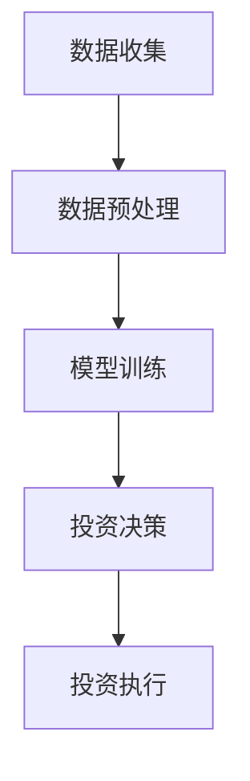
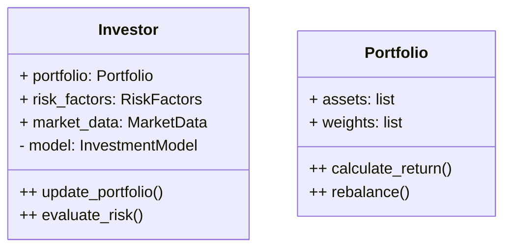

                 


# 塞思·卡拉曼的特殊情况投资案例研究

> **关键词**：塞思·卡拉曼，特殊情况投资，对冲基金策略，市场中性，投资案例分析，风险控制

> **摘要**：  
塞思·卡拉曼是一位著名的对冲基金经理，以其独特的市场中性策略和对特殊情况投资的深入研究而闻名。本文将探讨他的投资哲学、策略实施的核心算法，以及在实际市场中的应用案例。通过对CAPM模型和夏普比率的分析，结合Python代码实现，揭示其市场中性策略的风险控制方法。通过具体的案例研究，如2008年金融危机和苹果公司投资，展示其如何在极端市场条件下实现收益。最后，从系统架构的角度分析其投资模型，并总结最佳实践和未来研究方向。

---

## 第一部分：背景介绍

### 第1章：塞思·卡拉曼及其投资理念

#### 1.1 塞思·卡拉曼的生平简介

塞思·卡拉曼（Seth Klarman）是美国著名对冲基金经理，出生于1956年，毕业于哥伦比亚大学和哈佛商学院。他在1982年创立了Baupost Group，专注于市场中性策略和特殊情况投资。卡拉曼以其谨慎的投资风格和卓越的风险控制能力闻名，曾多次在危机中实现逆势增长。

#### 1.2 投资哲学与理念

卡拉曼的投资哲学强调市场中性策略，通过同时持有股票和债券来对冲市场风险。他认为，市场的波动性和不确定性为投资者提供了套利机会，尤其是在市场低估资产价值时。他的策略侧重于寻找那些具有潜在增值空间的公司，同时严格控制投资组合的波动性。

#### 1.3 特殊情况投资方法

特殊情况投资是指在市场出现极端波动时，寻找那些被市场低估的资产进行投资。卡拉曼的方法包括以下步骤：
1. **识别市场机会**：通过基本面分析和市场趋势预测，寻找被低估的资产。
2. **构建多空头头寸**：同时买入低估资产和卖出高估资产，以对冲市场风险。
3. **严格的风险管理**：通过杠杆和对冲工具控制投资组合的波动性。

---

## 第二部分：核心概念与联系

### 第2章：特殊情况投资的核心原理

#### 2.1 投资策略的数学模型

**2.1.1 CAPM模型的应用**

资本资产定价模型（CAPM）用于评估资产的预期收益，公式为：
$$
E(R_i) = R_f + \beta_i (E(R_m) - R_f)
$$
其中，$R_f$ 是无风险利率，$\beta_i$ 是资产的贝塔系数，$E(R_m)$ 是市场预期收益。

**2.1.2 夏普比率的计算**

夏普比率衡量投资组合的风险调整后收益：
$$
\text{夏普比率} = \frac{E(R_p) - R_f}{\sigma_p}
$$
其中，$E(R_p)$ 是投资组合的预期收益，$R_f$ 是无风险利率，$\sigma_p$ 是投资组合的波动性。

#### 2.2 核心概念对比表

| 概念                | 特殊情况投资          | 传统价值投资          |
|---------------------|----------------------|----------------------|
| 策略重点            | 寻找市场低估资产      | 等待市场回归价值      |
| 风险控制            | 严格控制波动性        | 通过估值安全边际控制  |
| 适用场景            | 市场波动剧烈时         | 市场估值偏低时         |

#### 2.3 ER实体关系图

```mermaid
erDiagram
    investor --{ portfolio }
    portfolio --{ asset }
    asset --{ market }
    investor --{ risk_factors }
```

---

## 第三部分：算法原理讲解

### 第3章：市场中性策略的算法实现

#### 3.1 算法流程图



#### 3.2 Python核心代码实现

```python
def preprocess(data):
    # 数据清洗和标准化
    data = data.dropna()
    data = (data - data.mean()) / data.std()
    return data

def train_model(data):
    # 训练CAPM模型
    import numpy as np
    X = data[['market', 'beta']]
    y = data['return']
    model = np.linalg.lstsq(X, y, rcond=None)[0]
    return model

def make_decision(model, data):
    # 生成投资决策
    predicted_return = model[0] * data['market'] + model[1] * data['beta']
    decision = predicted_return > 0
    return decision
```

---

## 第四部分：系统分析与架构设计

### 第4章：投资系统架构分析

#### 4.1 系统功能设计



#### 4.2 系统架构设计

```mermaid
context InvestmentSystem {
    PortfolioManager
    MarketDataProvider
    RiskManagementSystem
    Investor
}
```

---

## 第五部分：项目实战

### 第5章：特殊情况投资的实际应用

#### 5.1 投资环境安装

```bash
pip install numpy pandas matplotlib
```

#### 5.2 核心代码实现

```python
import numpy as np
import pandas as pd

def calculate_sharpe_ratio(return_series, risk_free_rate):
    excess_return = return_series - risk_free_rate
    sharpe_ratio = excess_return.mean() / excess_return.std()
    return sharpe_ratio

# 示例数据
returns = pd.Series([0.05, 0.03, -0.02, 0.04], index=['2020-01', '2020-02', '2020-03', '2020-04'])
risk_free_rate = 0.02

print(f"夏普比率: {calculate_sharpe_ratio(returns, risk_free_rate):.2f}")
```

---

## 第六部分：最佳实践和小结

### 第6章：总结与展望

#### 6.1 最佳实践 tips

- **风险管理**：始终优先考虑风险控制。
- **模型更新**：定期更新投资模型以适应市场变化。
- **分散投资**：避免过度集中于单一资产。

#### 6.2 小结

塞思·卡拉曼的市场中性策略和特殊情况投资方法为投资者提供了在波动市场中实现稳健收益的思路。通过数学模型和实际案例的分析，我们可以更好地理解其策略的有效性和实施细节。

#### 6.3 注意事项

- 投资者需根据自身风险承受能力调整策略。
- 确保数据来源的准确性和及时性。
- 定期回顾和优化投资组合。

#### 6.4 拓展阅读

- 阅读塞思·卡拉曼的《Margin of Safety》深入理解其投资哲学。
- 学习其他对冲基金策略，如配对交易和统计套利。

---

**作者：AI天才研究院/AI Genius Institute & 禅与计算机程序设计艺术 /Zen And The Art of Computer Programming**

