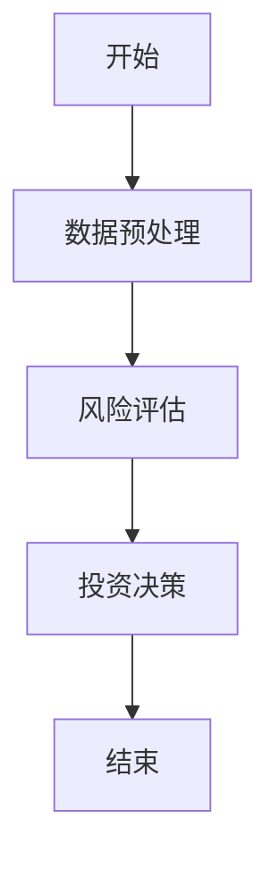
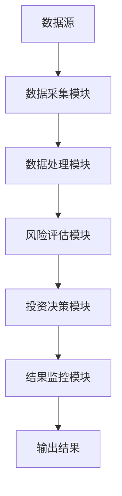
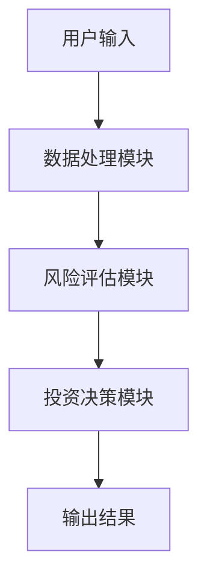

                 


# 塞思·卡拉曼的特殊情况投资策略

---

## 关键词：
- 特殊情况投资
- 塞思·卡拉曼
- 投资策略
- 风险评估
- 数学模型
- 投资组合优化
- 系统架构设计

---

## 摘要：
本文深入探讨了塞思·卡拉曼的特殊情况投资策略，分析其核心思想、数学模型、系统架构及实际应用。通过详细讲解投资背景、策略制定、算法优化、系统设计和项目实战，本文为读者提供了全面的视角，帮助其理解并应用卡拉曼的投资理念。

---

## 第1章: 投资与市场概述

### 1.1 投资的基本概念

#### 1.1.1 投资的定义与分类
- **定义**：投资是指将资金或资源投入到某种资产或项目中，以期望在未来获得收益或资本增值的行为。
- **分类**：包括股票、债券、房地产、私募股权等多种形式。

#### 1.1.2 市场与投资的关系
- **市场的作用**：市场是投资活动的载体，资产的价格波动直接影响投资收益。
- **市场风险**：市场波动性是投资的主要风险之一，投资者需通过策略降低风险。

#### 1.1.3 投资的基本原理
- **价值评估**：通过分析资产的内在价值，确定其市场价格是否被低估或高估。
- **风险与收益的平衡**：投资者需在风险和收益之间找到平衡点。

### 1.2 特殊情况投资的定义

#### 1.2.1 特殊情况投资的定义
- **特殊情况投资**：指在特定市场环境下，由于资产价格失衡或市场非理性波动，投资者可以利用市场异常进行投资获利的机会。

#### 1.2.2 特殊情况投资的特点
- **低效市场**：市场参与者信息不对称或市场机制不完善导致价格偏离价值。
- **短期机会**：特殊情况通常短暂，需快速识别和应对。

#### 1.2.3 特殊情况投资的分类
- **资产错配**：资产价格与基本面严重不符。
- **市场恐慌**：市场因突发事件导致价格异常。

### 1.3 塞思·卡拉曼投资策略的背景

#### 1.3.1 塞思·卡拉曼的生平简介
- **投资大师**：卡拉曼以其独特的投资策略闻名，尤其擅长在市场危机中发现投资机会。

#### 1.3.2 卡拉曼策略的形成背景
- **市场波动**：2008年金融危机后，市场波动加剧，为特殊情况投资提供了更多机会。
- **市场非理性**：投资者情绪波动导致市场定价失衡。

#### 1.3.3 卡拉曼策略的核心思想
- **逆向思维**：在市场恐慌时寻找被低估的资产。
- **风险控制**：严格控制投资风险，确保资本安全。

### 1.4 本章小结
本章介绍了投资的基本概念、市场与投资的关系，以及特殊情况投资的定义和特点。同时，分析了卡拉曼策略的背景和核心思想，为后续章节的分析奠定了基础。

---

## 第2章: 卡拉曼特殊情况投资的核心策略

### 2.1 卡拉曼投资哲学

#### 2.1.1 投资的目的是什么
- **资本增值**：通过投资实现财富增长。
- **风险控制**：确保投资本金的安全。

#### 2.1.2 投资的基本原则
- **价值投资**：投资于具有持续盈利能力的公司。
- **分散投资**：避免过度集中，降低风险。

#### 2.1.3 卡拉曼的投资理念
- **逆向思维**：在市场低谷时买入，在市场高点时卖出。
- **长期视角**：关注企业的长期价值，而非短期价格波动。

### 2.2 卡拉曼的决策框架

#### 2.2.1 信息收集与分析
- **数据收集**：包括财务报表、行业分析、市场趋势等。
- **信息处理**：通过数据分析识别市场机会和风险。

#### 2.2.2 风险评估与控制
- **风险识别**：通过模型评估投资组合的风险。
- **风险对冲**：利用衍生工具降低市场风险。

#### 2.2.3 投资决策的制定
- **决策流程**：从数据收集到投资决策的系统化流程。

### 2.3 卡拉曼的特殊情况分析方法

#### 2.3.1 特殊情况的识别
- **市场异动**：识别资产价格与基本面的偏离。
- **行业分析**：通过行业比较发现低估资产。

#### 2.3.2 特殊情况的分类
- **短期波动**：由于突发事件引起的市场波动。
- **长期趋势**：市场结构变化导致的长期低估。

#### 2.3.3 特殊情况的处理策略
- **快速反应**：及时抓住市场机会。
- **风险控制**：制定严格的止损策略。

### 2.4 本章小结
本章详细讲解了卡拉曼的投资哲学、决策框架和特殊情况分析方法，强调了逆向思维和风险控制的重要性。

---

## 第3章: 卡拉曼策略的数学模型与算法

### 3.1 投资组合优化的数学模型

#### 3.1.1 投资组合优化的基本假设
- **收益最大化**：在风险可控的前提下，最大化投资收益。
- **风险最小化**：在收益固定的情况下，最小化投资风险。

#### 3.1.2 投资组合优化的目标函数
- **目标函数**：最大化投资组合的期望收益，同时最小化其风险。

$$
\text{最大化} \quad \sum_{i=1}^{n} w_i r_i \\
\text{最小化} \quad \sum_{i=1}^{n} w_i^2 \sigma_i^2
$$

其中，\( w_i \) 为第 \( i \) 个资产的权重，\( r_i \) 为期望收益，\( \sigma_i \) 为收益的标准差。

#### 3.1.3 约束条件的设定
- **权重约束**：\( \sum_{i=1}^{n} w_i = 1 \)
- **风险约束**：投资组合的风险不超过设定值。

### 3.2 卡拉曼策略的算法流程

#### 3.2.1 数据预处理
- **清洗数据**：去除无效数据，处理缺失值。
- **标准化处理**：对数据进行标准化处理，确保模型输入一致。

#### 3.2.2 风险评估模型
- **风险评估模型**：使用历史数据和统计模型评估资产的风险。
- **风险排序**：根据风险评估结果对资产进行排序。

#### 3.2.3 投资决策算法
- **决策规则**：基于风险评估结果，制定投资决策。
- **动态调整**：根据市场变化动态调整投资组合。

### 3.3 算法的数学推导

#### 3.3.1 投资组合优化的数学公式
$$
\text{最大化} \quad \sum_{i=1}^{n} w_i r_i - \frac{1}{2} \lambda \sum_{i=1}^{n} w_i^2 \sigma_i^2
$$

其中，\( \lambda \) 是风险惩罚系数。

#### 3.3.2 算法流程图


### 3.4 本章小结
本章通过数学模型和算法流程图，详细讲解了卡拉曼策略的投资组合优化过程，强调了风险评估和投资决策的重要性。

---

## 第4章: 卡拉曼策略的系统架构设计

### 4.1 系统设计与架构

#### 4.1.1 系统功能设计
- **数据采集**：实时采集市场数据。
- **风险评估**：对资产进行风险评估。
- **投资决策**：根据评估结果制定投资策略。
- **结果监控**：监控投资组合的表现。

#### 4.1.2 系统架构图


#### 4.1.3 系统接口设计
- **数据接口**：与数据源进行数据交换。
- **用户接口**：供用户查看和调整投资策略。

### 4.2 系统交互设计

#### 4.2.1 交互流程


### 4.3 本章小结
本章通过系统架构设计，展示了如何将卡拉曼策略转化为实际的系统应用，强调了模块化设计和系统交互的重要性。

---

## 第5章: 项目实战——卡拉曼策略的应用

### 5.1 环境安装

#### 5.1.1 系统环境
- **操作系统**：建议使用Windows或Linux系统。
- **开发工具**：推荐使用PyCharm或Jupyter Notebook。

#### 5.1.2 软件依赖
- **Python**：3.8及以上版本。
- **库依赖**：numpy、pandas、scipy、matplotlib等。

### 5.2 核心实现源代码

#### 5.2.1 数据处理模块
```python
import pandas as pd
import numpy as np

# 数据清洗
def data_cleaning(data):
    data = data.dropna()
    return data
```

#### 5.2.2 风险评估模块
```python
import scipy.stats as stats

# 风险评估
def risk_assessment(data):
    returns = data['returns']
    std = returns.std()
    return std
```

#### 5.2.3 投资决策模块
```python
def investment_decision(risk, threshold):
    if risk < threshold:
        return '买入'
    else:
        return '卖出'
```

### 5.3 实际案例分析

#### 5.3.1 数据分析
```python
data = pd.read_csv('market_data.csv')
cleaned_data = data_cleaning(data)
risk = risk_assessment(cleaned_data)
decision = investment_decision(risk, 0.05)
print(decision)
```

#### 5.3.2 结果解读
- **买入信号**：当风险低于阈值时，发出买入信号。
- **卖出信号**：当风险高于阈值时，发出卖出信号。

### 5.4 本章小结
本章通过实际案例，展示了如何应用卡拉曼策略进行投资决策，并通过代码实现进行了详细说明。

---

## 第6章: 总结与展望

### 6.1 最佳实践

#### 6.1.1 投资策略
- **长期视角**：关注企业的长期价值。
- **风险控制**：严格控制投资风险。

#### 6.1.2 技术应用
- **数据分析**：利用大数据技术进行市场分析。
- **模型优化**：不断优化投资模型，提高投资收益。

### 6.2 小结
本文详细讲解了塞思·卡拉曼的特殊情况投资策略，从理论到实践，全面分析了其核心思想、数学模型和系统架构。

### 6.3 未来展望
随着技术的进步，投资策略将更加智能化和数据化，未来的研究方向包括人工智能在投资中的应用，以及更复杂的市场模型开发。

---

## 作者：AI天才研究院/AI Genius Institute & 禅与计算机程序设计艺术 /Zen And The Art of Computer Programming

---

本文通过详细讲解塞思·卡拉曼的特殊情况投资策略，为读者提供了全面的视角，帮助其理解并应用卡拉曼的投资理念。希望本文能为投资领域的研究和实践提供有价值的参考。

