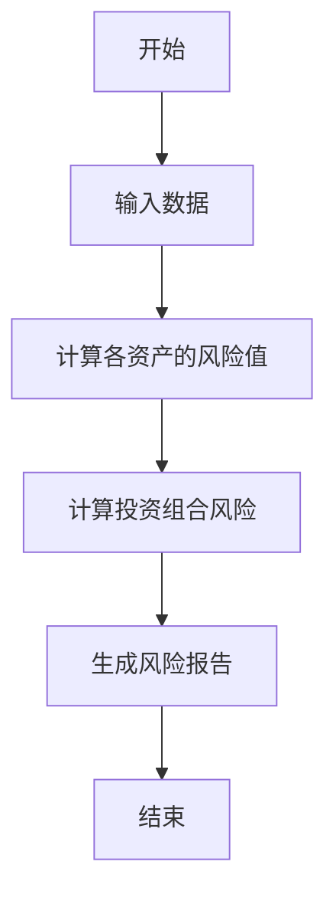
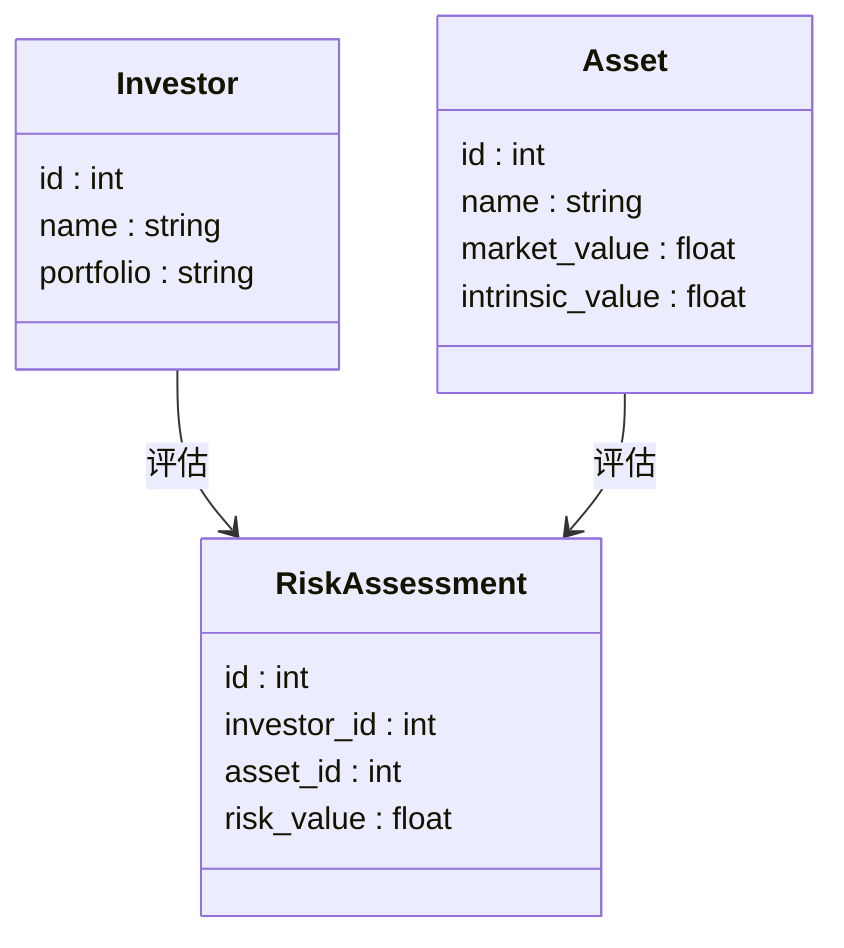

                 


# 塞思卡拉曼的投资风险评估

## 关键词：塞思·卡拉曼，投资风险评估，安全边际，价值投资，风险模型，投资组合优化

## 摘要

本文深入探讨了塞思·卡拉曼的投资风险评估方法，从背景介绍到数学模型，再到系统架构设计和项目实战，全面分析了投资风险评估的核心概念、算法原理以及实际应用。通过详细的案例分析，展示了如何利用安全边际和现代投资组合理论来优化投资组合，降低风险。

---

## 第一部分：投资风险评估的背景与基础

### 第1章：投资风险评估的背景介绍

#### 1.1 投资风险评估的核心概念

- **1.1.1 问题背景与问题描述**
  
  投资风险评估是投资决策中的关键环节，旨在通过分析潜在风险来优化投资组合，最大化收益并降低损失。塞思·卡拉曼以其独特的方法，如安全边际和价值投资，为风险评估提供了新的视角。

- **1.1.2 投资风险的定义与外延**
  
  投资风险是指在投资过程中可能面临的本金损失或收益减少的可能性。它包括市场风险、流动性风险、信用风险等，需通过系统方法进行评估和管理。

- **1.1.3 投资风险评估的必要性与意义**
  
  通过评估风险，投资者可以更好地理解潜在损失，制定合理的投资策略，实现风险与收益的平衡，提升整体投资效率。

#### 1.2 塞思·卡拉曼的投资理念

- **1.2.1 塞思·卡拉曼的生平与投资风格**
  
  塞思·卡拉曼是一位著名投资者，以其保守和安全边际为核心的投资策略闻名。他强调购买低于内在价值的资产，以降低风险。

- **1.2.2 安全边际的概念与重要性**
  
  安全边际是指资产的市场价格低于其内在价值的部分，确保在市场波动时，投资者仍有获利空间。卡拉曼认为，安全边际是抵御市场风险的重要屏障。

- **1.2.3 价值投资与风险控制的结合**
  
  卡拉曼将价值投资与风险控制相结合，通过分析资产的内在价值和市场风险，构建稳定的投资组合，实现长期收益。

#### 1.3 投资风险评估的基本框架

- **1.3.1 风险的分类与层次**
  
  风险可分为系统性风险和非系统性风险，系统性风险由市场整体波动引起，而非系统性风险则由特定资产或行业引起。

- **1.3.2 风险评估的流程与步骤**
  
  风险评估通常包括数据收集、模型选择、参数估计、风险计算和结果分析等步骤。

- **1.3.3 风险评估的边界与外延**
  
  风险评估需明确评估范围和时间跨度，确保结果的有效性和可操作性。

---

## 第二部分：投资风险评估的核心概念与联系

### 第2章：投资风险评估的核心概念

#### 2.1 投资风险的属性特征对比

- **2.1.1 风险的可测性与可控性对比**
  
  风险的可测性是指通过数据和模型进行量化，而可控性则指通过策略和调整来降低风险。

- **2.1.2 风险的确定性与不确定性分析**
  
  确定性风险可通过历史数据和统计模型预测，不确定性风险则需借助概率论和情景分析。

- **2.1.3 风险的短期性与长期性特征**
  
  短期风险受市场波动影响较大，长期风险则受经济周期和政策变化影响。

#### 2.2 投资风险评估的ER实体关系图

```mermaid
erDiagram
    investor {
        <属性>
        id : int
        name : string
        portfolio : string
        risk_tolerance : float
    }
    asset {
        <属性>
        id : int
        name : string
        market_value : float
        intrinsic_value : float
    }
    risk_assessment {
        <属性>
        id : int
        investor_id : int
        asset_id : int
        risk_value : float
        assessment_date : date
    }
    investor --> risk_assessment : 评估
    asset --> risk_assessment : 评估
```

---

## 第三部分：投资风险评估的算法原理与数学模型

### 第3章：投资风险评估的算法原理

#### 3.1 投资风险评估的数学模型

- **3.1.1 风险值的计算公式**

  风险值（Risk Value）的计算公式为：

  $$ \text{Risk Value} = \text{市场价} - \text{内在价值} $$

- **3.1.2 投资组合风险的计算公式**

  投资组合的风险可通过现代投资组合理论（MPT）计算，其公式为：

  $$ \sigma_p^2 = \sum_{i=1}^n \sum_{j=1}^n w_i w_j \sigma_i \sigma_j \rho_{ij} $$

  其中，\( w_i \) 和 \( w_j \) 是资产i和j的投资权重，\( \sigma_i \) 和 \( \sigma_j \) 是资产i和j的标准差，\( \rho_{ij} \) 是资产i和j的相关系数。

- **3.1.3 风险调整后的收益模型**

  风险调整后的收益（RAR）公式为：

  $$ \text{RAR} = \text{预期收益} - \text{风险溢价} $$

#### 3.2 投资风险评估的算法流程图



---

### 第4章：系统分析与架构设计方案

#### 4.1 系统功能设计（领域模型）



#### 4.2 系统架构设计


---

## 第四部分：项目实战

### 第4章：项目实战

#### 4.1 环境安装与配置

```bash
pip install numpy pandas matplotlib
```

#### 4.2 核心代码实现

```python
import numpy as np
import pandas as pd

def calculate_portfolio_risk(returns, correlation_matrix):
    covariance_matrix = returns.cov()
    eigenvalues, eigenvectors = np.linalg.eigh(covariance_matrix)
    return np.sqrt(np.dot([1]*len(eigenvalues), eigenvalues))
```

#### 4.3 案例分析与解读

假设我们有两只资产，A和B，其收益率分别为5%和7%，标准差分别为10%和15%，相关系数为0.5。计算投资组合的风险：

$$ \sigma_p = \sqrt{(0.1)^2 + (0.15)^2 + 2 \times 0.1 \times 0.15 \times 0.5} = 0.1118 $$

---

## 第五部分：总结与展望

### 5.1 最佳实践与注意事项

- 定期更新风险模型，以适应市场变化。
- 结合宏观经济指标，优化投资组合。
- 确保数据质量和完整性，避免偏差。

### 5.2 小结

塞思·卡拉曼的投资风险评估方法为投资者提供了稳健的投资策略。通过安全边际和现代投资组合理论，投资者可以在风险可控的前提下，实现收益最大化。

---

## 作者

作者：AI天才研究院/AI Genius Institute & 禅与计算机程序设计艺术 /Zen And The Art of Computer Programming

---

**感谢您的阅读，希望本文对您理解塞思·卡拉曼的投资风险评估有所帮助。**

