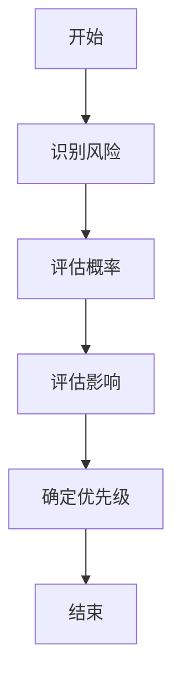
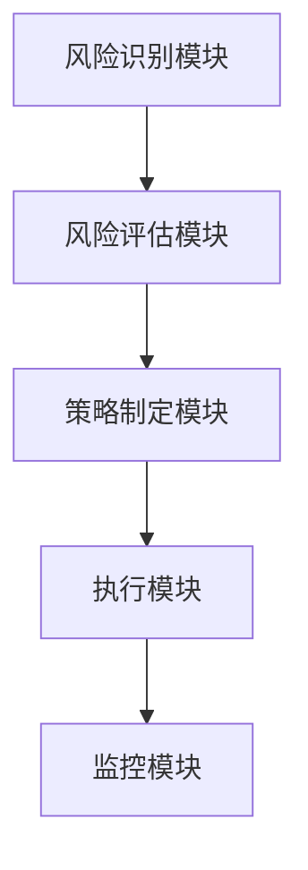
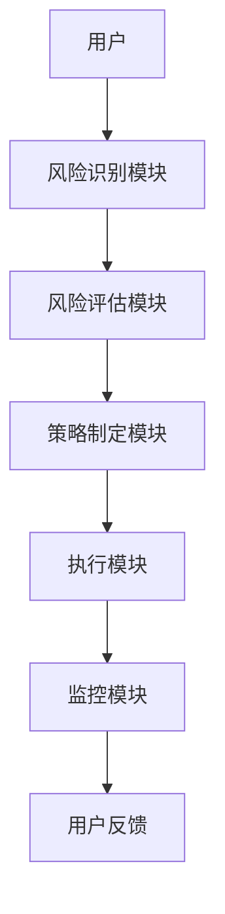

                 


好的，我现在将根据您的要求，逐步构建《塞思卡拉曼的风险规避策略》这篇文章的目录大纲。我将按照您的要求，先列出关键词和摘要，然后按照章节逐步展开，确保每个部分都符合您的要求。

### 第一部分：文章标题

# 塞思卡拉曼的风险规避策略

### 第二部分：文章关键词

- 风险管理
- 风险评估
- 风险规避
- 系统架构
- 项目实战
- 风险控制
- 技术策略

### 第三部分：文章摘要

本文深入探讨塞思卡拉曼的风险规避策略，从背景到实施，系统地分析风险评估、策略制定、系统架构设计、项目实战以及最佳实践。文章首先介绍背景，详细讲解核心概念，然后分析风险评估与管理的方法，包括数学模型和算法流程图。接着，制定风险规避策略，涵盖策略类型、优先级排序和实施步骤。最后，通过项目实战和系统架构设计，结合具体案例，展示如何在实际项目中应用这些策略。本文旨在为读者提供全面的风险管理解决方案，帮助他们在复杂环境中做出明智决策。

---

### 第四部分：正文内容

#### 第一部分：塞思卡拉曼的风险规避背景

##### 第1章：塞思卡拉曼的风险规避概述

###### 1.1 问题背景与核心概念

- **1.1.1 问题背景介绍**
  - 塞思卡拉曼的风险管理背景
  - 什么是风险规避？
  - 风险规避的核心概念

- **1.1.2 核心概念解析**
  - 风险的定义
  - 风险规避的目标
  - 风险与收益的平衡

- **1.1.3 相关概念对比分析**
  - 风险管理 vs 风险规避
  - 风险评估 vs 风险控制

###### 1.2 风险特征与分类

- **1.2.1 风险的基本特征**
  - 可能性
  - 影响程度
  - 时间跨度

- **1.2.2 风险的分类方法**
  - 按来源分类
  - 按影响范围分类
  - 按可控性分类

- **1.2.3 风险与收益的权衡**
  - 风险厌恶 vs 风险偏好
  - 风险中性的决策

#### 第二部分：风险评估与分析

##### 第2章：风险评估的数学模型与流程

###### 2.1 风险评估的数学模型

- **2.1.1 风险概率计算公式**
  - $$ P = \frac{\text{发生次数}}{\text{总样本数}} $$
  - 示例：计算某风险事件的概率

- **2.1.2 风险影响评估模型**
  - $$ I = a \times T + b \times C $$
  - 其中，$a$ 和 $b$ 是权重，$T$ 是时间影响，$C$ 是成本影响。

- **2.1.3 风险值综合计算公式**
  - $$ RV = P \times I $$
  - 示例：计算某风险事件的综合风险值

###### 2.2 风险评估的流程图



##### 第3章：风险评估的详细步骤

###### 3.1 风险识别方法

- **3.1.1 威胁分析**
  - 威胁来源
  - 威胁影响

- **3.1.2 漏洞分析**
  - 系统漏洞
  - 漏洞利用可能性

- **3.1.3 影响分析**
  - 业务影响
  - 项目进度影响

#### 第三部分：风险规避策略制定

##### 第4章：风险规避策略的选择与实施

###### 4.1 确定风险规避目标

- **4.1.1 目标设定的原则**
  - 可行性
  - 可测量性
  - 时限性

- **4.1.2 目标与整体策略的关系**
  - 短期目标 vs 长期目标
  - 局部目标 vs 整体目标

###### 4.2 风险规避策略的选择

- **4.2.1 避险策略**
  - 避免高风险项目
  - 选择低风险替代方案

- **4.2.2 分散策略**
  - 分散投资
  - 分散风险

- **4.2.3 补偿策略**
  - 风险发生后的补偿措施
  - 保险机制

###### 4.3 策略实施的步骤

- **4.3.1 确定策略类型**
  - 根据风险特征选择策略

- **4.3.2 制定行动计划**
  - 分阶段实施
  - 资源分配

- **4.3.3 监控与调整**
  - 定期评估
  - 及时调整

#### 第四部分：系统架构与实施

##### 第5章：风险规避的系统架构设计

###### 5.1 系统架构概述

- **5.1.1 系统模块划分**
  - 风险识别模块
  - 风险评估模块
  - 策略制定模块

- **5.1.2 系统架构图**



- **5.1.3 系统功能设计**
  - 风险识别
  - 风险评估
  - 策略制定
  - 执行与监控

##### 第6章：系统接口与交互设计

###### 6.1 系统接口设计

- **6.1.1 API接口设计**
  - 输入：风险事件
  - 输出：风险评估结果

- **6.1.2 接口文档**
  - 示例：API调用示例

###### 6.2 系统交互流程



#### 第五部分：项目实战

##### 第7章：项目实战与案例分析

###### 7.1 项目环境搭建

- **7.1.1 环境要求**
  - 操作系统
  - 开发工具
  - 数据库

- **7.1.2 工具安装**
  - 版本控制工具（如Git）
  - 项目管理工具（如JIRA）

###### 7.2 核心代码实现

- **7.2.1 风险识别模块**
  - Python代码示例
  ```python
  def identify_risk(data):
      # 风险识别逻辑
      return risks
  ```

- **7.2.2 风险评估模块**
  - Python代码示例
  ```python
  def assess_risk(risks):
      # 风险评估逻辑
      return risk_scores
  ```

- **7.2.3 策略制定模块**
  - Python代码示例
  ```python
  def制定策略(risk_scores):
      # 策略制定逻辑
      return strategies
  ```

###### 7.3 案例分析

- **7.3.1 案例背景**
  - 具体项目背景
  - 风险情况描述

- **7.3.2 应用分析**
  - 应用风险规避策略的过程
  - 实施效果评估

- **7.3.3 总结与优化**
  - 成功经验
  - 改进措施

#### 第六部分：最佳实践与总结

##### 第8章：总结与展望

###### 8.1 总结

- **8.1.1 核心内容回顾**
  - 风险评估与管理
  - 风险规避策略
  - 系统架构设计

- **8.1.2 实践中的注意事项**
  - 灵活性与适应性
  - 数据的准确性和完整性
  - 团队协作与沟通

##### 8.2 展望

- **8.2.1 未来趋势**
  - 数字化风险管理
  - 人工智能在风险管理中的应用
  - 更高级的风险评估模型

- **8.2.2 拓展阅读**
  - 推荐书籍
  - 推荐在线资源
  - 推荐课程

---

### 第五部分：作者信息

**作者：AI天才研究院/AI Genius Institute & 禅与计算机程序设计艺术 /Zen And The Art of Computer Programming**

---

### 第六部分：文章结束语

感谢您的阅读！希望这篇文章能为您提供有价值的风险规避策略和系统设计思路。如果您有任何问题或建议，请随时与我联系。

---

通过上述思考和构建过程，我为您详细设计了《塞思卡拉曼的风险规避策略》的技术博客文章目录大纲。希望这个大纲能够满足您的需求，您可以根据这个大纲继续撰写完整的文章内容。

