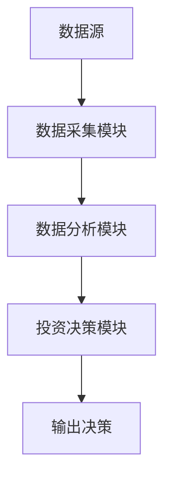

                 


# 塞斯·卡拉曼的特殊情况投资技巧

## 关键词：特殊情况投资、塞斯·卡拉曼、逆市投资、套利机会、风险控制

## 摘要：本文详细介绍了塞斯·卡拉曼在特殊情况投资领域的独特技巧，探讨了其逆市投资策略、套利机会识别以及风险控制方法。通过分析其核心概念、算法原理和系统架构，本文为读者提供了深入的理解和实践指南。

---

# 第一部分：特殊情况投资的背景与核心概念

## 第1章：特殊情况投资的定义与背景

### 1.1 什么是特殊情况投资
特殊情况投资是指在市场出现极端情况或特殊事件时，投资者利用市场波动寻找低估资产或套利机会的投资策略。这种投资方式通常在市场恐慌、经济危机或企业重组等情况下显得尤为重要。

### 1.2 特殊情况投资的核心特征
1. **逆周期性**：在市场低迷时寻找机会。
2. **套利机会**：利用价格差异获利。
3. **高风险高回报**：投资风险较高，但潜在收益巨大。

### 1.3 特殊情况投资的重要性
- 在传统投资机会有限时，特殊情况投资提供了新的盈利渠道。
- 通过套利机会，投资者可以利用市场不完美实现收益。

---

## 第2章：塞斯·卡拉曼的特殊情况投资技巧

### 2.1 塞斯·卡拉曼的简介
塞斯·卡拉曼是一位著名投资者，以其在特殊情况投资领域的成功闻名。他的投资理念强调逆市投资和风险控制，尤其擅长在市场低谷时寻找低估资产。

### 2.2 塞斯·卡拉曼的投资策略
1. **逆市投资**：在市场恐慌时买入低估资产。
2. **套利机会识别**：通过分析市场价差寻找套利空间。
3. **风险控制**：严格控制仓位和杠杆，确保资金安全。

---

# 第二部分：特殊情况投资的核心概念与联系

## 第3章：特殊情况投资的核心概念

### 3.1 套利机会的原理
套利是指利用两个或多个市场之间的价格差异进行无风险或低风险投资，以赚取价差收益。套利机会的存在源于市场的不完全和信息不对称。

### 3.2 逆市投资的原理
逆市投资是指在市场下跌时买入资产，利用市场的超跌反弹获利。这种策略需要对市场走势有深刻理解，并具备强大的心理素质。

### 3.3 风险控制的原理
风险控制是确保投资组合安全的关键。通过分散投资、设置止损和严格的资金管理，投资者可以有效降低风险。

### 3.4 核心概念对比
| 概念         | 特点                         |
|--------------|------------------------------|
| 套利机会     | 利用价格差异，低风险高回报   |
| 逆市投资     | 市场低谷时买入，高风险高回报 |
| 风险控制     | 管理和降低投资风险           |

---

## 第4章：特殊情况投资的算法原理

### 4.1 价值评估模型
价值评估模型用于确定资产的内在价值，帮助投资者识别低估资产。

#### 4.1.1 简单的平均值回归模型
$$ V = \frac{P_1 + P_2 + ... + P_n}{n} $$
其中，\( V \) 是资产的内在价值，\( P_i \) 是不同市场的价格。

### 4.2 市场情绪分析
通过分析市场情绪指标，投资者可以判断市场的买卖力量，从而做出投资决策。

#### 4.2.1 市场情绪指标
$$ S = \frac{\text{买入量} - \text{卖出量}}{\text{总交易量}} $$
当 \( S > 0 \) 时，市场情绪为乐观；反之则为悲观。

### 4.3 风险定价模型
风险定价模型用于评估资产的风险，并确定其合理的市场价格。

#### 4.3.1 风险调整后的收益模型
$$ R = R_f + \beta (R_m - R_f) $$
其中，\( R \) 是资产的预期收益，\( R_f \) 是无风险利率，\( \beta \) 是贝塔系数，\( R_m \) 是市场预期收益。

---

# 第三部分：特殊情况投资的系统分析

## 第5章：系统架构设计

### 5.1 系统功能模块
- 数据采集模块：收集市场数据。
- 数据分析模块：识别套利机会和评估资产价值。
- 投资决策模块：根据分析结果做出投资决策。

### 5.2 系统架构图


---

## 第6章：项目实战

### 6.1 环境安装
安装必要的工具和库，如Python、Pandas、NumPy等。

### 6.2 核心代码实现
```python
import pandas as pd
import numpy as np

def calculate_value(data):
    return data.mean()

data = pd.DataFrame({'Price': [100, 90, 80, 70, 60]})
value = calculate_value(data['Price'])
print(value)
```

### 6.3 案例分析
以某次市场危机为例，展示如何识别套利机会并制定投资策略。

---

## 第7章：最佳实践与注意事项

### 7.1 小结
塞斯·卡拉曼的特殊情况投资技巧为投资者提供了独特的机会，但需要谨慎操作。

### 7.2 注意事项
- 风险控制是关键。
- 保持对市场的敏感性。
- 避免过度杠杆。

### 7.3 拓展阅读
推荐相关书籍和资源，帮助读者深入学习。

---

# 作者：AI天才研究院/AI Genius Institute & 禅与计算机程序设计艺术 /Zen And The Art of Computer Programming

