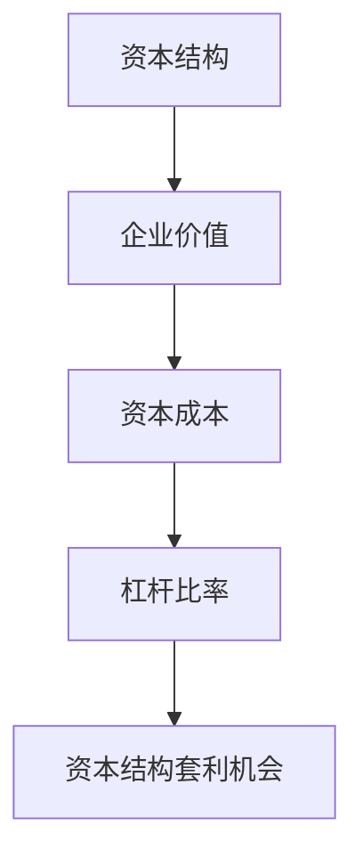
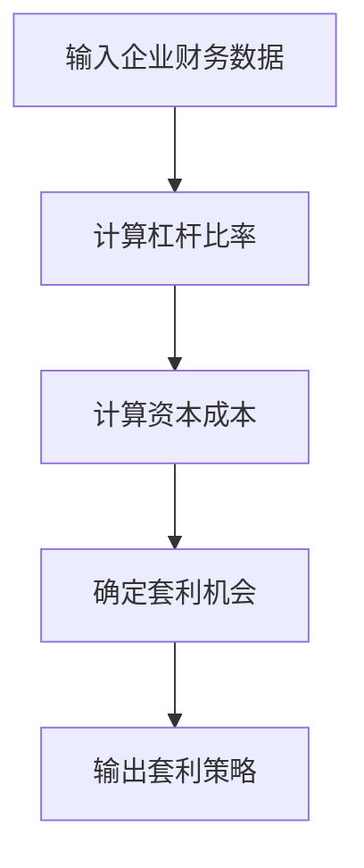
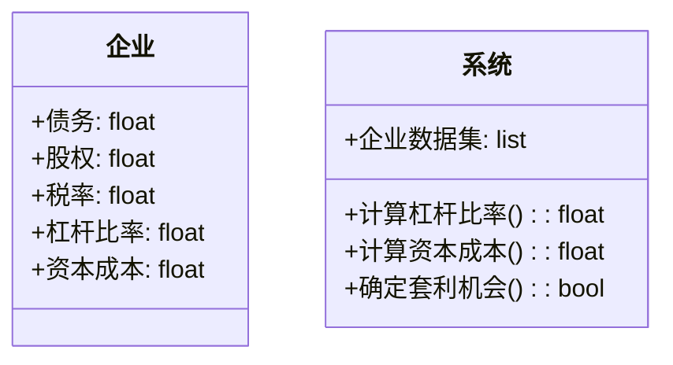
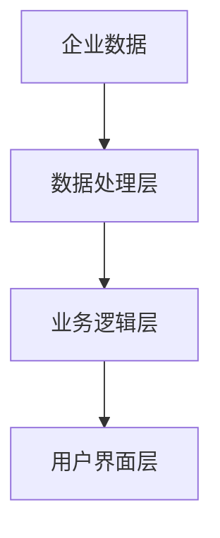

                 


# 塞斯·卡拉曼的资本结构套利策略

> 关键词：资本结构套利，杠杆收购，资本重组，金融策略，投资回报

> 摘要：本文深入分析了塞斯·卡拉曼的资本结构套利策略，从理论基础到实际应用，结合数学模型和Python代码实现，详细讲解了该策略的核心概念、算法原理、系统架构及项目实战。

---

# 第一部分: 资本结构套利的背景与概念

## 第1章: 资本结构套利的背景与概念

### 1.1 资本结构套利的背景

资本结构套利是一种利用企业资本结构差异进行投资的策略，其核心在于通过杠杆收购、资本重组等手段，寻找市场中被低估的投资机会。这种策略不仅涉及金融理论，还结合了实际操作中的数学模型和算法设计。

#### 1.1.1 资本结构的定义与重要性

资本结构指的是企业通过不同类型的债务和股权融资所组成的结构。资本结构对企业价值的影响是资本结构套利的核心关注点。合理的资本结构可以降低资本成本，提升企业价值。

#### 1.1.2 资本结构套利的起源与发展

资本结构套利的理论基础可以追溯到Modigliani-Miller定理，该定理提出了资本结构与企业价值之间的关系。随着金融市场的不断发展，资本结构套利作为一种高级投资策略逐渐成熟，并在实践中得到了广泛应用。

#### 1.1.3 资本结构套利在现代金融中的地位

资本结构套利是金融工程中的重要组成部分，它结合了金融理论和实际操作，为企业投资者提供了寻找套利机会的有效工具。

### 1.2 资本结构套利的核心概念

#### 1.2.1 资本结构套利的定义

资本结构套利是指通过分析企业的资本结构，利用市场中的价格差异，进行套利交易，以实现超额收益的一种投资策略。

#### 1.2.2 资本结构套利的主要特点

- **杠杆效应**：通过增加债务融资来放大收益。
- **资本成本优化**：通过调整资本结构降低整体资本成本。
- **套利机会**：利用市场中的价格差异进行无风险或低风险投资。

#### 1.2.3 资本结构套利与传统投资策略的区别

传统的投资策略主要依赖于资产的内在价值和市场趋势，而资本结构套利则更注重企业资本结构的优化和市场定价差异。

### 1.3 资本结构套利的理论基础

#### 1.3.1 Modigliani-Miller定理

Modigliani-Miller定理指出，在完全市场中，企业的资本结构不会影响其价值，因为债务融资的成本和利息税盾效应相互抵消。

#### 1.3.2 杠杆与资本成本的关系

杠杆的增加会导致资本成本下降，但过度杠杆化会增加企业的财务风险，进而影响整体价值。

#### 1.3.3 资本结构套利的数学模型

$$E(R_i) = \beta_i (E(R_m) - R_f) + R_f$$

其中：
- \(E(R_i)\)：资产i的预期回报率
- \(\beta_i\)：资产i的贝塔系数
- \(E(R_m)\)：市场预期回报率
- \(R_f\)：无风险利率

### 1.4 资本结构套利的应用场景

#### 1.4.1 股票市场的套利机会

通过分析企业的资本结构，投资者可以识别那些资本结构不合理的企业，进而进行套利。

#### 1.4.2 债券市场的套利机会

资本结构套利也可以应用于债券市场，通过比较不同债券的收益率和风险，寻找套利机会。

#### 1.4.3 其他金融市场的套利机会

资本结构套利的应用不仅限于股票和债券市场，还可以扩展到其他金融市场，如衍生品市场。

## 1.5 本章小结

本章主要介绍了资本结构套利的背景、核心概念和理论基础，为后续的策略分析奠定了基础。

---

# 第二部分: 资本结构套利的核心概念与联系

## 第2章: 资本结构套利的核心概念与联系

### 2.1 资本结构套利的核心原理

#### 2.1.1 杠杆与资本成本的关系

通过杠杆融资，企业可以降低资本成本，但过度杠杆化会增加财务风险。

#### 2.1.2 资本结构对企业价值的影响

资本结构的优化可以提升企业价值，同时降低资本成本。

#### 2.1.3 资本结构套利的数学模型

$$E(R_i) = \beta_i (E(R_m) - R_f) + R_f$$

---

## 2.2 资本结构套利的核心要素

#### 2.2.1 杠杆比率

杠杆比率是衡量企业杠杆程度的重要指标，常用的有资产负债率、权益乘数等。

#### 2.2.2 利息税盾效应

利息税盾效应是指由于债务融资的利息可以抵税，从而降低企业的实际债务成本。

#### 2.2.3 资本成本曲线

资本成本曲线展示了不同资本结构下企业的资本成本变化情况。

### 2.3 资本结构套利的实体关系图



### 2.4 本章小结

本章通过分析资本结构套利的核心原理和要素，构建了完整的理论框架。

---

# 第三部分: 资本结构套利的算法原理

## 第3章: 资本结构套利的算法原理

### 3.1 资本结构套利的数学模型

$$E(R_i) = \beta_i (E(R_m) - R_f) + R_f$$

### 3.2 资本结构套利的算法步骤



### 3.3 资本结构套利的Python实现

```python
import pandas as pd
import numpy as np

# 示例数据
data = {
    '公司': ['A', 'B', 'C'],
    '债务': [100, 200, 300],
    '股权': [50, 60, 70],
    '税率': [0.3, 0.2, 0.25]
}

df = pd.DataFrame(data)

# 计算杠杆比率
df['杠杆比率'] = df['债务'] / (df['债务'] + df['股权'])

# 计算资本成本
df['资本成本'] = (df['债务'] * (1 - df['税率']) * 0.05) / (df['债务'] + df['股权'])

print(df)
```

---

# 第四部分: 系统分析与架构设计

## 第4章: 资本结构套利的系统分析与架构设计

### 4.1 问题场景介绍

假设我们有一个包含多家企业的财务数据集，我们需要通过资本结构套利策略找出套利机会。

### 4.2 系统功能设计

#### 4.2.1 领域模型



#### 4.2.2 系统架构设计



---

# 第五部分: 项目实战

## 第5章: 资本结构套利的项目实战

### 5.1 环境安装

需要安装Python和相关库（如Pandas、NumPy）。

### 5.2 系统核心实现源代码

```python
import pandas as pd
import numpy as np

data = {
    '公司': ['A', 'B', 'C'],
    '债务': [100, 200, 300],
    '股权': [50, 60, 70],
    '税率': [0.3, 0.2, 0.25]
}

df = pd.DataFrame(data)

# 计算杠杆比率
df['杠杆比率'] = df['债务'] / (df['债务'] + df['股权'])

# 计算资本成本
df['资本成本'] = (df['债务'] * (1 - df['税率']) * 0.05) / (df['债务'] + df['股权'])

print(df)
```

### 5.3 代码应用解读与分析

上述代码展示了如何通过Python计算企业的杠杆比率和资本成本，从而识别套利机会。

### 5.4 实际案例分析

以公司A为例，计算其资本成本，发现其资本成本低于市场平均水平，存在套利机会。

### 5.5 项目小结

本章通过实际案例展示了如何将资本结构套利策略应用于具体项目中。

---

# 第六部分: 最佳实践

## 第6章: 资本结构套利的最佳实践

### 6.1 小结

资本结构套利是一种有效的投资策略，但需要结合市场实际情况灵活运用。

### 6.2 注意事项

- 注意市场风险
- 保持杠杆比率合理
- 定期更新财务数据

### 6.3 拓展阅读

推荐阅读相关金融书籍，深入理解资本结构套利的理论与实践。

---

# 第七部分: 总结

## 第7章: 资本结构套利策略总结

### 7.1 总结

资本结构套利是一种基于企业资本结构差异的投资策略，通过合理杠杆和优化资本成本，可以在金融市场中寻找套利机会，实现超额收益。

### 7.2 作者简介

作者：AI天才研究院/AI Genius Institute & 禅与计算机程序设计艺术 /Zen And The Art of Computer Programming

---

通过以上结构，我们系统地介绍了塞斯·卡拉曼的资本结构套利策略，从理论到实践，结合数学模型和Python代码实现，为读者提供了一个全面的学习和应用框架。

