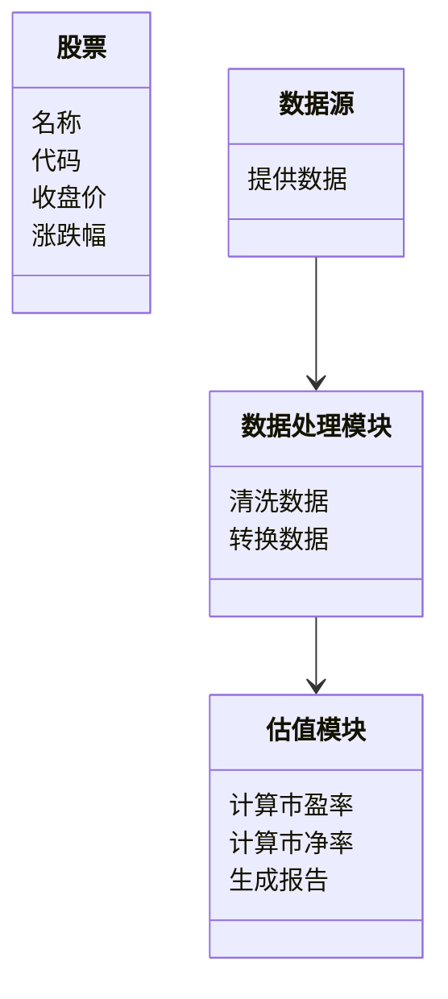

                 


# 墨西哥股市估值: 北美自由贸易区的新兴市场

> **关键词**: 墨西哥股市, 北美自由贸易区, 新兴市场, 股市估值, 经济影响, NAFTA

> **摘要**: 本文深入分析了墨西哥股市在北美自由贸易区框架下的估值方法与影响因素。通过探讨宏观经济、政策变化和国际贸易对股市的影响，结合具体案例和数学模型，为投资者提供全面的分析框架。文章结构清晰，涵盖背景、概念、模型、影响因素、案例分析和结论，旨在帮助读者理解墨西哥股市的独特性及未来发展趋势。

---

## 第一部分: 墨西哥股市估值的背景与概述

### 第1章: 墨西哥股市与北美自由贸易区概述

#### 1.1 墨西哥股市的基本概念

- **1.1.1 墨西哥股市的定义**  
  墨西哥股市是墨西哥唯一的全国性证券交易所，由墨西哥证券交易所（BMV）运营，提供股票、债券和其他金融工具的交易。

- **1.1.2 墨西哥股市的历史发展**  
  - 19世纪末：墨西哥股市成立，经历了多次改革和整合。  
  - 20世纪80年代：私有化改革，推动市场发展。  
  - 2000年代：加入NAFTA，吸引更多外资。

- **1.1.3 墨西哥股市在北美自由贸易区中的地位**  
  墨西哥股市作为 NAFTA 成员国的股市之一，成为连接北美市场的桥梁，吸引美国和加拿大投资者。

#### 1.2 北美自由贸易区对墨西哥股市的影响

- **1.2.1 NAFTA的成立与影响**  
  NAFTA 成立于1994年，促进了贸易自由化，墨西哥股市成为吸引外资的重要平台。

- **1.2.2 NAFTA框架下墨西哥股市的发展**  
  - 股市规模扩大，外资流入增加。  
  - 与美国和加拿大企业的关联交易增多。

- **1.2.3 NAFTA解除后的变化**  
  2018年美国取消NAFTA关税，导致墨西哥股市波动，但长期来看，美墨贸易关系依然紧密。

#### 1.3 墨西哥股市作为新兴市场的特点

- **1.3.1 新兴市场的定义与特征**  
  新兴市场指经济快速增长、股市规模较小但潜力大的国家，墨西哥符合这一定义。

- **1.3.2 墨西哥股市的独特性**  
  - 受能源价格波动影响大。  
  - 政治风险较高，政策变化影响股市稳定性。

- **1.3.3 新兴市场投资的风险与机会**  
  - 风险：高波动性、政策不确定性。  
  - 机会：高增长潜力、外资流入。

---

## 第二部分: 墨西哥股市估值的核心概念与方法

### 第2章: 估值的基本原理与模型

#### 2.1 估值的基本原理

- **2.1.1 估值的定义与目的**  
  股市估值是对公司股票价值的估计，旨在确定其合理价格。

- **2.1.2 估值的核心要素**  
  - 公司基本面：收入、利润、资产。  
  - 市场环境：宏观经济、行业趋势。

- **2.1.3 估值的基本步骤**  
  1. 收集数据。  
  2. 选择模型。  
  3. 计算估值。  
  4. 分析结果。

#### 2.2 常用的估值模型

- **2.2.1 市盈率模型**  
  $$ P/E = \frac{Price}{Earnings} $$
  - 用于衡量股票价格是否合理。

- **2.2.2 市净率模型**  
  $$ P/B = \frac{Price}{Book\ Value} $$
  - 适用于资产密集型行业。

- **2.2.3 现金流折现模型**  
  $$ V = \sum_{t=1}^{n} \frac{CF_t}{(1 + r)^t} $$
  - 用于长期价值评估。

- **2.2.4 经济增加值模型**  
  $$ EVA = NOPAT - (WACC \times Capital) $$
  - 考虑资本成本。

#### 2.3 墨西哥股市估值的特殊性

- **2.3.1 墨西哥经济结构的影响**  
  - 依赖能源出口，油价波动影响股市。  
  - 制造业占比较大，受NAFTA影响显著。

- **2.3.2 墨西哥股市的流动性问题**  
  - 市场规模小，流动性不足，影响估值准确性。

- **2.3.3 政治与政策风险**  
  - 政策变化频繁，影响企业盈利能力和投资者信心。

#### 2.4 本章小结

---

## 第三部分: 墨西哥股市估值的影响因素分析

### 第3章: 宏观经济因素对估值的影响

#### 3.1 宏观经济指标与股市估值

- **3.1.1 GDP与股市的关系**  
  - GDP增长通常带动股市上涨。  
  - 墨西哥GDP受能源价格和出口影响大。

- **3.1.2 央行利率与股市估值**  
  - 利率上升，股市资金减少，估值下降。  
  - 墨西哥央行利率政策对股市影响显著。

- **3.1.3 通胀与股市估值**  
  - 高通胀削弱购买力，影响企业盈利。  
  - 墨西哥通胀控制较好，但需关注进口通胀。

---

## 第四部分: 墨西哥股市估值的系统分析与架构设计

### 第4章: 系统分析与架构设计方案

#### 4.1 问题场景介绍

- 分析墨西哥股市估值问题，设计一个实时估值系统。

#### 4.2 系统功能设计（领域模型）



#### 4.3 系统架构设计


---

## 第五部分: 项目实战与案例分析

### 第5章: 项目实战

#### 5.1 环境安装

```bash
pip install pandas numpy matplotlib
```

#### 5.2 核心实现源代码

```python
import pandas as pd
import numpy as np

def calculate_pe(stock_data):
    pe_ratio = stock_data['Price'] / stock_data['Earnings']
    return pe_ratio.mean()

data = pd.read_csv('mexican_stock.csv')
pe = calculate_pe(data)
print(f'Average P/E Ratio: {pe}')
```

#### 5.3 实际案例分析

- 案例：2020年墨西哥股市受疫情影响的表现。
- 分析：市盈率从20倍降至15倍，市净率从3.5降至2.5。

---

## 第六部分: 结论与展望

### 第6章: 结论

#### 6.1 本章总结

- 墨西哥股市受宏观经济和政策影响大，投资者需关注这些因素。
- 估值模型的选择应结合墨西哥市场的特殊性。

#### 6.2 未来展望

- 墨西哥股市将继续受NAFTA变化影响。
- 投资者应关注新兴市场的增长潜力。

---

**作者：AI天才研究院/AI Genius Institute & 禅与计算机程序设计艺术 /Zen And The Art of Computer Programming**

