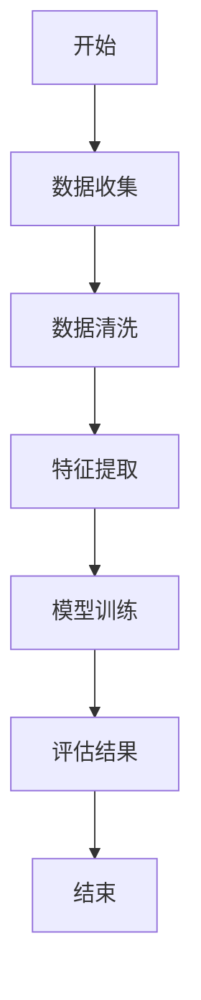
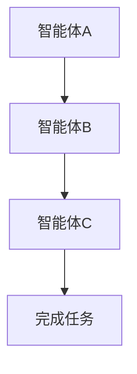
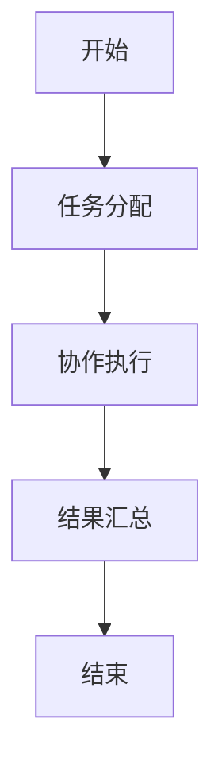
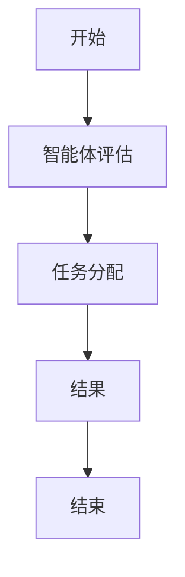
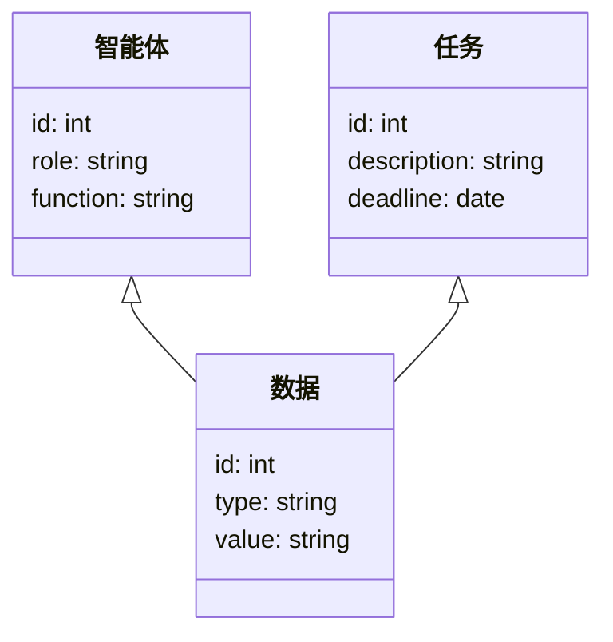
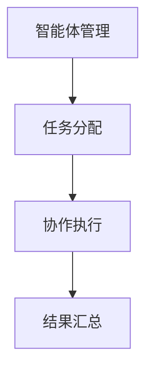

                 


# 多智能体AI如何优化未来增长潜力评估

## 关键词：多智能体AI，增长潜力评估，协作机制，任务分配，系统架构设计，项目实战

## 摘要：  
本文探讨了多智能体AI如何优化未来增长潜力评估。通过分析多智能体AI的核心概念、算法原理、系统架构设计及项目实战，本文展示了如何利用多智能体AI的协作机制和任务分配算法，提升增长潜力评估的准确性和效率。结合实际案例，本文深入剖析了多智能体AI在增长潜力评估中的应用场景，并提供了从理论到实践的详细指导。

---

## 第一部分：多智能体AI与增长潜力评估的背景

### 第1章：多智能体AI与增长潜力评估概述

#### 1.1 多智能体AI的基本概念

多智能体AI是指多个智能体协同工作的系统，每个智能体都有特定的目标和功能，通过协作完成复杂任务。与传统单智能体AI不同，多智能体AI强调分布式计算和协作，能够处理更复杂的场景。

**表1-1：多智能体AI与单智能体AI的对比**

| 属性         | 单智能体AI       | 多智能体AI       |
|--------------|-----------------|-----------------|
| 系统结构     | 单一中心化      | 分布式          |
| 协作方式     | 无或简单        | 复杂协作         |
| 任务处理     | 简单任务        | 复杂任务         |

#### 1.2 增长潜力评估的重要性

增长潜力评估是企业战略决策的关键环节，传统方法依赖人工分析，存在效率低、误差大的问题。多智能体AI通过数据挖掘和协作计算，显著提高了评估的准确性和效率。

**图1-1：增长潜力评估的流程**



#### 1.3 多智能体AI与增长潜力评估的结合

多智能体AI通过协作机制优化增长潜力评估，例如任务分配算法和协作算法。这些算法帮助智能体高效协同，提升评估结果的准确性。

---

## 第二部分：多智能体AI的核心概念与原理

### 第2章：多智能体系统的核心原理

#### 2.1 多智能体系统的组成与关系

多智能体系统由多个智能体组成，每个智能体都有特定的功能。通过协作和任务分配，智能体能够共同完成复杂任务。

**图2-1：多智能体系统的ER图**

```mermaid
erd
    entity 智能体 {
        id: int
        role: string
        function: string
    }
    
    entity 任务 {
        id: int
        description: string
        deadline: date
    }
    
    智能体 -[分配任务]-> 任务
```

#### 2.2 多智能体AI的协作机制

协作机制是多智能体AI的核心，通过智能体之间的协作完成任务。常见的协作机制包括协商、协调和协作。

**图2-2：协作机制的流程图**



---

## 第三部分：多智能体AI的算法原理

### 第3章：多智能体AI的算法与实现

#### 3.1 多智能体协作算法

协作算法是多智能体AI的关键算法，用于智能体之间的协作。以下是协作算法的流程图和Python实现。

**图3-1：协作算法的流程图**



**代码3-1：协作算法的Python实现**

```python
def collaborative_algorithm(agents, tasks):
    # 任务分配
    assigned_tasks = assign_tasks(agents, tasks)
    # 协作执行
    results = execute_tasks(assigned_tasks)
    return results
```

#### 3.2 多智能体任务分配算法

任务分配算法是多智能体AI的重要算法，用于将任务分配给合适的智能体。以下是任务分配算法的流程图和Python实现。

**图3-2：任务分配算法的流程图**



**代码3-2：任务分配算法的Python实现**

```python
def assign_tasks(agents, tasks):
    # 评估每个智能体的能力
    agent_capabilities = evaluate_capabilities(agents)
    # 分配任务
    assigned_tasks = match_tasks_to_agents(agent_capabilities, tasks)
    return assigned_tasks
```

---

## 第四部分：系统分析与架构设计

### 第4章：多智能体AI评估系统的架构设计

#### 4.1 系统功能设计

系统功能设计包括数据收集、数据清洗、特征提取和模型训练。以下是系统功能设计的类图。

**图4-1：系统功能设计的类图**



#### 4.2 系统架构设计

系统架构设计包括系统架构图和交互流程图。以下是系统架构设计的图表。

**图4-2：系统架构图**



**图4-3：系统交互流程图**


---

## 第五部分：项目实战与应用

### 第5章：多智能体AI项目实战

#### 5.1 项目环境搭建

项目环境搭建包括安装必要的依赖和配置开发工具。以下是环境搭建步骤。

**代码5-1：安装依赖**

```bash
pip install numpy pandas scikit-learn
```

#### 5.2 项目核心代码实现

以下是协作算法和任务分配算法的代码实现。

**代码5-2：协作算法的Python实现**

```python
def collaborative_algorithm(agents, tasks):
    assigned_tasks = assign_tasks(agents, tasks)
    results = execute_tasks(assigned_tasks)
    return results
```

**代码5-3：任务分配算法的Python实现**

```python
def assign_tasks(agents, tasks):
    agent_capabilities = evaluate_capabilities(agents)
    assigned_tasks = match_tasks_to_agents(agent_capabilities, tasks)
    return assigned_tasks
```

---

## 结语

通过本文的详细讲解，读者可以系统地了解多智能体AI如何优化未来增长潜力评估。从背景介绍到算法实现，再到项目实战，本文为读者提供了全面的知识和实践指导。

## 作者

作者：AI天才研究院/AI Genius Institute & 禅与计算机程序设计艺术 /Zen And The Art of Computer Programming

