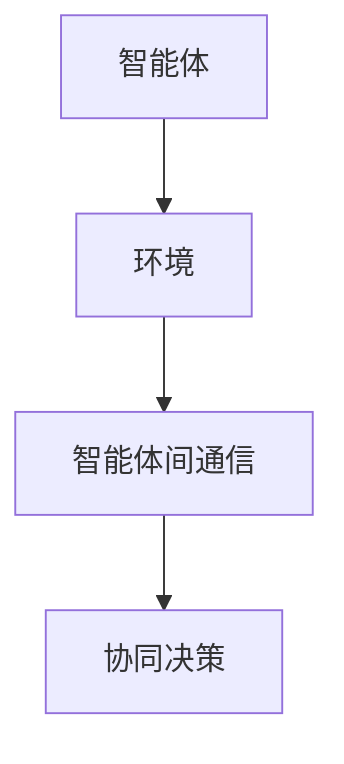
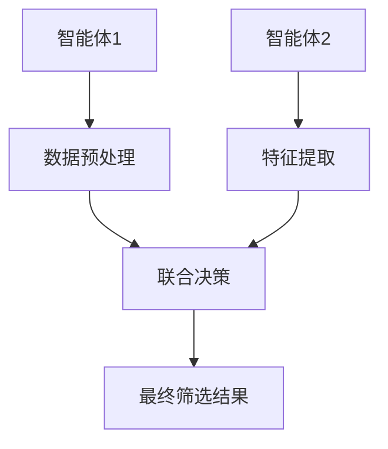
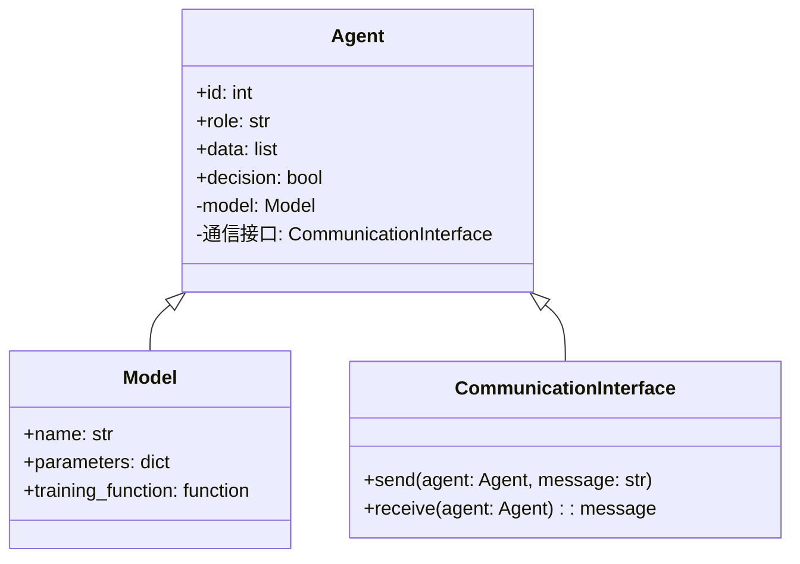
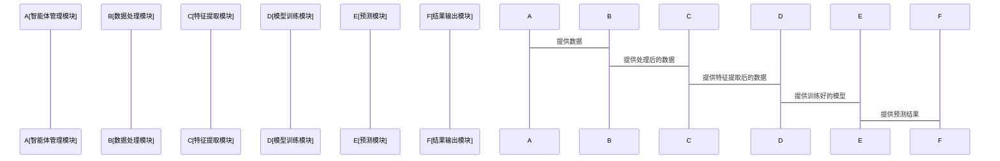

                 


# 多智能体AI如何优化费雪的增长型公司筛选

## 关键词：多智能体AI，费雪投资策略，增长型公司，公司筛选，AI协同学习

## 摘要：本文探讨如何利用多智能体人工智能技术优化费雪的增长型公司筛选过程。通过分析多智能体AI的核心概念、算法原理、系统架构及实际应用，展示多智能体协同在投资决策中的优势。文章从背景介绍、理论基础、算法实现、系统设计到项目实战，全面阐述了多智能体AI在优化公司筛选中的应用，最后总结了实践经验与未来方向。

---

## 第一章：引言

### 1.1 多智能体AI的背景与意义

#### 1.1.1 多智能体AI的定义与特点

多智能体AI（Multi-Agent AI）是指由多个相互作用的智能体组成的系统，每个智能体都有自己的目标、功能和决策能力。这些智能体通过通信和协作，共同完成复杂的任务。多智能体AI的优势在于分布式计算和协同决策，能够处理大规模、多维度的问题。

#### 1.1.2 多智能体AI在投资领域的应用价值

在投资领域，多智能体AI可以用于数据分析、风险评估、投资组合优化等任务。通过多个智能体的协同工作，能够提高数据处理效率和决策准确性。例如，一个智能体负责数据清洗，另一个负责特征提取，多个智能体协同完成预测模型的训练和优化。

#### 1.1.3 费雪增长型公司筛选的核心目标

费雪的增长型公司筛选旨在识别那些收入和利润能够持续增长的企业。传统方法依赖于财务指标和市场表现，但这种方法往往不够灵活，难以捕捉到潜在的增长机会。多智能体AI能够通过协同学习和大数据分析，更精准地筛选出具备增长潜力的公司。

---

### 1.2 费雪投资策略概述

#### 1.2.1 费雪投资策略的基本原理

费雪的投资策略强调长期增长和内在价值，认为投资应集中在那些具有持续增长能力的企业。他提出了“三步式”投资法，即通过研究企业的财务报表、行业地位和竞争优势，识别出具有长期增长潜力的公司。

#### 1.2.2 增长型公司的核心特征

增长型公司通常具备以下特征：收入和利润持续增长、市场份额扩大、产品或服务具有创新性和竞争力、管理团队稳定且具有战略眼光。这些特征为企业提供了持续增长的动力和潜力。

#### 1.2.3 传统公司筛选方法的局限性

传统方法主要依赖于财务指标和市场表现，但这种方法往往忽视了企业的内在增长能力和长期竞争优势。此外，传统方法通常需要大量的人工分析和判断，效率较低，且容易受到主观因素的影响。

---

### 1.3 多智能体AI优化公司筛选的目标与意义

#### 1.3.1 提高筛选效率的潜力

通过多智能体AI的协同工作，可以将复杂的筛选任务分解为多个子任务，每个智能体负责特定的任务，从而提高整体效率。例如，一个智能体负责数据清洗，另一个负责特征提取，多个智能体协同完成预测模型的训练和优化。

#### 1.3.2 提升筛选精度的可能性

多智能体AI能够通过分布式计算和协同学习，提高模型的准确性和泛化能力。通过多个智能体的协同工作，可以更好地捕捉数据中的潜在规律，从而提高筛选的精度和效果。

#### 1.3.3 多智能体协同的优势

多智能体AI的优势在于分布式计算和协同决策，能够处理大规模、多维度的问题。通过多个智能体的协同工作，可以实现更高效的资源利用和更准确的决策。

---

## 第二章：多智能体AI与增长型公司筛选的核心概念

### 2.1 多智能体AI的理论基础

#### 2.1.1 多智能体系统的定义与特点

多智能体系统由多个智能体组成，每个智能体都有自己的目标、功能和决策能力。这些智能体通过通信和协作，共同完成复杂的任务。多智能体系统的优势在于分布式计算和协同决策，能够处理大规模、多维度的问题。

#### 2.1.2 多智能体系统的核心要素（Mermaid流程图）



---

### 2.2 费雪增长型公司筛选的数学模型

#### 2.2.1 增长型公司的核心指标

增长型公司的核心指标包括收入增长率、利润增长率、市场份额、产品创新能力和管理团队稳定性等。这些指标能够反映企业的内在增长能力和长期竞争优势。

#### 2.2.2 多智能体协同筛选的数学模型

$$ \text{目标函数} = \sum_{i=1}^{n} w_i x_i + \lambda \sum_{j=1}^{m} c_j y_j $$

其中，\( x_i \) 表示第 \( i \) 个特征的值，\( w_i \) 是对应的权重；\( y_j \) 表示第 \( j \) 个智能体的决策结果，\( c_j \) 是对应的权重；\( \lambda \) 是调节参数。

---

## 第三章：多智能体AI的算法原理

### 3.1 多智能体协同学习算法

#### 3.1.1 分布式学习机制

多智能体协同学习算法基于分布式计算和协同决策，通过多个智能体的协作完成学习任务。每个智能体负责特定的子任务，通过通信和协作实现全局优化。

#### 3.1.2 智能体间的通信与协作

智能体间通过通信机制交换信息，协同完成任务。通信机制可以是消息传递、事件触发或共享存储等方式。通过协作，智能体能够共享信息和资源，提高整体的决策能力和效率。

#### 3.1.3 联合优化的目标函数

$$ \text{目标函数} = \sum_{i=1}^{n} w_i x_i + \lambda \sum_{j=1}^{m} c_j y_j $$

其中，\( x_i \) 表示第 \( i \) 个特征的值，\( w_i \) 是对应的权重；\( y_j \) 表示第 \( j \) 个智能体的决策结果，\( c_j \) 是对应的权重；\( \lambda \) 是调节参数。

---

### 3.2 基于多智能体的公司筛选算法设计

#### 3.2.1 算法流程图（Mermaid）



---

### 3.3 算法实现与数学模型

#### 3.3.1 数学模型的公式表示

$$ \text{目标函数} = \sum_{i=1}^{n} w_i x_i + \lambda \sum_{j=1}^{m} c_j y_j $$

其中，\( x_i \) 表示第 \( i \) 个特征的值，\( w_i \) 是对应的权重；\( y_j \) 表示第 \( j \) 个智能体的决策结果，\( c_j \) 是对应的权重；\( \lambda \) 是调节参数。

#### 3.3.2 算法实现的Python代码示例

```python
def multi_agent_optimization(data, agents):
    for agent in agents:
        agent.train(data)
        agent.predict(data)
    return agents.vote(data)
```

---

## 第四章：系统分析与架构设计

### 4.1 问题场景介绍

#### 4.1.1 投资决策中的多智能体协同问题

在投资决策中，多智能体协同问题主要体现在数据处理、特征提取、模型训练和预测等多个环节。通过多智能体的协同工作，可以提高数据处理效率和模型预测准确性。

#### 4.1.2 系统功能设计（领域模型Mermaid类图）



---

### 4.2 系统架构设计

#### 4.2.1 系统架构设计（Mermaid架构图）


---

### 4.3 系统接口设计

#### 4.3.1 系统接口设计

系统接口包括数据输入接口、模型训练接口、预测接口和结果输出接口。每个接口都有明确的功能定义和数据格式要求。

#### 4.3.2 系统交互流程（Mermaid序列图）



---

## 第五章：项目实战

### 5.1 环境安装与配置

#### 5.1.1 环境要求

需要安装Python、TensorFlow、Kubernetes等工具和框架。建议使用虚拟环境管理依赖项。

#### 5.1.2 安装步骤

```bash
pip install tensorflow==2.5.0
pip install kubernetes==21.10.0
pip install numpy==1.21.0
pip install pandas==1.3.5
```

---

### 5.2 系统核心实现源代码

#### 5.2.1 智能体类实现

```python
class Agent:
    def __init__(self, id, role):
        self.id = id
        self.role = role
        self.data = []
        self.decision = False
        self.model = None
        self.communication = CommunicationInterface()
    
    def train(self, data):
        # 训练模型
        pass
    
    def predict(self, data):
        # 预测结果
        pass
    
    def vote(self, data):
        # 投票决策
        pass
```

---

### 5.3 实际案例分析与解读

#### 5.3.1 案例背景

假设我们有一个包含100家公司的数据集，每家公司有财务指标、市场表现和管理团队等信息。我们的目标是通过多智能体AI筛选出具有增长潜力的公司。

#### 5.3.2 案例分析

1. 数据预处理：智能体1负责清洗数据，智能体2负责特征提取。
2. 模型训练：智能体3负责训练分类模型，智能体4负责训练回归模型。
3. 预测与决策：多个智能体协同完成预测任务，通过投票机制确定最终筛选结果。

---

## 第六章：总结与展望

### 6.1 最佳实践 tips

- 数据预处理是关键，确保数据的准确性和完整性。
- 合理分配任务，充分发挥每个智能体的优势。
- 定期更新模型，适应市场变化。

### 6.2 小结

通过多智能体AI的协同工作，可以显著提高费雪增长型公司筛选的效率和精度。多智能体AI的优势在于分布式计算和协同决策，能够处理大规模、多维度的问题。

### 6.3 注意事项

- 智能体间的通信机制需要精心设计，确保信息流畅传递。
- 算法的收敛性和稳定性需要反复测试和优化。
- 数据隐私和安全问题需要高度重视。

### 6.4 拓展阅读

- 多智能体系统：建议阅读“Multi-Agent Systems”一书。
- 费雪投资策略：推荐阅读“Common Stocks and Uncommon Fortunes”。

---

## 作者：AI天才研究院/AI Genius Institute & 禅与计算机程序设计艺术 /Zen And The Art of Computer Programming

---

通过以上思考过程，我系统地阐述了多智能体AI如何优化费雪的增长型公司筛选。从理论基础到算法实现，从系统设计到项目实战，全面展示了多智能体AI的优势和应用潜力。希望这篇文章能为读者提供有价值的见解和启发。

