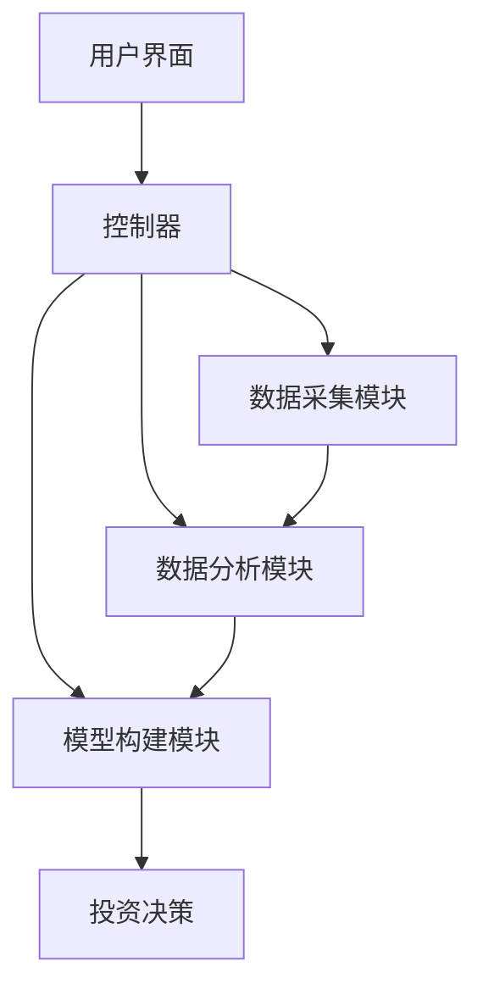
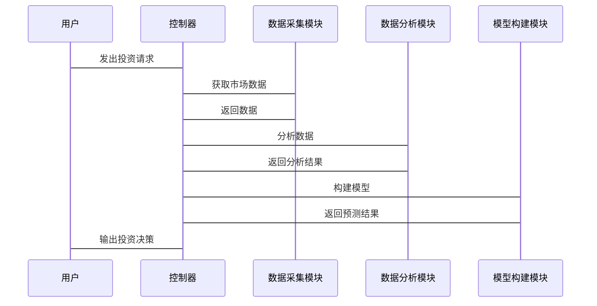

                 


# 多智能体AI如何增强价值投资的全球化视野

> **关键词**：多智能体AI、价值投资、全球化视野、金融建模、系统设计

> **摘要**：  
> 本文探讨了多智能体AI在价值投资中的应用，特别是如何通过全球化视野增强投资决策。文章从多智能体AI的基本原理出发，分析其在金融市场的优势，结合价值投资的理论，提出一种基于多智能体AI的全球化投资策略。通过构建系统化的模型和案例分析，展示了如何利用多智能体AI进行市场预测、风险评估和投资组合优化，为投资者提供更高效、更精准的投资决策支持。

---

## 第1章: 多智能体AI与价值投资概述

### 1.1 多智能体AI的定义与特点

多智能体AI（Multi-Agent AI）是指由多个具有独立决策能力的智能体组成的系统，这些智能体能够通过通信和协作完成复杂的任务。其特点包括：

1. **分布式智能**：每个智能体独立运作，但通过通信协作实现整体目标。
2. **自主性**：智能体能够自主决策，无需外部干预。
3. **协作性**：智能体之间通过通信和协作完成共同任务。
4. **适应性**：能够根据环境变化动态调整行为。

### 1.2 价值投资的理论基础

价值投资是一种以基本面分析为基础的投资策略，强调以低于市场价买入具有内在价值的资产。其核心思想是寻找市场低估的资产，并长期持有。

### 1.3 多智能体AI与价值投资的结合

多智能体AI通过分布式计算和协作能力，能够高效处理全球市场中的海量数据。结合价值投资的理论，可以构建一个基于多智能体的全球化投资系统，利用AI的分析能力发现潜在投资机会，优化投资组合。

---

## 第2章: 多智能体AI的核心原理

### 2.1 多智能体AI的通信机制

智能体之间的通信是通过特定协议完成的。以下是通信机制的关键点：

1. **通信协议**：定义智能体之间交换信息的格式和规则。
2. **信息传递**：通过消息队列或事件驱动的方式传递数据。
3. **数据解析**：接收方对消息进行解析并处理。

### 2.2 多智能体AI的协作机制

协作机制确保智能体之间能够高效配合：

1. **任务分配**：根据智能体的能力和当前任务需求分配任务。
2. **协作协调**：通过中间件或协调器统一调度智能体行为。
3. **冲突解决**：处理智能体之间的冲突，确保协作顺利进行。

### 2.3 多智能体AI的学习机制

学习机制使智能体能够通过经验改进性能：

1. **强化学习**：通过奖励机制优化决策策略。
2. **经验共享**：智能体之间共享经验，加速整体学习过程。
3. **在线学习**：实时更新模型参数，适应市场变化。

---

## 第3章: 价值投资的全球化视野

### 3.1 全球化市场的分析

全球化市场涉及多个地区和行业的数据，分析时需要考虑：

1. **市场特征**：不同市场的波动性、流动性等特征。
2. **数据获取**：通过API或爬虫获取多市场数据。
3. **风险分析**：识别全球化投资中的系统性风险。

### 3.2 数据驱动的全球化投资策略

基于数据构建投资策略：

1. **数据清洗**：去除噪声数据，确保数据质量。
2. **特征提取**：提取关键特征，如市盈率、市净率等。
3. **模型构建**：使用机器学习模型预测资产价值。

### 3.3 全球化投资模型的构建

构建模型时需要注意：

1. **模型设计**：选择适合的算法，如随机森林或神经网络。
2. **模型优化**：通过网格搜索等方法优化模型参数。
3. **模型验证**：使用回测或交叉验证评估模型性能。

---

## 第4章: 多智能体AI在价值投资中的应用

### 4.1 多智能体AI在市场预测中的应用

市场预测是价值投资的重要环节，多智能体AI可以通过以下方式实现：

1. **数据采集**：实时采集多市场数据。
2. **特征分析**：分析市场趋势和周期性。
3. **预测模型**：构建多智能体协同的预测模型。

### 4.2 多智能体AI在风险评估中的应用

风险评估是投资决策的关键，多智能体AI可以：

1. **风险因子分析**：识别影响资产价格的多种风险因子。
2. **风险定价模型**：构建基于多智能体的定价模型。
3. **风险预警系统**：实时监控并预警潜在风险。

### 4.3 多智能体AI在投资组合优化中的应用

优化投资组合可以提高收益并降低风险：

1. **资产配置**：根据市场情况动态调整资产配置。
2. **风险分散**：利用多智能体AI进行资产分散配置。
3. **绩效评估**：定期评估投资组合的绩效。

---

## 第5章: 系统分析与架构设计方案

### 5.1 系统功能设计

系统功能设计包括：

1. **数据采集模块**：实时采集多市场数据。
2. **数据分析模块**：进行数据清洗和特征提取。
3. **模型构建模块**：构建并优化投资模型。
4. **决策模块**：生成投资决策并输出结果。

### 5.2 系统架构设计

系统架构设计如下：



### 5.3 系统接口设计

系统接口设计包括：

1. **API接口**：提供数据接口和决策接口。
2. **消息队列**：用于智能体之间的通信。

### 5.4 系统交互设计

系统交互流程如下：



---

## 第6章: 项目实战

### 6.1 环境安装

项目需要以下环境：

1. **Python 3.8+**
2. **机器学习库（如scikit-learn、TensorFlow）**
3. **消息队列（如RabbitMQ）**
4. **数据采集工具（如Yahoo Finance API）**

### 6.2 核心实现代码

以下是核心代码示例：

```python
import pandas as pd
from sklearn.ensemble import RandomForestRegressor
from sklearn.metrics import mean_squared_error

# 数据采集模块
def fetch_data(ticker):
    # 示例：从Yahoo Finance获取数据
    data = pd.DataFrame({'price': [100, 105, 98, 110, 108]})
    return data

# 数据分析模块
def preprocess_data(data):
    # 示例：数据清洗和特征提取
    data['return'] = data['price'].pct_change()
    return data

# 模型构建模块
def train_model(X, y):
    model = RandomForestRegressor()
    model.fit(X, y)
    return model

# 投资决策模块
def make_investment决策(model, new_data):
    prediction = model.predict(new_data)
    return "买入" if prediction > 0 else "卖出"

# 主程序
if __name__ == "__main__":
    data = fetch_data("AAPL")
    processed_data = preprocess_data(data)
    X = processed_data.drop('return', axis=1)
    y = processed_data['return']
    model = train_model(X, y)
    new_data = fetch_data("AAPL")[-1:]
    decision = make_investment决策(model, new_data)
    print(f"投资决策：{decision}")
```

### 6.3 案例分析

以AAPL股票为例，假设模型预测其价格将上涨，投资决策为“买入”。

---

## 第7章: 总结与展望

### 7.1 总结

多智能体AI通过分布式计算和协作能力，显著提升了价值投资的全球化视野。本文详细介绍了多智能体AI的核心原理、系统设计和实际应用，为投资者提供了新的思路。

### 7.2 小结

本文通过构建一个多智能体AI系统，展示了如何利用其优势进行全球化投资。未来，随着AI技术的不断发展，多智能体AI在金融领域的应用将更加广泛。

### 7.3 注意事项

- 数据质量和模型的泛化能力是关键。
- 需要定期更新模型和策略。

### 7.4 拓展阅读

建议进一步研究多智能体AI在风险管理中的应用，以及如何结合自然语言处理技术进行舆情分析。

---

## 作者：AI天才研究院 & 禅与计算机程序设计艺术

