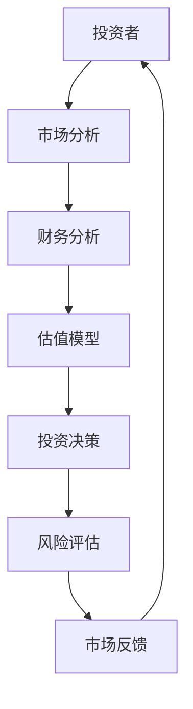
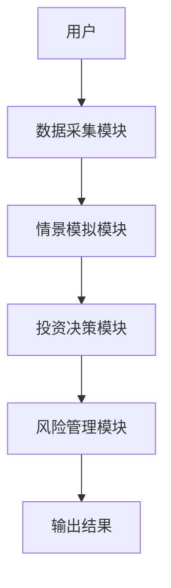
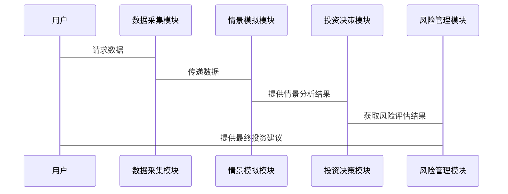

                 


# 多智能体AI如何增强价值投资的情景分析能力

## 关键词：多智能体AI，价值投资，情景分析，强化学习，分布式计算，风险管理

## 摘要：  
多智能体AI通过分布式计算和强化学习等技术，能够显著增强价值投资的情景分析能力。本文从多智能体AI的基本概念出发，详细探讨其在价值投资中的应用，包括算法原理、数学模型、系统架构设计、项目实战等。通过结合多智能体AI的优势，本文展示了如何在复杂金融环境中优化投资决策，提升风险管理能力，为投资者提供更精准的情景分析支持。

---

## 第一部分: 多智能体AI与价值投资的背景介绍

### 第1章: 多智能体AI与价值投资的背景

#### 1.1 多智能体AI的定义与特点
- **多智能体AI的定义**：多智能体AI是指由多个相互作用的智能体组成的系统，这些智能体通过协作完成复杂的任务。与单智能体AI相比，多智能体AI能够更好地模拟现实世界中的复杂关系。
- **多智能体AI的核心特点**：
  - 分布式计算能力
  - 高度协作性
  - 自适应性
- **多智能体AI与传统AI的区别**：多智能体AI强调协作与分布式决策，而传统AI通常依赖于单点计算。

#### 1.2 价值投资的基本概念
- **价值投资的定义**：价值投资是一种投资策略，旨在通过分析企业的内在价值，寻找被市场低估的投资机会。
- **价值投资的核心原则**：
  - 质量：企业具有良好的财务状况和竞争优势。
  - 价格：股票价格低于其内在价值。
  - 时间：长期持有，等待市场重新评估。
- **价值投资的实现方法**：基本面分析、估值模型、风险管理。

#### 1.3 多智能体AI在价值投资中的应用前景
- **多智能体AI在金融领域的应用**：股票预测、风险评估、交易策略优化。
- **多智能体AI在价值投资中的优势**：
  - 能够处理复杂多变的市场环境。
  - 可以模拟多种市场情景，帮助投资者做出更明智的决策。
- **多智能体AI在价值投资中的挑战**：数据依赖性强、模型复杂性高、计算资源需求大。

---

### 第2章: 多智能体AI与价值投资的核心概念

#### 2.1 多智能体AI的核心概念
- **多智能体系统的基本结构**：由多个智能体组成，每个智能体负责特定任务，通过通信和协作完成整体目标。
- **多智能体系统中的通信与协作**：通过消息传递、状态共享等方式实现协作。
- **多智能体系统中的决策机制**：基于局部信息做出决策，同时考虑全局目标。

#### 2.2 价值投资的核心概念
- **价值投资的分析框架**：包括财务分析、行业分析、公司治理等。
- **价值投资的决策过程**：从数据收集到分析、估值、投资决策。
- **价值投资的风险管理**：分散投资、止损策略、风险定价。

#### 2.3 多智能体AI与价值投资的结合点
- **多智能体AI在价值投资中的应用场景**：情景模拟、风险评估、投资组合优化。
- **多智能体AI与价值投资的核心联系**：通过分布式计算和协作优化，提升情景分析的效率和准确性。
- **多智能体AI在价值投资中的创新点**：引入实时市场反馈，动态调整投资策略。

---

## 第二部分: 多智能体AI的算法原理与数学模型

### 第3章: 多智能体AI的算法原理

#### 3.1 多智能体AI的主要算法
- **强化学习算法**：通过试错机制优化决策策略。
- **分布式计算算法**：利用并行计算提高处理效率。
- **联合学习算法**：多个智能体共同学习，共享知识。

#### 3.2 多智能体AI的通信与协作机制
- **通信协议的设计**：定义消息格式和传输规则。
- **协作策略的制定**：确定协作目标和分工。
- **决策机制的优化**：基于实时数据调整决策。

#### 3.3 多智能体AI的算法流程图


### 第4章: 多智能体AI的数学模型

#### 4.1 多智能体AI的数学基础
- **概率论与统计学基础**：用于数据建模和不确定性分析。
- **线性代数与矩阵运算**：用于特征提取和降维。
- **优化理论与算法**：用于模型训练和参数调整。

#### 4.2 多智能体AI的核心公式
- **收益计算公式**：
  $$ \text{收益} = \sum_{i=1}^{n} p_i \cdot r_i $$
  其中，\( p_i \) 是投资比例，\( r_i \) 是资产的收益率。
- **风险评估公式**：
  $$ \text{风险} = \sqrt{\sum_{i=1}^{n} p_i^2 \cdot \sigma_i^2} $$
  其中，\( \sigma_i \) 是资产的风险标准差。
- **联合决策公式**：
  $$ \text{决策} = \arg\max_{a} \sum_{i=1}^{m} w_i \cdot v_i(a) $$
  其中，\( w_i \) 是权重，\( v_i(a) \) 是决策 \( a \) 的价值。

#### 4.3 多智能体AI的数学模型实现
- **模型的构建与训练**：使用强化学习框架，如OpenAI Gym。
- **模型的优化与调整**：通过分布式计算优化训练过程。
- **模型的验证与测试**：通过回测验证模型的有效性。

---

## 第三部分: 价值投资的情景分析能力

### 第5章: 价值投资的情景分析方法

#### 5.1 情景分析的基本概念
- **情景分析的定义**：通过模拟不同市场环境，评估投资策略的可行性。
- **情景分析的核心步骤**：
  1. 确定分析目标。
  2. 收集历史数据。
  3. 构建情景模型。
  4. 评估情景结果。
- **情景分析的应用领域**：股票、债券、基金等。

#### 5.2 价值投资中的情景分析
- **价值投资的情景分析框架**：包括宏观经济、行业趋势、公司基本面等因素。
- **价值投资的情景分析方法**：基于多智能体AI的动态情景模拟。
- **价值投资的情景分析工具**：利用多智能体AI构建情景分析平台。

#### 5.3 多智能体AI增强的情景分析能力
- **情景模拟的动态性**：实时更新市场数据，提供动态情景分析。
- **情景评估的全面性**：多智能体协作，覆盖更多市场可能性。
- **情景优化的精准性**：通过强化学习优化投资策略。

---

## 第四部分: 项目实战与系统架构

### 第6章: 多智能体AI在价值投资中的系统架构设计

#### 6.1 问题场景介绍
- **复杂金融环境**：多变的市场、海量数据、多因素影响。
- **投资决策的复杂性**：需要综合考虑多种因素，制定最优策略。

#### 6.2 系统功能设计
- **数据采集模块**：实时采集市场数据。
- **情景模拟模块**：构建多种市场情景。
- **投资决策模块**：基于情景分析做出投资决策。
- **风险管理模块**：评估风险并制定应对策略。

#### 6.3 系统架构设计


#### 6.4 系统接口设计
- **数据接口**：与数据源对接，获取实时数据。
- **用户接口**：提供友好的操作界面，展示分析结果。
- **决策接口**：输出投资建议和风险预警。

#### 6.5 系统交互序列图


---

## 第五部分: 项目实战

### 第7章: 项目实战

#### 7.1 环境安装
- **工具安装**：安装Python、TensorFlow、Keras、OpenAI Gym等。
- **数据源配置**：配置股票数据接口，如Yahoo Finance。

#### 7.2 系统核心实现源代码
- **数据采集模块**：
  ```python
  import pandas_datareader as pdr

  def get_stock_data(ticker, start, end):
      data = pdr.get_data_yahoo(ticker, start=start, end=end)
      return data
  ```

- **情景模拟模块**：
  ```python
  import numpy as np

  def simulate_scenario(prices, scenarios):
      returns = np.random.lognormal(mean=scenarios['mean'], sigma=scenarios['std'], size=len(prices))
      simulated_prices = prices[-1] * np.cumprod(returns)
      return simulated_prices
  ```

- **投资决策模块**：
  ```python
  import tensorflow as tf
  from tensorflow.keras import layers

  model = tf.keras.Sequential([
      layers.Dense(64, activation='relu', input_shape=(input_dim,)),
      layers.Dense(1, activation='sigmoid')
  ])
  model.compile(optimizer='adam', loss='binary_crossentropy')
  ```

#### 7.3 案例分析与实际应用
- **案例分析**：以某股票为例，展示数据采集、情景模拟、投资决策的全过程。
- **实际应用**：分析市场波动、行业趋势，制定投资策略。

#### 7.4 项目总结
- **项目成果**：成功构建多智能体AI驱动的价值投资分析系统。
- **项目经验**：强调数据质量、模型优化和系统集成的重要性。
- **项目展望**：探索更复杂的情景模拟，引入更多市场因素。

---

## 第六部分: 最佳实践与拓展阅读

### 第8章: 最佳实践 tips
- **数据质量管理**：确保数据的准确性和及时性。
- **模型调优**：定期更新模型参数，适应市场变化。
- **系统维护**：监控系统运行状态，及时修复问题。

### 第9章: 小结
多智能体AI通过分布式计算和强化学习，显著提升了价值投资的情景分析能力。本文从理论到实践，详细探讨了多智能体AI在价值投资中的应用，为投资者提供了新的工具和方法。

### 第10章: 注意事项
- **数据隐私**：注意数据安全，避免信息泄露。
- **模型局限性**：认识到模型的局限性，避免过度依赖。
- **市场变化**：及时调整模型，适应市场变化。

### 第11章: 拓展阅读
- **推荐书籍**：
  - 《The Intelligent Investor》
  - 《Reinforcement Learning: Theory and Algorithms》
- **推荐论文**：多智能体系统的最新研究。
- **推荐工具**：多智能体AI框架，如OpenAI、TensorFlow。

---

## 作者：AI天才研究院/AI Genius Institute & 禅与计算机程序设计艺术 /Zen And The Art of Computer Programming

---

通过以上结构，本文系统地探讨了多智能体AI在价值投资中的应用，从理论基础到算法实现，再到实际案例，为读者提供了全面的视角和深入的分析。

