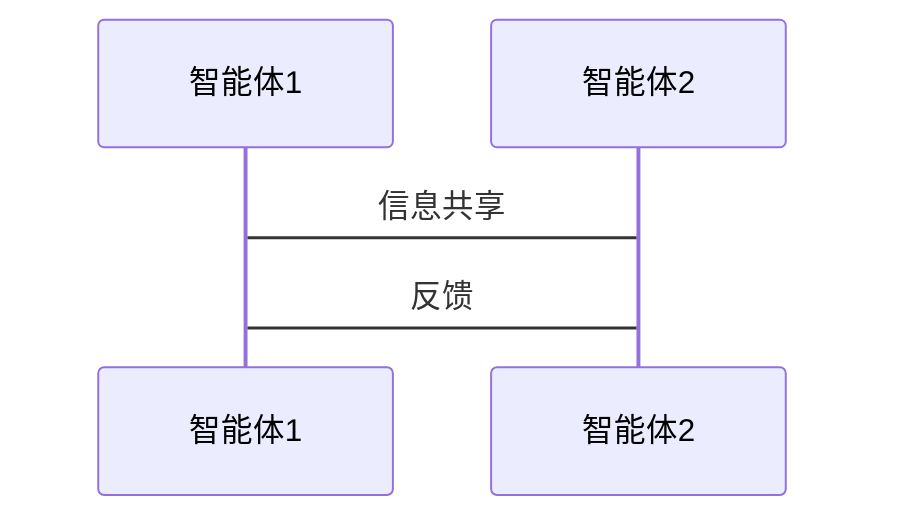

                 


# 多智能体AI如何增强价值投资的跨资产类别配置

## 关键词：多智能体AI，价值投资，跨资产配置，机器学习，投资组合优化，风险管理

## 摘要：本文探讨了多智能体AI在价值投资中的应用，特别是在跨资产类别配置中的优势。通过分析多智能体AI的核心算法、系统架构和实际案例，本文展示了如何利用多智能体协作机制优化投资组合，降低风险，提升投资收益。

---

# 第1章: 多智能体AI的背景与核心概念

## 1.1 多智能体AI的背景介绍

### 1.1.1 从单智能体到多智能体的演进
传统的单智能体AI（如单个预测模型）在金融投资中已经展现出强大的能力，但其局限性逐渐显现：单一视角难以覆盖复杂市场环境，缺乏灵活性和适应性。多智能体AI通过多个智能体的协作，能够更好地捕捉市场动态，优化投资决策。

### 1.1.2 多智能体AI的核心特点
- **分布式计算**：多个智能体协同工作，每个智能体专注于特定任务。
- **自主性与协作性**：智能体能够自主决策，同时通过通信机制进行协作。
- **动态适应性**：能够实时调整策略，应对市场变化。

### 1.1.3 多智能体AI在金融领域的应用前景
多智能体AI在金融领域的应用包括股票交易、风险管理、投资组合优化等。本文重点关注其在跨资产配置中的应用。

---

## 1.2 价值投资的定义与跨资产配置的重要性

### 1.2.1 价值投资的基本概念
价值投资是一种以内在价值为导向的投资策略，强调通过分析企业的基本面（如盈利能力、财务状况）来寻找被市场低估的投资标的。

### 1.2.2 跨资产配置的必要性
跨资产配置是指在不同资产类别（如股票、债券、基金等）之间分配资金，以降低风险并最大化收益。多智能体AI能够通过分析各资产类别的特性和市场动态，优化跨资产配置。

### 1.2.3 价值投资与多智能体AI的结合
多智能体AI能够通过协作机制，从多个角度分析市场数据，帮助投资者发现潜在的投资机会，并优化投资组合。

---

## 1.3 多智能体AI与价值投资的结合点

### 1.3.1 多智能体AI在投资决策中的优势
- **多维度分析**：多个智能体分别专注于不同的市场因素（如宏观经济指标、公司财务数据）。
- **分布式决策**：每个智能体独立决策，同时通过通信机制协同工作。
- **动态优化**：能够实时调整投资策略，应对市场变化。

### 1.3.2 跨资产配置中的挑战与机遇
- **挑战**：不同资产类别之间的相关性、波动性差异较大，增加了优化的复杂性。
- **机遇**：多智能体AI能够通过协作机制，充分利用各资产类别的特性，实现更优的配置。

### 1.3.3 本章小结
本章介绍了多智能体AI的核心概念及其在价值投资中的潜在应用，为后续章节奠定了基础。

---

# 第2章: 多智能体AI的核心概念与联系

## 2.1 多智能体AI的核心概念

### 2.1.1 多智能体系统的定义
多智能体系统是由多个智能体组成的协作系统，每个智能体具有自主性、反应性和社会性。

### 2.1.2 多智能体系统的组成要素
- **智能体**：具有自主决策能力的个体。
- **通信机制**：智能体之间的信息交互方式。
- **协作协议**：智能体之间的协作规则。

### 2.1.3 多智能体系统的协作机制
- **分布式协作**：智能体独立决策，通过通信机制协同工作。
- **集中式协作**：由中央控制节点协调各智能体的行动。

---

## 2.2 多智能体AI与价值投资的联系

### 2.2.1 多智能体AI在资产配置中的作用
- **资产分类与筛选**：智能体分别负责不同资产类别的分析与筛选。
- **风险评估**：通过多智能体协作，全面评估投资组合的风险。

### 2.2.2 多智能体AI如何优化投资组合
- **动态调整**：根据市场变化实时调整资产配置比例。
- **风险分散**：通过协作机制，优化资产分布，降低投资风险。

### 2.2.3 多智能体AI与市场风险控制
- **实时监控**：智能体实时监控市场动态，及时发现潜在风险。
- **风险预警**：通过协作机制，智能体能够快速识别并预警市场风险。

---

## 2.3 资产类别与多智能体AI的关系

### 2.3.1 股票、债券、基金等资产类别的特点
- **股票**：高风险、高收益。
- **债券**：低风险、稳定收益。
- **基金**：多样化投资，风险分散。

### 2.3.2 多智能体AI在不同资产类别中的应用
- **股票分析**：智能体分析公司基本面、市场情绪等。
- **债券评级**：智能体评估债券发行人信用风险。
- **基金配置**：智能体优化基金投资比例。

### 2.3.3 跨资产配置的复杂性与多智能体AI的解决方案
- **复杂性来源**：资产类别之间的相关性、市场波动性。
- **多智能体AI的解决方案**：通过协作机制，优化资产配置，降低复杂性。

---

## 2.4 本章小结

---

# 第3章: 多智能体AI的算法原理与数学模型

## 3.1 多智能体AI的核心算法

### 3.1.1 分布式多智能体算法
- **分布式计算**：多个智能体独立计算，通过通信机制共享信息。
- **分布式优化**：通过分布式计算优化全局目标函数。

### 3.1.2 协作式多智能体算法
- **协作机制**：智能体之间通过通信机制协作完成任务。
- **联合决策**：智能体基于协作信息做出决策。

### 3.1.3 对抗式多智能体算法
- **对抗训练**：智能体之间通过对抗训练优化模型。
- **博弈论模型**：智能体之间模拟博弈过程，优化策略。

---

## 3.2 多智能体AI的数学模型

### 3.2.1 多智能体系统的基本数学框架
$$ V = \sum_{i=1}^{n} v_i $$
其中，$V$ 是全局价值函数，$v_i$ 是第 $i$ 个智能体的价值函数。

### 3.2.2 资产配置的数学模型
$$ w_i = \frac{v_i}{\sum_{j=1}^{n} v_j} $$
其中，$w_i$ 是第 $i$ 个资产类别的配置权重，$v_i$ 是第 $i$ 个智能体的价值评估。

### 3.2.3 多智能体协作的数学表达
$$ f(x) = \sum_{i=1}^{n} f_i(x_i) $$
其中，$f(x)$ 是全局目标函数，$f_i(x_i)$ 是第 $i$ 个智能体的目标函数。

---

## 3.3 多智能体AI的通信机制

### 3.3.1 智能体之间的信息传递
- **消息传递**：智能体通过消息传递共享信息。
- **状态共享**：智能体共享当前状态，以便协作决策。

### 3.3.2 联合决策模型
$$ y = \arg\max_{y} \sum_{i=1}^{n} f_i(y_i) $$
其中，$y$ 是联合决策结果，$y_i$ 是第 $i$ 个智能体的决策。

### 3.3.3 联合优化算法
$$ \min_{x} \sum_{i=1}^{n} f_i(x_i) $$
其中，$x$ 是优化变量，$f_i(x_i)$ 是第 $i$ 个智能体的优化目标。

---

## 3.4 本章小结

---

# 第4章: 多智能体AI在跨资产配置中的系统架构设计

## 4.1 系统总体架构

### 4.1.1 系统功能模块划分
- **数据采集模块**：采集市场数据（如股票价格、债券收益率）。
- **智能体模块**：多个智能体分别负责不同资产类别的分析。
- **决策模块**：基于智能体的分析结果，优化资产配置。

### 4.1.2 系统架构的分层设计
- **数据层**：存储市场数据和历史数据。
- **计算层**：智能体进行数据处理和分析。
- **决策层**：优化资产配置并生成投资策略。

### 4.1.3 系统架构的可扩展性
- **模块化设计**：每个智能体独立运行，便于扩展。
- **通信机制**：支持智能体之间的信息交互，便于协作。

---

## 4.2 系统功能设计

### 4.2.1 数据采集与处理模块
- **数据源**：股票、债券、基金等市场数据。
- **数据处理**：清洗、转换、特征提取。

### 4.2.2 智能体协作模块
- **通信机制**：智能体之间通过消息传递共享信息。
- **协作规则**：定义智能体的协作方式和规则。

### 4.2.3 投资组合优化模块
- **优化目标**：最大化收益、最小化风险。
- **优化算法**：基于多智能体协作的优化算法。

---

## 4.3 系统架构设计

### 4.3.1 系统架构图


### 4.3.2 系统交互设计


---

## 4.4 本章小结

---

# 第5章: 多智能体AI在跨资产配置中的项目实战

## 5.1 环境安装与配置

### 5.1.1 安装Python
```bash
python --version
pip install numpy pandas scikit-learn
```

### 5.1.2 安装多智能体框架
```bash
pip install multi-agent-systems
```

---

## 5.2 系统核心实现

### 5.2.1 数据采集与处理
```python
import pandas as pd

# 采集股票数据
data = pd.read_csv('stock_data.csv')
```

### 5.2.2 智能体协作实现
```python
from multi_agent_systems import Agent

class PortfolioAgent(Agent):
    def __init__(self, name):
        super().__init__(name)
        self.data = None

    def receive_message(self, message):
        # 处理消息并更新数据
        self.data = message['data']
```

### 5.2.3 投资组合优化
```python
import numpy as np

def optimize_portfolio(weights):
    # 定义优化目标函数
    return np.sum(weights**2)

# 调用优化算法
from scipy.optimize import minimize

result = minimize(optimize_portfolio, initial_guess, constraints)
```

---

## 5.3 代码应用解读与分析

### 5.3.1 代码功能解读
- **数据采集模块**：从CSV文件中读取股票数据。
- **智能体协作模块**：定义智能体类，实现消息接收功能。
- **投资组合优化模块**：定义优化目标函数并调用优化算法。

### 5.3.2 代码实现细节
- **数据处理**：使用Pandas进行数据清洗和特征提取。
- **智能体协作**：通过消息传递机制实现智能体之间的信息共享。
- **优化算法**：使用Scipy.optimize库进行投资组合优化。

---

## 5.4 实际案例分析

### 5.4.1 案例背景
假设我们有三个资产类别：股票、债券、基金。

### 5.4.2 数据分析
股票：高风险高收益；债券：低风险低收益；基金：中风险中收益。

### 5.4.3 投资组合优化
通过多智能体协作，智能体分别分析股票、债券、基金的特性，并优化配置比例。

---

## 5.5 项目小结

---

# 第6章: 多智能体AI在跨资产配置中的最佳实践

## 6.1 小结
- 多智能体AI在跨资产配置中的优势：多维度分析、动态优化、风险控制。
- 项目实战中的关键点：智能体协作、数据处理、投资组合优化。

## 6.2 注意事项
- 数据质量：确保数据准确性和完整性。
- 模型选择：根据具体需求选择合适的多智能体算法。
- 风险控制：实时监控市场动态，及时调整投资策略。

## 6.3 拓展阅读
- 推荐书籍：《Multi-Agent Systems》、《Financial Risk Management》。
- 推荐工具：Python的多智能体框架（如Multi-Agent Systems）。

---

# 作者：AI天才研究院 & 禅与计算机程序设计艺术

---

感谢您的阅读！希望本文能为您提供有价值的信息和启发。

