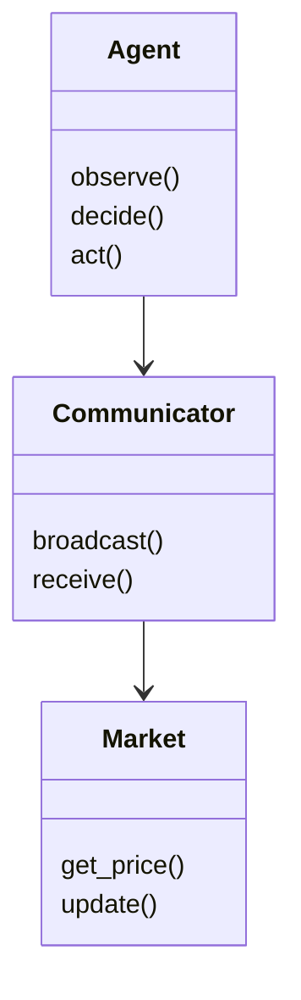
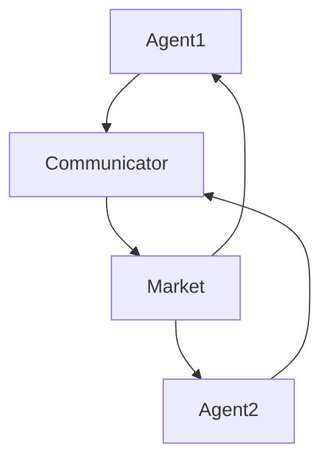
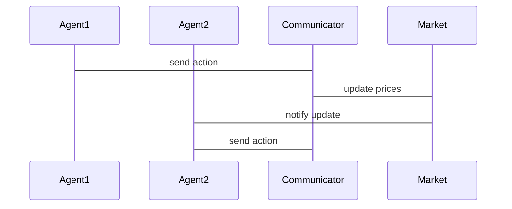

                 


# 多智能体AI如何提升价值投资中的时机选择

> 关键词：多智能体AI，价值投资，时机选择，金融建模，强化学习，实时决策

> 摘要：本文探讨了多智能体AI在价值投资时机选择中的应用，分析了传统方法的局限性，并通过系统架构设计和算法实现，展示了多智能体AI如何优化投资决策。文章结合理论与实战，详细讲解了多智能体AI在金融领域的潜力和优势。

---

# 第1章: 多智能体AI与价值投资概述

## 1.1 多智能体AI的定义与特点

### 1.1.1 多智能体AI的定义

多智能体AI是指由多个相互协作或竞争的智能体组成的系统，每个智能体都有自己的目标和决策能力。与传统AI不同，多智能体AI强调智能体之间的互动与协作，能够共同完成复杂的任务。

$$
\text{多智能体系统} = \{\text{智能体}_1, \text{智能体}_2, \dots, \text{智能体}_n\}
$$

### 1.1.2 多智能体AI的核心特点

- **分布式计算**：每个智能体独立决策，通过通信协作完成任务。
- **动态协作**：智能体之间实时互动，动态调整策略。
- **自适应性**：系统能够根据环境变化自动调整。

### 1.1.3 多智能体AI与传统AI的区别

| 特性          | 多智能体AI                     | 传统AI                       |
|---------------|-------------------------------|-----------------------------|
| 结构          | 分布式，多个智能体协作         | 集中式，单个智能体处理       |
| 交互          | 智能体之间频繁交互             | 智能体间无交互或弱交互       |
| 应用场景       | 金融、游戏、自动驾驶等复杂场景 | 单一任务，如图像识别、语音识别 |

## 1.2 价值投资的基本概念

### 1.2.1 价值投资的定义

价值投资是一种投资策略，旨在通过分析企业内在价值，寻找市场价格低于内在价值的投资标的。

$$
\text{内在价值} = \frac{\text{未来现金流}}{\text{折现率}}
$$

### 1.2.2 价值投资的核心原则

- **长期视角**：关注企业的长期价值，而非短期波动。
- **安全边际**：买入价格低于内在价值。
- **逆向思维**：在市场恐慌时寻找机会。

### 1.2.3 价值投资与时机选择的关系

时机选择是价值投资的关键，买入时机过晚可能导致收益减少，时机过早可能面临市场波动风险。

## 1.3 多智能体AI在价值投资中的应用前景

### 1.3.1 多智能体AI在金融领域的潜力

- 提高投资决策的效率和准确性。
- 模拟市场行为，预测价格走势。
- 实时监控市场变化，优化投资组合。

### 1.3.2 多智能体AI在价值投资中的优势

- 多维度分析：多个智能体分别负责不同的分析任务。
- 协作优化：智能体之间协作，提供更全面的决策支持。
- 实时反馈：系统能够快速响应市场变化。

### 1.3.3 多智能体AI应用的挑战与机遇

- **挑战**：系统复杂性高，智能体之间的协作需要精细设计。
- **机遇**：通过分布式计算和协作优化，提高投资收益。

---

# 第2章: 多智能体系统的核心概念

## 2.1 多智能体系统的基本架构

### 2.1.1 多智能体系统的组成要素

- **智能体**：独立决策的个体。
- **通信机制**：智能体之间的信息交换。
- **协作机制**：智能体如何共同完成任务。
- **环境**：智能体所处的外部世界。

### 2.1.2 多智能体系统的通信机制

通信机制是多智能体系统的核心，通过消息传递实现协作。

$$
\text{通信机制} = \{\text{发送方}, \text{接收方}, \text{消息类型}\}
$$

### 2.1.3 多智能体系统的协作机制

协作机制包括任务分配、决策协调等步骤。

$$
\text{协作机制} = \{\text{任务分配}, \text{决策协调}, \text{结果整合}\}
$$

## 2.2 多智能体系统的分类与特点

### 2.2.1 基于任务的多智能体系统

每个智能体负责特定任务，共同完成整体目标。

### 2.2.2 基于角色的多智能体系统

智能体根据角色分工，协作完成任务。

### 2.2.3 基于行为的多智能体系统

智能体根据行为规则自主决策，无需明确任务分配。

## 2.3 多智能体系统在金融中的应用

### 2.3.1 金融市场的多智能体模拟

通过模拟市场参与者的决策行为，预测市场走势。

### 2.3.2 多智能体系统在投资决策中的作用

- 提供实时市场分析。
- 协助制定投资策略。
- 优化投资组合。

### 2.3.3 多智能体系统与价值投资的结合

通过多智能体协作，提高价值投资的时机选择能力。

---

# 第3章: 时机选择的重要性与传统方法的局限性

## 3.1 时机选择在价值投资中的重要性

### 3.1.1 市场时机选择的基本概念

时机选择是指在合适的时间点进行买入或卖出操作。

### 3.1.2 时机选择对投资收益的影响

$$
\text{收益} = (\text{卖出价} - \text{买入价}) \times \text{数量}
$$

### 3.1.3 时机选择的复杂性与挑战

市场波动、信息不全、投资者情绪等多重因素影响时机选择。

## 3.2 传统时机选择方法的局限性

### 3.2.1 基于历史数据分析的传统方法

- **问题**：历史数据不一定代表未来。
- **局限性**：忽略市场实时变化。

### 3.2.2 基于技术分析的传统方法

- **问题**：依赖假设，容易受到主观影响。
- **局限性**：难以捕捉市场拐点。

### 3.2.3 基于基本面分析的传统方法

- **问题**：分析周期长，难以应对快速变化。
- **局限性**：需要大量人工判断。

## 3.3 多智能体AI在时机选择中的优势

### 3.3.1 多智能体AI的实时决策能力

通过实时数据分析，快速做出决策。

### 3.3.2 多智能体AI的协作优化能力

多个智能体协作，提供更精准的时机选择。

### 3.3.3 多智能体AI的自适应性

能够根据市场变化自动调整策略。

---

# 第4章: 多智能体AI在时机选择中的算法实现

## 4.1 强化学习算法原理

### 4.1.1 强化学习的基本概念

通过智能体与环境的交互，学习最优策略。

$$
Q(s, a) = r + \gamma \max_{a'} Q(s', a')
$$

### 4.1.2 多智能体强化学习的挑战

- **竞争与协作**：智能体之间可能既有竞争又有协作。
- **通信与协调**：需要设计有效的通信机制。

### 4.1.3 多智能体强化学习的应用

通过强化学习，智能体能够自主学习最优交易策略。

## 4.2 多智能体协作算法实现

### 4.2.1 分布式计算框架

使用分布式计算框架，如Spark或Flink，处理大量数据。

### 4.2.2 智能体通信协议

设计高效的通信协议，确保智能体之间的信息高效传递。

### 4.2.3 算法实现代码示例

```python
class MultiAgentSystem:
    def __init__(self, num_agents):
        self.agents = [Agent() for _ in range(num_agents)]
        self.communicator = Communicator()

    def step(self):
        for agent in self.agents:
            state = agent.observe()
            action = agent.decide(state)
            self.communicator.broadcast(action)
```

---

# 第5章: 系统架构与项目实战

## 5.1 项目介绍

### 5.1.1 项目目标

开发一个多智能体AI系统，用于优化价值投资中的时机选择。

### 5.1.2 项目需求

- 实时数据分析
- 多智能体协作
- 自动化交易决策

## 5.2 系统架构设计

### 5.2.1 领域模型类图



### 5.2.2 系统架构图



## 5.3 系统接口设计

### 5.3.1 智能体接口

- `observe()`: 获取市场数据
- `decide()`: 决策交易动作
- `act()`: 执行交易

### 5.3.2 通信接口

- `broadcast(action)`: 发布动作
- `receive(action)`: 接收动作

## 5.4 系统交互流程



---

# 第6章: 项目实战与案例分析

## 6.1 环境安装

安装必要的库，如TensorFlow、Keras、Pandas等。

## 6.2 核心代码实现

### 6.2.1 智能体类实现

```python
class Agent:
    def __init__(self, id):
        self.id = id
        self.model = self.build_model()

    def build_model(self):
        # 构建强化学习模型
        pass

    def observe(self):
        # 获取市场数据
        pass

    def decide(self, state):
        # 决策交易动作
        pass

    def act(self, action):
        # 执行交易
        pass
```

### 6.2.2 通信器类实现

```python
class Communicator:
    def __init__(self):
        self.agents = []

    def broadcast(self, action):
        for agent in self.agents:
            agent.receive(action)
```

## 6.3 实际案例分析

### 6.3.1 数据分析

分析历史数据，训练智能体的交易策略。

### 6.3.2 系统优化

根据实际表现，优化系统参数。

### 6.3.3 结果展示

展示系统在实际交易中的表现。

---

# 第7章: 总结与展望

## 7.1 总结

多智能体AI在价值投资中的应用前景广阔，能够显著提升时机选择的效率和准确性。

## 7.2 展望

未来，随着AI技术的不断发展，多智能体系统将在金融领域发挥更大的作用。

---

作者：AI天才研究院 & 禅与计算机程序设计艺术

