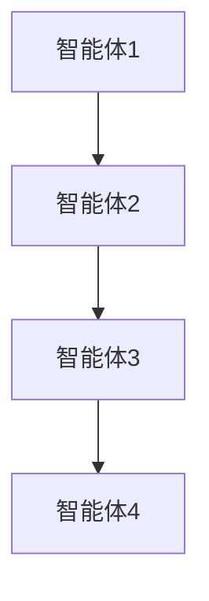
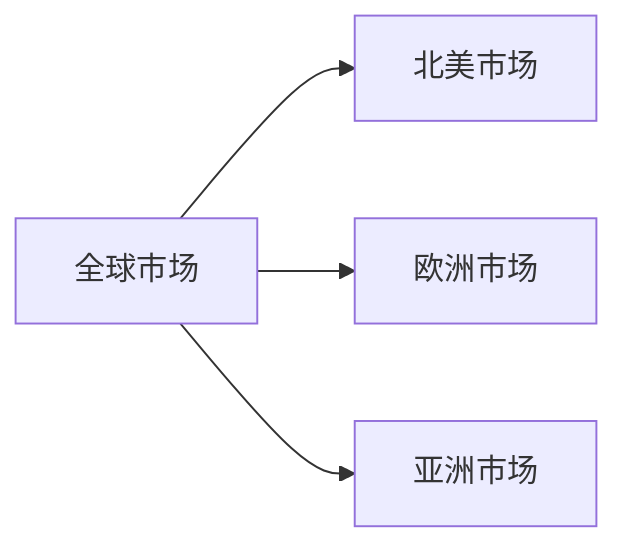
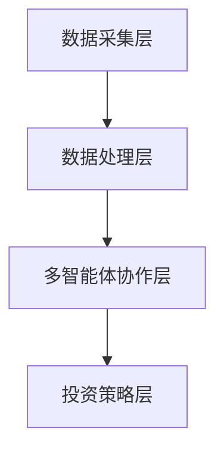

                 


# 多智能体AI如何提升价值投资的全球化视野

> 关键词：多智能体AI, 价值投资, 全球化视野, 投资策略, 人工智能

> 摘要：本文探讨了多智能体AI在价值投资中的应用，特别是如何通过全球化视野提升投资策略。文章从多智能体AI的基本原理、价值投资的核心理念入手，分析了两者的结合方式，详细讲解了多智能体AI的算法原理和系统架构设计，并通过实际案例展示了其在价值投资中的应用效果。

---

## 第一部分：多智能体AI与价值投资的背景

### 第1章：多智能体AI的定义与特点

#### 1.1 多智能体AI的定义
多智能体AI（Multi-Agent AI）是由多个智能体组成的系统，每个智能体具备一定的感知、决策和执行能力，能够通过协作与竞争完成复杂的任务。

#### 1.2 多智能体AI的核心特点
1. **分布式智能**：每个智能体独立运作，但通过通信和协作实现整体目标。
2. **协作与竞争**：智能体之间可以协作，也可以在资源分配上形成竞争。
3. **动态适应**：系统能够根据环境变化调整策略。

#### 1.3 多智能体AI与传统AI的区别
| 特性 | 单智能体AI | 多智能体AI |
|------|------------|------------|
| 结构   | 单一中心    | 分布式结构 |
| 决策   | 中央决策    | 分布式决策 |
| 协作   | 单点控制    | 多点协作与竞争 |

### 第2章：价值投资的定义与全球化视野

#### 2.1 价值投资的核心理念
价值投资强调寻找被市场低估的资产，注重长期收益，而非短期价格波动。

#### 2.2 全球化视野在价值投资中的重要性
1. **跨市场机会**：全球化视野能够发现不同市场的投资机会。
2. **分散风险**：通过全球化配置降低投资风险。
3. **全球经济趋势**：全球化视野能够捕捉宏观经济趋势的影响。

#### 2.3 多智能体AI与价值投资的结合
通过多智能体AI的协作，能够实现对全球市场的全面分析，提供更精准的价值评估。

---

## 第二部分：多智能体AI在价值投资中的核心概念

### 第3章：多智能体AI的核心原理

#### 3.1 多智能体系统的基本结构


#### 3.2 多智能体AI的协作机制
1. **分布式协作**：智能体通过通信模块共享信息。
2. **联合学习**：智能体之间共享数据和知识，提升整体性能。

#### 3.3 多智能体AI的决策机制
- **自主决策**：每个智能体根据自身信息做出决策。
- **群体决策**：通过协商和协作形成集体决策。

### 第4章：价值投资的全球化视角

#### 4.1 全球市场分析


#### 4.2 跨国公司的价值评估
- **财务指标分析**：如市盈率、ROE等。
- **行业地位分析**：市场份额、竞争优势。

#### 4.3 经济趋势影响
- **宏观经济指标**：GDP、利率、汇率等。
- **政策影响**：国际贸易政策、税收政策。

---

## 第三部分：多智能体AI与价值投资的系统架构设计

### 第5章：系统功能设计

#### 5.1 数据采集与处理模块
- **数据源**：全球市场数据、公司财务数据、新闻舆情等。
- **数据清洗**：去除噪声数据，确保数据质量。

#### 5.2 多智能体协作模块
- **通信机制**：智能体之间通过消息队列进行信息传递。
- **协作算法**：分布式协作算法，确保任务分配合理。

#### 5.3 投资策略生成模块
- **模型训练**：基于历史数据训练价值评估模型。
- **策略生成**：根据当前市场情况生成投资策略。

### 第6章：系统架构设计

#### 6.1 分层架构设计


#### 6.2 模块化设计
- **模块划分**：数据采集、处理、协作、策略生成。
- **模块接口**：定义清晰的接口，确保模块间的通信。

---

## 第四部分：多智能体AI的算法原理与实现

### 第7章：多智能体协作算法

#### 7.1 分布式协作算法
- **步骤**：
  1. 智能体接收任务分配指令。
  2. 各智能体独立处理任务。
  3. 通过通信模块共享结果。

```python
# 分布式协作算法示例代码
class Agent:
    def __init__(self, id):
        self.id = id
        self.task = None

    def receive_task(self, task):
        self.task = task

    def execute_task(self):
        # 处理任务并返回结果
        result = f"Agent {self.id} completed task {self.task}"
        return result

# 分配任务
agents = [Agent(1), Agent(2), Agent(3)]
tasks = ["analyze market", "evaluate risk", "recommend strategy"]

for agent in agents:
    agent.receive_task(tasks[agents.index(agent)])

for agent in agents:
    print(agent.execute_task())
```

#### 7.2 联合学习算法
- **步骤**：
  1. 各智能体收集数据。
  2. 数据进行加密后共享。
  3. 联合训练模型并返回结果。

---

## 第五部分：项目实战与案例分析

### 第8章：项目实战

#### 8.1 环境安装与配置
- **Python环境**：安装Python 3.8以上版本。
- **依赖库**：安装numpy、pandas、scikit-learn等。

#### 8.2 核心代码实现
```python
import numpy as np
import pandas as pd

# 示例代码：价值评估模型
class ValueInvestmentModel:
    def __init__(self):
        self.data = None

    def load_data(self, file_path):
        self.data = pd.read_csv(file_path)

    def calculate_value(self):
        # 示例计算市盈率
        self.data['PE'] = self.data['Price'] / self.data['Earnings']
        return self.data

# 使用模型进行价值评估
model = ValueInvestmentModel()
model.load_data('market_data.csv')
result = model.calculate_value()
print(result.head())
```

#### 8.3 案例分析
- **案例**：分析某跨国公司的价值。
- **步骤**：
  1. 收集公司财务数据。
  2. 应用价值评估模型。
  3. 得出投资建议。

---

## 第六部分：总结与展望

### 第9章：总结

#### 9.1 全书总结
通过多智能体AI的应用，价值投资的全球化视野得到了显著提升，能够更全面地分析市场和评估投资机会。

### 第10章：展望

#### 10.1 未来发展方向
- **更复杂的协作机制**：如多智能体之间的动态协作。
- **更智能化的决策系统**：结合强化学习提升决策效率。

---

作者：AI天才研究院/AI Genius Institute & 禅与计算机程序设计艺术 /Zen And The Art of Computer Programming

