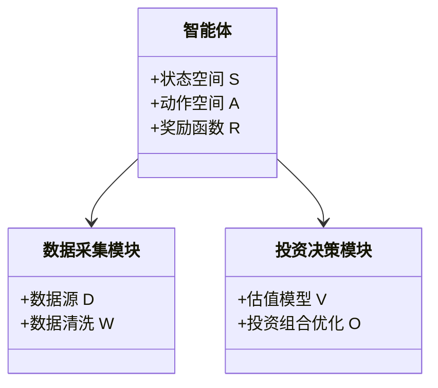

                 


# 多智能体AI如何提升价值投资的决策精度

## 关键词
多智能体AI, 价值投资, 决策精度, 强化学习, 投资决策

## 摘要
多智能体AI通过协作学习和分布式决策，显著提升了传统价值投资的决策精度。本文深入分析多智能体系统在价值投资中的应用，探讨其算法原理和系统架构，结合实际案例，展示了多智能体AI如何优化投资策略，提高决策效率和准确性。

---

# 第1章: 多智能体AI与价值投资的背景介绍

## 1.1 多智能体AI的定义与特点
### 1.1.1 多智能体系统的定义
多智能体系统（Multi-Agent System, MAS）是由多个相互作用的智能体组成的分布式系统。每个智能体都能独立感知环境、做出决策并执行动作，通过协作完成复杂任务。

### 1.1.2 多智能体的核心特点
- **分布式性**：智能体独立决策，无需中央控制。
- **协作性**：通过通信和协调实现共同目标。
- **反应性**：实时感知环境变化并调整行为。
- **自主性**：每个智能体都有自主决策能力。

### 1.1.3 多智能体与传统AI的区别
| 特性        | 多智能体AI                | 传统AI                  |
|-------------|--------------------------|-------------------------|
| 结构         | 分布式、协作式          | 集中式、单一决策者     |
| 灵活性       | 高                      | 较低                   |
| 应用场景     | 复杂任务协作             | 单一任务处理           |

## 1.2 价值投资的基本概念
### 1.2.1 价值投资的定义
价值投资是一种投资策略，通过分析公司基本面，寻找市场价格低于内在价值的股票进行投资。

### 1.2.2 价值投资的核心原则
- **安全边际**：买入价格低于内在价值。
- **长期视角**：关注公司长期盈利能力。
- **分散投资**：降低风险。

### 1.2.3 价值投资的决策过程
1. 数据收集：公司财务数据、行业趋势等。
2. 基本面分析：评估公司价值。
3. 市场分析：判断价格是否低估。
4. 投资决策：决定买入、持有或卖出。

## 1.3 多智能体AI与价值投资的结合
### 1.3.1 多智能体AI在金融领域的应用
- **数据处理**：分析大量非结构化数据。
- **决策支持**：提供多维度分析结果。
- **风险管理**：实时监控市场风险。

### 1.3.2 价值投资中引入多智能体的优势
- **提高决策精度**：多个智能体协作，提供更全面的分析。
- **增强鲁棒性**：分布式决策降低单点故障风险。
- **加速决策过程**：智能体并行处理数据。

### 1.3.3 多智能体AI如何提升投资决策的精度
通过多智能体协作，投资者可以从不同角度分析数据，发现潜在机会，从而做出更精准的投资决策。

## 1.4 本章小结
本章介绍了多智能体AI的定义、特点，以及价值投资的基本概念和决策过程。通过对比分析，展示了多智能体AI在提升价值投资决策精度方面的潜力。

---

# 第2章: 多智能体AI的核心概念与联系

## 2.1 多智能体系统的核心原理
### 2.1.1 多智能体系统的组成
- **智能体**：独立决策的个体。
- **环境**：智能体感知和交互的空间。
- **通信机制**：智能体之间的信息交换方式。
- **协作协议**：智能体协作的规则和策略。

### 2.1.2 多智能体系统中的通信与协作
- **通信**：智能体之间通过消息传递信息。
- **协作**：基于共享目标，智能体协同完成任务。

### 2.1.3 多智能体系统的决策机制
- **分布式决策**：每个智能体独立决策。
- **集中式决策**：由中央控制器统一决策。
- **混合式决策**：结合分布式和集中式特点。

## 2.2 价值投资模型的核心要素
### 2.2.1 价值评估模型的构建
- **财务指标**：市盈率、市净率等。
- **行业分析**：行业趋势、竞争状况。
- **宏观经济**：经济周期、政策影响。

### 2.2.2 投资决策的逻辑框架
1. 数据收集与清洗。
2. 估值模型计算。
3. 风险评估。
4. 投资组合优化。

### 2.2.3 数据驱动的决策支持
通过大数据分析，提供实时市场动态和深度分析报告，辅助投资决策。

## 2.3 多智能体与价值投资模型的联系
### 2.3.1 多智能体如何优化价值评估
- **数据处理**：多智能体分别处理不同数据源。
- **模型优化**：多个智能体协作改进估值模型。
- **结果整合**：整合各智能体的分析结果，提供更准确的估值。

### 2.3.2 多智能体如何辅助投资决策
- **实时监控**：智能体实时跟踪市场变化。
- **风险预警**：智能体识别潜在风险。
- **策略优化**：智能体协作优化投资组合。

### 2.3.3 多智能体与传统价值投资方法的对比
| 特性        | 多智能体AI                | 传统价值投资            |
|-------------|--------------------------|--------------------------|
| 决策速度     | 快                      | 较慢                   |
| 决策精度     | 高                      | 中等                   |
| 数据处理能力 | 强大                    | 较弱                   |

## 2.4 本章小结
本章深入探讨了多智能体系统的核心原理和价值投资模型的关键要素，并分析了两者之间的联系，展示了多智能体AI在优化价值投资中的潜力。

---

# 第3章: 多智能体AI的算法原理与数学模型

## 3.1 多智能体协作机制
### 3.1.1 分散决策与集中控制
- **分散决策**：每个智能体独立决策。
- **集中控制**：由中央控制器统一协调。

### 3.1.2 基于博弈论的协作策略
- **纳什均衡**：各智能体策略相互最优。
- **合作博弈**：智能体通过合作实现共同目标。

### 3.1.3 基于强化学习的协作方法
- **Q-learning**：学习最优策略。
- **多智能体强化学习**：协作完成任务。

## 3.2 强化学习算法在多智能体中的应用
### 3.2.1 Q-learning算法
Q-learning是一种经典的强化学习算法，通过更新Q值函数来学习最优策略。

$$ Q(s, a) = Q(s, a) + \alpha (r + \gamma \max Q(s', a') - Q(s, a)) $$

### 3.2.2 多智能体强化学习的挑战
- **状态空间爆炸**：智能体数量增加，状态空间急剧扩大。
- **动作协调困难**：智能体之间需要高效协作。
- **通信开销**：智能体之间通信增加计算开销。

### 3.2.3 基于DQN的多智能体协作
DQN（Deep Q-Network）通过深度神经网络近似Q值函数，实现多智能体协作。

## 3.3 多智能体AI的数学模型
### 3.3.1 状态空间的定义
状态空间由所有可能的状态组成，表示智能体所处环境。

### 3.3.2 动作空间的构建
动作空间是智能体可执行的动作集合。

### 3.3.3 奖励函数的设计
奖励函数定义智能体执行动作后的奖励值，指导智能体学习最优策略。

$$ R(s, a) = r $$

## 3.4 本章小结
本章详细讲解了多智能体AI的协作机制和强化学习算法，分析了数学模型的设计，为后续章节的系统设计和项目实现奠定了基础。

---

# 第4章: 价值投资中的系统分析与架构设计

## 4.1 问题场景介绍
### 4.1.1 价值投资中的信息处理问题
- 数据量大：处理大量市场数据。
- 数据复杂：非结构化数据多。
- 决策风险高：需要精准判断。

### 4.1.2 多智能体AI的应用场景
- 实时监控：实时跟踪市场动态。
- 风险管理：识别潜在风险。
- 投资组合优化：优化资产配置。

### 4.1.3 系统的目标与约束
- 目标：提升决策精度，降低风险。
- 约束：计算资源有限，通信延迟。

## 4.2 系统功能设计
### 4.2.1 数据采集模块
- 数据来源：金融市场数据、新闻资讯等。
- 数据清洗：处理缺失值、异常值。

### 4.2.2 智能体协作模块
- 通信机制：智能体之间通过消息传递信息。
- 协作策略：基于强化学习的协作机制。

### 4.2.3 投资决策模块
- 估值模型：计算股票内在价值。
- 投资组合优化：优化资产配置。

## 4.3 系统架构设计
### 4.3.1 领域模型


### 4.3.2 系统架构
```mermaid
client --> 智能体1
client --> 智能体2
...
智能体1 --> 数据采集模块
智能体2 --> 数据采集模块
...
智能体1 --> 投资决策模块
智能体2 --> 投资决策模块
```

## 4.4 本章小结
本章通过对价值投资中的问题场景分析，设计了系统的功能模块和架构，展示了多智能体AI在价值投资中的应用。

---

# 第5章: 项目实战

## 5.1 环境安装
### 5.1.1 安装Python
```bash
python --version
pip install --upgrade pip
```

### 5.1.2 安装依赖库
```bash
pip install numpy pandas matplotlib scikit-learn
```

## 5.2 系统核心实现源代码
### 5.2.1 智能体协作模块
```python
import numpy as np
import pandas as pd

class Agent:
    def __init__(self, state_space, action_space):
        self.state_space = state_space
        self.action_space = action_space
        self.Q = np.zeros((len(state_space), len(action_space)))

    def act(self, state):
        # 选择动作
        pass
```

### 5.2.2 投资决策模块
```python
import pandas as pd
from sklearn import preprocessing

def preprocess_data(data):
    # 数据预处理
    pass

def evaluate_stock(data):
    # 估值模型
    pass
```

## 5.3 案例分析与详细讲解
### 5.3.1 案例介绍
分析某公司的财务数据，利用多智能体AI进行估值。

### 5.3.2 数据分析过程
1. 数据清洗：处理缺失值、异常值。
2. 估值模型计算：计算股票内在价值。
3. 投资决策：基于多智能体协作结果做出投资决策。

## 5.4 项目总结
通过实际案例，展示了多智能体AI在价值投资中的应用，验证了其提升决策精度的优势。

## 5.5 本章小结
本章通过项目实战，详细讲解了多智能体AI在价值投资中的应用，展示了其实际价值。

---

# 第6章: 最佳实践与注意事项

## 6.1 最佳实践
### 6.1.1 系统设计
- 明确目标：确保系统设计符合投资需求。
- 优化算法：选择合适的强化学习算法。
- 提高效率：优化通信机制，减少延迟。

### 6.1.2 数据管理
- 数据清洗：确保数据质量。
- 数据安全：保护敏感数据。

### 6.1.3 风险管理
- 风险预警：实时监控潜在风险。
- 风险控制：制定风险应对策略。

## 6.2 注意事项
### 6.2.1 算法选择
- 根据任务需求选择合适的算法。
- 确保算法可扩展性。

### 6.2.2 系统优化
- 优化计算效率。
- 降低通信开销。

### 6.2.3 风险控制
- 定期评估系统风险。
- 制定应急预案。

## 6.3 本章小结
本章总结了多智能体AI在价值投资中的最佳实践和注意事项，帮助读者更好地应用多智能体AI提升决策精度。

---

# 作者信息

作者：AI天才研究院/AI Genius Institute & 禅与计算机程序设计艺术 /Zen And The Art of Computer Programming

---

本文通过详细分析多智能体AI在价值投资中的应用，结合理论与实践，展示了多智能体AI如何提升投资决策的精度。希望本文能为相关领域的研究和实践提供有价值的参考。

