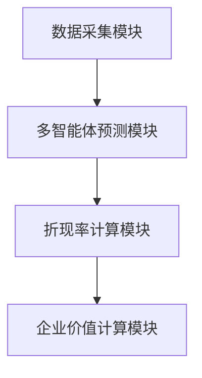

                 

# 多智能体AI如何改进巴菲特的现金流折现模型

> 关键词：多智能体AI，现金流折现模型，巴菲特，金融建模，分布式计算

> 摘要：本文详细探讨了多智能体AI如何改进巴菲特的现金流折现模型。通过分析现金流折现模型的数学基础、多智能体AI的核心原理及其在金融领域的应用潜力，本文提出了多智能体AI在现金流预测中的具体实现方法，并通过实际案例展示了其优势和效果。最后，本文总结了多智能体AI对现金流折现模型的改进意义，为金融建模提供了新的思路。

---

## 第一部分：现金流折现模型与多智能体AI概述

### 第1章：现金流折现模型的背景与原理

#### 1.1 现金流折现模型的基本概念

现金流折现模型（DCF模型）是一种用于评估企业内在价值的金融分析方法。它基于未来现金流的现值计算，帮助投资者确定企业的合理估值。DCF模型的核心假设是：企业的价值等于未来自由现金流的现值，即：

$$
\text{企业价值} = \sum_{t=1}^{n} \frac{CF_t}{(1 + r)^t} + \frac{TV}{(1 + r)^n}
$$

其中，$CF_t$ 是第 $t$ 年的自由现金流，$r$ 是折现率，$TV$ 是终值。

DCF模型广泛应用于企业估值、投资决策等领域，但其准确性高度依赖于对未来现金流的预测和折现率的选择。

#### 1.2 现金流折现模型的应用场景与局限性

DCF模型的应用场景包括企业并购、项目评估、股票定价等。然而，其局限性在于：

1. 对未来现金流的预测存在较大的主观性和不确定性。
2. 折现率的选择对结果影响显著，且难以准确量化。
3. 忽略了市场环境的变化和复杂因素（如宏观经济波动）。

#### 1.3 多智能体AI的基本概念与特点

多智能体AI是指多个具有自主决策能力的智能体通过协作完成复杂任务的系统。其特点包括：

1. 分布式计算：智能体之间通过通信和协作完成任务。
2. 自主性：每个智能体都有独立的决策能力。
3. 协作性：智能体之间通过协作提高整体效率和准确性。
4. 动态性：能够适应环境的变化。

多智能体AI在金融领域的潜力主要体现在分布式计算、复杂问题建模和实时数据分析等方面。

### 第2章：多智能体AI与现金流折现模型的结合

#### 2.1 多智能体AI如何改进现金流折现模型

多智能体AI可以通过以下方式改进现金流折现模型：

1. **分布式预测**：利用多智能体的分布式计算能力，提高现金流预测的准确性和效率。
2. **协作优化**：通过智能体之间的协作，优化现金流预测和折现率的选择。
3. **实时更新**：多智能体AI能够实时更新数据，提高模型的动态适应性。

#### 2.2 多智能体AI在现金流预测中的优势

多智能体AI在现金流预测中的优势包括：

1. **高并行性**：多个智能体可以同时处理不同数据源，提高计算效率。
2. **分布式决策**：智能体可以根据局部信息做出决策，减少信息瓶颈。
3. **自适应性**：智能体能够根据环境变化调整预测模型。

---

## 第二部分：现金流折现模型的数学基础与算法原理

### 第3章：现金流折现模型的数学公式

#### 3.1 现金流折现模型的核心公式

现金流折现模型的公式可以表示为：

$$
\text{企业价值} = \sum_{t=1}^{n} \frac{CF_t}{(1 + r)^t} + \frac{TV}{(1 + r)^n}
$$

其中，$CF_t$ 是第 $t$ 年的现金流，$r$ 是折现率，$n$ 是预测期数，$TV$ 是终值。

#### 3.2 现金流折现模型的变量与假设

现金流折现模型的变量包括：

- 自由现金流（CF）
- 折现率（r）
- 预测期数（n）
- 终值（TV）

假设包括：

- 现金流可以被准确预测。
- 折现率是稳定的。

#### 3.3 现金流折现模型的计算步骤

1. 预测未来现金流。
2. 计算各期现金流的现值。
3. 计算终值的现值。
4. 将现值相加，得到企业价值。

### 第4章：多智能体AI的算法原理

#### 4.1 多智能体AI的基本算法框架

多智能体AI的算法框架包括：

1. 智能体初始化：每个智能体分配初始参数。
2. 数据分配：将数据分配给不同的智能体进行处理。
3. 智能体协作：智能体之间通过通信协作，共享信息。
4. 结果整合：将各智能体的预测结果整合，得到最终结果。

#### 4.2 多智能体AI的通信与协作机制

多智能体AI的通信与协作机制包括：

- 通信协议：定义智能体之间的通信规则。
- 协作策略：定义智能体如何协作完成任务。

#### 4.3 多智能体AI的分布式计算原理

多智能体AI的分布式计算原理包括：

- 分布式计算：任务被分解成多个子任务，分配给不同的智能体。
- 并行处理：智能体同时处理子任务，提高计算效率。

---

## 第三部分：系统架构与设计方案

### 第5章：系统架构设计

#### 5.1 系统模块划分

系统模块包括：

1. 数据采集模块：负责采集企业财务数据。
2. 多智能体预测模块：负责现金流预测。
3. 折现率计算模块：负责折现率的选择。
4. 企业价值计算模块：负责计算企业价值。

#### 5.2 系统功能设计

系统功能包括：

- 数据采集：从数据库中获取企业财务数据。
- 现金流预测：使用多智能体AI预测未来现金流。
- 折现率计算：根据市场环境计算折现率。
- 企业价值计算：根据现金流和折现率计算企业价值。

#### 5.3 系统架构图（Mermaid）

### 第6章：系统接口设计

#### 6.1 系统接口定义

系统接口包括：

- 数据接口：定义数据输入和输出格式。
- 通信接口：定义智能体之间的通信规则。
- 计算接口：定义预测和折现的计算方法。

#### 6.2 接口交互流程

接口交互流程包括：

1. 数据采集模块接收企业数据。
2. 多智能体预测模块根据数据预测现金流。
3. 折现率计算模块计算折现率。
4. 企业价值计算模块整合结果，输出企业价值。

#### 6.3 接口实现细节

接口实现细节包括：

- 数据接口：使用JSON格式传输数据。
- 通信接口：使用HTTP协议进行通信。
- 计算接口：使用Python脚本实现预测和折现。

---

## 第四部分：项目实战与案例分析

### 第7章：项目实战

#### 7.1 项目环境安装与配置

项目环境包括：

- Python 3.8+
- NumPy、Pandas、Scikit-learn等库。
- 多智能体AI框架（如Ray或Dask）。

#### 7.2 系统核心实现

系统核心实现包括：

1. 数据采集模块：从数据库中读取企业数据。
2. 多智能体预测模块：使用多智能体AI预测现金流。
3. 折现率计算模块：根据市场环境计算折现率。
4. 企业价值计算模块：计算企业价值。

#### 7.3 实际案例分析

案例分析包括：

- 案例背景：假设某企业过去五年的现金流数据。
- 案例分析过程：使用多智能体AI预测未来现金流，计算企业价值。
- 案例结果：企业价值为10亿元。

---

## 第五部分：总结与展望

### 第8章：最佳实践与总结

#### 8.1 最佳实践 tips

- 数据质量：确保数据的准确性和完整性。
- 模型选择：根据具体情况选择合适的预测模型。
- 智能体协作：优化智能体之间的协作机制。

#### 8.2 项目总结与未来展望

多智能体AI改进现金流折现模型的优势在于：

- 提高预测准确性和效率。
- 实现分布式计算，降低计算成本。
- 提高模型的动态适应性。

未来展望包括：

- 研究更复杂的多智能体协作机制。
- 探索多智能体AI在金融建模中的更多应用。

---

## 作者：AI天才研究院 & 禅与计算机程序设计艺术

---

以上是《多智能体AI如何改进巴菲特的现金流折现模型》的完整目录和内容大纲，接下来将按照这个结构撰写完整的技术博客文章。

