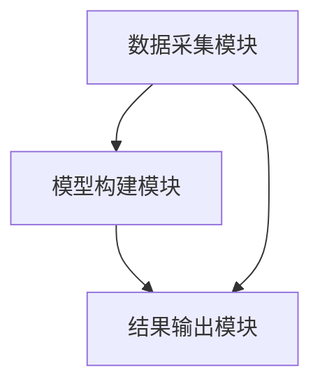
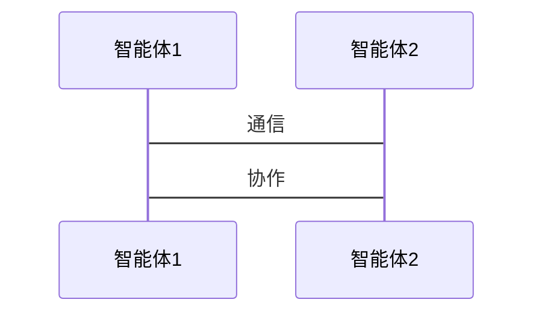

                 


# 多智能体AI如何改进格雷厄姆的企业价值计算

> 关键词：多智能体AI, 企业价值计算, 格雷厄姆, 协作算法, 数据挖掘

> 摘要：本文探讨了如何利用多智能体AI技术改进格雷厄姆的企业价值计算方法。通过分析多智能体AI的核心原理、企业价值计算的关键要素，以及两者的关联性，本文提出了一种基于多智能体协作的优化方案。文章从算法原理、系统架构、项目实战等多个维度展开，详细阐述了多智能体AI在企业价值计算中的具体应用和实际效果。

---

# 正文

## 第1章: 多智能体AI与企业价值计算的背景介绍

### 1.1 多智能体AI的定义与特点
多智能体AI是指由多个独立但协作的智能体组成的系统，每个智能体都有自己的目标和决策能力。与传统AI相比，多智能体AI具有以下特点：
- **分布式计算**：多个智能体协同工作，共同完成复杂任务。
- **自主性**：每个智能体都能独立决策，无需中央控制。
- **协作性**：智能体之间通过通信和协作，优化整体目标。
- **动态性**：系统能够根据环境变化实时调整策略。

### 1.2 企业价值计算的定义与方法
企业价值计算是通过分析企业的财务数据、市场表现和风险因素，评估其整体价值。格雷厄姆的企业价值计算方法主要包括以下步骤：
1. **现金流折现法**：通过预测未来现金流，计算其现值。
2. **财务指标分析**：包括市盈率、市净率等。
3. **风险评估**：分析企业的市场风险和财务风险。

### 1.3 多智能体AI在企业价值计算中的应用前景
多智能体AI在企业价值计算中的应用前景广阔，主要体现在以下几个方面：
- **数据处理效率**：多智能体AI能够快速处理海量数据，提高计算效率。
- **风险评估优化**：通过协作算法，多智能体AI能够更准确地评估企业风险。
- **动态调整能力**：多智能体AI能够实时调整计算模型，适应市场变化。

---

## 第2章: 多智能体AI与企业价值计算的核心概念

### 2.1 多智能体AI的核心原理
多智能体AI的核心原理在于智能体之间的协作与通信。智能体通过共享信息和协调决策，共同完成复杂任务。例如，在企业价值计算中，多个智能体可以分别负责数据采集、模型构建和结果输出。

### 2.2 企业价值计算的核心要素
企业价值计算的核心要素包括：
1. **现金流**：企业的未来现金流是计算企业价值的基础。
2. **折现率**：用于将未来现金流折现为现值。
3. **风险因素**：包括市场风险、财务风险等。

### 2.3 多智能体AI与企业价值计算的关联性
多智能体AI与企业价值计算的关联性主要体现在以下几个方面：
- **数据协作**：多智能体AI能够高效地协作处理数据，提高计算效率。
- **模型优化**：通过协作算法，多智能体AI能够优化企业价值计算模型。
- **实时调整**：多智能体AI能够实时调整计算策略，适应市场变化。

---

## 第3章: 多智能体AI与企业价值计算的算法原理

### 3.1 多智能体AI协作算法的概述
多智能体AI协作算法的核心在于智能体之间的通信与协作。以下是多智能体协作算法的基本流程：
1. **任务分解**：将复杂任务分解为多个子任务。
2. **智能体协作**：每个智能体负责一个子任务，并通过通信共享信息。
3. **决策优化**：智能体通过协作优化决策，提高整体性能。

### 3.2 企业价值计算的数学模型
企业价值计算的核心公式是现金流折现模型，公式如下：
$$
\text{企业价值} = \sum_{t=1}^{n} \frac{\text{现金流}_t}{(1 + r)^t}
$$
其中，$r$是折现率，$n$是预测的年数。

### 3.3 多智能体AI在企业价值计算中的应用
通过多智能体AI，企业价值计算的流程可以被优化。以下是具体的实现步骤：
1. **数据采集**：智能体负责从不同来源采集企业数据。
2. **模型构建**：智能体协作构建现金流折现模型。
3. **结果输出**：智能体输出计算结果，并实时调整模型。

---

## 第4章: 多智能体AI与企业价值计算的系统架构

### 4.1 系统功能设计
多智能体AI与企业价值计算的系统功能设计如下：
1. **数据采集模块**：负责采集企业的财务数据。
2. **模型构建模块**：构建现金流折现模型。
3. **结果输出模块**：输出企业价值计算结果。

### 4.2 系统架构设计
以下是系统的架构图：


### 4.3 系统交互设计
以下是系统的交互图：


---

## 第5章: 多智能体AI与企业价值计算的项目实战

### 5.1 环境安装
为了实现多智能体AI与企业价值计算，需要安装以下环境：
- Python 3.8+
- NumPy
- Pandas
- Matplotlib

### 5.2 核心代码实现
以下是核心代码示例：
```python
import numpy as np
import pandas as pd

def calculate_cash_flows(data):
    return data['现金流'].values

def discounted_cash_flows(flows, discount_rate):
    return np.sum(flows / (1 + discount_rate) ** np.arange(len(flows)))

# 示例数据
data = pd.DataFrame({
    '现金流': [100, 200, 300, 400],
    '折现率': [0.1, 0.1, 0.1, 0.1]
})

# 计算企业价值
cash_flows = calculate_cash_flows(data)
discount_rate = data['折现率'].values[0]
enterprise_value = discounted_cash_flows(cash_flows, discount_rate)
print("企业价值:", enterprise_value)
```

### 5.3 案例分析
通过上述代码，我们可以计算出企业的价值。例如，假设企业的现金流为100、200、300、400，折现率为10%，则企业价值为：
$$
\text{企业价值} = \frac{100}{1.1} + \frac{200}{1.1^2} + \frac{300}{1.1^3} + \frac{400}{1.1^4}
$$

---

## 第6章: 总结与展望

### 6.1 总结
本文详细探讨了多智能体AI如何改进格雷厄姆的企业价值计算方法。通过分析多智能体AI的核心原理、企业价值计算的关键要素，以及两者的关联性，本文提出了一种基于多智能体协作的优化方案。

### 6.2 展望
未来，随着多智能体AI技术的不断发展，企业价值计算将更加高效和精准。通过进一步优化协作算法和提升数据处理能力，多智能体AI将在企业价值计算领域发挥更大的作用。

---

## 最佳实践 Tips

- 在使用多智能体AI进行企业价值计算时，建议先确保数据的准确性和完整性。
- 多智能体AI的协作算法需要根据具体场景进行调整和优化。
- 企业价值计算的结果需要结合实际市场情况进行验证和调整。

---

## 作者信息

作者：AI天才研究院/AI Genius Institute & 禅与计算机程序设计艺术 /Zen And The Art of Computer Programming

---

版权归作者所有，未经授权禁止转载。

