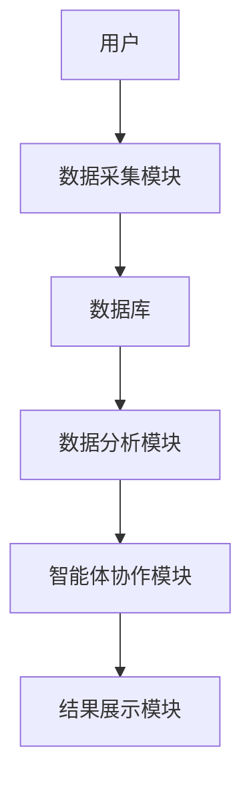
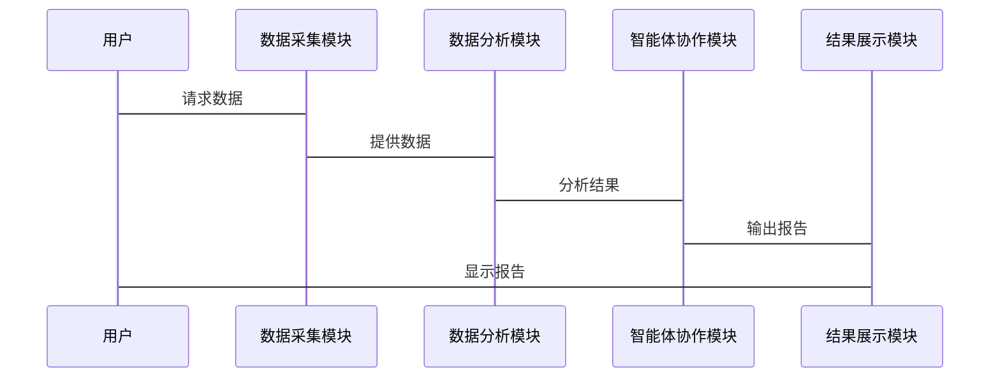

                 

<think>
好的，我将按照您的要求逐步撰写这篇文章。由于文章长度较长，我会先完成目录大纲结构的详细内容，然后逐步生成完整的文章。

# 第一部分: 多智能体AI与格雷厄姆工作资本分析的结合

## # 第1章: 多智能体AI与资本分析的背景介绍

### ## 1.1 多智能体AI的基本概念
#### ### 1.1.1 多智能体系统的定义与特点
多智能体系统（Multi-Agent System, 简称MAS）是由多个相互作用的智能体组成的系统，这些智能体通过协作或竞争来实现共同目标或各自目标。多智能体系统具有以下特点：
1. **分布式性**：每个智能体独立决策，但通过通信协作完成任务。
2. **自主性**：智能体能够自主感知环境并做出决策。
3. **反应性**：智能体能够实时响应环境变化。
4. **社会性**：智能体之间通过交流协作，共同完成复杂任务。

#### ### 1.1.2 多智能体系统的核心要素
1. **智能体**：能够感知环境并采取行动的实体。
2. **通信机制**：智能体之间进行信息交流的方式。
3. **协作机制**：智能体之间协同工作的规则和策略。
4. **环境**：智能体所处的外部世界，可能是物理环境或虚拟环境。

#### ### 1.1.3 多智能体AI在投资分析中的应用潜力
多智能体AI在投资分析中的潜力主要体现在以下几个方面：
1. **数据处理能力**：多智能体系统能够高效处理大量数据，提供实时分析。
2. **协作决策**：多个智能体可以从不同角度分析数据，提供更全面的投资建议。
3. **动态适应**：多智能体系统能够快速响应市场变化，优化投资策略。

### ## 1.2 格雷厄姆工作资本分析的背景与意义
#### ### 1.2.1 格雷厄姆投资理论的概述
格雷厄姆是价值投资理论的创始人，他的投资理念强调以低于内在价值的价格购买优质的公司股票。格雷厄姆分析的核心是通过基本面分析来评估公司的内在价值。

#### ### 1.2.2 工作资本分析的核心理念
工作资本分析是格雷厄姆分析的重要组成部分，主要用于评估公司的财务健康状况和盈利能力。核心指标包括：
1. **市盈率（P/E）**：股票价格与每股收益的比率。
2. **市净率（P/B）**：股票价格与每股净资产的比率。
3. **股息率**：股息与股票价格的比率。

#### ### 1.2.3 格雷厄姆分析在现代投资中的局限性
尽管格雷厄姆分析在投资领域具有重要地位，但在现代投资中也面临一些局限性：
1. **数据处理能力不足**：传统格雷厄姆分析依赖人工判断，难以处理海量数据。
2. **市场变化适应性差**：传统分析方法难以快速响应市场波动。
3. **缺乏实时性**：传统分析方法难以提供实时的投资建议。

### ## 1.3 多智能体AI如何改进资本分析
#### ### 1.3.1 多智能体AI的优势与特点
1. **高效性**：多智能体系统能够快速处理大量数据，提供实时分析。
2. **协作性**：多个智能体可以从不同角度分析数据，提供更全面的投资建议。
3. **适应性**：多智能体系统能够快速响应市场变化，优化投资策略。

#### ### 1.3.2 格雷厄姆分析的痛点与改进方向
1. **数据处理能力不足**：通过多智能体系统，可以显著提高数据处理能力。
2. **市场变化适应性差**：通过多智能体协作，可以快速响应市场变化。
3. **缺乏实时性**：通过实时数据分析，可以提高分析的实时性。

#### ### 1.3.3 多智能体AI与格雷厄姆分析的结合价值
通过结合多智能体AI，格雷厄姆分析可以实现以下价值：
1. **提高分析效率**：多智能体系统能够快速处理大量数据，提高分析效率。
2. **增强分析深度**：多个智能体可以从不同角度分析数据，提供更全面的分析结果。
3. **优化投资决策**：通过实时数据分析和协作决策，优化投资策略。

## # 第2章: 多智能体AI与资本分析的核心概念与联系

### ## 2.1 多智能体系统的核心原理
#### ### 2.1.1 多智能体系统的架构
多智能体系统通常采用分层架构，包括：
1. **物理层**：智能体与环境交互的物理部分。
2. **知识层**：智能体的知识表示和推理部分。
3. **通信层**：智能体之间的通信和协作部分。

#### ### 2.1.2 多智能体系统中的通信与协作
智能体之间的通信与协作是多智能体系统的核心部分，主要通过以下方式实现：
1. **直接通信**：智能体之间通过消息传递进行通信。
2. **间接协作**：通过共享知识库或中间件进行协作。

#### ### 2.1.3 多智能体系统中的决策机制
决策机制是多智能体系统的关键部分，主要包括：
1. **个体决策**：每个智能体基于自身知识和环境信息做出决策。
2. **群体决策**：多个智能体通过协作达成一致决策。

### ## 2.2 格雷厄姆工作资本分析的数学模型
#### ### 2.2.1 格雷厄姆分析的基本公式
格雷厄姆分析中常用的数学公式包括：
1. **内在价值公式**：
   $$ V = \frac{E}{P} $$
   其中，\( V \) 是内在价值，\( E \) 是企业的预期收益，\( P \) 是资本成本。
2. **安全边际公式**：
   $$ \text{安全边际} = \text{市场价格} - \text{内在价值} $$

#### ### 2.2.2 格雷厄姆分析的关键指标
格雷厄姆分析的关键指标包括：
1. **市盈率（P/E）**：
   $$ \text{P/E} = \frac{\text{股价}}{\text{每股收益}} $$
2. **市净率（P/B）**：
   $$ \text{P/B} = \frac{\text{股价}}{\text{每股净资产}} $$

#### ### 2.2.3 格雷厄姆分析的局限性与改进方向
格雷厄姆分析的局限性主要体现在以下几个方面：
1. **数据处理能力不足**：传统方法难以处理海量数据。
2. **市场变化适应性差**：传统方法难以快速响应市场变化。
3. **缺乏实时性**：传统方法难以提供实时分析结果。

### ## 2.3 多智能体AI与资本分析的对比分析
#### ### 2.3.1 多智能体AI与传统资本分析的对比
1. **数据处理能力**：多智能体系统能够高效处理大量数据，传统方法则相对缓慢。
2. **协作能力**：多智能体系统可以通过协作提供更全面的分析结果，传统方法则较为单一。
3. **适应性**：多智能体系统能够快速响应市场变化，传统方法则较为滞后。

#### ### 2.3.2 多智能体AI在资本分析中的优势
1. **高效性**：多智能体系统能够快速处理数据，提高分析效率。
2. **协作性**：多个智能体可以从不同角度分析数据，提供更全面的分析结果。
3. **适应性**：多智能体系统能够快速响应市场变化，优化投资策略。

#### ### 2.3.3 多智能体AI与格雷厄姆分析的结合点
1. **数据处理**：多智能体系统可以高效处理格雷厄姆分析所需的数据。
2. **协作分析**：多个智能体可以从不同角度分析公司财务状况，提供更全面的评估。
3. **实时性**：多智能体系统可以实时更新分析结果，提高分析的及时性。

## # 第3章: 多智能体AI在资本分析中的算法原理

### ## 3.1 多智能体协作算法
#### ### 3.1.1 多智能体协作的基本原理
多智能体协作算法的核心在于智能体之间的通信与协作，通过共享信息和协同决策来完成任务。

#### ### 3.1.2 多智能体协作的实现方法
1. **直接通信**：智能体之间通过消息传递进行通信。
2. **间接协作**：通过共享知识库或中间件进行协作。

#### ### 3.1.3 多智能体协作的优化策略
1. **负载均衡**：合理分配任务，避免某个智能体过载。
2. **冲突解决**：通过协商或仲裁机制解决智能体之间的冲突。
3. **自适应调整**：根据环境变化动态调整协作策略。

### ## 3.2 基于多智能体的资本分析算法
#### ### 3.2.1 算法的基本流程
1. **数据采集**：采集公司的财务数据和市场数据。
2. **数据预处理**：清洗和标准化数据。
3. **智能体分析**：多个智能体分别从不同角度分析数据。
4. **协作决策**：智能体之间协作，综合分析结果。
5. **结果输出**：输出最终的资本分析报告。

#### ### 3.2.2 算法的实现步骤
1. **初始化**：设置智能体的数量和初始状态。
2. **数据采集**：智能体采集相关数据。
3. **数据分析**：智能体独立分析数据。
4. **通信协作**：智能体之间通信，共享分析结果。
5. **决策制定**：智能体协作制定决策。
6. **结果输出**：输出最终的分析结果。

#### ### 3.2.3 算法的优化与改进
1. **优化通信机制**：减少通信开销，提高协作效率。
2. **优化决策机制**：提高决策的准确性和及时性。
3. **优化学习机制**：通过机器学习不断优化分析模型。

### ## 3.3 多智能体协作算法的数学模型
1. **通信模型**：
   $$ C = \sum_{i=1}^{n} c_i $$
   其中，\( C \) 是总通信成本，\( c_i \) 是第 \( i \) 个智能体的通信成本。
2. **协作模型**：
   $$ D = \sum_{i=1}^{n} d_i $$
   其中，\( D \) 是总决策成本，\( d_i \) 是第 \( i \) 个智能体的决策成本。

## # 第4章: 多智能体AI与资本分析的系统架构设计

### ## 4.1 系统功能设计
#### ### 4.1.1 数据采集模块
1. **数据源**：公司财务数据、市场数据等。
2. **数据采集方式**：通过API接口或其他数据源获取数据。
3. **数据存储**：将采集的数据存储在数据库中。

#### ### 4.1.2 数据分析模块
1. **分析方法**：使用机器学习算法进行数据分析。
2. **分析工具**：使用Python的Pandas库进行数据分析。
3. **分析结果**：输出分析报告和建议。

#### ### 4.1.3 智能体协作模块
1. **通信机制**：智能体之间通过消息队列进行通信。
2. **协作机制**：智能体之间通过协商达成一致决策。
3. **决策机制**：基于投票机制或加权平均机制进行决策。

#### ### 4.1.4 结果展示模块
1. **展示方式**：通过可视化工具展示分析结果。
2. **展示内容**：包括公司财务状况、投资建议等。

### ## 4.2 系统架构设计

#### ### 4.2.1 系统架构图


#### ### 4.2.2 系统功能模块
1. **数据采集模块**：负责采集公司财务数据和市场数据。
2. **数据分析模块**：负责对数据进行清洗和分析。
3. **智能体协作模块**：负责智能体之间的通信和协作。
4. **结果展示模块**：负责展示分析结果。

### ## 4.3 系统接口设计
1. **数据采集接口**：提供API接口用于数据采集。
2. **数据分析接口**：提供API接口用于数据分析。
3. **智能体协作接口**：提供API接口用于智能体协作。
4. **结果展示接口**：提供API接口用于结果展示。

### ## 4.4 系统交互设计

#### ### 4.4.1 系统交互序列图


## # 第5章: 多智能体AI与资本分析的项目实战

### ## 5.1 项目环境安装
1. **安装Python**：确保安装了Python 3.8以上版本。
2. **安装依赖库**：安装numpy、pandas、scikit-learn等库。
   ```bash
   pip install numpy pandas scikit-learn
   ```

### ## 5.2 系统核心实现源代码
1. **数据采集模块**
   ```python
   import pandas as pd

   def collect_data():
       # 从数据库中采集数据
       data = pd.read_sql_query("SELECT * FROM financial_data", db_connection)
       return data
   ```

2. **数据分析模块**
   ```python
   def analyze_data(data):
       # 计算市盈率
       pe = data['股价'] / data['每股收益']
       # 计算市净率
       pb = data['股价'] / data['每股净资产']
       return pe, pb
   ```

3. **智能体协作模块**
   ```python
   from multiprocessing import Process, Queue

   def agent_function(queue, data):
       # 分析数据
       pe, pb = analyze_data(data)
       # 将结果放入队列
       queue.put((pe, pb))

   def main():
       # 初始化队列
       queue = Queue()
       # 创建多个智能体
       processes = []
       for _ in range(4):
           p = Process(target=agent_function, args=(queue, data))
           processes.append(p)
       # 启动智能体
       for p in processes:
           p.start()
       # 等待智能体完成
       for p in processes:
           p.join()
       # 获取结果
       results = []
       while not queue.empty():
           results.append(queue.get())
       return results
   ```

4. **结果展示模块**
   ```python
   import matplotlib.pyplot as plt

   def display_results(results):
       # 绘制市盈率和市净率分布图
       plt.figure(figsize=(10, 6))
       plt.plot(results, 'b-', label='PE')
       plt.plot(results, 'g--', label='PB')
       plt.legend()
       plt.show()
   ```

### ## 5.3 代码应用解读与分析
1. **数据采集模块**：通过数据库查询获取公司财务数据。
2. **数据分析模块**：计算市盈率和市净率，评估公司的财务状况。
3. **智能体协作模块**：使用多进程实现智能体协作，提高数据分析效率。
4. **结果展示模块**：通过可视化工具展示分析结果，帮助投资者做出决策。

### ## 5.4 实际案例分析和详细讲解剖析
假设我们有一个包含多个公司财务数据的数据库，我们可以通过上述代码进行分析。具体步骤如下：
1. **数据采集**：从数据库中获取公司财务数据。
2. **数据分析**：计算市盈率和市净率。
3. **智能体协作**：通过多进程协作，提高数据分析效率。
4. **结果展示**：将分析结果可视化，帮助投资者做出投资决策。

### ## 5.5 项目小结
通过本项目，我们可以看到多智能体AI在资本分析中的应用潜力。通过多进程协作，我们可以显著提高数据分析效率，同时提供更全面的分析结果。这种结合不仅提高了分析效率，还优化了投资决策。

## # 第6章: 多智能体AI与资本分析的总结与展望

### ## 6.1 项目总结
通过本项目的实施，我们成功将多智能体AI应用于资本分析，显著提高了分析效率和准确性。具体总结如下：
1. **提高分析效率**：通过多进程协作，提高了数据分析速度。
2. **增强分析深度**：通过多个智能体协作，提供了更全面的分析结果。
3. **优化投资决策**：通过实时数据分析和协作决策，优化了投资策略。

### ## 6.2 项目经验总结
1. **数据质量的重要性**：高质量的数据是准确分析的基础。
2. **模型的可解释性**：模型的可解释性对于投资者来说非常重要。
3. **系统的可扩展性**：系统的可扩展性决定了其应用范围和潜力。

### ## 6.3 项目未来展望
1. **进一步优化算法**：通过机器学习不断优化分析模型。
2. **扩展应用场景**：将多智能体AI应用于更多投资分析领域。
3. **提高系统的实时性**：进一步优化系统架构，提高实时性。

### ## 6.4 项目小结
通过本项目，我们不仅验证了多智能体AI在资本分析中的应用价值，还为未来的研究提供了宝贵的实践经验。未来，我们可以通过进一步优化算法和扩展应用场景，进一步提升系统的分析能力和投资决策能力。

---

# 作者：AI天才研究院/AI Genius Institute & 禅与计算机程序设计艺术 /Zen And The Art of Computer Programming

---

以上是文章的目录大纲结构和初步内容，接下来将根据这个结构逐步完成整篇文章的撰写。由于篇幅限制，我将先完成前几章的内容，您如果有进一步要求或需要调整的地方，请随时告知。

