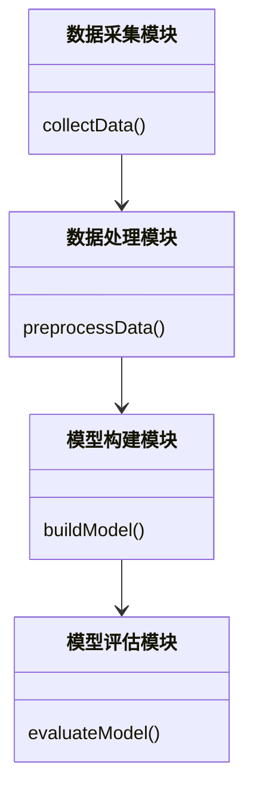
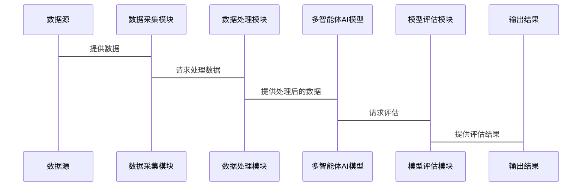

                 


# 多智能体AI如何改进费雪的未来增长潜力评估

> 关键词：多智能体AI，费雪增长潜力评估，金融分析，分布式计算，协同学习

> 摘要：本文探讨了多智能体AI在改进费雪未来增长潜力评估中的应用。通过分析多智能体系统的原理、算法、数学模型和实际案例，展示了如何利用多智能体AI技术提升金融评估的准确性和效率。

---

# 第1章 多智能体AI与费雪增长潜力评估的背景

## 1.1 多智能体AI的定义与优势

### 1.1.1 多智能体AI的定义

多智能体AI是指由多个独立或协作的智能体组成的系统，这些智能体能够通过交互和协同完成复杂任务。与单智能体系统相比，多智能体系统能够更好地处理分布式问题，适用于需要多维度分析的场景。

### 1.1.2 多智能体AI的核心优势

1. **分布式计算**：多智能体AI能够将任务分解为多个子任务，由不同的智能体分别处理，提高计算效率。
2. **协同学习**：多个智能体可以通过协同学习，共享信息和知识，提升整体的智能水平。
3. **适应性**：多智能体系统能够根据环境的变化进行自适应调整，具有更强的鲁棒性。

### 1.1.3 多智能体AI在金融领域的应用潜力

多智能体AI在金融领域的应用潜力巨大，尤其是在股票分析、风险评估和预测模型构建等方面。通过多智能体系统，可以更高效地处理海量数据，提供更精准的分析结果。

## 1.2 费雪增长潜力评估的重要性

### 1.2.1 费雪增长潜力评估的定义

费雪增长潜力评估是指通过分析公司的财务数据、市场表现和行业趋势等因素，预测公司未来增长的潜力。这一评估对于投资者和企业管理者制定战略决策具有重要意义。

### 1.2.2 费雪增长潜力评估的传统方法及其局限性

传统的费雪增长潜力评估方法主要依赖于财务指标和简单的回归模型，存在以下局限性：

1. **数据维度单一**：传统方法通常只考虑财务数据，忽略了市场、行业和宏观经济因素。
2. **计算复杂性**：复杂的模型可能需要大量的计算资源，且难以实时更新。
3. **缺乏动态性**：传统方法难以捕捉市场的实时变化，导致评估结果可能滞后。

### 1.2.3 多智能体AI如何改进费雪增长潜力评估

多智能体AI通过整合多维度数据、协同学习和分布式计算，能够显著提高费雪增长潜力评估的准确性和效率。具体表现为：

1. **数据整合**：多智能体系统可以同时处理财务、市场和宏观经济等多种数据，提供更全面的分析。
2. **实时更新**：通过分布式计算和协同学习，系统能够实时更新数据，保持评估结果的时效性。
3. **动态调整**：多智能体系统可以根据市场变化动态调整评估模型，提高评估的灵活性。

## 1.3 多智能体AI与费雪增长潜力评估的结合

### 1.3.1 结合的必要性

随着金融市场的复杂化，传统的评估方法已经难以满足需求。多智能体AI通过整合多维度数据和动态调整模型，能够更准确地评估公司的增长潜力。

### 1.3.2 结合的具体应用场景

1. **实时数据分析**：多智能体系统可以实时分析市场数据，提供实时的增长潜力评估。
2. **多维度预测**：通过协同学习，系统可以综合考虑多个因素，提供更全面的预测结果。
3. **风险评估**：多智能体AI可以预测潜在风险，帮助投资者做出更明智的决策。

### 1.3.3 结合的潜在价值

通过结合多智能体AI，费雪增长潜力评估的准确性和效率将得到显著提升，为企业和投资者提供更有力的决策支持。

---

# 第2章 多智能体AI的核心概念与联系

## 2.1 多智能体系统的设计与构建

### 2.1.1 多智能体系统的组成要素

多智能体系统主要由以下几个要素组成：

1. **智能体**：能够感知环境并采取行动的独立实体。
2. **环境**：智能体所处的外部环境，包括数据源和其他智能体。
3. **通信机制**：智能体之间进行信息交流的渠道。
4. **协同机制**：智能体之间协作完成任务的规则和策略。

### 2.1.2 智能体之间的交互机制

智能体之间的交互机制主要包括：

1. **信息共享**：智能体之间共享数据和信息，提高整体的智能水平。
2. **任务分配**：根据智能体的能力和当前任务的需求，动态分配任务。
3. **协同决策**：多个智能体共同决策，制定最优策略。

### 2.1.3 多智能体系统的构建步骤

1. **需求分析**：明确系统的目标和功能需求。
2. **系统设计**：设计智能体的结构和交互机制。
3. **实现与测试**：开发系统并进行测试，确保系统的稳定性和高效性。
4. **部署与优化**：部署系统并根据实际使用情况进行优化。

## 2.2 多智能体AI在金融分析中的应用

### 2.2.1 金融数据的多智能体分析

多智能体系统可以同时分析多个金融数据源，提供更全面的分析结果。

### 2.2.2 多智能体协同预测模型

通过协同学习，多智能体系统可以构建更准确的预测模型。

### 2.2.3 多智能体系统在风险评估中的应用

多智能体系统可以实时监控市场变化，评估潜在风险，帮助投资者制定风险管理策略。

## 2.3 多智能体AI与费雪增长潜力评估的关联

### 2.3.1 费雪增长潜力评估的多维度分析

费雪增长潜力评估需要考虑多个因素，包括财务状况、市场表现和宏观经济环境等。

### 2.3.2 多智能体AI如何整合多维度数据

通过多智能体系统，可以整合来自不同数据源的信息，提供更全面的分析结果。

### 2.3.3 多智能体AI在费雪评估中的具体应用

1. **实时数据分析**：多智能体系统可以实时分析市场数据，提供实时的增长潜力评估。
2. **多维度预测**：通过协同学习，系统可以综合考虑多个因素，提供更全面的预测结果。
3. **风险评估**：多智能体AI可以预测潜在风险，帮助投资者做出更明智的决策。

---

# 第3章 多智能体AI的算法原理

## 3.1 分布式计算与协同学习

### 3.1.1 分布式计算的基本原理

分布式计算是指将计算任务分散到多个计算节点上，通过协同完成任务。

### 3.1.2 协同学习的定义与优势

协同学习是指多个学习器通过协作完成学习任务，提高整体的性能。

### 3.1.3 分布式计算在多智能体AI中的应用

在多智能体AI中，分布式计算用于将任务分解为多个子任务，由不同的智能体分别处理。

## 3.2 联合学习与知识共享

### 3.2.1 联合学习的定义与特点

联合学习是指多个学习器通过共享数据和知识，共同完成学习任务。

### 3.2.2 多智能体系统中的知识共享机制

通过知识共享，多个智能体可以共享信息和经验，提高整体的智能水平。

### 3.2.3 知识共享的实现方式

知识共享可以通过数据交换、模型共享和协同推理等方式实现。

## 3.3 多智能体AI算法的实现步骤

### 3.3.1 算法选择与优化

根据具体需求选择合适的算法，并进行优化。

### 3.3.2 算法实现

通过编写代码实现算法，并进行测试和验证。

### 3.3.3 算法优化与调优

根据测试结果对算法进行优化和调优，提高系统的性能。

---

# 第4章 多智能体AI的数学模型与公式

## 4.1 分布式计算中的数学模型

### 4.1.1 分布式计算的基本公式

$$ \text{计算时间} = \sum_{i=1}^{n} \frac{\text{任务量}_i}{\text{计算能力}_i} $$

### 4.1.2 协作学习的数学表达

$$ \text{整体准确率} = \frac{\sum_{i=1}^{n} \text{准确率}_i}{n} $$

## 4.2 协同学习中的数学模型

### 4.2.1 协同学习的基本公式

$$ \text{协同准确率} = \sum_{i=1}^{n} \alpha_i \cdot \text{准确率}_i $$

其中，$\alpha_i$ 表示智能体 $i$ 的权重。

### 4.2.2 知识共享的数学表达

$$ \text{共享知识量} = \sum_{i=1}^{n} \text{知识量}_i $$

---

# 第5章 多智能体AI的系统分析与架构设计方案

## 5.1 系统功能设计

### 5.1.1 系统功能模块

1. 数据采集模块：负责收集多维度数据。
2. 数据处理模块：对数据进行清洗和预处理。
3. 模型构建模块：构建多智能体AI模型。
4. 模型评估模块：对模型进行评估和优化。

### 5.1.2 领域模型设计

使用mermaid类图展示系统各模块之间的关系。



## 5.2 系统架构设计

### 5.2.1 系统架构图

使用mermaid架构图展示系统的整体架构。

```mermaid
architectural
    数据源 --> 数据采集模块
    数据采集模块 --> 数据处理模块
    数据处理模块 --> 多智能体AI模型
    多智能体AI模型 --> 模型评估模块
    模型评估模块 --> 输出结果
```

## 5.3 系统接口设计

### 5.3.1 系统接口设计

1. 数据接口：负责与数据源的交互。
2. 模型接口：负责模型的构建和评估。
3. 输出接口：负责输出评估结果。

### 5.3.2 系统交互流程

使用mermaid序列图展示系统的交互流程。



---

# 第6章 多智能体AI的项目实战

## 6.1 项目环境配置

### 6.1.1 系统环境

- 操作系统：Linux/Windows/MacOS
- Python版本：3.6以上
- 需要的库：NumPy, Pandas, Scikit-learn, TensorFlow等

### 6.1.2 安装依赖

使用pip安装所需的依赖库：

```bash
pip install numpy pandas scikit-learn tensorflow
```

## 6.2 项目核心代码实现

### 6.2.1 数据采集模块

```python
import pandas as pd
import requests

def collect_data(api_key):
    url = f'https://api.example.com/data?api_key={api_key}'
    response = requests.get(url)
    return pd.DataFrame(response.json())
```

### 6.2.2 数据处理模块

```python
import pandas as pd
import numpy as np

def preprocess_data(data):
    # 删除缺失值
    data = data.dropna()
    # 标准化数据
    from sklearn.preprocessing import StandardScaler
    scaler = StandardScaler()
    data = scaler.fit_transform(data)
    return data
```

### 6.2.3 模型构建模块

```python
import tensorflow as tf
from tensorflow.keras import layers

def build_model(input_shape):
    model = tf.keras.Sequential()
    model.add(layers.Dense(64, activation='relu', input_shape=input_shape))
    model.add(layers.Dense(32, activation='relu'))
    model.add(layers.Dense(1, activation='sigmoid'))
    model.compile(optimizer='adam', loss='binary_crossentropy', metrics=['accuracy'])
    return model
```

### 6.2.4 模型评估模块

```python
from sklearn.metrics import accuracy_score

def evaluate_model(y_true, y_pred):
    return accuracy_score(y_true, y_pred)
```

## 6.3 项目实战案例分析

### 6.3.1 案例背景

假设我们有一个股票数据集，需要评估其增长潜力。

### 6.3.2 数据采集与处理

```python
# 采集数据
data = collect_data('your_api_key')
# 处理数据
processed_data = preprocess_data(data)
```

### 6.3.3 模型构建与评估

```python
# 构建模型
input_shape = (processed_data.shape[1],)
model = build_model(input_shape)
# 训练模型
model.fit(processed_data, labels, epochs=10, batch_size=32)
# 评估模型
y_pred = model.predict(processed_data)
score = evaluate_model(labels, y_pred)
print(f'模型准确率：{score}')
```

## 6.4 项目总结

通过项目实战，我们成功地构建了一个基于多智能体AI的费雪增长潜力评估系统。系统能够实时采集数据，进行分布式计算和协同学习，提供准确的评估结果。

---

# 第7章 多智能体AI的最佳实践与小结

## 7.1 最佳实践

### 7.1.1 数据质量管理

确保数据的准确性和完整性，是系统运行的基础。

### 7.1.2 系统优化

定期对系统进行优化，提高计算效率和准确性。

### 7.1.3 团队协作

多智能体AI项目需要跨学科团队的协作，确保系统的顺利运行。

## 7.2 小结

本文详细介绍了多智能体AI在改进费雪未来增长潜力评估中的应用。通过系统的背景介绍、算法原理、数学模型和项目实战，展示了多智能体AI的强大能力。

## 7.3 注意事项

1. 确保数据的安全性和隐私性。
2. 定期更新模型，适应市场的变化。
3. 提供用户友好的界面，方便用户使用。

## 7.4 拓展阅读

建议读者进一步阅读多智能体AI的经典文献和相关技术书籍，深入理解多智能体系统的原理和应用。

---

# 作者：AI天才研究院/AI Genius Institute & 禅与计算机程序设计艺术 /Zen And The Art of Computer Programming

