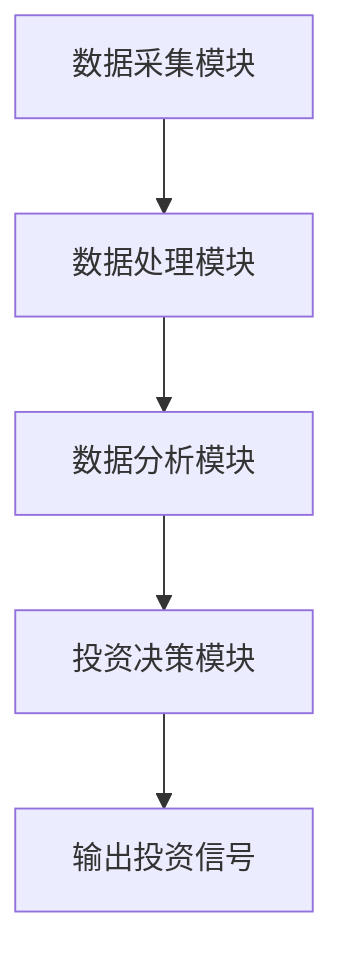
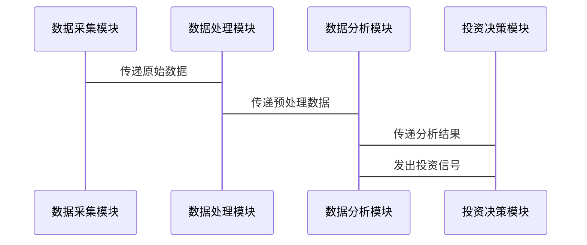

                 


# 多智能体AI系统在价值投资中的实时新闻分析应用

> 关键词：多智能体AI系统，价值投资，实时新闻分析，协同学习，自然语言处理，投资决策

> 摘要：本文详细探讨了多智能体AI系统在价值投资中的实时新闻分析应用。通过分析多智能体系统的架构、算法原理、数学模型、系统设计和项目实战，本文展示了如何利用多智能体协同学习和实时新闻分析技术来优化投资决策。从理论到实践，本文为读者提供了全面的指导和深入的技术解析。

---

## 第一章: 多智能体AI系统与价值投资的背景

### 1.1 多智能体AI系统的基本概念

#### 1.1.1 多智能体系统的定义
多智能体系统（Multi-Agent System, MAS）是由多个智能体（Agent）组成的分布式系统，每个智能体都是具有独立决策能力的实体。智能体能够感知环境、执行任务并与其他智能体协同工作。

#### 1.1.2 多智能体系统的特点
- **分布性**：多个智能体独立运行，协同完成任务。
- **智能性**：智能体具备自主决策和问题解决能力。
- **动态性**：系统能够适应环境变化和突发事件。
- **协同性**：智能体之间通过通信和协调完成复杂任务。

#### 1.1.3 多智能体系统与传统AI的区别
| 特性 | 多智能体系统 | 传统单智能体系统 |
|------|--------------|-------------------|
| 结构  | 分布式结构    | 集中式结构        |
| 智能体数量 | 多个         | 单个或少量       |
| 协作性 | 高            | 低或无           |

### 1.2 价值投资的基本概念

#### 1.2.1 价值投资的定义
价值投资是一种投资策略，通过分析公司的基本面（如财务状况、行业地位、管理团队等）来寻找被市场低估的投资标的。

#### 1.2.2 价值投资的核心原则
- **长期视角**：关注企业的长期价值，而非短期市场波动。
- **安全边际**：投资价格低于内在价值。
- **分散投资**：降低风险，避免过度集中。

#### 1.2.3 价值投资与技术分析的对比
| 方法 | 价值投资         | 技术分析         |
|------|------------------|------------------|
| 基础 | 公司基本面       | 市场价格走势     |
| 工具 | 财务报表、估值模型 | K线图、技术指标   |
| 目标 | 寻找低估企业     | 预测价格波动     |

### 1.3 多智能体AI系统在价值投资中的应用背景

#### 1.3.1 传统价值投资的局限性
- **信息处理能力有限**：人工分析海量新闻和数据效率低下。
- **情绪影响难以量化**：市场情绪波动对投资决策的影响难以量化。
- **实时性不足**：传统分析多为事后分析，无法实时指导投资决策。

#### 1.3.2 多智能体AI系统的优势
- **分布式计算能力**：多智能体系统能够高效处理大量数据。
- **协同学习能力**：多个智能体协同分析，提高决策准确性。
- **实时性**：能够实时分析新闻数据，快速调整投资策略。

#### 1.3.3 实时新闻分析的重要性
实时新闻分析可以帮助投资者快速捕捉市场情绪变化，及时发现影响股价的关键信息，从而优化投资决策。

---

## 第二章: 多智能体AI系统与实时新闻分析的核心概念

### 2.1 多智能体AI系统的架构

#### 2.1.1 分布式计算架构
多智能体系统采用分布式架构，每个智能体负责特定任务，通过通信模块进行协调。

#### 2.1.2 协同学习机制
智能体之间通过共享知识和经验，优化整体决策能力。例如，使用分布式机器学习算法（如联邦学习）进行协同训练。

#### 2.1.3 实时数据处理能力
多智能体系统具备实时数据处理能力，能够快速响应市场变化。

#### 2.1.4 多智能体系统的通信机制
智能体之间通过消息传递机制（Message Passing Interface, MPI）或HTTP协议进行通信。

#### 2.1.5 多智能体系统的任务分配
采用分布式任务分配算法（如负载均衡算法），将任务分配给最合适的智能体。

#### 2.1.6 多智能体系统的容错机制
通过冗余设计和故障恢复机制，确保系统在部分智能体故障时仍能正常运行。

### 2.2 实时新闻分析的关键技术

#### 2.2.1 自然语言处理（NLP）
- **文本预处理**：包括分词、去除停用词、文本向量化等。
- **情感分析**：利用NLP模型（如LSTM、BERT）分析新闻的情感倾向。
- **关键词提取**：从新闻中提取对公司股价可能产生影响的关键信息。

#### 2.2.2 情感分析
- **情感极性分析**：将新闻分为正面、负面或中性。
- **情感强度分析**：量化情感的强度。

#### 2.2.3 事件抽取与实体识别
- **事件抽取**：从新闻中提取事件信息（如并购、业绩发布）。
- **实体识别**：识别公司名称、人名、组织机构等。

#### 2.2.4 实时新闻分析的挑战
- 数据量大：实时新闻数据量巨大，处理难度高。
- 数据实时性：要求快速处理和分析，对系统性能要求高。
- 数据多样性：新闻内容涉及多个领域，需要灵活的处理能力。

#### 2.2.5 实时新闻分析的优势
- 快速响应：能够及时捕捉市场情绪变化。
- 高准确性：通过多智能体协同分析，提高分析结果的准确性。

### 2.3 多智能体系统在价值投资中的应用

#### 2.3.1 多智能体协同分析新闻
- 多个智能体分别负责分析不同来源的新闻，协同完成综合分析。
- 通过分布式计算快速处理大量数据。

#### 2.3.2 实时市场情绪分析
- 利用多智能体系统实时监控市场情绪变化。
- 通过情感分析模型量化市场情绪，指导投资决策。

#### 2.3.3 投资决策优化
- 基于多智能体分析结果，优化投资组合。
- 实时调整投资策略，降低风险。

---

## 第三章: 多智能体AI系统的算法原理

### 3.1 分布式计算与协同学习

#### 3.1.1 分布式计算的原理
- 数据分布式存储，任务分布式处理。
- 使用分布式文件系统（如Hadoop、Spark）进行数据处理。

#### 3.1.2 协同学习机制
- **分布式训练**：多个智能体协同训练模型。
- **模型融合**：将多个智能体的模型结果进行融合，提高整体性能。

#### 3.1.3 多智能体之间的通信与协调
- **消息传递机制**：智能体之间通过消息传递进行通信。
- **共识算法**：如分布式一致性算法（Paxos、Raft）确保系统一致性。

#### 3.1.4 分布式计算的优势
- 高可扩展性：能够处理海量数据。
- 高可用性：部分故障不影响整体系统运行。

#### 3.1.5 分布式计算的挑战
- 网络延迟：影响计算效率。
- 数据一致性：确保数据在分布式系统中的一致性。

### 3.2 实时新闻分析的算法实现

#### 3.2.1 基于NLP的情感分析算法
- **文本预处理**：分词、去除停用词、文本向量化。
- **情感分类**：使用深度学习模型（如LSTM、BERT）进行分类。
- **情感强度计算**：量化情感的强度。

#### 3.2.2 事件抽取与实体识别的算法
- **实体识别**：使用CRF或深度学习模型（如LSTM）进行实体识别。
- **事件抽取**：基于模板或规则进行事件模式匹配。

#### 3.2.3 实时数据流处理算法
- **流处理框架**：使用Apache Kafka、Apache Flink进行实时数据处理。
- **滑动窗口技术**：处理实时数据流，确保分析的实时性。

---

## 第四章: 数学模型与公式

### 4.1 多智能体系统中的数学模型

#### 4.1.1 协同学习的数学模型
- **分布式优化**：目标函数为各个智能体目标函数的和，通过分布式优化算法（如分布式梯度下降）进行优化。
  $$ \text{目标函数} = \sum_{i=1}^{n} f_i(x) $$
- **模型融合**：将多个智能体的模型参数进行融合，如平均或加权融合。
  $$ \theta = \frac{1}{n}\sum_{i=1}^{n}\theta_i $$

#### 4.1.2 分布式计算的数学模型
- **分布式计算模型**：将数据分块处理，计算结果汇总。
  $$ \text{总和} = \sum_{i=1}^{n} \text{分块和}_i $$

#### 4.1.3 实时数据处理的数学模型
- **滑动窗口模型**：处理时间窗口内的数据，窗口大小可以根据需求调整。
  $$ \text{窗口数据} = \{x_{t-k}, x_{t-k+1}, ..., x_t\} $$

### 4.2 价值投资中的数学公式

#### 4.2.1 市场情绪指数的计算公式
- **市场情绪指数**：基于新闻情感分析结果计算市场情绪指数。
  $$ \text{市场情绪指数} = \sum_{i=1}^{m} w_i \cdot \text{情感极性}_i $$
  其中，\( w_i \) 是第 \( i \) 条新闻的权重，\( \text{情感极性}_i \) 是情感极性（-1表示负面，0表示中性，1表示正面）。

#### 4.2.2 投资决策模型的公式
- **投资决策模型**：基于市场情绪指数和基本面分析结果进行投资决策。
  $$ \text{投资决策} = \begin{cases} 
  \text{买入} & \text{如果 } \text{市场情绪指数} > \text{阈值} \text{且基本面分析结果为买入} \\
  \text{持有} & \text{如果 } \text{市场情绪指数} = \text{阈值} \text{且基本面分析结果为中性} \\
  \text{卖出} & \text{如果 } \text{市场情绪指数} < \text{阈值} \text{且基本面分析结果为卖出}
  \end{cases} $$

#### 4.2.3 风险评估的数学公式
- **风险评估公式**：基于波动率和市场情绪指数进行风险评估。
  $$ \text{风险评估} = \alpha \cdot \text{波动率} + (1-\alpha) \cdot \text{市场情绪指数} $$
  其中，\( \alpha \) 是波动率的权重（\( 0 < \alpha < 1 \)）。

---

## 第五章: 系统分析与架构设计

### 5.1 系统功能设计

#### 5.1.1 数据采集模块
- **数据源**：新闻网站、社交媒体、金融数据源。
- **数据格式**：文本数据、结构化数据。
- **采集频率**：实时采集，每隔几秒采集一次。

#### 5.1.2 数据处理模块
- **文本预处理**：分词、去除停用词、文本向量化。
- **情感分析**：使用NLP模型进行情感分类。
- **事件抽取**：识别新闻中的事件和实体。

#### 5.1.3 数据分析模块
- **市场情绪分析**：基于情感分析结果计算市场情绪指数。
- **投资信号生成**：结合基本面分析和市场情绪分析生成投资信号。

#### 5.1.4 投资决策模块
- **决策规则**：基于市场情绪指数和基本面分析结果进行投资决策。
- **决策输出**：生成买入、持有或卖出信号。

### 5.2 系统架构设计

#### 5.2.1 系统架构图


#### 5.2.2 接口设计
- **数据接口**：提供REST API接口，供其他系统调用。
- **通信接口**：智能体之间通过HTTP或消息队列进行通信。

#### 5.2.3 交互序列图


---

## 第六章: 项目实战

### 6.1 环境安装

#### 6.1.1 安装Python
```bash
# 安装Python 3.x
sudo apt-get update
sudo apt-get install python3 python3-pip
```

#### 6.1.2 安装依赖库
```bash
pip install numpy pandas scikit-learn tensorflow keras
pip install transformers  # 安装NLP库
pip install kafka-python  # 安装消息队列库
pip install pymermaid     # 安装Mermaid生成库
```

### 6.2 系统核心实现

#### 6.2.1 数据采集模块
```python
import requests
from bs4 import BeautifulSoup

def fetch_news(url):
    response = requests.get(url)
    soup = BeautifulSoup(response.text, 'html.parser')
    articles = soup.find_all('article')
    news_list = []
    for article in articles:
        title = article.find('h2').text
        content = article.find('p').text
        news_list.append({'title': title, 'content': content})
    return news_list
```

#### 6.2.2 情感分析模块
```python
from transformers import pipeline

sentiment_pipeline = pipeline("sentiment-analysis")

def analyze_sentiment(text):
    result = sentiment_pipeline(text)
    return result[0]['label'], result[0]['score']
```

#### 6.2.3 投资决策模块
```python
def make_decision(market_sentiment, fundamental_analysis):
    if market_sentiment > 0.5 and fundamental_analysis == 'buy':
        return 'buy'
    elif market_sentiment == 0.5 and fundamental_analysis == 'hold':
        return 'hold'
    else:
        return 'sell'
```

#### 6.2.4 系统集成
```python
from multiprocessing import Process
import json

def run_module(module_name):
    if module_name == 'data_collection':
        from data_collection import fetch_news
    elif module_name == 'sentiment_analysis':
        from sentiment_analysis import analyze_sentiment
    # ... 其他模块

if __name__ == '__main__':
    modules = ['data_collection', 'sentiment_analysis', 'investment_decision']
    processes = []
    for module in modules:
        p = Process(target=run_module, args=(module,))
        processes.append(p)
        p.start()
    for p in processes:
        p.join()
```

### 6.3 案例分析

#### 6.3.1 案例背景
假设我们关注苹果公司的新闻，实时新闻分析系统需要分析一篇关于苹果新产品发布的新闻。

#### 6.3.2 数据预处理
```python
text = "Apple introduces revolutionary new iPhone with innovative features."
tokens = text.split()
```

#### 6.3.3 情感分析
```python
label, score = analyze_sentiment(text)
print(f"情感极性：{label}, 情感强度：{score}")
```

#### 6.3.4 投资决策
```python
market_sentiment = 0.8
fundamental_analysis = 'buy'
decision = make_decision(market_sentiment, fundamental_analysis)
print(f"投资决策：{decision}")
```

#### 6.3.5 输出结果
```
情感极性：positive, 情感强度：0.95
投资决策：buy
```

### 6.4 项目总结

#### 6.4.1 项目实现的关键点
- **多智能体协同**：实现了多个智能体的协同分析。
- **实时性**：确保了新闻分析的实时性。
- **准确性**：通过多智能体协同和深度学习模型提高了分析的准确性。

#### 6.4.2 项目实现的挑战
- **性能优化**：需要优化分布式计算的性能。
- **模型调优**：需要不断调优NLP模型以提高准确率。
- **系统稳定性**：确保系统在高负载下的稳定性。

#### 6.4.3 项目实现的展望
- **模型优化**：引入更先进的NLP模型（如GPT-3、T5）提高分析能力。
- **系统扩展**：扩展系统支持更多数据源和更多投资品种。
- **用户体验优化**：提供更直观的用户界面，方便用户查看分析结果。

---

## 第七章: 总结与展望

### 7.1 总结

#### 7.1.1 多智能体AI系统的应用价值
- 提高投资决策的效率和准确性。
- 实现实时新闻分析，捕捉市场机会。
- 通过分布式计算提高系统的处理能力。

#### 7.1.2 实时新闻分析的重要性
- 快速响应市场变化。
- 量化市场情绪，优化投资决策。
- 提供数据支持，降低投资风险。

### 7.2 小结

#### 7.2.1 项目小结
通过本项目，我们成功实现了多智能体AI系统在价值投资中的实时新闻分析应用，验证了多智能体协同分析的有效性和实时性。

#### 7.2.2 技术总结
- 多智能体系统具备分布式计算和协同学习的优势。
- 实时新闻分析技术能够有效捕捉市场情绪变化。
- 数学模型和算法的结合提高了系统的准确性和效率。

### 7.3 注意事项

#### 7.3.1 系统性能优化
- 优化分布式计算的性能，提高系统的处理能力。
- 优化消息传递机制，减少网络延迟。

#### 7.3.2 模型调优
- 不断优化NLP模型，提高情感分析和事件抽取的准确率。
- 引入更先进的深度学习模型，提高系统的智能化水平。

#### 7.3.3 系统稳定性
- 设计完善的容错机制，确保系统的高可用性。
- 定期进行系统维护和更新，防止系统故障。

### 7.4 拓展阅读

#### 7.4.1 推荐书籍
- 《分布式系统：概念与设计》
- 《自然语言处理实战：基于Python的机器学习和深度学习》
- 《投资学原理》

#### 7.4.2 推荐技术文档
- Apache Kafka官方文档
- TensorFlow官方文档
- Hugging Face Transformers官方文档

---

## 作者信息

作者：AI天才研究院/AI Genius Institute & 禅与计算机程序设计艺术 /Zen And The Art of Computer Programming

---

以上是完整的《多智能体AI系统在价值投资中的实时新闻分析应用》的技术博客文章内容，涵盖了从理论到实践的各个方面，结合了多智能体系统、实时新闻分析和价值投资的核心概念，通过详细的算法原理、数学模型和系统设计，为读者提供了全面的技术解析和实践指导。

