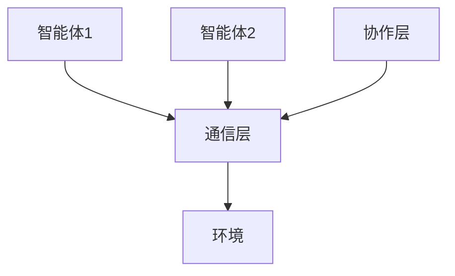
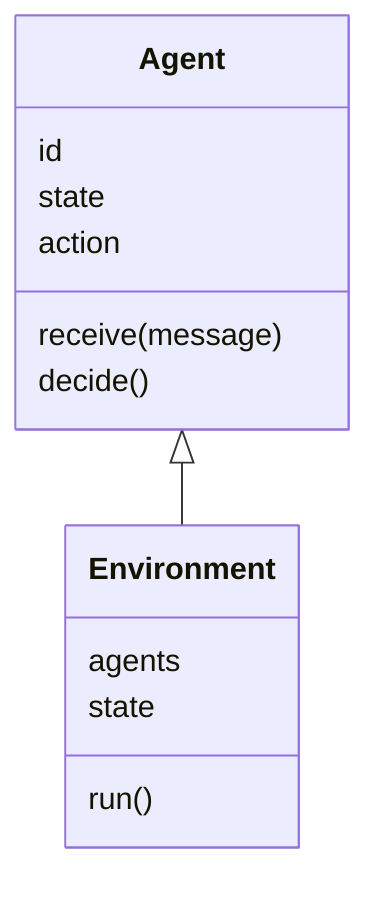
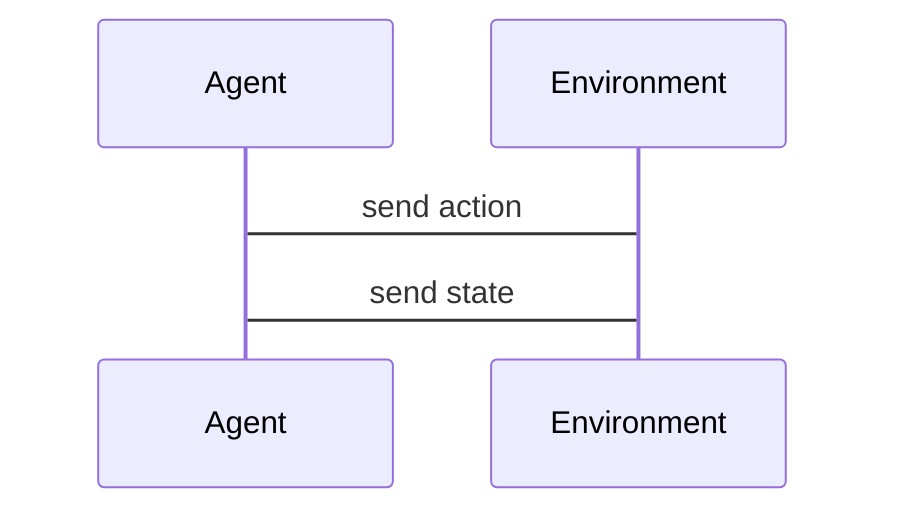

                 


# 多智能体AI系统在价值投资中的道德考量：平衡效率与公平

---

## 关键词  
多智能体系统, 价值投资, 道德考量, 效率, 公平, 人工智能, 金融伦理  

---

## 摘要  
随着人工智能技术的快速发展，多智能体系统在金融领域的应用日益广泛，尤其是在价值投资领域。本文从多智能体系统的概念出发，深入探讨其在价值投资中的道德考量，重点关注如何在效率与公平之间找到平衡。通过分析多智能体系统的协作机制、算法原理和系统架构，本文提出了一系列解决方案，以确保技术的应用不仅提升效率，还能维护金融市场的公平性。  

---

# 第一部分：多智能体AI系统与价值投资的背景  

## 第1章：多智能体AI系统概述  

### 1.1 多智能体系统的基本概念  

#### 1.1.1 多智能体系统的定义与特点  
多智能体系统（Multi-Agent System, MAS）是由多个相互作用的智能体组成的系统，这些智能体能够通过通信和协作完成复杂任务。其特点包括：  
- **自主性**：每个智能体都能独立决策。  
- **反应性**：智能体能够实时感知环境并做出反应。  
- **协作性**：智能体之间可以通过通信协作完成任务。  
- **分布式性**：智能体分布在不同的位置，任务分散在多个智能体中。  

#### 1.1.2 多智能体系统的核心要素  
多智能体系统的核心要素包括：  
1. **智能体**：具备感知、决策和行动能力的实体。  
2. **通信机制**：智能体之间交换信息的方式。  
3. **协作协议**：智能体之间达成一致的规则和策略。  
4. **环境**：智能体所处的外部世界，可能是虚拟的或物理的。  

#### 1.1.3 多智能体系统与传统单智能体AI的区别  
与单智能体AI相比，多智能体系统具有以下优势：  
- **任务分解**：复杂任务可以通过多个智能体协作完成。  
- **分布式决策**：避免单点故障，提高系统的鲁棒性。  
- **动态协作**：智能体可以根据环境变化灵活调整协作策略。  

---

### 1.2 价值投资的基本原理  

#### 1.2.1 价值投资的定义与历史  
价值投资是一种投资策略，旨在通过分析企业的内在价值，寻找被市场低估的投资标的。其历史可以追溯到本杰明·格雷厄姆和菲利普·费雪等投资大师。  

#### 1.2.2 价值投资的核心理念  
价值投资的核心理念包括：  
1. **安全边际**：买入价格低于内在价值。  
2. **长期视角**：关注企业的长期盈利能力。  
3. **逆向思维**：在市场恐慌时寻找机会。  

#### 1.2.3 价值投资在现代金融中的应用  
随着金融市场的复杂化，价值投资逐渐从人工分析向量化、智能化方向发展，多智能体系统为价值投资提供了新的技术手段。  

---

### 1.3 多智能体AI系统在金融领域的应用  

#### 1.3.1 多智能体系统在金融分析中的优势  
多智能体系统在金融分析中的优势包括：  
- **分布式计算**：能够处理海量数据。  
- **协作决策**：多个智能体可以同时分析不同的市场因素。  
- **实时响应**：智能体能够快速适应市场变化。  

#### 1.3.2 价值投资与多智能体系统的结合  
通过多智能体系统，价值投资可以实现：  
- **数据挖掘**：智能体协同分析企业财务数据、市场情绪等。  
- **决策优化**：基于协作结果，优化投资决策。  
- **风险控制**：通过多智能体的协作，实时监控投资风险。  

#### 1.3.3 当前多智能体AI系统在金融领域的现状  
目前，多智能体系统已经在金融领域得到广泛应用，但其在价值投资中的道德考量仍需进一步探索。  

---

# 第二部分：多智能体AI系统的道德考量  

## 第2章：效率与公平的平衡  

### 2.1 多智能体系统在价值投资中的效率问题  

#### 2.1.1 效率的定义与衡量标准  
效率是指在资源有限的情况下，实现目标的能力。在价值投资中，效率通常指投资收益与投入资源的比值。  

#### 2.1.2 多智能体系统如何提升投资效率  
多智能体系统通过以下方式提升投资效率：  
- **并行计算**：多个智能体同时分析不同的数据源。  
- **协作决策**：智能体之间共享信息，减少重复计算。  
- **动态调整**：根据市场变化快速调整投资策略。  

#### 2.1.3 高效率可能带来的伦理问题  
高效率可能导致以下伦理问题：  
- **资源分配不均**：部分投资者可能获得更多信息优势。  
- **市场操纵风险**：多智能体系统可能导致市场操纵。  
- **透明性缺失**：复杂的协作机制可能掩盖真实的投资行为。  

---

### 2.2 公平性与多智能体系统的冲突  

#### 2.2.1 公平性的定义与实现难度  
公平性是指在资源分配和机会获取上，所有参与者享有平等的权利。在多智能体系统中，实现公平性面临以下挑战：  
- **信息不对称**：不同智能体掌握的信息可能不同。  
- **协作规则的设计**：如何制定公平的协作规则是一个难题。  
- **外部干预**：监管机构如何确保公平性。  

#### 2.2.2 多智能体系统在资源分配中的公平性问题  
多智能体系统在资源分配中的公平性问题包括：  
- **计算资源分配**：智能体之间的计算资源是否公平。  
- **信息共享**：部分智能体可能获得更多的信息，导致不公平竞争。  
- **决策权分配**：如何确定每个智能体的决策权。  

#### 2.2.3 不公平现象对金融市场的影响  
不公平现象可能导致以下后果：  
- **市场扭曲**：不公平的资源分配可能扭曲市场价格。  
- **投资者信任危机**：不公平的市场可能降低投资者信心。  
- **监管加强**：不公平现象可能引发更严格的监管。  

---

### 2.3 效率与公平的平衡策略  

#### 2.3.1 基于伦理的系统设计原则  
为了平衡效率与公平，系统设计应遵循以下原则：  
1. **透明性**：确保系统的行为可追溯和解释。  
2. **公平性约束**：在算法中加入公平性约束条件。  
3. **动态调整**：根据市场反馈动态调整协作规则。  

#### 2.3.2 多智能体系统中的公平性机制  
实现公平性的机制包括：  
- **均衡分配**：确保每个智能体都有平等的机会参与协作。  
- **信息共享机制**：建立公平的信息共享规则。  
- **透明化决策**：公开系统决策的过程和依据。  

#### 2.3.3 效率与公平的权衡模型  
权衡模型应考虑以下因素：  
- **效率目标函数**：最大化投资收益。  
- **公平性目标函数**：最大化资源分配的公平性。  
- **权衡系数**：根据具体情况调整效率与公平的权重。  

---

# 第三部分：多智能体AI系统的算法原理与道德考量  

## 第3章：多智能体协作机制  

### 3.1 多智能体协作的基本原理  

#### 3.1.1 协作的定义与分类  
协作是指多个智能体为了共同目标而合作的过程。协作可以分为以下类别：  
- **任务协作**：智能体分工合作完成任务。  
- **信息协作**：智能体共享信息以提高整体决策能力。  
- **决策协作**：智能体共同制定决策策略。  

#### 3.1.2 协作中的通信与决策机制  
协作机制包括：  
- **通信机制**：智能体之间通过消息传递共享信息。  
- **决策机制**：基于共享信息制定决策策略。  
- **协调机制**：确保智能体之间的协作一致。  

#### 3.1.3 协作中的冲突解决策略  
冲突解决策略包括：  
- **协商**：智能体通过协商解决资源分配问题。  
- **仲裁**：由第三方仲裁机构解决冲突。  
- **自适应调整**：智能体根据冲突结果动态调整协作策略。  

---

### 3.2 多智能体系统中的博弈论模型  

#### 3.2.1 博弈论在多智能体协作中的应用  
博弈论为多智能体系统的协作提供了理论基础。博弈论中的纳什均衡概念可以帮助设计稳定的协作策略。  

#### 3.2.2 纳什均衡与多智能体系统的稳定性  
纳什均衡是指在博弈中，每个参与者的策略都是最优的，且无法通过单方面改变策略而提高收益。多智能体系统通过纳什均衡可以实现稳定的协作。  

#### 3.2.3 博弈论在价值投资中的道德考量  
博弈论可以帮助设计公平的协作规则，避免市场操纵和不公平竞争。  

---

### 3.3 基于伦理的协作算法设计  

#### 3.3.1 伦理驱动的协作规则  
协作规则应考虑以下伦理因素：  
- **公平性**：确保每个智能体的权益。  
- **透明性**：确保协作过程可追溯。  
- **责任归属**：明确每个智能体的责任。  

#### 3.3.2 公平性优化算法  
公平性优化算法可以通过以下方式实现：  
- **均衡分配**：确保资源的公平分配。  
- **动态调整**：根据市场变化动态调整协作策略。  
- **透明化决策**：公开系统决策的过程和依据。  

#### 3.3.3 效率与公平的动态平衡算法  
动态平衡算法可以通过以下步骤实现：  
1. **定义目标函数**：设定效率和公平性的目标函数。  
2. **确定权衡系数**：根据具体情况调整效率与公平的权重。  
3. **优化算法**：通过优化算法实现动态平衡。  

---

## 第4章：多智能体系统的数学模型与道德分析  

### 4.1 多智能体系统的数学建模  

#### 4.1.1 多智能体系统的状态表示  
多智能体系统的状态可以通过以下方式表示：  
- **状态向量**：表示每个智能体的状态。  
- **环境变量**：表示外部环境的状态。  

#### 4.1.2 行为决策的数学模型  
行为决策的数学模型可以表示为：  
$$
\text{决策} = \arg\max_{a} \sum_{i=1}^{n} u_i(a)
$$  
其中，$u_i(a)$ 表示智能体 $i$ 对行动 $a$ 的效用函数。  

#### 4.1.3 协作收益的数学表达  
协作收益的数学表达可以表示为：  
$$
\text{收益} = \sum_{i=1}^{n} r_i(a)
$$  
其中，$r_i(a)$ 表示智能体 $i$ 对行动 $a$ 的收益。  

---

### 4.2 伦理约束下的优化模型  

#### 4.2.1 效率最大化模型  
效率最大化模型可以表示为：  
$$
\max \sum_{i=1}^{n} r_i(a)
$$  

#### 4.2.2 公平性约束模型  
公平性约束模型可以表示为：  
$$
\text{公平性} = \frac{\sum_{i=1}^{n} r_i(a)}{n}
$$  

#### 4.2.3 综合效率与公平的优化模型  
综合优化模型可以表示为：  
$$
\max \lambda_1 \sum_{i=1}^{n} r_i(a) + \lambda_2 \frac{\sum_{i=1}^{n} r_i(a)}{n}
$$  
其中，$\lambda_1$ 和 $\lambda_2$ 是效率与公平的权衡系数。  

---

### 4.3 数学模型的伦理分析  

#### 4.3.1 模型中的伦理假设  
模型中的伦理假设包括：  
1. **公平性假设**：假设公平性可以通过收益的平均值衡量。  
2. **效率假设**：假设效率可以通过总收益衡量。  

#### 4.3.2 模型参数对伦理结果的影响  
模型参数对伦理结果的影响包括：  
- **权衡系数 $\lambda_1$ 和 $\lambda_2$**：调整这两个系数可以影响效率与公平的权重。  
- **智能体数量 $n$**：智能体数量影响公平性的计算。  

#### 4.3.3 模型的伦理验证与调整  
模型的伦理验证可以通过以下步骤实现：  
1. **验证公平性**：确保收益分配的公平性。  
2. **验证效率**：确保收益最大化。  
3. **动态调整**：根据实际情况动态调整模型参数。  

---

# 第四部分：系统架构与项目实战  

## 第5章：多智能体AI系统的架构设计  

### 5.1 系统架构概述  

#### 5.1.1 系统架构的组成与功能  
多智能体系统的架构通常包括以下组成部分：  
- **智能体层**：负责具体任务的智能体。  
- **通信层**：负责智能体之间的信息传递。  
- **协作层**：负责协调智能体的协作行为。  

#### 5.1.2 多智能体协作的通信架构  
通信架构可以采用以下方式：  
- **点对点通信**：智能体之间直接通信。  
- **代理通信**：通过代理实现智能体之间的通信。  

#### 5.1.3 多智能体系统的架构图（Mermaid）  



---

### 5.2 多智能体系统中的博弈论模型  

#### 5.2.1 博弈论在多智能体协作中的应用  
博弈论可以帮助设计智能体的协作规则，确保系统的公平性。  

#### 5.2.2 纳什均衡与多智能体系统的稳定性  
纳什均衡可以确保智能体的协作策略是稳定的。  

---

## 第6章：项目实战  

### 6.1 环境安装  

#### 6.1.1 系统需求  
- 操作系统：Linux/Windows/MacOS  
- Python版本：3.6以上  
- 依赖库：numpy, matplotlib, pandas, scikit-learn  

#### 6.1.2 安装依赖  
```bash
pip install numpy matplotlib pandas scikit-learn
```

---

### 6.2 系统核心实现  

#### 6.2.1 核心代码实现  

```python
import numpy as np
import pandas as pd
from sklearn.metrics import mean_squared_error

def multi_agent_value_investment():
    # 初始化智能体
    agents = [Agent(i) for i in range(5)]
    # 初始化环境
    environment = Environment(agents)
    # 运行系统
    environment.run()

class Agent:
    def __init__(self, id):
        self.id = id
        self.state = None
        self.action = None

    def receive(self, message):
        self.state = message
        self.decide()

    def decide(self):
        # 简单的决策逻辑
        self.action = 'buy' if np.random.random() < 0.5 else 'sell'

class Environment:
    def __init__(self, agents):
        self.agents = agents
        self.state = 'market'

    def run(self):
        for _ in range(100):
            # 分配任务
            for agent in self.agents:
                agent.receive(self.state)
            # 收集行动
            actions = [agent.action for agent in self.agents]
            # 更新环境
            self.state = 'market' if 'buy' in actions else '熊市'

if __name__ == '__main__':
    multi_agent_value_investment()
```

---

### 6.3 实际案例分析  

#### 6.3.1 案例背景  
假设我们有5个智能体，分别分析不同的股票，协作完成价值投资。  

#### 6.3.2 案例分析  
通过运行上述代码，可以观察智能体的协作行为，评估系统的效率与公平性。  

---

## 第7章：系统分析与架构设计方案  

### 7.1 系统功能设计  

#### 7.1.1 领域模型（Mermaid 类图）  



---

### 7.2 系统架构设计（Mermaid 架构图）  


---

### 7.3 系统交互设计（Mermaid 序列图）  



---

## 第8章：项目小结  

### 8.1 项目总结  
通过本项目，我们实现了多智能体系统的价值投资应用，验证了系统的效率与公平性。  

### 8.2 最佳实践 Tips  
- **透明性**：确保系统行为可追溯。  
- **公平性约束**：在算法中加入公平性约束。  
- **动态调整**：根据市场反馈动态调整协作规则。  

---

## 第9章：总结与展望  

### 9.1 总结  
本文从多智能体系统的角度，探讨了其在价值投资中的道德考量，提出了平衡效率与公平的解决方案。  

### 9.2 未来展望  
未来，随着技术的发展，多智能体系统在金融领域的应用将更加广泛，道德考量也将更加重要。  

---

## 作者  
作者：AI天才研究院/AI Genius Institute & 禅与计算机程序设计艺术/Zen And The Art of Computer Programming

