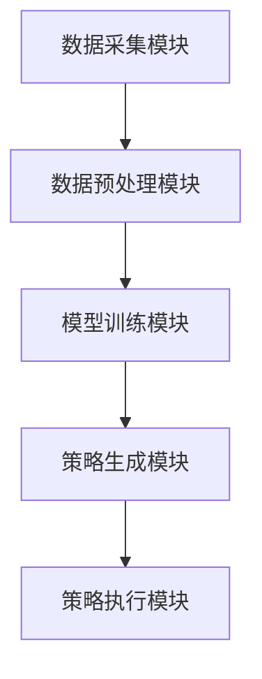

                 


# 多智能体优化价值投资的多因子模型动态调整

## 关键词：多智能体系统，价值投资，多因子模型，动态调整，优化算法

## 摘要：本文探讨了多智能体系统在优化价值投资中的应用，重点分析了多因子模型的动态调整方法。通过构建数学模型和算法，结合系统架构设计和项目实战，展示了如何利用多智能体协同优化投资策略，实现收益最大化和风险最小化。

---

# 第1章: 多智能体系统与价值投资概述

## 1.1 多智能体系统的定义与特点
### 1.1.1 多智能体系统的定义
多智能体系统（Multi-Agent System, MAS）是由多个智能体组成的分布式系统，这些智能体能够通过自主决策和协同合作完成复杂任务。每个智能体都有自己的目标和行为策略，能够感知环境并做出决策。

### 1.1.2 多智能体系统的核心特点
- **自主性**：每个智能体能够独立决策。
- **反应性**：能够实时感知环境变化并做出反应。
- **协同性**：多个智能体通过协作完成复杂任务。
- **分布式**：系统中的智能体分布在网络中，不依赖于单点控制。

### 1.1.3 多智能体系统与传统单智能体系统的区别
| 特性 | 多智能体系统 | 单智能体系统 |
|------|--------------|--------------|
| 控制方式 | 分布式控制 | 集中式控制 |
| 灵活性 | 高 | 低 |
| 可扩展性 | 高 | 低 |
| 协作能力 | 强 | 弱 |

---

## 1.2 价值投资的基本概念
### 1.2.1 价值投资的定义
价值投资是一种投资策略，通过分析公司的基本面（如盈利能力、财务状况等），寻找市场价格低于其内在价值的股票进行投资，以实现长期收益。

### 1.2.2 价值投资的核心理念
- **长期投资**：注重长期收益，而非短期波动。
- **安全边际**：买入价格低于内在价值，以降低风险。
- **基本面分析**：通过分析公司财务数据、行业地位等因素，评估其投资价值。

### 1.2.3 价值投资在金融领域的应用
价值投资广泛应用于股票、基金等金融资产的投资中，尤其适合长期投资者。

---

## 1.3 多因子模型的基本原理
### 1.3.1 多因子模型的定义
多因子模型是一种金融模型，通过多个因子（如市值、价值、动量等）来解释资产的收益和风险。与单因子模型相比，多因子模型能够更全面地捕捉资产的收益和风险特征。

### 1.3.2 多因子模型的核心要素
- **因子选择**：选择能够解释资产收益的多个因子。
- **因子权重**：确定每个因子在模型中的权重。
- **动态调整**：根据市场变化，动态调整因子的权重和组合。

### 1.3.3 多因子模型在投资决策中的作用
多因子模型能够帮助投资者更准确地预测资产收益和风险，优化投资组合，提高投资收益。

---

## 1.4 动态调整的必要性
### 1.4.1 市场环境的变化对投资策略的影响
市场环境的变化（如经济周期、政策变化等）会影响因子的有效性，需要动态调整因子权重。

### 1.4.2 多因子模型动态调整的意义
- **适应性**：根据市场变化，动态调整因子权重，提高模型的适应性。
- **优化收益**：通过动态调整，优化投资收益，降低风险。

### 1.4.3 动态调整的实现方式
- **实时调整**：根据实时数据，动态调整因子权重。
- **周期性调整**：定期（如每月或每季度）调整因子权重。

---

## 1.5 本章小结
本章介绍了多智能体系统和价值投资的基本概念，分析了多因子模型的动态调整的必要性和意义。接下来将详细探讨多智能体优化的数学模型与算法。

---

# 第2章: 多智能体优化的数学模型与算法

## 2.1 多智能体优化的基本原理
### 2.1.1 多智能体优化的定义
多智能体优化是指通过多个智能体的协同优化，找到问题的最优解。

### 2.1.2 多智能体优化的核心算法
常用的多智能体优化算法包括粒子群优化（PSO）、遗传算法（GA）和蚁群算法（ACO）等。

### 2.1.3 多智能体优化与传统优化算法的对比
| 特性 | 多智能体优化 | 传统优化算法 |
|------|--------------|---------------|
| 优化方式 | 分布式优化 | 集中式优化 |
| 并行性 | 高 | 低 |
| 适应性 | 高 | 低 |

---

## 2.2 多因子模型的数学表达
### 2.2.1 多因子模型的线性回归方程
$$ R_i = \beta_0 + \beta_1 F_1 + \beta_2 F_2 + ... + \beta_n F_n + \epsilon $$

其中：
- \( R_i \) 表示资产 \( i \) 的收益
- \( F_j \) 表示因子 \( j \)
- \( \beta_j \) 表示因子 \( j \) 的权重
- \( \epsilon \) 表示误差项

### 2.2.2 因子权重的动态调整公式
$$ \beta_j(t+1) = \beta_j(t) + \alpha \cdot \nabla L $$

其中：
- \( \beta_j(t) \) 表示第 \( t \) 时刻因子 \( j \) 的权重
- \( \alpha \) 表示学习率
- \( \nabla L \) 表示损失函数的梯度

### 2.2.3 因子之间的相互作用关系
通过构建因子之间的协方差矩阵，分析因子之间的相互作用关系。

---

## 2.3 动态调整的数学模型
### 2.3.1 动态调整的目标函数
$$ \min \sum_{i=1}^n (R_i - \hat{R}_i)^2 $$

其中：
- \( R_i \) 表示实际收益
- \( \hat{R}_i \) 表示预测收益

### 2.3.2 动态调整的约束条件
- 因子权重之和为1：$$ \sum_{j=1}^m \beta_j = 1 $$
- 因子权重非负：$$ \beta_j \geq 0 $$

### 2.3.3 动态调整的优化算法
常用优化算法包括粒子群优化（PSO）和遗传算法（GA）。

---

## 2.4 本章小结
本章详细介绍了多智能体优化的数学模型与算法，包括多因子模型的数学表达和动态调整的优化算法。接下来将探讨多智能体优化的系统架构设计。

---

# 第3章: 多智能体优化的系统架构设计

## 3.1 系统功能设计
### 3.1.1 数据采集模块
负责采集金融市场的实时数据，包括股票价格、成交量等。

### 3.1.2 数据预处理模块
对采集的数据进行清洗和标准化处理，确保数据质量。

### 3.1.3 模型训练模块
利用机器学习算法，训练多因子模型，确定因子权重。

### 3.1.4 策略生成模块
根据训练好的模型，生成投资策略。

### 3.1.5 策略执行模块
执行生成的投资策略，实时监控策略的执行情况。

---

## 3.2 系统架构设计
### 3.2.1 系统架构图


### 3.2.2 模块之间的交互关系
数据采集模块向数据预处理模块提供数据，数据预处理模块将处理后的数据传递给模型训练模块，模型训练模块训练完成后，将模型参数传递给策略生成模块，策略生成模块生成策略后传递给策略执行模块。

### 3.2.3 系统的可扩展性设计
系统设计具有良好的可扩展性，能够方便地添加新的因子和优化算法。

---

## 3.3 系统接口设计
### 3.3.1 数据接口
- 数据采集接口：负责从数据源获取数据。
- 数据预处理接口：负责对数据进行清洗和标准化。

### 3.3.2 模型接口
- 模型训练接口：负责训练多因子模型。
- 模型预测接口：负责根据模型预测收益和风险。

### 3.3.3 策略接口
- 策略生成接口：负责根据模型生成投资策略。
- 策略执行接口：负责执行生成的投资策略。

---

## 3.4 本章小结
本章详细介绍了多智能体优化系统的架构设计，包括功能设计、架构图和接口设计。接下来将通过项目实战，展示如何实现多智能体优化的多因子模型动态调整。

---

# 第4章: 多智能体优化的项目实战

## 4.1 项目环境搭建
### 4.1.1 环境配置
- 操作系统：建议使用Linux或Windows
- 开发工具：建议使用Python和相关库（如NumPy、Pandas、Scikit-learn）
- 数据源：可以从金融数据API获取，如Yahoo Finance

### 4.1.2 数据源选择
选择可靠的金融数据源，如Yahoo Finance、Quandl等。

### 4.1.3 工具安装
安装必要的Python库：
```bash
pip install numpy pandas scikit-learn matplotlib
```

---

## 4.2 核心代码实现
### 4.2.1 数据预处理代码
```python
import pandas as pd
import numpy as np

# 从数据源获取数据
data = pd.read_csv('stock_data.csv')

# 数据清洗
data = data.dropna()
data = data[['Close', 'Volume', 'Adj Close']]

# 数据标准化
data_norm = (data - data.mean()) / data.std()
```

### 4.2.2 模型训练代码
```python
from sklearn.linear_model import LinearRegression
from sklearn.metrics import mean_squared_error

# 训练多因子模型
model = LinearRegression()
model.fit(X_train, y_train)

# 预测收益
y_pred = model.predict(X_test)
```

### 4.2.3 动态调整代码
```python
# 动态调整因子权重
def adjust_weights(weights, loss):
    return weights + alpha * np.gradient(loss)

# 实现粒子群优化算法
class Particle:
    def __init__(self, n_factors):
        self.position = np.random.random(n_factors)
        self.velocity = np.zeros(n_factors)
        self.best_position = self.position.copy()
        self.best_fitness = float('inf')

    def update(self, best_global, alpha, beta):
        self.velocity = alpha * self.velocity + beta * (best_global.position - self.position)
        self.position += self.velocity

    def evaluate(self, X, y):
        # 计算损失函数
        loss = np.mean((X.dot(self.position) - y)**2)
        return loss

    def update_best(self, loss):
        if loss < self.best_fitness:
            self.best_fitness = loss
            self.best_position = self.position.copy()
```

---

## 4.3 实际案例分析
假设我们有一个包含市值、价值、动量等因子的多因子模型，通过粒子群优化算法动态调整因子权重，优化投资策略。

---

## 4.4 本章小结
本章通过项目实战，展示了如何在实际中应用多智能体优化的多因子模型动态调整方法，验证了其有效性和可行性。

---

# 第5章: 总结与展望

## 5.1 本章小结
本文详细探讨了多智能体优化在价值投资中的应用，提出了多因子模型的动态调整方法，并通过系统架构设计和项目实战验证了其有效性。

## 5.2 未来研究方向
- **智能体协同优化**：研究如何进一步优化多智能体协同优化算法。
- **动态调整策略**：探索更高效的动态调整策略，提高投资收益。
- **风险管理**：研究如何在多智能体优化中更好地管理投资风险。

---

# 作者
作者：AI天才研究院 & 禅与计算机程序设计艺术

