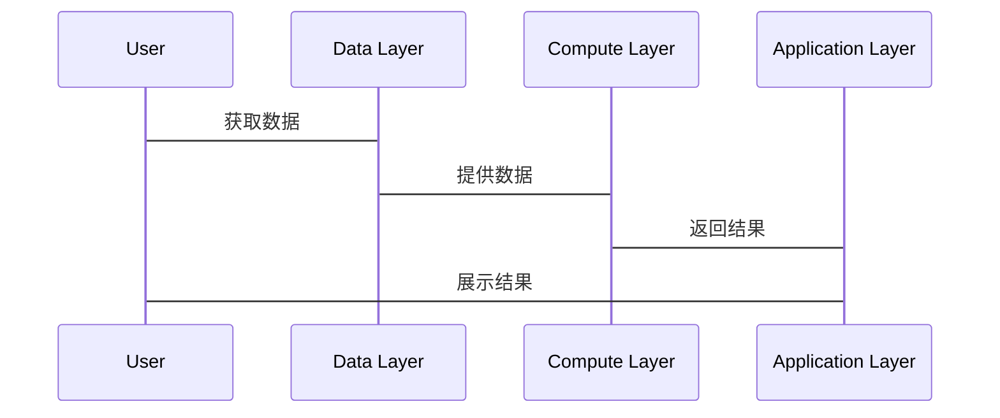

                 


# 多智能体优化价值投资的多因子模型自适应调整

> 关键词：多智能体优化，价值投资，多因子模型，自适应调整，投资组合优化

> 摘要：本文探讨了多智能体优化技术在价值投资中的应用，重点分析了多因子模型的自适应调整方法。通过结合多智能体系统的优势，提出了一种新型的投资组合优化框架，并通过实际案例验证了该方法的有效性。

---

## 第1章 多智能体优化与价值投资的背景介绍

### 1.1 多智能体优化的定义与特点

多智能体优化（Multi-Agent Optimization，MAO）是一种基于分布式智能体系统的技术，通过多个智能体的协同工作，实现复杂问题的最优解。与传统的单智能体优化方法相比，MAO具有以下特点：

- **分布式计算**：多个智能体独立决策，减少计算压力。
- **协同优化**：通过信息共享和协同，提高整体优化效果。
- **适应性更强**：智能体能够动态调整策略，适应环境变化。

### 1.2 价值投资与多因子模型的结合

#### 1.2.1 价值投资的定义与特点

价值投资是一种以基本面分析为基础的投资策略，旨在通过识别被市场低估的资产，长期持有以获取超额收益。其核心在于对资产内在价值的深入分析。

#### 1.2.2 多因子模型在金融分析中的应用

多因子模型通过多个因子（如市值、收益、流动性等）来解释资产的超额收益。常用模型包括Fama-French三因子模型和Carhart四因子模型。这些模型能够帮助投资者更全面地分析资产的风险和收益。

#### 1.2.3 多智能体优化在价值投资中的优势

多智能体优化能够同时优化多个因子，提高投资组合的效率。通过多个智能体分别优化不同的因子，最终实现整体收益的最大化。

### 1.3 多智能体优化价值投资的背景与意义

#### 1.3.1 传统投资分析的局限性

传统投资分析方法往往依赖单一因子，难以应对复杂多变的市场环境。例如，仅依赖市盈率筛选股票可能会忽略其他重要的风险因素。

#### 1.3.2 多智能体优化在现代投资中的应用前景

随着金融市场数据的复杂化，多智能体优化能够通过分布式计算和协同优化，帮助投资者应对复杂的决策问题。

#### 1.3.3 本书的研究目标与意义

本文旨在通过多智能体优化技术，实现多因子模型的自适应调整，为投资者提供更高效的投资组合优化方法。

---

## 第2章 多智能体优化与多因子模型的核心概念

### 2.1 多智能体优化的数学模型

多智能体优化的目标是最小化或最大化一个目标函数，同时满足一定的约束条件。

$$\min_{x_1, x_2, ..., x_n} f(x_1, x_2, ..., x_n)$$

约束条件可以表示为：

$$g(x_1, x_2, ..., x_n) \leq 0$$

### 2.2 多因子模型的构建与优化

#### 2.2.1 多因子模型的基本结构

多因子模型可以表示为：

$$R_i = \alpha + \beta_1F_1 + \beta_2F_2 + ... + \beta_kF_k + \epsilon$$

其中，$R_i$是资产的超额收益，$F_j$是因子，$\beta_j$是因子的权重，$\epsilon$是误差项。

#### 2.2.2 多因子模型的因子选择与权重分配

因子选择可以通过回归分析或信息准则（如AIC、BIC）来确定。权重分配可以通过优化算法实现。

#### 2.2.3 多因子模型的优化目标

多因子模型的优化目标是最大化投资组合的超额收益，同时控制风险。

### 2.3 多智能体优化与多因子模型的关系

#### 2.3.1 多智能体优化对多因子模型的改进

通过多个智能体分别优化不同的因子，提高了模型的适应性和效率。

#### 2.3.2 多因子模型对多智能体优化的支持

多因子模型为多智能体优化提供了明确的目标函数和约束条件。

#### 2.3.3 两者的结合与协同优化

通过协同优化，多智能体优化能够动态调整因子权重，提高投资组合的收益。

---

## 第3章 多智能体优化算法的原理与实现

### 3.1 多智能体优化算法的原理

多智能体优化算法的核心在于信息共享和协同优化。每个智能体独立优化自己的目标，同时通过共享信息提高整体优化效果。

### 3.2 多智能体优化算法的实现步骤

#### 3.2.1 初始化智能体

为每个智能体分配初始参数。

#### 3.2.2 信息共享与协同优化

智能体通过共享信息，调整自己的参数，以提高整体优化效果。

#### 3.2.3 算法终止条件

当达到预设的终止条件（如达到最大迭代次数或收敛标准）时，算法结束。

### 3.3 基于Python的多智能体优化算法实现

#### 3.3.1 环境安装与配置

需要安装numpy、pandas等库。

```python
import numpy as np
import pandas as pd
```

#### 3.3.2 算法代码实现

```python
def multi_agent_optimization(n_agents, target):
    agents = [np.random.rand() for _ in range(n_agents)]
    while True:
        # 信息共享
        shared_info = sum(agents) / len(agents)
        # 单智能体优化
        for i in range(n_agents):
            agents[i] = max(agents[i] + shared_info * 0.1, 0)
        # 终止条件
        if np.max(agents) > target:
            break
    return agents

agents = multi_agent_optimization(5, 1.0)
print(agents)
```

### 3.4 数学模型与公式

多智能体优化的目标函数可以表示为：

$$f(x_1, x_2, ..., x_n) = \sum_{i=1}^{n} x_i$$

约束条件为：

$$g(x_1, x_2, ..., x_n) = \sum_{i=1}^{n} x_i \leq 1$$

---

## 第4章 系统分析与架构设计方案

### 4.1 问题场景介绍

在价值投资中，需要同时优化多个因子，以提高投资组合的收益。

### 4.2 系统功能设计

#### 4.2.1 数据采集模块

负责采集市场数据和基本面数据。

#### 4.2.2 模型构建模块

基于多因子模型构建投资组合。

#### 4.2.3 优化引擎模块

通过多智能体优化算法优化投资组合。

### 4.3 系统架构设计

使用分层架构，包括数据层、计算层和应用层。


### 4.4 系统接口设计

#### 4.4.1 数据接口

负责与数据源对接。

#### 4.4.2 优化接口

负责与优化算法对接。

### 4.5 系统交互设计



---

## 第5章 项目实战

### 5.1 环境安装与配置

需要安装numpy、pandas、scikit-learn等库。

### 5.2 系统核心实现

#### 5.2.1 数据采集与预处理

```python
import pandas as pd
import numpy as np

# 数据采集
data = pd.read_csv('stock_data.csv')
# 数据预处理
data = data.dropna()
```

#### 5.2.2 模型构建与优化

```python
from sklearn.linear_model import LinearRegression

# 模型构建
model = LinearRegression()
# 模型训练
model.fit(X, y)
```

### 5.3 代码应用解读与分析

通过代码实现多因子模型的构建与优化。

### 5.4 实际案例分析

以某股票为例，展示如何通过多智能体优化算法优化投资组合。

### 5.5 项目小结

通过实际案例验证了多智能体优化算法的有效性。

---

## 第6章 总结与展望

### 6.1 本书的核心内容回顾

总结了多智能体优化与多因子模型的结合方法。

### 6.2 未来的研究方向

提出了进一步优化的方向，如引入更复杂的智能体策略。

### 6.3 最佳实践 Tips

给出了实际应用中的注意事项和最佳实践。

---

## 作者：AI天才研究院/AI Genius Institute & 禅与计算机程序设计艺术 /Zen And The Art of Computer Programming

---

以上是《多智能体优化价值投资的多因子模型自适应调整》的完整目录和内容大纲。希望这篇文章能够为读者提供清晰的思路和深入的分析。

