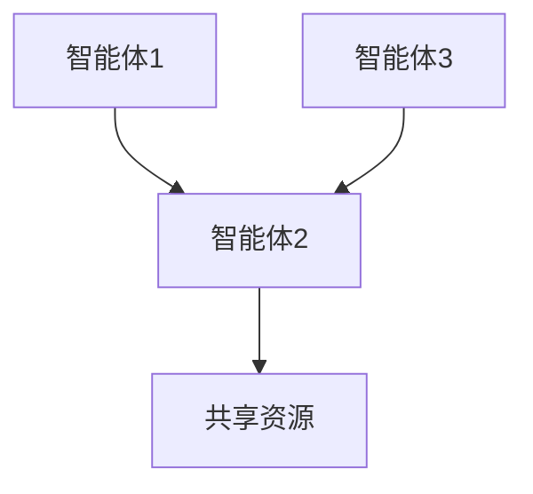
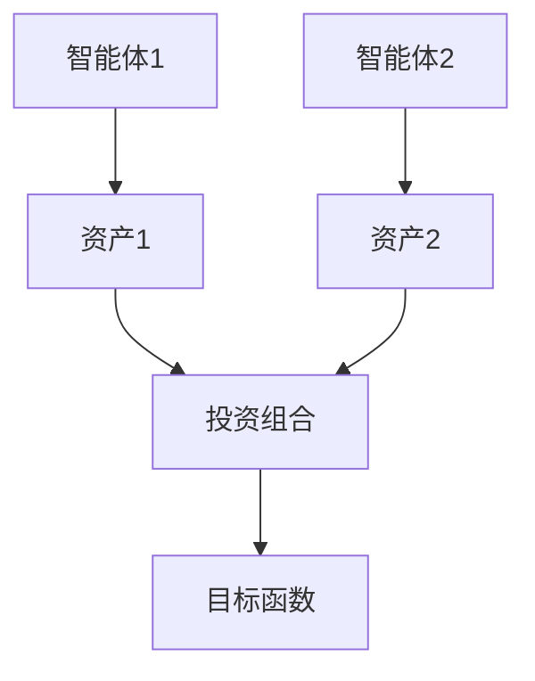
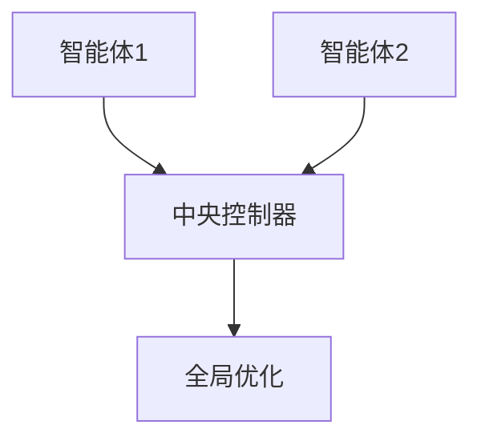
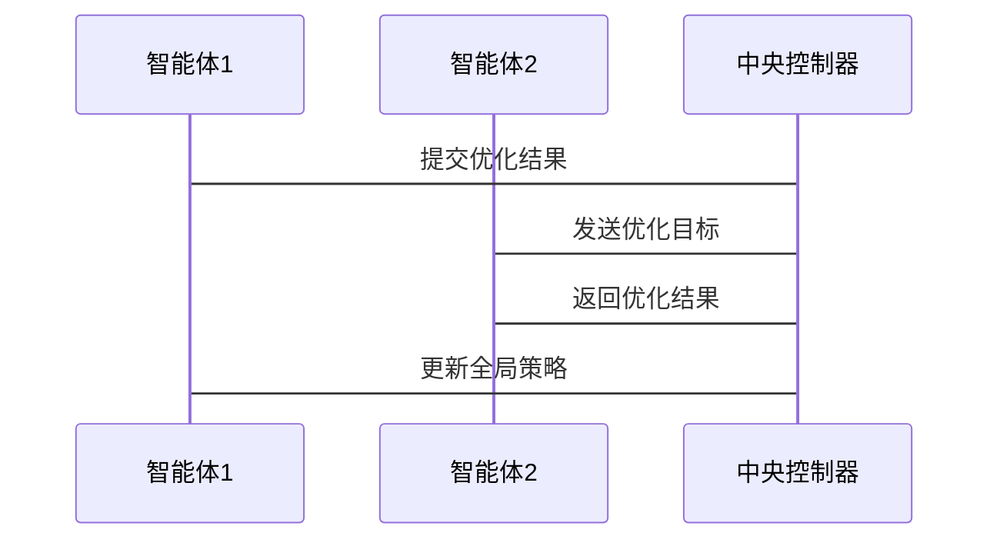

                 


# 多智能体优化价值投资的多资产类别动态配置

## 关键词
多智能体优化、价值投资、多资产类别动态配置、投资组合优化、机器学习、金融建模

## 摘要
本文探讨了多智能体优化在价值投资中的应用，特别是在多资产类别动态配置中的创新性解决方案。通过结合多智能体系统的分布式优化能力和价值投资的深度分析方法，本文提出了一种动态调整投资组合的新策略。文章首先介绍了多智能体优化的基本原理和价值投资的核心理念，然后详细分析了多智能体优化算法在多资产类别配置中的具体实现。通过构建系统化的数学模型和实际案例分析，本文展示了如何利用多智能体优化技术实现投资组合的动态调整，从而提高投资收益并降低风险。最后，本文提出了未来研究方向和实际应用中的注意事项。

---

## 第1章 多智能体优化与价值投资概述

### 1.1 多智能体优化的基本概念
#### 1.1.1 多智能体系统的基本定义
多智能体系统（Multi-Agent System，MAS）是由多个相互作用的智能体组成的系统，每个智能体都有自己的目标、决策能力和行为规则。智能体之间通过信息交互和协作完成复杂的任务。

#### 1.1.2 多智能体优化的定义与特点
多智能体优化是指通过多个智能体的协作，共同优化一个复杂的目标函数。与传统优化方法相比，多智能体优化具有分布式计算、局部决策和自适应性等特点。

#### 1.1.3 多智能体优化与传统优化方法的对比
| 对比维度 | 传统优化 | 多智能体优化 |
|----------|----------|--------------|
| 决策主体 | 单一主体 | 多个主体      |
| 计算方式 | 集中计算 | 分布式计算    |
| 自适应性 | 较低     | 较高          |

### 1.2 价值投资的基本理论
#### 1.2.1 价值投资的定义与核心理念
价值投资是一种投资策略，强调以低于资产内在价值的价格买入资产。其核心理念是寻找市场定价错误的资产，并长期持有，等待价值回归。

#### 1.2.2 价值投资与其它投资策略的对比
| 对比维度 | 价值投资 | 技术分析   | 市场中性策略 |
|----------|----------|------------|--------------|
| 投资依据 | 内在价值 | 技术指标   | 市场套利机会 |
| 持股期限 | 长期     | 短期或中期 | 短期          |

#### 1.2.3 价值投资在多资产类别中的应用
多资产类别配置要求投资者在股票、债券、基金等多种资产之间进行动态调整，以实现风险可控下的最大收益。价值投资的核心思想为多资产配置提供了新的思路，即通过分析各资产的内在价值，动态调整配置比例。

### 1.3 多资产类别动态配置的背景与意义
#### 1.3.1 多资产类别配置的基本概念
多资产类别配置是指将资金分配到多个不同的资产类别中，以分散风险并优化收益。

#### 1.3.2 动态配置的必要性与挑战
市场环境的动态变化要求投资组合需要不断调整。然而，传统优化方法难以应对多资产类别中的非线性关系和复杂约束条件。

#### 1.3.3 多智能体优化在动态配置中的作用
多智能体优化通过分布式计算和局部决策，能够高效地处理多资产配置中的复杂问题，实现动态调整。

---

## 第2章 多智能体优化的核心概念与联系

### 2.1 多智能体优化的核心原理
#### 2.1.1 多智能体优化的数学模型
目标函数：$$ f(x_1, x_2, ..., x_n) $$
约束条件：$$ g_i(x_1, x_2, ..., x_n) \leq 0 $$

#### 2.1.2 多智能体优化的算法框架
1. 初始化各智能体的初始状态。
2. 各智能体根据局部信息更新决策。
3. 智能体之间进行信息交互。
4. 评估整体目标函数，调整各智能体的决策。

#### 2.1.3 多智能体优化与价值投资的结合
通过将多智能体优化应用于价值投资，可以实现对多个资产的动态配置，每个智能体负责分析一种资产的内在价值和市场趋势。

### 2.2 多智能体优化的核心要素
#### 2.2.1 智能体的定义与属性
- **智能体**：具有感知环境和决策能力的实体。
- **属性**：目标、状态、行为、决策规则。

#### 2.2.2 多智能体之间的关系与交互


#### 2.2.3 多智能体优化的目标函数与约束条件
目标函数：$$ \text{最大化收益} - \text{风险} $$
约束条件：$$ \sum_{i=1}^{n} w_i = 1 $$

### 2.3 多智能体优化与价值投资的实体关系图


---

## 第3章 多智能体优化的算法原理

### 3.1 多智能体强化学习算法
#### 3.1.1 多智能体强化学习的基本原理
智能体通过与环境交互，学习策略以最大化累积奖励。

#### 3.1.2 多智能体强化学习的数学模型
状态空间：$$ S $$
动作空间：$$ A $$
奖励函数：$$ R(s, a) $$

#### 3.1.3 多智能体强化学习的实现流程
1. 初始化智能体状态。
2. 智能体选择动作并执行。
3. 计算奖励并更新策略。
4. 重复直到收敛。

#### 3.1.4 多智能体强化学习的代码示例
```python
import numpy as np

class MultiAgentRL:
    def __init__(self, num_agents):
        self.num_agents = num_agents
        self.states = [0] * num_agents
        self.rewards = [0] * num_agents

    def take_action(self, actions):
        # 执行动作
        pass

    def update_policy(self):
        # 更新策略
        pass
```

### 3.2 多智能体分布式优化算法
#### 3.2.1 多智能体分布式优化的基本原理
通过分布式计算，每个智能体负责优化局部目标，最终达到全局最优。

#### 3.2.2 多智能体分布式优化的数学模型
局部目标函数：$$ f_i(x_i) $$
全局目标函数：$$ F(x_1, x_2, ..., x_n) = \sum_{i=1}^{n} f_i(x_i) $$

#### 3.2.3 多智能体分布式优化的实现流程
1. 初始化各智能体的参数。
2. 各智能体独立优化局部目标。
3. 智能体之间进行参数同步。
4. 重复直到收敛。

---

## 第4章 多智能体优化的系统分析与架构设计

### 4.1 多智能体优化系统的架构设计


### 4.2 多智能体优化系统的接口设计
- **输入接口**：接收市场数据和用户指令。
- **输出接口**：输出投资建议和配置报告。

### 4.3 多智能体优化系统的交互流程


---

## 第5章 项目实战：多智能体优化在价值投资中的应用

### 5.1 项目背景与目标
通过多智能体优化技术，实现对多个资产的动态配置，优化投资组合的收益与风险比。

### 5.2 环境安装与配置
- **工具安装**：安装Python、TensorFlow、numpy等库。
- **数据获取**：获取各资产的历史数据。

### 5.3 核心实现与代码分析
```python
import numpy as np
import tensorflow as tf

class InvestmentAgent:
    def __init__(self, assets):
        self.assets = assets
        self.model = self.build_model()

    def build_model(self):
        model = tf.keras.Sequential([
            tf.keras.layers.Dense(64, activation='relu'),
            tf.keras.layers.Dense(1, activation='linear')
        ])
        model.compile(optimizer='adam', loss='mean_squared_error')
        return model

    def evaluate_asset(self, asset_data):
        return self.model.predict(asset_data)
```

### 5.4 案例分析与结果解读
通过实际案例分析，验证多智能体优化在动态配置中的有效性。例如，在股票、债券和基金之间动态调整配置比例，实现风险可控下的最大收益。

---

## 第6章 总结与展望

### 6.1 本文总结
本文探讨了多智能体优化在价值投资中的应用，提出了一种基于多智能体系统的动态配置方法，解决了传统优化方法的局限性。

### 6.2 未来研究方向
- 更复杂的多智能体交互模型。
- 更高效的学习算法。
- 更广泛的实际应用。

### 6.3 注意事项与建议
在实际应用中，需注意市场风险、数据质量和模型的实时性问题。

### 6.4 拓展阅读
推荐阅读相关领域的书籍和论文，深入理解多智能体优化和价值投资的理论与实践。

---

## 作者：AI天才研究院/AI Genius Institute & 禅与计算机程序设计艺术 /Zen And The Art of Computer Programming

---

**注**：以上内容为示例，实际撰写时需要根据具体需求调整细节。

