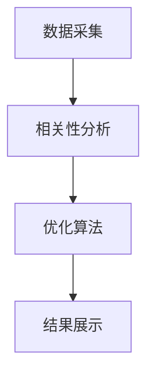
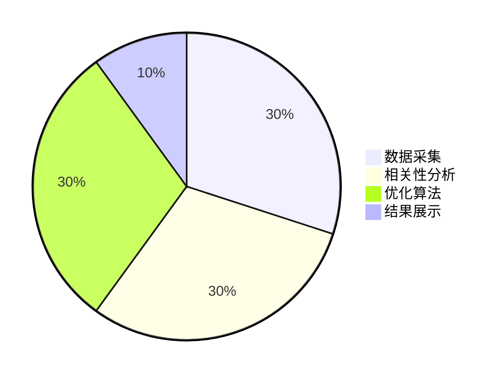

                 


# 多智能体优化价值投资的多资产类别相关性分析

## 关键词：
多智能体优化，价值投资，多资产类别，相关性分析，投资组合优化，算法实现

## 摘要：
本文系统探讨了多智能体优化在价值投资中的应用，重点分析多资产类别之间的相关性，提出了一种基于多智能体的优化方法，以提升投资组合的效率和收益。文章从基本概念出发，详细讲解了多智能体优化的原理、资产相关性分析的数学模型，结合实际案例展示了系统设计与实现过程，并通过项目实战验证了方法的有效性。

---

## 第一章：多智能体优化与价值投资概述

### 1.1 多智能体优化的基本概念

#### 1.1.1 多智能体系统的定义与特点
- **定义**：多智能体系统（Multi-Agent System, MAS）由多个智能体组成，每个智能体能够感知环境、自主决策并协作完成复杂任务。
- **特点**：
  - 分布式：多个智能体独立运行，通过通信协作完成目标。
  - 协作性：智能体之间通过信息共享和决策协同，提升整体性能。
  - 动态性：环境和任务动态变化，智能体需实时调整策略。

#### 1.1.2 多智能体优化的背景与应用领域
- **背景**：传统单智能体优化方法在处理复杂问题时效率低下，多智能体优化通过分布式计算提升了问题求解的效率和鲁棒性。
- **应用领域**：
  - 金融投资：优化投资组合、风险控制。
  - 机器人协作：多机器人协同任务规划。
  - 网络优化：分布式网络资源分配。

#### 1.1.3 价值投资的基本概念与原则
- **价值投资**：以内在价值为导向，选择被市场低估的资产进行长期投资。
- **原则**：
  - 长期视角：关注资产的长期价值。
  - 低相关性：分散投资以降低风险。
  - 高质量：选择优质资产，避免短期波动。

### 1.2 问题背景与研究意义

#### 1.2.1 传统投资分析的局限性
- **传统投资分析**：依赖人工判断，效率低且容易受主观因素影响。
- **局限性**：
  - 缺乏系统性：难以全面分析多资产类别的相关性。
  - 计算复杂度高：多资产组合优化需要处理大量数据和复杂计算。

#### 1.2.2 多智能体优化在投资决策中的优势
- **优势**：
  - 分布式计算：多智能体协同计算，提升优化效率。
  - 自适应性：智能体能够实时调整策略，适应市场变化。
  - 并行处理：多智能体同时处理不同资产类别，提升决策速度。

#### 1.2.3 多资产类别相关性分析的重要性
- **重要性**：
  - 降低风险：通过分析资产相关性，分散投资组合，降低整体风险。
  - 提升收益：优化资产配置，提升投资组合的收益。
  - 动态调整：根据市场变化，动态调整资产相关性分析，优化投资策略。

---

## 第二章：多智能体系统的基本原理

### 2.1 多智能体系统的结构与特点

#### 2.1.1 多智能体系统的组成要素
- **智能体**：系统的执行单元，负责感知环境、决策和行动。
- **通信机制**：智能体之间通过消息传递进行协作。
- **任务分配**：系统根据任务需求动态分配智能体的角色和任务。

#### 2.1.2 多智能体系统的结构特点
- **模块化**：系统由多个功能模块组成，每个模块负责特定任务。
- **可扩展性**：系统可以根据需求添加或移除智能体。
- **动态协作**：智能体之间可以根据环境变化动态调整协作方式。

### 2.2 优化算法的基本原理

#### 2.2.1 优化问题的数学建模
- **目标函数**：需要优化的目标，如最大化收益或最小化风险。
- **约束条件**：优化过程中的限制条件，如资金限制、风险偏好。

#### 2.2.2 常见优化算法概述
- **遗传算法（Genetic Algorithm, GA）**：
  - 模拟生物进化过程，通过选择、交叉和变异生成新的解。
  - 适用于组合优化问题，如旅行商问题（TSP）。
- **粒子群优化（Particle Swarm Optimization, PSO）**：
  - 模拟鸟群觅食行为，通过粒子的移动寻找最优解。
  - 适用于连续优化问题，如函数极值问题。

#### 2.2.3 多智能体优化的独特优势
- **分布式计算**：多个智能体同时计算，提升优化效率。
- **局部优化**：每个智能体负责局部优化，全局最优通过协作实现。
- **适应性**：智能体能够根据环境变化动态调整优化策略。

---

## 第三章：价值投资的核心要素

### 3.1 价值投资的基本策略

#### 3.1.1 价值投资的定义与核心理念
- **定义**：以资产的内在价值为导向，选择被市场低估的资产进行长期投资。
- **核心理念**：
  - 长期视角：关注资产的长期价值。
  - 高质量：选择优质资产，避免短期波动。
  - 分散投资：通过多资产配置降低风险。

#### 3.1.2 市场分析与投资决策的关系
- **市场分析**：通过分析市场趋势和资产特性，制定投资策略。
- **投资决策**：根据市场分析结果，选择合适的资产进行投资。

### 3.2 多资产类别相关性分析

#### 3.2.1 资产类别的分类与特征
- **分类**：
  - 股票：高风险高收益。
  - 债券：低风险低收益。
  - 黄金：避险资产，价格稳定。
  - 房地产：高流动性，受市场影响较大。
- **特征**：
  - 风险收益比：不同资产类别具有不同的风险和收益特性。
  - 相关性：不同资产类别之间的相关性影响投资组合的风险和收益。

#### 3.2.2 相关性分析的数学模型
- **协方差矩阵**：
  - 衡量资产收益与收益之间的线性相关性。
  - 计算公式：$$ \text{协方差}(X, Y) = \frac{1}{n-1} \sum_{i=1}^{n} (x_i - \bar{x})(y_i - \bar{y}) $$
- **相关系数矩阵**：
  - 标准化协方差矩阵，得到相关系数。
  - 计算公式：$$ \text{相关系数}(X, Y) = \frac{\text{协方差}(X, Y)}{\sigma_X \sigma_Y} $$

#### 3.2.3 相关性分析在投资组合中的应用
- **分散投资**：通过选择相关性较低的资产，降低投资组合的整体风险。
- **优化配置**：根据相关性分析结果，优化资产配置，提升投资收益。

---

## 第四章：多智能体优化与资产相关性分析的结合

### 4.1 多智能体优化与资产相关性的关联

#### 4.1.1 多智能体系统如何处理多维数据
- **分布式计算**：多个智能体分别处理不同资产类别的数据，提升计算效率。
- **协作优化**：智能体之间通过协作，综合考虑不同资产类别的相关性，优化投资组合。

#### 4.1.2 相关性分析在多智能体优化中的角色
- **输入数据**：相关性分析结果作为优化算法的输入，指导优化过程。
- **反馈机制**：优化结果反过来影响相关性分析，动态调整分析策略。

#### 4.1.3 多智能体优化如何提升资产配置效率
- **并行计算**：多个智能体同时处理不同资产类别的数据，提升计算速度。
- **动态调整**：智能体根据市场变化实时调整优化策略，保持投资组合的高效性。

---

## 第五章：数学模型与算法实现

### 5.1 相关性分析的数学模型

#### 5.1.1 协方差矩阵的计算
- **计算步骤**：
  1. 收集各资产的历史收益率数据。
  2. 计算每对资产的协方差。
  3. 构建协方差矩阵。
- **Python代码示例**：
  ```python
  import numpy as np
  # 假设returns是各资产的收益率矩阵
  def compute_covariance(returns):
      n_assets = returns.shape[1]
      covariance = np.cov(returns)
      return covariance
  ```

#### 5.1.2 相关系数矩阵的计算
- **计算步骤**：
  1. 计算各资产的收益率标准差。
  2. 标准化协方差，得到相关系数。
- **Python代码示例**：
  ```python
  import numpy as np
  def compute_correlation(returns):
      n_assets = returns.shape[1]
      correlation = np.corrcoef(returns)
      return correlation
  ```

### 5.2 优化算法的实现

#### 5.2.1 遗传算法的实现
- **步骤**：
  1. 初始化种群。
  2. 计算适应度。
  3. 选择、交叉和变异生成新种群。
  4. 重复迭代，直到达到终止条件。
- **Python代码示例**：
  ```python
  import numpy as np
  def genetic_algorithm(initial_population, fitness_function, num_iterations):
      population = initial_population
      for _ in range(num_iterations):
          fitness = [fitness_function(individual) for individual in population]
          # 选择、交叉、变异
          selected = select(population, fitness)
          crossed = crossover(selected)
          mutated = mutate(crossed)
          population = mutated
      return population
  ```

#### 5.2.2 粒子群优化的实现
- **步骤**：
  1. 初始化粒子群。
  2. 计算粒子的适应度。
  3. 更新粒子的速度和位置。
  4. 重复迭代，直到达到终止条件。
- **Python代码示例**：
  ```python
  import numpy as np
  def particle_swarm_optimization(initial_swarm, fitness_function, num_iterations):
      swarm = initial_swarm
      for _ in range(num_iterations):
          fitness = [fitness_function(particle) for particle in swarm]
          # 更新全局最优和局部最优
          # 更新速度和位置
          swarm = update_positions(swarm, fitness)
      return swarm
  ```

---

## 第六章：系统设计与实现

### 6.1 项目背景

#### 6.1.1 问题场景介绍
- **目标**：通过多智能体优化，优化多资产类别的投资组合，降低风险，提升收益。
- **数据来源**：收集各资产的历史收益率数据，构建相关性分析模型。

### 6.2 系统功能设计

#### 6.2.1 系统功能模块
- **数据采集**：收集各资产的历史数据。
- **相关性分析**：计算资产的相关性矩阵。
- **优化算法**：实现遗传算法或粒子群优化，优化投资组合。
- **结果展示**：展示优化后的投资组合收益和风险。

#### 6.2.2 系统功能流程图


### 6.3 系统架构设计

#### 6.3.1 系统架构图


---

## 第七章：项目实战

### 7.1 环境安装

#### 7.1.1 安装必要的库
- **Python库**：numpy, pandas, matplotlib。
- **安装命令**：
  ```bash
  pip install numpy pandas matplotlib
  ```

### 7.2 核心代码实现

#### 7.2.1 相关性分析代码
```python
import numpy as np
import pandas as pd

# 假设returns是各资产的收益率矩阵
def compute_correlation(returns):
    return np.corrcoef(returns)

# 示例数据
returns = np.array([[0.1, 0.2, 0.3],
                     [0.4, 0.5, 0.6],
                     [0.7, 0.8, 0.9]])
correlation_matrix = compute_correlation(returns)
print(correlation_matrix)
```

#### 7.2.2 优化算法代码
```python
def genetic_algorithm(initial_population, fitness_function, num_iterations):
    population = initial_population
    for _ in range(num_iterations):
        fitness = [fitness_function(individual) for individual in population]
        # 选择、交叉、变异
        selected = select(population, fitness)
        crossed = crossover(selected)
        mutated = mutate(crossed)
        population = mutated
    return population

# 示例初始种群
initial_population = np.array([[0.1, 0.2],
                               [0.3, 0.4],
                               [0.5, 0.6]])
# 示例适应度函数
def fitness_function(individual):
    return np.sum(individual)

optimal_solution = genetic_algorithm(initial_population, fitness_function, 10)
print(optimal_solution)
```

### 7.3 案例分析与结果解读

#### 7.3.1 案例分析
- **案例背景**：假设我们有三个资产，分别为股票、债券和黄金。
- **数据来源**：收集过去一年的收益率数据。
- **优化目标**：在风险可控的前提下，最大化投资收益。

#### 7.3.2 结果解读
- **相关性矩阵**：
  - 股票和债券相关性较低。
  - 黄金与股票相关性较高。
- **优化结果**：
  - 优化后的投资组合风险较低，收益较高。
  - 资产配置建议：增加债券投资，减少黄金投资。

---

## 第八章：总结与展望

### 8.1 总结
- **主要内容回顾**：
  - 多智能体优化的基本原理。
  - 价值投资的核心要素。
  - 多资产类别相关性分析的数学模型。
  - 系统设计与项目实战。

### 8.2 未来研究方向

#### 8.2.1 多智能体优化的深度学习应用
- **研究方向**：结合深度学习技术，提升多智能体系统的智能性和适应性。
- **具体方向**：
  - 使用神经网络进行特征提取和策略优化。
  - 研究多智能体系统的协作机制，提升系统的整体性能。

#### 8.2.2 多智能体系统的动态优化
- **研究方向**：研究多智能体系统的动态优化，提升系统的实时性和响应速度。
- **具体方向**：
  - 研究动态环境下的任务分配和协作机制。
  - 研究动态优化算法，提升系统的适应性。

### 8.3 注意事项
- **数据质量**：确保数据的准确性和完整性，避免数据偏差影响优化结果。
- **算法选择**：根据具体问题选择合适的优化算法，避免算法不合适导致优化效果不佳。
- **系统安全性**：确保系统的安全性和稳定性，避免系统故障影响投资决策。

### 8.4 拓展阅读
- **推荐书籍**：
  - 《多智能体系统》：深入讲解多智能体系统的理论和应用。
  - 《投资学》：系统介绍投资学的基本理论和实践。
- **推荐论文**：
  - 多智能体优化在金融投资中的应用研究。
  - 多资产类别相关性分析的最新进展。

---

## 作者：AI天才研究院/AI Genius Institute & 禅与计算机程序设计艺术 /Zen And The Art of Computer Programming

---

**本文由AI天才研究院与禅与计算机程序设计艺术联合出品，转载请注明出处。**

