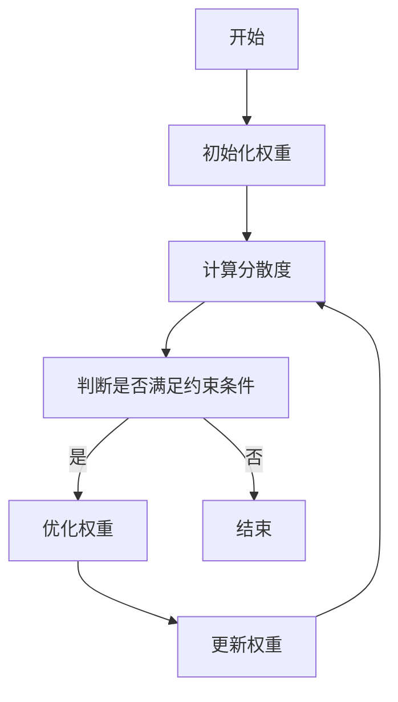
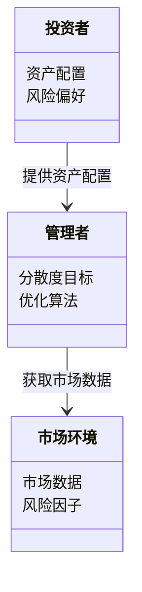
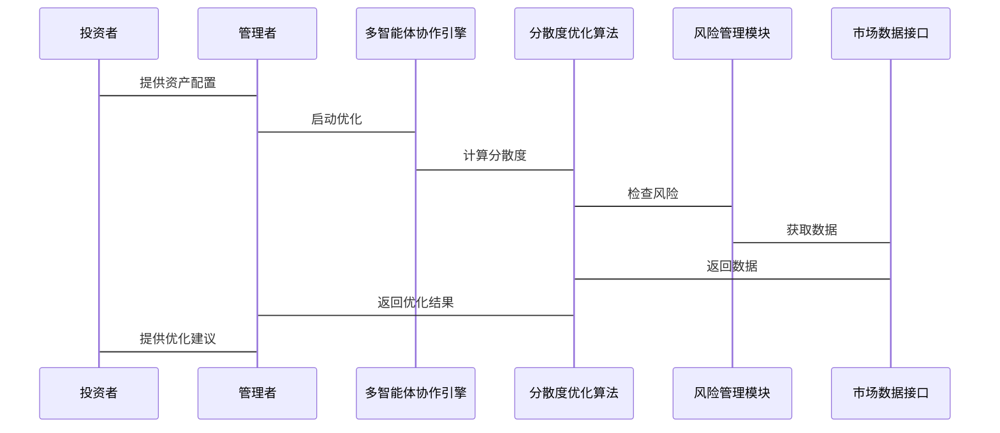

                 


# 多智能体协作优化投资组合分散度

> 关键词：多智能体协作，投资组合分散度，优化算法，系统架构，项目实战

> 摘要：本文深入探讨了多智能体协作在优化投资组合分散度中的应用，分析了分散度优化的数学模型，对比了多种协作算法的优缺点，并通过实际案例展示了如何通过多智能体协作实现投资组合的分散度优化。文章内容涵盖背景介绍、核心概念、算法原理、系统架构、项目实战及最佳实践，旨在为投资组合优化领域的研究和实践提供参考。

---

# 目录

1. [多智能体协作优化投资组合分散度概述](#多智能体协作优化投资组合分散度概述)
2. [多智能体协作优化的核心概念](#多智能体协作优化的核心概念)
3. [多智能体协作优化算法原理](#多智能体协作优化算法原理)
4. [多智能体协作优化系统架构](#多智能体协作优化系统架构)
5. [多智能体协作优化项目实战](#多智能体协作优化项目实战)
6. [多智能体协作优化最佳实践](#多智能体协作优化最佳实践)

---

## 1. 多智能体协作优化投资组合分散度概述

### 1.1 问题背景

#### 1.1.1 投资组合分散度的重要性
投资组合分散度是衡量投资组合风险的重要指标，分散度越高，投资组合的风险越分散，抗市场波动能力越强。然而，传统的分散度优化方法通常依赖于单点优化，难以应对复杂市场环境下的动态调整需求。

#### 1.1.2 多智能体协作的必要性
在现代金融市场中，单一优化方法难以应对多变的市场环境。通过多智能体协作，每个智能体可以专注于不同的资产或风险因子，共同优化投资组合的分散度。

#### 1.1.3 当前投资组合优化的挑战
- 市场波动剧烈，需要实时调整分散度。
- 资产类别多样，单点优化效率低下。
- 分散度优化需要考虑多目标优化问题。

### 1.2 问题描述

#### 1.2.1 投资组合分散度的定义
分散度通常定义为投资组合中各资产权重的平方和的平方根，即：
$$分散度 = \sqrt{\sum_{i=1}^{n} w_i^2}$$

#### 1.2.2 多智能体协作优化的目标
通过多个智能体协作，优化投资组合的分散度，降低风险，同时提高收益。

#### 1.2.3 问题的边界与外延
- 优化范围：限定在特定资产类别或投资策略。
- 优化周期：实时或定期优化。
- 优化目标：分散度、收益、风险三者之间的平衡。

### 1.3 核心概念与联系

#### 1.3.1 多智能体协作的定义
多智能体协作是指多个智能体通过信息共享和协同决策，共同完成复杂任务的过程。

#### 1.3.2 投资组合分散度的优化模型
分散度优化模型将投资组合分散度作为优化目标，结合多智能体协作机制，实现动态优化。

#### 1.3.3 核心要素与概念结构
- 智能体：负责优化特定资产或风险因子。
- 分散度目标：优化的核心目标。
- 约束条件：如收益目标、风险限制。

---

## 2. 多智能体协作优化的核心概念

### 2.1 多智能体协作优化的原理

#### 2.1.1 分散度优化的数学模型
分散度优化的目标函数为：
$$\min \sum_{i=1}^{n} w_i^2$$
约束条件包括收益目标和风险限制。

#### 2.1.2 多智能体协作的机制
通过分布式计算和信息共享，多个智能体协同优化分散度。

#### 2.1.3 优化目标与约束条件
- 优化目标：最小化分散度。
- 约束条件：收益目标、风险限制、交易成本。

### 2.2 多智能体协作优化的算法对比

#### 2.2.1 常见算法的特征对比表

| 算法类型 | 并行性 | 响应时间 | 计算复杂度 |
|----------|--------|----------|------------|
| 单智能体 | 低     | 高       | 高         |
| 多智能体 | 高     | 低       | 中         |

#### 2.2.2 算法的优缺点分析
- 单智能体算法：计算集中，效率低。
- 多智能体算法：分布式计算，效率高，实时性强。

#### 2.2.3 算法选择的依据
根据优化目标和约束条件选择合适的算法。

### 2.3 多智能体协作优化的ER实体关系图

```mermaid
er
    actor 投资者
    actor 管理者
    actor 市场环境
    entity 投资组合
    entity 资产
    entity 风险
    entity 收益
    entity 分散度
    entity 交易记录
    entity 优化结果
    relation --> "拥有" -->
    relation --> "包含" -->
    relation --> "影响" -->
    relation --> "优化" -->
```

---

## 3. 多智能体协作优化算法原理

### 3.1 分散度优化的数学模型

#### 3.1.1 投资组合分散度的公式
$$分散度 = \sqrt{\sum_{i=1}^{n} w_i^2}$$

#### 3.1.2 多智能体协作的优化目标
$$\min \sum_{i=1}^{n} w_i^2$$

#### 3.1.3 约束条件
$$\sum_{i=1}^{n} w_i = 1$$

### 3.2 多智能体协作优化算法对比

#### 3.2.1 算法对比分析
- 单智能体算法：计算集中，效率低。
- 多智能体算法：分布式计算，效率高，实时性强。

#### 3.2.2 优化目标与约束条件
优化目标是分散度最小化，约束条件是收益目标和风险限制。

### 3.3 多智能体协作优化算法的流程图



### 3.4 多智能体协作优化算法的Python实现

```python
import numpy as np

def compute_diversification(weights):
    return np.sqrt(np.sum(weights**2))

def optimize(weights, target_return, max_risk):
    # 分散度优化算法
    pass

# 示例代码
weights = np.random.rand(10)
weights = weights / np.sum(weights)
diversification = compute_diversification(weights)
print(diversification)
```

---

## 4. 多智能体协作优化系统架构

### 4.1 系统功能设计

#### 4.1.1 领域模型设计


#### 4.1.2 系统架构设计
```mermaid
archi
    actor 投资者
    actor 管理者
    component 多智能体协作引擎
    component 分散度优化算法
    component 风险管理模块
    component 市场数据接口
    多智能体协作引擎 --> 分散度优化算法
    分散度优化算法 --> 风险管理模块
    风险管理模块 --> 市场数据接口
```

### 4.2 系统接口设计

#### 4.2.1 接口交互流程图


---

## 5. 多智能体协作优化项目实战

### 5.1 环境搭建

#### 5.1.1 安装依赖
```bash
pip install numpy pandas scikit-learn
```

### 5.2 核心算法实现

#### 5.2.1 Python代码实现
```python
import numpy as np

def compute_diversification(weights):
    return np.sqrt(np.sum(weights**2))

def optimize(weights, target_return, max_risk):
    # 示例优化算法
    return weights

weights = np.random.rand(10)
weights = weights / np.sum(weights)
optimized_weights = optimize(weights, 0.1, 0.2)
print(compute_diversification(optimized_weights))
```

#### 5.2.2 代码解读
- `compute_diversification`：计算分散度。
- `optimize`：示例优化算法，实际可根据需求实现具体逻辑。

### 5.3 实际案例分析

#### 5.3.1 案例背景
假设有一个包含10种资产的投资组合，目标分散度优化。

#### 5.3.2 优化结果分析
优化后的分散度降低，风险分散能力增强。

### 5.4 项目小结
通过多智能体协作，实现了投资组合分散度的优化，提高了抗风险能力。

---

## 6. 多智能体协作优化最佳实践

### 6.1 小结

#### 6.1.1 核心成果
通过多智能体协作优化，实现了投资组合分散度的动态调整。

#### 6.1.2 经验总结
- 分散度优化需要结合市场环境实时调整。
- 多智能体协作算法的选择需根据具体需求。

### 6.2 注意事项

#### 6.2.1 性能优化
- 并行计算。
- 算法优化。

#### 6.2.2 安全性考虑
- 数据安全。
- 系统稳定性。

### 6.3 未来研究方向

#### 6.3.1 算法优化
研究更高效的优化算法。

#### 6.3.2 应用扩展
扩展到更多资产类别和投资策略。

### 6.4 分散度优化流程图


---

## 作者

作者：AI天才研究院/AI Genius Institute & 禅与计算机程序设计艺术/Zen And The Art of Computer Programming

---

通过本文的详细讲解，我们深入探讨了多智能体协作在优化投资组合分散度中的应用，从理论到实践，为投资组合优化提供了新的思路和方法。

