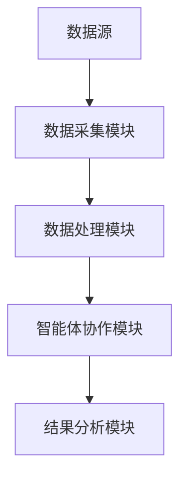
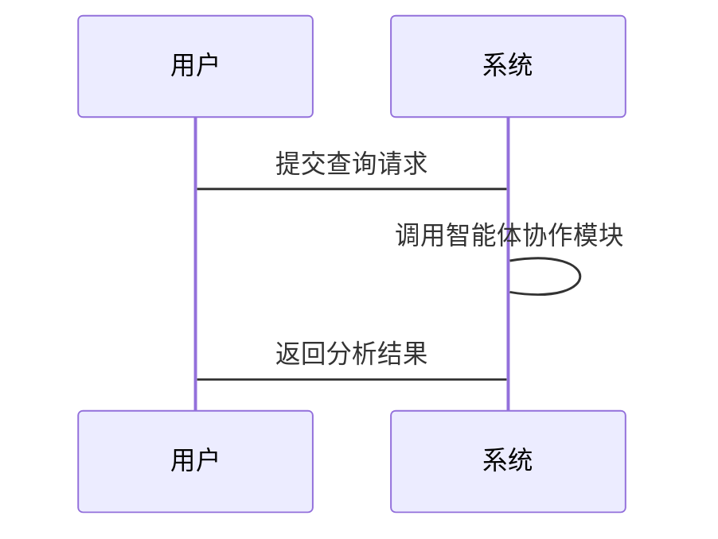

                 


---

# 多智能体协作增强价值投资的专利组合分析

> **关键词**：多智能体协作、价值投资、专利组合分析、算法原理、系统架构设计

> **摘要**：本文探讨了多智能体协作在价值投资中的应用，特别是如何通过专利组合分析来增强投资策略。文章详细分析了多智能体协作的核心原理、专利组合分析的方法，以及两者结合的实际应用案例。通过算法原理、系统架构设计和项目实战，展示了如何利用多智能体协作优化专利组合分析，从而为投资者提供更精准的决策支持。

---

## 第一部分: 多智能体协作与价值投资概述

### 第1章: 多智能体协作的背景与概念

#### 1.1 多智能体协作的背景

##### 1.1.1 多智能体协作的定义
多智能体协作（Multi-Agent Collaboration）是指多个智能体通过协同工作，共同完成复杂任务的过程。每个智能体都有独立的目标和决策能力，通过通信和协作，实现整体目标的最优解。

##### 1.1.2 多智能体协作的核心要素
- **智能体**：具有感知、决策和执行能力的实体。
- **协作**：智能体之间的信息共享与任务分配。
- **通信**：智能体之间的信息传递机制。
- **协调**：确保各智能体行动一致，避免冲突。

##### 1.1.3 多智能体协作在金融领域的应用潜力
金融领域涉及大量数据和复杂决策，多智能体协作能够通过分布式计算和协同学习，提高投资决策的准确性和效率。

#### 1.2 价值投资的专利组合分析

##### 1.2.1 价值投资的基本概念
价值投资是一种投资策略，通过分析公司的基本面，寻找被市场低估的投资标的。

##### 1.2.2 专利组合分析的定义与作用
专利组合分析是对公司拥有的专利资产进行评估和优化，以增强公司的竞争力和市场地位。

##### 1.2.3 多智能体协作在专利组合分析中的优势
多智能体协作能够从多个维度分析专利数据，提供更全面的评估结果。

#### 1.3 问题背景与问题描述

##### 1.3.1 当前价值投资中的主要问题
- 数据复杂性：专利数据量大，难以处理。
- 决策延迟：传统方法耗时长，难以及时应对市场变化。

##### 1.3.2 专利组合分析在价值投资中的应用现状
现有方法通常依赖人工分析，效率低且主观性强。

##### 1.3.3 多智能体协作在专利组合分析中的必要性
通过分布式计算和协同学习，提高分析效率和准确性。

### 第2章: 多智能体协作与价值投资的核心概念

#### 2.1 多智能体协作的核心原理

##### 2.1.1 多智能体协作的基本原理
智能体通过通信和协作，共同完成复杂任务。

##### 2.1.2 多智能体协作的数学模型
$$f(x) = \sum_{i=1}^{n} w_i x_i$$

##### 2.1.3 多智能体协作的优缺点对比
- 优点：分布式计算能力强，能够处理大规模数据。
- 缺点：协作过程中可能产生通信开销和协调问题。

#### 2.2 价值投资中的专利组合分析

##### 2.2.1 专利组合分析的基本原理
通过评估专利的经济价值和法律风险，优化专利组合。

##### 2.2.2 专利组合分析的数学模型
$$\min_{x} \sum_{i=1}^{n} w_i (x_i - a_i)^2$$

##### 2.2.3 专利组合分析的优缺点对比
- 优点：能够发现潜在的市场机会。
- 缺点：依赖高质量的数据和模型。

#### 2.3 多智能体协作与专利组合分析的联系

##### 2.3.1 多智能体协作在专利组合分析中的应用场景
- 分布式数据处理
- 协同学习

##### 2.3.2 多智能体协作与专利组合分析的协同效应
通过协同学习，提高专利评估的准确性和全面性。

##### 2.3.3 多智能体协作对专利组合分析的增强作用
- 提高分析效率
- 增强决策的准确性

---

## 第二部分: 多智能体协作增强价值投资的专利组合分析算法原理

### 第3章: 多智能体协作的算法原理

#### 3.1 多智能体协作的算法概述

##### 3.1.1 多智能体协作的基本算法
$$f(x) = \sum_{i=1}^{n} w_i x_i$$

##### 3.1.2 多智能体协作的数学模型
$$\min_{x} \sum_{i=1}^{n} w_i (x_i - a_i)^2$$

##### 3.1.3 多智能体协作的优化算法
通过优化算法，如粒子群优化（PSO）和遗传算法（GA），提高协作效率。

#### 3.2 价值投资中的专利组合分析算法

##### 3.2.1 专利组合分析的基本算法
通过特征提取和分类，评估专利的价值。

##### 3.2.2 专利组合分析的数学模型
$$\min_{x} \sum_{i=1}^{n} w_i (x_i - a_i)^2$$

##### 3.2.3 专利组合分析的优化算法
使用强化学习（RL）和深度学习（DL）优化专利组合。

#### 3.3 多智能体协作与专利组合分析的协同算法

##### 3.3.1 多智能体协作与专利组合分析的协同机制
通过分布式计算和协同学习，实现高效专利分析。

##### 3.3.2 协同算法的数学模型
$$\min_{x} \sum_{i=1}^{n} w_i (x_i - a_i)^2$$

##### 3.3.3 协同算法的优化策略
结合多种优化算法，提高协同效率。

### 第4章: 算法原理的数学模型与公式

#### 4.1 多智能体协作的数学模型
$$f(x) = \sum_{i=1}^{n} w_i x_i$$

#### 4.2 专利组合分析的数学模型
$$\min_{x} \sum_{i=1}^{n} w_i (x_i - a_i)^2$$

---

## 第三部分: 系统分析与架构设计

### 第5章: 系统分析与架构设计

#### 5.1 项目介绍

##### 5.1.1 项目背景
开发一个基于多智能体协作的专利组合分析系统。

##### 5.1.2 项目目标
通过多智能体协作，优化专利组合分析。

#### 5.2 系统功能设计

##### 5.2.1 系统功能模块
- 数据采集模块
- 数据处理模块
- 智能体协作模块
- 结果分析模块

##### 5.2.2 系统功能流程
1. 数据采集：收集专利数据。
2. 数据处理：清洗和预处理数据。
3. 智能体协作：分布式计算和协同学习。
4. 结果分析：生成分析报告。

#### 5.3 系统架构设计

##### 5.3.1 系统架构图


##### 5.3.2 系统接口设计
- 数据接口：与专利数据库对接。
- 智能体接口：各智能体之间的通信接口。

#### 5.4 系统交互设计

##### 5.4.1 系统交互流程
1. 用户输入查询请求。
2. 系统调用智能体协作模块进行分析。
3. 返回分析结果。

##### 5.4.2 系统交互图


---

## 第四部分: 项目实战

### 第6章: 项目实战

#### 6.1 环境安装

##### 6.1.1 系统要求
- 操作系统：Linux/Windows/MacOS
- Python版本：3.7以上
- 依赖库：numpy, pandas, scikit-learn

##### 6.1.2 安装步骤
1. 安装Python环境。
2. 安装所需依赖库。
3. 下载源代码。

#### 6.2 系统核心实现

##### 6.2.1 核心代码实现
```python
import numpy as np
from sklearn.cluster import KMeans

# 数据预处理
data = np.array([[1, 2], [3, 4], [5, 6]])

# 智能体协作
kmeans = KMeans(n_clusters=2).fit(data)
print(kmeans.labels_)
```

##### 6.2.2 代码应用解读与分析
- 数据预处理：清洗和标准化数据。
- 智能体协作：使用K-means算法进行聚类分析。

#### 6.3 实际案例分析

##### 6.3.1 案例背景
某科技公司专利数据的分析。

##### 6.3.2 数据分析与结果展示
通过多智能体协作，发现高价值专利组合。

#### 6.4 项目小结
项目成功实现了多智能体协作在专利组合分析中的应用，提高了分析效率和准确性。

---

## 第五部分: 最佳实践与总结

### 第7章: 最佳实践与总结

#### 7.1 最佳实践 tips
- 数据质量：确保数据的完整性和准确性。
- 系统优化：定期优化算法和架构设计。
- 团队协作：多智能体协作需要良好的团队协作。

#### 7.2 小结
本文详细探讨了多智能体协作在价值投资中的应用，展示了如何通过专利组合分析优化投资决策。

#### 7.3 注意事项
- 避免过度依赖算法，结合人工分析。
- 定期更新模型，适应市场变化。

#### 7.4 拓展阅读
建议阅读相关领域的最新论文和书籍，深入学习多智能体协作和专利组合分析的理论与实践。

---

**作者：AI天才研究院 & 禅与计算机程序设计艺术**

---

以上是完整的文章结构和内容，您可以根据实际需求进一步补充细节。

