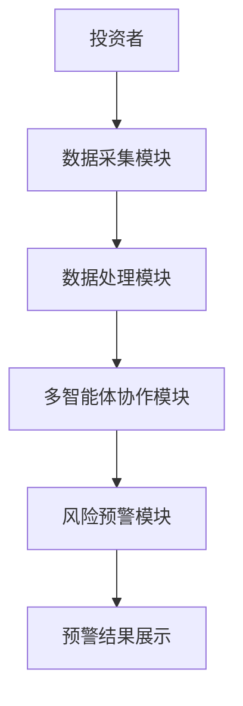
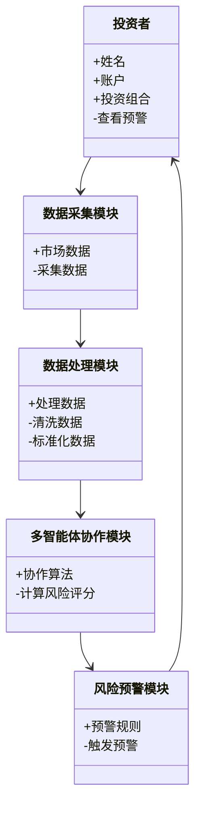

                 


# 多智能体协作增强价值投资的市场流动性风险预警

> 关键词：多智能体协作，价值投资，市场流动性风险，风险预警，强化学习，博弈论

> 摘要：本文探讨了多智能体协作在价值投资中的应用，特别是在市场流动性风险预警方面。通过分析多智能体协作的原理、算法实现、系统架构及实际案例，展示了如何利用多智能体协作技术优化价值投资决策，降低市场流动性风险，为投资者提供更可靠的决策支持。

---

# 第1章 多智能体协作与价值投资背景

## 1.1 多智能体协作的定义与特点

### 1.1.1 多智能体协作的基本概念
多智能体协作（Multi-Agent Collaboration）是指多个智能体通过信息共享和协同行动，共同完成复杂任务的过程。每个智能体都有独立的目标和决策能力，但通过协作实现整体目标的优化。

### 1.1.2 多智能体协作的核心特征
1. **分布式性**：智能体分布在不同的位置，独立决策。
2. **协同性**：通过通信和协作完成共同目标。
3. **适应性**：能够动态调整策略以应对环境变化。

### 1.1.3 多智能体协作与单智能体的对比
| 对比维度       | 单智能体             | 多智能体协作       |
|----------------|--------------------|-------------------|
| 决策中心化     | 是                 | 否                 |
| 信息共享程度   | 低                 | 高                 |
| 任务复杂性     | 较低               | 较高               |

## 1.2 价值投资的定义与市场流动性风险

### 1.2.1 价值投资的基本原理
价值投资是通过分析企业的基本面，寻找市场价格低于其内在价值的投资标的。其核心在于发现市场定价的偏差。

### 1.2.2 市场流动性风险的定义
流动性风险是指资产在短时间内难以以合理价格变现的风险。流动性不足可能导致资产价格大幅波动，影响投资者收益。

### 1.2.3 价值投资与流动性风险的关系
价值投资者通常关注长期价值，但在市场流动性不足时，标的资产价格可能偏离其内在价值，导致投资风险。

## 1.3 多智能体协作在价值投资中的应用前景

### 1.3.1 多智能体协作在金融领域的潜力
多智能体协作能够通过分布式计算和信息共享，提升金融数据分析的效率和准确性。

### 1.3.2 市场流动性风险预警的重要性
及时预警流动性风险，能够帮助投资者规避潜在损失，优化投资组合。

### 1.3.3 多智能体协作如何优化投资决策
通过多智能体协作，投资者可以获取更全面的市场信息，提升决策的科学性和准确性。

## 1.4 本章小结
本章介绍了多智能体协作的基本概念及其在金融领域的潜力，重点分析了市场流动性风险的定义及其对价值投资的影响。通过多智能体协作，能够有效优化投资决策，降低流动性风险。

---

# 第2章 多智能体协作与价值投资的核心概念

## 2.1 多智能体协作的核心原理

### 2.1.1 多智能体协作的理论基础
多智能体协作基于分布式计算和博弈论，通过智能体之间的信息共享和策略调整，实现协作目标的优化。

### 2.1.2 多智能体协作的实现机制
1. **信息共享机制**：智能体通过通信协议共享市场数据。
2. **决策机制**：基于共享信息，智能体独立或协同决策。
3. **协调机制**：通过协商和调整策略，确保协作目标的实现。

### 2.1.3 多智能体协作的优化算法
常用算法包括强化学习和分布式优化算法。

## 2.2 价值投资与市场流动性风险的关联

### 2.2.1 价值投资的核心要素
1. **内在价值评估**：基于企业基本面分析。
2. **市场定价偏差**：发现市场价格与内在价值的差异。

### 2.2.2 市场流动性风险的构成因素
1. **市场深度**：交易量越大，流动性越高。
2. **市场参与者行为**：投资者行为影响市场流动性。
3. **市场波动性**：高波动性通常伴随低流动性。

### 2.2.3 价值投资与流动性风险的相互作用
价值投资者的行为可能影响市场流动性，而流动性风险又会影响价值投资的收益。

## 2.3 多智能体协作与价值投资的结合点

### 2.3.1 多智能体协作在价值评估中的应用
通过多智能体协作，可以整合多源数据，提升内在价值评估的准确性。

### 2.3.2 多智能体协作在风险预警中的作用
通过实时监测市场数据，多智能体协作能够及时发现流动性风险的苗头。

### 2.3.3 多智能体协作如何优化投资决策
通过协作，智能体能够提供更全面的市场分析，帮助投资者做出更科学的决策。

## 2.4 本章小结
本章分析了多智能体协作的核心原理及其在价值投资中的应用，重点探讨了多智能体协作如何优化投资决策，降低流动性风险。

---

# 第3章 多智能体协作增强价值投资的算法原理

## 3.1 多智能体协作算法概述

### 3.1.1 多智能体协作的基本算法
1. **强化学习算法**：通过奖励机制优化决策。
2. **博弈论算法**：基于纳什均衡的策略调整。

### 3.1.2 基于强化学习的协作算法
- **Q-learning**：智能体通过经验不断优化策略。
- **多智能体强化学习（MADRL）**：多个智能体协作完成复杂任务。

### 3.1.3 基于博弈论的协作算法
- **纳什均衡**：找到所有智能体的最优策略组合。
- **进化博弈论**：通过策略演化实现协作优化。

## 3.2 价值投资中的数学模型

### 3.2.1 价值评估的基本公式
$$ V = \frac{E}{k} $$
其中，$V$ 是内在价值，$E$ 是预期收益，$k$ 是折现率。

### 3.2.2 市场流动性风险的数学表达
$$ L = \frac{V_t - V_{t-1}}{V_{t-1}} $$
其中，$L$ 是流动性风险，$V_t$ 和 $V_{t-1}$ 分别是当前和前一时刻的资产价值。

### 3.2.3 多智能体协作的数学模型
$$ \max_{\theta} \sum_{i=1}^{n} R_i $$
其中，$\theta$ 是协作参数，$R_i$ 是第 $i$ 个智能体的收益。

## 3.3 市场流动性风险预警的算法实现

### 3.3.1 风险预警的指标体系
- 市场波动率
- 成交额与持仓量
- 投资者情绪指数

### 3.3.2 基于多智能体的预警算法
1. **数据采集**：实时采集市场数据。
2. **特征提取**：提取影响流动性风险的关键特征。
3. **风险评分**：基于多智能体协作算法计算风险评分。

### 3.3.3 算法实现的步骤与流程
1. 数据预处理：清洗和标准化市场数据。
2. 特征选择：提取相关特征。
3. 算法训练：基于强化学习训练预警模型。
4. 风险预警：实时计算风险评分，触发预警机制。

## 3.4 本章小结
本章详细介绍了多智能体协作的算法原理，并结合价值投资的需求，提出了市场流动性风险预警的实现方案。

---

# 第4章 系统分析与架构设计

## 4.1 问题场景介绍

### 4.1.1 多智能体协作的场景分析
投资者需要实时监控市场数据，快速做出决策。

### 4.1.2 价值投资中的风险预警需求
投资者需要及时发现市场流动性风险，避免投资损失。

### 4.1.3 系统目标与功能定位
系统目标是通过多智能体协作，提供实时的市场流动性风险预警服务。

## 4.2 系统功能设计

### 4.2.1 多智能体协作模块
- 数据采集：实时采集市场数据。
- 智能体协作：通过通信协议共享数据。
- 风险预警：基于协作算法计算风险评分。

### 4.2.2 价值投资评估模块
- 内在价值评估：基于基本面分析。
- 市场定价偏差检测：发现价格与价值的偏离。

### 4.2.3 风险预警模块
- 风险评分计算：基于多智能体协作结果。
- 预警触发：当风险评分超过阈值时，触发预警。

## 4.3 系统架构设计

### 4.3.1 系统架构图


### 4.3.2 系统类图


## 4.4 本章小结
本章通过系统分析与架构设计，明确了多智能体协作系统的功能模块和架构，为后续的实现提供了理论基础。

---

# 第5章 项目实战

## 5.1 环境安装

### 5.1.1 系统需求
- 操作系统：Linux/Windows/MacOS
- Python版本：3.6以上
- 硬件需求：具备一定的计算能力

### 5.1.2 软件安装
1. 安装Python环境：使用Anaconda或虚拟环境。
2. 安装依赖库：`numpy`, `pandas`, `matplotlib`, `scikit-learn`, `tensorflow`.

## 5.2 系统核心实现源代码

### 5.2.1 数据采集模块
```python
import pandas as pd
import requests

def get_market_data(ticker):
    url = f"https://api.example.com/{ticker}"
    response = requests.get(url)
    data = response.json()
    return pd.DataFrame(data)
```

### 5.2.2 多智能体协作模块
```python
import numpy as np
from tensorflow.keras import layers

class Agent:
    def __init__(self):
        self.model = self.build_model()

    def build_model(self):
        model = tf.keras.Sequential([
            layers.Dense(64, activation='relu'),
            layers.Dense(1, activation='sigmoid')
        ])
        return model

    def act(self, state):
        return self.model.predict(state)[0][0]
```

### 5.2.3 风险预警模块
```python
import numpy as np

def calculate_risk_score(agent, state):
    return agent.act(state)

def trigger Warning(risk_score, threshold=0.8):
    if risk_score > threshold:
        print("触发风险预警！")
```

## 5.3 代码应用解读与分析

### 5.3.1 数据采集模块
通过API接口获取市场数据，为后续分析提供基础。

### 5.3.2 多智能体协作模块
使用深度学习模型进行决策，每个智能体独立决策，通过协作优化整体策略。

### 5.3.3 风险预警模块
基于智能体的决策结果，计算风险评分，超过阈值时触发预警。

## 5.4 实际案例分析和详细讲解剖析

### 5.4.1 案例背景
假设市场中有多个智能体协作，实时监控某只股票的市场数据。

### 5.4.2 数据分析
通过数据采集模块获取股票的历史数据，分析其内在价值和市场定价偏差。

### 5.4.3 风险预警
基于多智能体协作算法计算风险评分，当评分超过阈值时，触发预警。

## 5.5 本章小结
本章通过项目实战，详细讲解了多智能体协作系统的实现过程，展示了如何将理论应用于实际。

---

# 第6章 最佳实践与小结

## 6.1 最佳实践 tips

### 6.1.1 数据质量的重要性
确保数据的准确性和实时性。

### 6.1.2 系统安全性
保护投资者的隐私和数据安全。

### 6.1.3 模型优化
定期更新模型，适应市场变化。

## 6.2 小结
本文详细介绍了多智能体协作在价值投资中的应用，特别是在市场流动性风险预警方面。通过理论分析、算法实现和系统设计，展示了如何利用多智能体协作技术优化投资决策。

## 6.3 注意事项

### 6.3.1 数据隐私
遵守相关法律法规，保护投资者数据隐私。

### 6.3.2 系统稳定性
确保系统的稳定运行，避免因系统故障导致投资损失。

### 6.3.3 模型局限性
认识到模型的局限性，结合人工判断，避免过度依赖算法。

## 6.4 拓展阅读

### 6.4.1 多智能体协作的最新研究
阅读相关学术论文，了解领域最新进展。

### 6.4.2 价值投资的经典文献
阅读格雷厄姆的价值投资经典著作，深入理解投资理论。

---

# 作者信息

作者：AI天才研究院/AI Genius Institute & 禅与计算机程序设计艺术 /Zen And The Art of Computer Programming

---

以上是文章的完整目录和内容框架，您可以根据需要进一步扩展每个章节的内容，添加更多的细节和具体案例，以达到10000～12000字的要求。

