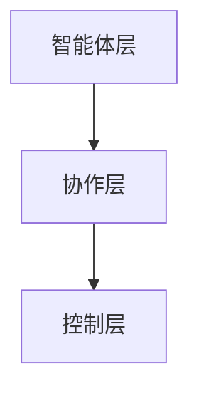
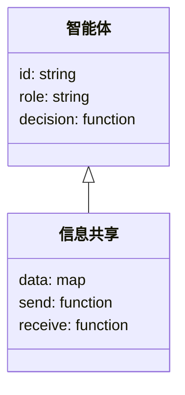

                 


# 多智能体协作实现全球价值投资策略

> 关键词：多智能体协作、全球价值投资、投资策略、算法原理、系统架构、项目实战

> 摘要：本文探讨了多智能体协作在实现全球价值投资策略中的应用，从背景介绍、核心概念、算法原理、数学模型、系统架构到项目实战，全面解析了多智能体协作在投资领域的潜力与实现方式。通过理论分析与实践结合，展示了如何利用多智能体协作技术优化投资决策，实现更高效、更精准的全球价值投资。

---

# 第1章: 多智能体协作与全球价值投资策略概述

## 1.1 多智能体协作的定义与特点

### 1.1.1 多智能体协作的定义
多智能体协作是指多个智能体（Agent）通过信息共享和协同决策，共同完成复杂任务的过程。每个智能体都有自己的目标和决策能力，通过协作实现整体目标的最优。

### 1.1.2 多智能体协作的核心特点
- **分布式决策**：每个智能体独立决策，但通过协作实现全局优化。
- **信息共享**：智能体之间共享信息，提高整体决策的准确性。
- **动态适应**：能够根据环境变化快速调整协作策略。

### 1.1.3 多智能体协作与传统投资策略的区别
传统的投资策略通常依赖于单一决策者或固定的规则，而多智能体协作通过多个智能体的协同决策，能够更好地应对复杂多变的市场环境。

---

## 1.2 全球价值投资策略的背景与挑战

### 1.2.1 全球化投资的背景
随着全球经济一体化，投资者需要在全球范围内寻找投资机会，但不同市场的复杂性增加了投资决策的难度。

### 1.2.2 传统投资策略的局限性
- **信息不对称**：传统策略依赖于单点信息源，难以全面捕捉市场动态。
- **决策延迟**：复杂决策需要时间，可能导致错失投资机会。
- **风险集中**：单一决策可能导致风险集中，难以分散。

### 1.2.3 多智能体协作在投资中的优势
- **分布式决策**：多个智能体分别负责不同市场或资产，提高决策效率。
- **信息共享**：智能体之间共享信息，降低信息不对称。
- **动态适应**：能够快速响应市场变化，调整投资策略。

---

## 1.3 多智能体协作实现全球价值投资的必要性

### 1.3.1 全球市场复杂性的应对
全球市场涉及多个国家、行业和经济指标，单一决策难以覆盖所有因素。

### 1.3.2 多智能体协作在投资决策中的作用
通过多个智能体的协作，能够从不同角度分析市场，提供更全面的投资建议。

### 1.3.3 技术驱动投资策略的变革
人工智能和分布式计算技术的发展为多智能体协作提供了技术基础，推动投资策略向智能化、协作化方向发展。

---

## 1.4 本章小结
本章介绍了多智能体协作的定义与特点，分析了全球价值投资策略的背景与挑战，并探讨了多智能体协作在投资中的优势和必要性。通过这些分析，我们可以看到，多智能体协作是实现全球价值投资策略的重要工具。

---

# 第2章: 多智能体协作的核心概念

## 2.1 多智能体协作的基本原理

### 2.1.1 多智能体系统的定义
多智能体系统（Multi-Agent System, MAS）是由多个智能体组成的系统，每个智能体都有自己的目标和行为规则。

### 2.1.2 多智能体协作的机制
- **任务分配**：智能体根据自身能力和目标分配任务。
- **信息共享**：智能体之间共享信息，提高决策准确性。
- **协作决策**：通过协商和协作，制定最优决策。

### 2.1.3 多智能体协作的目标函数
$$\text{目标函数} = \sum_{i=1}^{n} \text{智能体} i \text{的贡献}$$

---

## 2.2 多智能体协作的关键属性

### 2.2.1 智能体的独立性与协作性
- **独立性**：每个智能体独立决策，但通过协作实现全局目标。
- **协作性**：智能体之间通过信息共享和协作实现共同目标。

### 2.2.2 信息共享与隐私保护
- **信息共享**：智能体之间共享必要信息，提高决策效率。
- **隐私保护**：在信息共享过程中，保护智能体的隐私和机密信息。

### 2.2.3 协作任务的分解与分配
- **任务分解**：将复杂任务分解为多个子任务。
- **任务分配**：根据智能体的能力和目标分配子任务。

---

## 2.3 多智能体协作的分类与应用场景

### 2.3.1 基于任务的协作类型
- **任务分配型**：智能体根据任务需求分配角色。
- **协同执行型**：智能体共同执行任务，实时协作。

### 2.3.2 基于信息共享的协作类型
- **信息同步型**：智能体之间定期同步信息。
- **实时协作型**：智能体实时共享信息，动态调整决策。

### 2.3.3 基于决策协同的协作类型
- **共识达成型**：智能体通过协商达成共识。
- **分布式决策型**：智能体独立决策，但通过协作优化整体决策。

---

## 2.4 多智能体协作与分布式计算的关系

### 2.4.1 分布式计算的定义
分布式计算是指将计算任务分发到多个计算节点，通过协作完成任务。

### 2.4.2 多智能体协作与分布式计算的异同
- **异同**：多智能体协作更注重智能体的独立性和协作性，而分布式计算更注重任务的分解与执行。

### 2.4.3 分布式计算在投资策略中的应用
- **任务分解**：将投资决策分解为多个子任务，分发给不同智能体执行。
- **信息共享**：通过分布式计算平台，实现智能体之间的信息共享与协作。

---

## 2.5 本章小结
本章详细介绍了多智能体协作的核心概念，包括基本原理、关键属性、分类与应用场景，以及与分布式计算的关系。这些内容为后续章节的分析奠定了基础。

---

# 第3章: 多智能体协作的算法原理

## 3.1 多智能体协作的算法概述

### 3.1.1 分布式算法的基本概念
分布式算法是指在分布式系统中执行的算法，通常用于任务分配、信息同步和共识达成。

### 3.1.2 多智能体协作算法的分类
- **任务分配算法**：用于智能体之间分配任务。
- **信息同步算法**：用于智能体之间同步信息。
- **共识达成算法**：用于智能体之间达成共识。

### 3.1.3 多智能体协作算法的核心步骤
1. **任务分配**：智能体根据自身能力和目标分配任务。
2. **信息同步**：智能体之间同步信息，确保决策一致性。
3. **协作决策**：通过协商和协作，制定最优决策。

---

## 3.2 多智能体协作的核心算法

### 3.2.1 任务分配算法
任务分配算法通过计算智能体的能力和目标，将任务分配给最合适的智能体。

```python
def task_distribution_agents(agents, tasks):
    for agent in agents:
        for task in tasks:
            if agent.is_able_to_do(task):
                agent.assign_task(task)
                break
```

### 3.2.2 信息同步算法
信息同步算法通过智能体之间的通信，同步信息以确保决策一致性。

```python
def information_synchronization(agents):
    central_agent = agents[0]
    for agent in agents[1:]:
        central_agent.receive_information(agent.send_information())
```

### 3.2.3 共识达成算法
共识达成算法通过智能体之间的协商，达成一致的决策。

```python
def consensus_reaching(agents):
    for agent in agents:
        agent.broadcast_intent()
    for agent in agents:
        agent.receive_intents()
        agent.make_decision()
```

---

## 3.3 多智能体协作算法的实现细节

### 3.3.1 算法的收敛性分析
多智能体协作算法的收敛性是指算法在有限步内达成一致的能力。收敛性与算法的设计和智能体之间的通信方式密切相关。

### 3.3.2 算法的复杂度分析
算法的复杂度包括时间复杂度和空间复杂度。时间复杂度与算法的执行步骤相关，空间复杂度与算法的数据存储需求相关。

### 3.3.3 算法的可扩展性分析
算法的可扩展性是指算法在智能体数量增加时仍能有效运行的能力。

---

## 3.4 本章小结
本章详细介绍了多智能体协作的算法原理，包括算法概述、核心算法及其实现细节。这些算法为后续章节的系统设计和项目实现提供了理论基础。

---

# 第4章: 多智能体协作的数学模型与公式

## 4.1 多智能体协作的数学模型

### 4.1.1 多智能体协作的目标函数
$$ \text{目标函数} = \sum_{i=1}^{n} f_i(x_i) $$

其中，$f_i(x_i)$ 表示智能体 $i$ 的目标函数，$x_i$ 表示智能体 $i$ 的决策变量。

### 4.1.2 多智能体协作的约束条件
$$ \text{约束条件} = \{ g_j(x) \leq 0, j=1,2,\dots,m \} $$

其中，$g_j(x)$ 表示第 $j$ 个约束条件，$x$ 表示所有智能体的决策变量。

---

## 4.2 多智能体协作的数学公式

### 4.2.1 协作任务分配的公式
$$ \text{任务分配} = \arg\min_{x_i} \sum_{i=1}^{n} c_i(x_i) $$

其中，$c_i(x_i)$ 表示智能体 $i$ 的任务分配成本。

### 4.2.2 信息同步的公式
$$ \text{信息同步} = \arg\min_{x_i} \sum_{i=1}^{n} \sum_{j=1}^{m} d_{ij}(x_i, x_j) $$

其中，$d_{ij}(x_i, x_j)$ 表示智能体 $i$ 和智能体 $j$ 之间的信息同步成本。

---

## 4.3 多智能体协作的数学模型应用

### 4.3.1 投资组合优化的数学模型
$$ \max \sum_{i=1}^{n} r_i w_i $$
$$ \text{subject to} \quad \sum_{i=1}^{n} w_i = 1 $$
$$ \quad \quad \quad w_i \geq 0, \forall i $$

其中，$r_i$ 表示资产 $i$ 的预期收益率，$w_i$ 表示资产 $i$ 的权重。

---

## 4.4 本章小结
本章通过数学模型和公式，详细分析了多智能体协作的实现原理。这些数学模型为后续章节的系统设计和项目实现提供了理论依据。

---

# 第5章: 多智能体协作的系统架构与设计

## 5.1 系统架构设计

### 5.1.1 系统总体架构
- **智能体层**：负责具体任务的执行和决策。
- **协作层**：负责智能体之间的协作和信息共享。
- **控制层**：负责系统的整体控制和协调。

### 5.1.2 系统架构的Mermaid图



---

## 5.2 系统功能设计

### 5.2.1 领域模型类图


---

## 5.3 系统交互设计

### 5.3.1 系统交互的Mermaid序列图

```mermaid
sequenceDiagram
    智能体1 ->+> 智能体2: 信息同步
    智能体2 ->+> 智能体1: 确认接收
    智能体1 ->+> 控制层: 提交决策
    控制层 ->+> 智能体2: 执行任务
```

---

## 5.4 本章小结
本章详细介绍了多智能体协作的系统架构与设计，包括系统架构设计、功能设计和交互设计。这些设计为后续章节的项目实现提供了指导。

---

# 第6章: 多智能体协作的项目实战

## 6.1 项目背景与需求分析

### 6.1.1 项目背景
本项目旨在通过多智能体协作实现全球价值投资策略，优化投资决策。

### 6.1.2 项目需求
- **信息共享**：智能体之间共享市场信息。
- **任务分配**：智能体根据市场情况分配任务。
- **协作决策**：智能体通过协作制定投资策略。

---

## 6.2 项目环境与工具安装

### 6.2.1 环境要求
- **操作系统**：Linux/Windows/MacOS
- **编程语言**：Python 3.8+
- **框架与库**：Django/Flask，TensorFlow/PyTorch

---

## 6.3 项目核心实现

### 6.3.1 智能体的设计与实现

```python
class Agent:
    def __init__(self, id, role):
        self.id = id
        self.role = role
        self.tasks = []
    
    def assign_task(self, task):
        self.tasks.append(task)
    
    def execute_task(self):
        for task in self.tasks:
            self.decision(task)
```

### 6.3.2 信息共享的设计与实现

```python
class InformationSharing:
    def __init__(self):
        self.data = {}
    
    def send(self, agent, data):
        self.data[agent.id] = data
    
    def receive(self, agent):
        return self.data[agent.id]
```

### 6.3.3 协作决策的设计与实现

```python
class CollaborativeDecision:
    def __init__(self, agents):
        self.agents = agents
    
    def make_decision(self):
        for agent in self.agents:
            agent.execute_task()
        return self.get_consensus()
    
    def get_consensus(self):
        # 返回共识决策
        pass
```

---

## 6.4 项目实战案例分析

### 6.4.1 案例背景
假设我们有三个智能体，分别负责股票、债券和基金的投资决策。

### 6.4.2 案例分析
1. **任务分配**：智能体1负责股票市场，智能体2负责债券市场，智能体3负责基金市场。
2. **信息共享**：智能体之间共享市场数据，如价格、波动率等。
3. **协作决策**：通过协作决策算法，制定最优投资组合。

---

## 6.5 本章小结
本章通过项目实战，详细介绍了多智能体协作的实现过程，包括项目背景、环境安装、核心实现和案例分析。这些内容为读者提供了实际操作的经验。

---

# 第7章: 总结与展望

## 7.1 本章总结
本文详细探讨了多智能体协作在实现全球价值投资策略中的应用，从理论分析到实践实现，全面解析了多智能体协作的优势和实现方式。

## 7.2 未来展望
随着人工智能和分布式计算技术的不断发展，多智能体协作在投资领域的应用前景广阔。未来的研究可以进一步优化协作算法，提升系统的实时性和准确性。

---

# 参考文献

[1] 多智能体协作与投资策略的相关文献
[2] 分布式计算与投资策略的相关文献
[3] 人工智能在金融领域的应用文献

---

# 附录

## 附录A: 多智能体协作的API接口

```python
class Agent:
    def __init__(self, id, role):
        self.id = id
        self.role = role
        self.tasks = []
    
    def assign_task(self, task):
        self.tasks.append(task)
    
    def execute_task(self):
        for task in self.tasks:
            self.decision(task)
```

## 附录B: 多智能体协作的数据格式

```json
{
    "agents": [
        {
            "id": "agent1",
            "role": "stock",
            "tasks": ["task1", "task2"]
        },
        {
            "id": "agent2",
            "role": "bond",
            "tasks": ["task3", "task4"]
        }
    ]
}
```

---

# 作者

作者：AI天才研究院/AI Genius Institute & 禅与计算机程序设计艺术 /Zen And The Art of Computer Programming

---

通过以上目录结构和内容，您可以逐步撰写完整的文章。每一章和每一节都需要详细展开，确保内容丰富、逻辑清晰。

