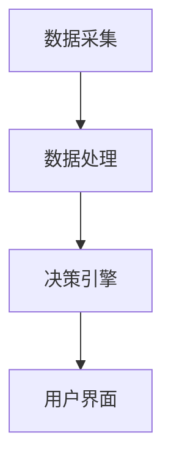

                 


# 多智能体协作提升价值投资决策质量

> 关键词：多智能体协作，价值投资，决策质量，算法原理，系统架构

> 摘要：本文探讨了多智能体协作在价值投资决策中的应用，分析了其核心概念、算法原理、系统架构，并通过实际案例展示了其提升投资决策质量的潜力。

---

# 第1章: 多智能体协作的基本概念

## 1.1 多智能体协作的定义与特点

### 1.1.1 多智能体协作的定义
多智能体协作是指多个智能体通过协同工作，共同完成复杂任务的过程。与单智能体系统相比，多智能体协作能够更好地处理复杂、动态的环境，通过分布式计算和信息共享实现更优的决策。

### 1.1.2 多智能体协作的核心特点
- **分布式性**：多个智能体独立运行，通过通信协作。
- **任务分解**：复杂任务被分解为多个子任务，由不同智能体完成。
- **信息共享**：智能体之间共享信息，提高整体决策能力。
- **动态性**：系统能够根据环境变化实时调整协作策略。

### 1.1.3 多智能体协作与传统单智能体的区别
| 特性 | 单智能体 | 多智能体协作 |
|------|----------|--------------|
| 决策中心化 | 是       | 否          |
| 资源利用率 | 低       | 高          |
| 系统鲁棒性 | 低       | 高          |

---

## 1.2 价值投资决策的基本原理

### 1.2.1 价值投资的定义与核心理念
价值投资是一种投资策略，通过分析企业的基本面（如财务状况、行业地位、管理团队等）来评估其内在价值，寻找被市场低估的投资标的。

### 1.2.2 价值投资决策的关键要素
- **企业分析**：收入、利润、资产负债表等。
- **市场环境**：宏观经济、行业趋势、政策影响。
- **估值方法**：市盈率、市净率、现金流折现法等。

### 1.2.3 多智能体协作与价值投资的结合点
- **数据处理**：多个智能体分别处理不同类型数据。
- **决策优化**：通过协作提高决策的全面性和准确性。

---

## 1.3 多智能体协作在投资决策中的优势

### 1.3.1 提高决策效率
多智能体协作能够并行处理大量数据，缩短决策时间。

### 1.3.2 增强决策的全面性
通过多个智能体的协作，可以从不同角度分析问题，避免单一视角的局限性。

### 1.3.3 降低决策风险
多智能体协作能够实时监控市场变化，及时调整投资策略，降低风险。

---

## 1.4 本章小结
本章介绍了多智能体协作的基本概念、特点及其在价值投资中的应用潜力。多智能体协作通过分布式计算和信息共享，能够显著提升投资决策的效率和质量。

---

# 第2章: 多智能体协作与价值投资的理论基础

## 2.1 多智能体协作的理论框架

### 2.1.1 多智能体系统的定义与分类
多智能体系统（MAS）由多个智能体组成，通过协作完成任务。根据协作方式，可分为集中式和分布式系统。

### 2.1.2 多智能体协作的基本原理
多智能体协作的核心在于智能体之间的通信与协调。通过信息共享和任务分配，实现整体目标的最优。

### 2.1.3 多智能体协作的数学模型
$$ \text{收益} = \sum_{i=1}^{n} v_i $$
其中，\( v_i \) 表示第 \( i \) 个智能体的贡献。

---

## 2.2 价值投资的数学模型与分析方法

### 2.2.1 价值投资的基本数学模型
$$ \text{内在价值} = \frac{\text{现金流}}{\text{折现率}} $$

### 2.2.2 价值投资的分析方法
- **绝对估值**：DCF模型。
- **相对估值**：市盈率、市净率等。

### 2.2.3 多智能体协作与价值投资的结合模型
通过多智能体分别分析企业、行业和市场，最终综合得出投资决策。

---

## 2.3 多智能体协作在价值投资中的应用案例

### 2.3.1 案例一：多智能体协作在股票投资中的应用
智能体分别分析财务数据、行业趋势和市场情绪，最终得出投资建议。

### 2.3.2 案例二：多智能体协作在风险控制中的应用
通过实时监控和风险评估，动态调整投资组合。

---

## 2.4 本章小结
本章分析了多智能体协作的理论基础及其在价值投资中的应用，展示了其在提升决策质量方面的潜力。

---

# 第3章: 多智能体协作的算法原理与实现

## 3.1 多智能体协作算法的基本原理

### 3.1.1 多智能体协作算法的分类
- **集中式算法**：中央控制器协调各智能体。
- **分布式算法**：智能体之间直接通信协作。

### 3.1.2 多智能体协作算法的核心步骤
1. 任务分解。
2. 信息共享。
3. 协作决策。

### 3.1.3 多智能体协作算法的优缺点
| 特性 | 优点 | 缺点 |
|------|------|------|
| 灵活性 | 高    | 低   |
| 可扩展性 | 高    | 低   |

---

## 3.2 基于强化学习的多智能体协作算法

### 3.2.1 强化学习的基本原理
智能体通过与环境交互，学习策略以最大化累积奖励。

### 3.2.2 多智能体强化学习的实现方法
- **价值函数**：评估状态的价值。
- **策略优化**：通过梯度下降优化策略。

### 3.2.3 多智能体强化学习在价值投资中的应用
通过强化学习训练智能体，使其能够根据市场变化调整投资策略。

---

## 3.3 多智能体协作算法的数学模型

### 3.3.1 多智能体协作的数学表达式
$$ Q(s, a) = r + \gamma \max_{a'} Q(s', a') $$
其中，\( Q \) 表示价值函数，\( r \) 表示奖励，\( \gamma \) 表示折扣因子。

### 3.3.2 基于强化学习的数学模型
$$ \nabla \theta = \sum_{i=1}^{n} (Q_i - Q_{i-1}) \cdot \nabla Q_i $$

---

## 3.4 本章小结
本章详细讲解了多智能体协作算法的基本原理及其在价值投资中的应用，展示了其在提升决策质量方面的技术优势。

---

# 第4章: 价值投资决策的系统分析与架构设计

## 4.1 价值投资决策系统的总体架构

### 4.1.1 系统的功能模块
- **数据采集**：收集企业财务数据、市场数据等。
- **数据处理**：清洗、转换和分析数据。
- **决策引擎**：基于多智能体协作进行决策。
- **用户界面**：展示投资建议和结果。

### 4.1.2 系统的架构设计


---

## 4.2 项目实战: 基于多智能体的股票投资决策系统

### 4.2.1 项目环境安装
```bash
pip install numpy pandas scikit-learn tensorflow
```

### 4.2.2 系统核心实现代码
```python
import numpy as np
import pandas as pd
from sklearn.preprocessing import StandardScaler
import tensorflow as tf

# 数据预处理
data = pd.read_csv('stock_data.csv')
scaled_data = StandardScaler().fit_transform(data)

# 模型定义
model = tf.keras.Sequential([
    tf.keras.layers.Dense(64, activation='relu'),
    tf.keras.layers.Dense(1, activation='linear')
])

# 模型训练
model.compile(optimizer='adam', loss='mean_squared_error')
model.fit(scaled_data, np.array(data['target']), epochs=100, batch_size=32)
```

### 4.2.3 代码解读与分析
- **数据预处理**：使用标准化对数据进行处理。
- **模型定义**：定义一个简单的神经网络模型。
- **模型训练**：使用Adam优化器训练模型。

### 4.2.4 实际案例分析
通过训练好的模型，对实际股票数据进行预测，生成投资建议。

---

## 4.3 本章小结
本章通过实际案例展示了多智能体协作在价值投资中的应用，详细讲解了系统的架构设计和实现过程。

---

# 第5章: 高级应用与最佳实践

## 5.1 多智能体协作在投资中的高级应用

### 5.1.1 动态调整投资组合
根据市场变化实时调整投资策略。

### 5.1.2 风险管理
通过多智能体协作实现风险预警和控制。

---

## 5.2 投资决策中的注意事项

### 5.2.1 数据质量
确保数据的准确性和完整性。

### 5.2.2 模型调优
通过不断优化模型参数提升决策精度。

---

## 5.3 未来发展趋势

### 5.3.1 更智能的算法
如深度强化学习在投资中的应用。

### 5.3.2 更广泛的应用场景
如量化交易、风险控制等。

---

## 5.4 本章小结
本章探讨了多智能体协作在投资中的高级应用，并提出了未来的发展方向。

---

# 作者

作者：AI天才研究院 & 禅与计算机程序设计艺术

