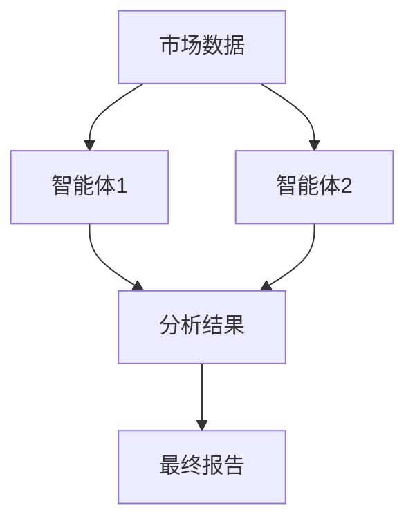

                 


# 多智能体协作提升市场分析效率

> 关键词：多智能体协作、市场分析效率、分布式计算、任务分配、通信协议、数据隐私

> 摘要：本文详细探讨了多智能体协作在市场分析中的应用，从背景、核心概念到算法原理、系统架构、项目实战，再到最佳实践，全面分析了多智能体协作如何提升市场分析效率。文章结合理论与实践，通过丰富的图表和代码示例，帮助读者深入理解多智能体协作的技术细节和实际应用。

---

# 第一部分: 多智能体协作与市场分析概述

## 第1章: 多智能体协作与市场分析背景

### 1.1 多智能体协作的概念与特点
#### 1.1.1 多智能体协作的定义
多智能体协作是指多个智能体通过分布式计算和通信机制，共同完成复杂任务的过程。与传统的单智能体分析相比，多智能体协作能够更好地利用资源、提高效率和准确性。

#### 1.1.2 多智能体协作的核心特点
- **分布式计算**：任务由多个智能体分担，减少单点故障风险。
- **异步通信**：智能体之间通过消息传递进行协作，无需同步。
- **动态协作**：根据任务需求动态调整协作策略。

#### 1.1.3 多智能体协作与传统单智能体分析的区别
| 特性             | 单智能体分析                     | 多智能体协作                     |
|------------------|----------------------------------|----------------------------------|
| 资源利用率       | 单一资源利用                   | 多资源并行利用                   |
| 计算速度         | 较慢                            | 较快                            |
| 故障容错性       | 低                              | 高                              |

### 1.2 市场分析的背景与挑战
#### 1.2.1 市场分析的传统方法与局限性
- 传统方法依赖人工分析，效率低，且容易出错。
- 数据量爆炸式增长，单个智能体难以处理。

#### 1.2.2 数据量爆炸与分析效率的需求
- 市场数据来源多样，包括社交媒体、新闻、交易数据等。
- 需要实时分析，以快速做出决策。

#### 1.2.3 多智能体协作在市场分析中的潜力
- 提高数据处理速度。
- 增强数据挖掘的深度。
- 降低分析成本。

### 1.3 多智能体协作提升市场分析效率的必要性
#### 1.3.1 提高分析速度的需求
- 实时市场变化需要快速响应。
- 多智能体协作能够并行处理数据，显著提高分析速度。

#### 1.3.2 增强分析精度的必要性
- 多智能体协作可以结合多个模型，提高预测准确性。
- 通过分布式计算，减少单点误差的影响。

#### 1.3.3 降低分析成本的优势
- 资源共享，降低单个智能体的计算负担。
- 集群协作，提高整体效率。

---

## 第2章: 多智能体协作的核心概念与联系

### 2.1 多智能体协作的原理
#### 2.1.1 分布式计算与任务分配
- 智能体通过分布式计算完成任务。
- 任务分配策略包括轮询、负载均衡等。

#### 2.1.2 智能体之间的通信机制
- 使用消息队列或事件总线进行通信。
- 通信协议需要支持异步和同步两种模式。

#### 2.1.3 协作任务的同步与协调
- 使用锁机制或分布式事务保证数据一致性。
- 协调机制包括仲裁和协商。

### 2.2 核心概念对比与联系
| 概念             | 特性                     | 示例                         |
|------------------|--------------------------|------------------------------|
| 任务分配策略     | 负载均衡、轮询           | 根据计算能力动态分配任务     |
| 通信协议         | HTTP、WebSocket           | 实时通信和批量数据传输       |
| 协作机制         | 仲裁、协商               | 确保任务执行的一致性         |

### 2.3 实体关系架构图


---

## 第3章: 多智能体协作的算法原理

### 3.1 分布式计算与任务分配算法
#### 3.1.1 分布式计算的基本原理
- 将任务分解为多个子任务。
- 分配给不同的智能体执行。

#### 3.1.2 任务分配的贪心算法
```python
def greedy_task_assignment(tasks, agents):
    for task in tasks:
        agent = select_agent_with_min_load(agents)
        assign_task_to_agent(task, agent)
```

#### 3.1.3 负载均衡算法
```python
def load_balancing(agents):
    total_load = sum(agent.load for agent in agents)
    avg_load = total_load / len(agents)
    for agent in agents:
        if agent.load > avg_load:
            redistribute_tasks(agent, agents)
```

### 3.2 多智能体通信协议
#### 3.2.1 通信协议的设计原则
- 简单性：易于实现和维护。
- 可扩展性：支持多种通信模式。

#### 3.2.2 基于消息队列的通信机制
```python
from queue import Queue

def send_message(sender, receiver, message):
    receiver.queue.put(message)
```

#### 3.2.3 通

